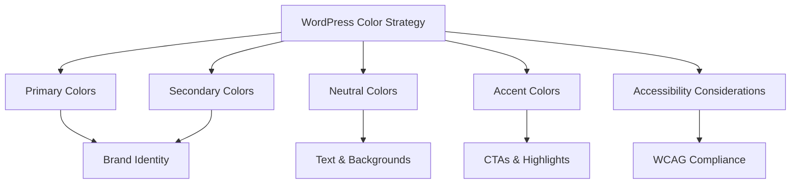

# WordPress Colors

Colors play a crucial role in defining your WordPress site's identity and user experience. In this guide, we'll explore how WordPress handles colors, how to customize color schemes, and implement custom color palettes in your themes and blocks.

## Understanding Colors in WordPress

WordPress allows you to customize colors in various ways, depending on your theme and the WordPress version you're using. Modern WordPress themes, especially those built with Gutenberg compatibility, offer extensive color customization options.

### Where Colors Matter in WordPress

Colors affect many elements of your WordPress site, including:

- Text colors
- Background colors
- Button colors
- Link colors
- Header and footer colors
- Block colors
- Border colors
- Accent colors

## Accessing Color Settings

Most WordPress themes provide color settings in the WordPress Customizer:

1. Go to your WordPress dashboard
2. Navigate to **Appearance → Customize**
3. Look for a section labeled "Colors" or "Color Settings" (the exact name varies by theme)

## The WordPress Color Picker

WordPress includes a built-in color picker that makes it easy to select colors:

![WordPress Color Picker]

The color picker allows you to:
- Select colors from a visual palette
- Enter hex color codes (like `#FF5733`)
- Set RGB and HSL values
- Adjust opacity/transparency

## Theme Color Schemes

Many WordPress themes come with predefined color schemes:

### Default Color Schemes

Most themes include several color schemes that you can select from to instantly change your site's appearance. These are typically found in the Customizer under "Colors & Backgrounds" or a similar section.

### Custom Color Customization

Beyond preset schemes, you can usually customize specific color elements:

```php
// Example: How themes register color customization options
function mytheme_customize_register( $wp_customize ) {
    // Add color section
    $wp_customize->add_section( 'mytheme_colors', array(
        'title' => __( 'Theme Colors', 'mytheme' ),
        'priority' => 30,
    ) );

    // Add primary color setting
    $wp_customize->add_setting( 'primary_color', array(
        'default' => '#0073aa',
        'sanitize_callback' => 'sanitize_hex_color',
    ) );

    // Add primary color control
    $wp_customize->add_control( new WP_Customize_Color_Control( $wp_customize, 'primary_color', array(
        'label' => __( 'Primary Color', 'mytheme' ),
        'section' => 'mytheme_colors',
    ) ) );
}
add_action( 'customize_register', 'mytheme_customize_register' );
```

## Block Editor Colors

With the WordPress block editor (Gutenberg), colors have become even more important. The block editor allows you to set colors for individual blocks and elements.

### Theme-Defined Color Palettes

WordPress themes can define custom color palettes that appear in the block editor:

```php
// Example: How to add theme support for editor color palette
function mytheme_setup() {
    // Add theme support for custom color palette
    add_theme_support( 'editor-color-palette', array(
        array(
            'name'  => __( 'Strong Blue', 'mytheme' ),
            'slug'  => 'strong-blue',
            'color' => '#0073aa',
        ),
        array(
            'name'  => __( 'Lighter Blue', 'mytheme' ),
            'slug'  => 'lighter-blue',
            'color' => '#229fd8',
        ),
        array(
            'name'  => __( 'Very Light Gray', 'mytheme' ),
            'slug'  => 'very-light-gray',
            'color' => '#eee',
        ),
        array(
            'name'  => __( 'Dark Gray', 'mytheme' ),
            'slug'  => 'dark-gray',
            'color' => '#444',
        ),
    ) );
}
add_action( 'after_setup_theme', 'mytheme_setup' );
```

This code creates a custom color palette that users will see when they edit blocks:

![Block Editor Color Palette]

### Using Block Editor Colors in CSS

When you define colors in the theme, WordPress generates CSS classes that you can use in your theme:

```css
/* These classes are automatically generated by WordPress */
.has-strong-blue-color {
    color: #0073aa;
}

.has-strong-blue-background-color {
    background-color: #0073aa;
}

/* And so on for each color in your palette */
```

## Creating a Color Strategy

When developing or customizing a WordPress site, it's important to create a consistent color strategy:

### 1. Define Primary Colors

Select 1-3 primary brand colors that represent your main identity.

### 2. Choose Secondary Colors

Add 2-4 secondary colors that complement your primary colors.

### 3. Include Neutral Colors

Define a range of neutral colors (whites, blacks, grays) for backgrounds and text.

### 4. Accent Colors

Include 1-2 accent colors for calls-to-action, highlights, or alerts.

### 5. Consider Accessibility

Ensure there's enough contrast between text and background colors for readability. The Web Content Accessibility Guidelines (WCAG) recommend a contrast ratio of at least 4.5:1 for normal text.



## Practical Examples

### Example 1: Changing Link Color Using Customizer

Here's how to add an option to change link colors in your theme:

```php
// Add link color option to the customizer
function mytheme_customize_register( $wp_customize ) {
    // Add link color setting
    $wp_customize->add_setting( 'link_color', array(
        'default'           => '#0073aa',
        'sanitize_callback' => 'sanitize_hex_color',
        'transport'         => 'refresh',
    ) );

    // Add link color control
    $wp_customize->add_control( new WP_Customize_Color_Control( $wp_customize, 'link_color', array(
        'label'    => __( 'Link Color', 'mytheme' ),
        'section'  => 'colors',
        'settings' => 'link_color',
    ) ) );
}
add_action( 'customize_register', 'mytheme_customize_register' );

// Output the custom CSS
function mytheme_customizer_css() {
    ?>
    <style type="text/css">
        a { 
            color: <?php echo get_theme_mod( 'link_color', '#0073aa' ); ?>; 
        }
    </style>
    <?php
}
add_action( 'wp_head', 'mytheme_customizer_css' );
```

### Example 2: Creating a Block with Custom Color Controls

Here's how to create a custom block with color settings using JavaScript (for the block editor):

```javascript
// In your block's edit.js file
import { InspectorControls, ColorPalette } from '@wordpress/block-editor';
import { PanelBody } from '@wordpress/components';
import { __ } from '@wordpress/i18n';

export default function Edit({ attributes, setAttributes }) {
    const { backgroundColor, textColor } = attributes;
    
    return (
        <>
            <InspectorControls>
                <PanelBody title={__('Color Settings')}>
                    <p>{__('Background Color')}</p>
                    <ColorPalette
                        value={backgroundColor}
                        onChange={(color) => setAttributes({ backgroundColor: color })}
                    />
                    <p>{__('Text Color')}</p>
                    <ColorPalette
                        value={textColor}
                        onChange={(color) => setAttributes({ textColor: color })}
                    />
                </PanelBody>
            </InspectorControls>
            <div style={{ 
                backgroundColor: backgroundColor,
                color: textColor,
                padding: '20px'
            }}>
                {__('This block has custom colors')}
            </div>
        </>
    );
}
```

## Advanced: Using CSS Custom Properties for Theme Colors

Modern themes often use CSS custom properties (variables) to manage colors:

```php
// Define colors in PHP
function mytheme_generate_css_variables() {
    $primary_color = get_theme_mod('primary_color', '#0073aa');
    $secondary_color = get_theme_mod('secondary_color', '#23282d');
    
    $css = "
        :root {
            --primary-color: {$primary_color};
            --secondary-color: {$secondary_color};
            --primary-color-rgb: " . hex_to_rgb($primary_color) . ";
            --secondary-color-rgb: " . hex_to_rgb($secondary_color) . ";
        }
    ";
    
    return $css;
}

// Helper function to convert hex to rgb
function hex_to_rgb($hex) {
    list($r, $g, $b) = sscanf($hex, "#%02x%02x%02x");
    return "{$r}, {$g}, {$b}";
}

// Output CSS variables
function mytheme_output_css_variables() {
    echo '<style type="text/css">' . mytheme_generate_css_variables() . '</style>';
}
add_action('wp_head', 'mytheme_output_css_variables');
```

Then in your CSS, you can use these variables:

```css
a {
    color: var(--primary-color);
}

button {
    background-color: var(--primary-color);
    color: white;
}

.highlight {
    background-color: rgba(var(--primary-color-rgb), 0.2);
}
```

## Summary

WordPress offers multiple ways to work with colors:

1. **Theme Customizer**: Most themes include color options in the WordPress Customizer
2. **Block Editor Colors**: Define custom color palettes for use in the block editor
3. **CSS Implementation**: Apply colors through your theme's CSS, potentially using CSS variables
4. **Plugin Extensions**: Various plugins can extend color functionality

Effectively using colors in WordPress helps establish your brand identity, improves user experience, and guides visitors toward key actions on your site.

## Additional Resources

- [WordPress Theme Developer Handbook](https://developer.wordpress.org/themes/)
- [Block Editor Handbook](https://developer.wordpress.org/block-editor/)
- [Web Content Accessibility Guidelines (WCAG) Color Contrast](https://www.w3.org/WAI/WCAG21/Understanding/contrast-minimum.html)

## Exercises

1. Create a custom color palette for a WordPress theme that matches a specific brand.
2. Add a background color option to the WordPress Customizer for the header area.
3. Implement CSS custom properties for all colors in a theme to easily change the entire color scheme.
4. Create a custom block that uses theme colors but also allows custom color overrides.