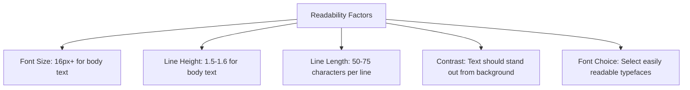

# WordPress Typography

Typography is a crucial element of web design that significantly impacts how users perceive and interact with your WordPress website. Good typography enhances readability, establishes brand identity, and creates visual hierarchy in your content.

## Introduction to WordPress Typography

Typography in WordPress refers to the style, arrangement, and appearance of text on your website. It encompasses fonts, font sizes, line spacing, letter spacing, and other text-related styling options that affect how your content looks and reads.

By mastering WordPress typography, you can:

- Improve readability and user experience
- Establish a consistent brand identity
- Create visual hierarchy and guide users' attention
- Express your website's personality and tone

## Understanding WordPress Typography Controls

WordPress provides several ways to control typography:

1. **Theme Options** - Many WordPress themes include built-in typography controls
2. **Customizer** - The WordPress Customizer often includes typography settings
3. **Block Editor** - The Gutenberg editor allows typography adjustments for individual blocks
4. **CSS** - Custom CSS gives you complete control over typography
5. **Typography Plugins** - Extend typography capabilities without coding

Let's explore each of these methods in detail.

## Theme Typography Options

Most quality WordPress themes provide typography controls in their settings. These are usually accessible through:

1. The WordPress Customizer (Appearance → Customize)
2. Theme-specific settings pages

### Accessing Theme Typography Settings

Navigate to your WordPress dashboard and look for:

1. Appearance → Customize → Typography (or similar)
2. Appearance → Theme Options → Typography (theme-dependent)

Different themes offer varying levels of typography control, from basic font selection to comprehensive options for every text element on your site.

## Using the WordPress Customizer for Typography

The WordPress Customizer provides a user-friendly interface for modifying your site's appearance with a live preview.

### Steps to Access Typography in the Customizer:

1. Go to Appearance → Customize in your WordPress dashboard
2. Look for Typography, Fonts, or Text options (varies by theme)
3. Make changes and see them applied in real-time
4. Click "Publish" to save your changes

Example typography options you might find in the Customizer:

- Font family selection
- Font size adjustments
- Line height controls
- Font weight options
- Text transformation (uppercase, lowercase, etc.)
- Letter spacing

## Typography in the Block Editor (Gutenberg)

WordPress's block editor provides typography controls for individual blocks, allowing for more granular control over your content.

### Basic Typography Controls in Blocks:

1. Select a text block
2. Open the block settings in the right sidebar
3. Look for Typography settings
4. Adjust available options like font size, line height, etc.

Here's how to change the font size of a paragraph block:

```
// Select a paragraph block
// In the block settings sidebar:
1. Click on "Typography"
2. Choose from preset sizes (Small, Normal, Large, etc.)
3. Or click "Set custom size" to enter a specific value
```

### Advanced Block Typography with the Font Size Panel

```
// To access more detailed font controls:
1. Select a text block
2. Click the three-dot menu in the block toolbar
3. Select "Show more settings"
4. Expand the Typography section
5. Adjust font size, line height, and other available options
```

## Using Custom CSS for Complete Typography Control

For maximum control over your WordPress typography, custom CSS is the most powerful approach.

### Adding Custom CSS:

1. Go to Appearance → Customize → Additional CSS
2. Add your CSS code
3. See the changes in real-time
4. Click "Publish" to save

### Example CSS for Typography Customization:

```css
/* Change main body text */
body, p {
  font-family: 'Open Sans', sans-serif;
  font-size: 16px;
  line-height: 1.6;
  color: #333333;
}

/* Style headings */
h1, h2, h3, h4, h5, h6 {
  font-family: 'Montserrat', sans-serif;
  font-weight: 700;
  color: #222222;
}

/* Specific heading styles */
h1 {
  font-size: 32px;
  line-height: 1.2;
  margin-bottom: 24px;
}

h2 {
  font-size: 24px;
  line-height: 1.3;
  margin-bottom: 20px;
}

/* Style links */
a {
  color: #0066cc;
  text-decoration: none;
  transition: color 0.3s ease;
}

a:hover {
  color: #004499;
  text-decoration: underline;
}
```

### Using Google Fonts with Custom CSS

To use custom web fonts from Google Fonts:

1. Visit [Google Fonts](https://fonts.google.com/)
2. Select the fonts you want to use
3. Get the embed code
4. Add the code to your WordPress site

There are two main methods to add Google Fonts to WordPress:

**Method 1: Using functions.php (recommended for theme developers)**

```php
function add_custom_fonts() {
  wp_enqueue_style('google-fonts', 'https://fonts.googleapis.com/css2?family=Open+Sans:wght@400;600;700&family=Montserrat:wght@400;700&display=swap', array(), null);
}
add_action('wp_enqueue_scripts', 'add_custom_fonts');
```

**Method 2: Using Additional CSS in the Customizer (for beginners)**

```css
/* Add this at the top of your Additional CSS */
@import url('https://fonts.googleapis.com/css2?family=Open+Sans:wght@400;600;700&family=Montserrat:wght@400;700&display=swap');

/* Then use the fonts in your CSS */
body {
  font-family: 'Open Sans', sans-serif;
}
```

## Typography Plugins for WordPress

If you prefer not to write CSS, several plugins can help you control typography:

### Popular Typography Plugins:

1. **Easy Google Fonts** - Adds Google Fonts to the WordPress Customizer
2. **TypeKit Fonts for WordPress** - Integrates Adobe TypeKit fonts
3. **WP Google Fonts** - Simple interface for adding Google Fonts
4. **Advanced Typography** - Comprehensive typography controls

### Using Easy Google Fonts Plugin:

1. Install and activate the plugin
2. Go to Appearance → Customize → Typography
3. Select elements to customize (paragraphs, headings, etc.)
4. Choose from hundreds of Google Fonts
5. Adjust size, weight, style, and other properties

## Typography Best Practices for WordPress

Follow these guidelines to create effective typography on your WordPress site:

### 1. Maintain Consistency

Use a limited set of fonts (typically 2-3) throughout your site:
- One font for headings
- One font for body text
- Optionally, one accent font for special elements

### 2. Ensure Readability



### 3. Create Hierarchy

Use typography to establish importance:
- Vary font sizes for different heading levels
- Use weight (bold/light) to emphasize or de-emphasize
- Consider using different fonts for headings vs. body text

### 4. Consider Responsive Design

Make sure your typography works on all devices:
- Use relative units like em, rem, or percentages
- Test how fonts look on mobile devices
- Consider reducing font sizes for smaller screens

### 5. Optimize for Performance

Typography can affect site speed:
- Limit the number of font families and weights
- Use system fonts when possible
- Consider using font subsets if you only need certain characters

## Real-World Typography Example

Let's walk through setting up a complete typography system for a WordPress blog:

### Step 1: Define Your Typography Strategy

For a professional blog, we might choose:
- Headings: Montserrat (clean, modern, authoritative)
- Body: Open Sans (highly readable, neutral)
- Accent: Playfair Display (for quotes or special elements)

### Step 2: Implement the Fonts

Using the Additional CSS option in the Customizer:

```css
/* Import the fonts */
@import url('https://fonts.googleapis.com/css2?family=Montserrat:wght@400;600;700&family=Open+Sans:wght@400;600&family=Playfair+Display:ital@0;1&display=swap');

/* Base Typography */
body {
  font-family: 'Open Sans', sans-serif;
  font-size: 16px;
  line-height: 1.6;
  color: #333333;
}

/* Heading Styles */
h1, h2, h3, h4, h5, h6 {
  font-family: 'Montserrat', sans-serif;
  font-weight: 600;
  line-height: 1.3;
  margin-top: 1.5em;
  margin-bottom: 0.5em;
}

h1 { font-size: 2.5rem; }
h2 { font-size: 2rem; }
h3 { font-size: 1.75rem; }
h4 { font-size: 1.5rem; }
h5 { font-size: 1.25rem; }
h6 { font-size: 1rem; }

/* Special Elements */
blockquote {
  font-family: 'Playfair Display', serif;
  font-style: italic;
  font-size: 1.2rem;
  line-height: 1.6;
  color: #555;
  border-left: 4px solid #ddd;
  padding-left: 1rem;
}

/* Links */
a {
  color: #0066cc;
  text-decoration: none;
  border-bottom: 1px solid transparent;
  transition: border-color 0.2s ease;
}

a:hover {
  border-bottom-color: #0066cc;
}

/* Mobile Typography */
@media (max-width: 768px) {
  body { font-size: 15px; }
  h1 { font-size: 2rem; }
  h2 { font-size: 1.75rem; }
  h3 { font-size: 1.5rem; }
  h4 { font-size: 1.25rem; }
  h5, h6 { font-size: 1rem; }
}
```

### Step 3: Fine-tune for Different Elements

Adjust typography for specific WordPress elements:

```css
/* Post title */
.entry-title {
  font-size: 2.8rem;
  font-weight: 700;
  margin-bottom: 1rem;
}

/* Meta information (date, author) */
.entry-meta {
  font-size: 0.9rem;
  color: #666;
}

/* Widget titles */
.widget-title {
  font-family: 'Montserrat', sans-serif;
  font-size: 1.1rem;
  text-transform: uppercase;
  letter-spacing: 1px;
}

/* Footer text */
.site-footer {
  font-size: 0.9rem;
  color: #999;
}
```

## Troubleshooting Typography Issues

Common typography problems in WordPress and their solutions:

### Fonts Not Loading

**Problem**: You've added Google Fonts but they aren't appearing.

**Solutions**:
- Check if your theme is overriding your font choices
- Ensure the font import URL is correct
- Add `!important` to your font-family declarations as a last resort
- Check browser console for errors

### Inconsistent Fonts

**Problem**: Different fonts appear in different parts of your site.

**Solutions**:
- Use CSS specificity to target all elements
- Check for theme elements with hardcoded font styles
- Inspect elements with browser dev tools to find conflicting styles

### Responsive Typography Issues

**Problem**: Fonts look too big/small on mobile devices.

**Solution**:
```css
/* Responsive typography using fluid scaling */
:root {
  font-size: 16px;
}

@media (max-width: 768px) {
  :root {
    font-size: 15px;
  }
}

@media (max-width: 480px) {
  :root {
    font-size: 14px;
  }
}

/* Then use rem units for all font sizes */
h1 { font-size: 2.5rem; }
body { font-size: 1rem; }
```

## Summary

Typography is a fundamental aspect of WordPress design that greatly impacts user experience, readability, and brand identity. In this guide, we've covered:

- The importance of typography in WordPress
- How to use theme typography options
- Typography controls in the WordPress Customizer
- Working with typography in the Block Editor
- Using custom CSS for maximum control
- Implementing Google Fonts in WordPress
- Typography plugins for extra functionality
- Best practices for effective web typography
- A real-world example of a complete typography system
- Troubleshooting common typography issues

By applying these principles and techniques, you can create a WordPress site with beautiful, readable, and consistent typography that enhances the user experience and strengthens your brand identity.

## Additional Resources

To further develop your WordPress typography skills:

1. Explore [Google Fonts](https://fonts.google.com/) for free web fonts
2. Learn more about [CSS Typography](https://developer.mozilla.org/en-US/docs/Learn/CSS/Styling_text/Fundamentals) on MDN Web Docs
3. Try [Type Scale](https://type-scale.com/) to create harmonious font size systems
4. Check out [Fontpair](https://fontpair.co/) for font pairing ideas

## Practice Exercises

1. Set up a typography system for your WordPress site using 2-3 complementary fonts
2. Create responsive typography that looks good on both desktop and mobile
3. Customize block typography in the editor to make your content stand out
4. Experiment with different font pairings to see what best matches your brand
5. Implement a typographic hierarchy that guides readers through your content