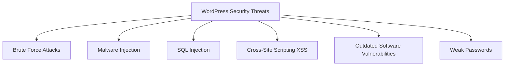

# WordPress Security Basics

## Introduction

WordPress powers more than 40% of all websites on the internet, making it a prime target for hackers and malicious actors. Understanding the basics of WordPress security is crucial for anyone running or developing WordPress websites. This guide will help you implement essential security measures to protect your WordPress site from common threats.

Security is not a one-time task but an ongoing process. By implementing the security fundamentals outlined in this guide, you'll significantly reduce the risk of your WordPress site being compromised.

## Why WordPress Security Matters

WordPress websites face several common security threats:



A security breach can lead to:
- Data theft
- Website defacement
- SEO penalties
- Loss of customer trust
- Distribution of malware to your visitors

## Essential WordPress Security Measures

### 1. Keep Everything Updated

One of the simplest yet most effective security measures is keeping your WordPress core, themes, and plugins updated.

#### Why Updates Matter

Updates often include security patches for known vulnerabilities. When a vulnerability is discovered, developers release updates to fix it. If you don't update, your site remains vulnerable to attacks that target these known issues.

#### How to Update WordPress

You can update WordPress core, themes, and plugins from your dashboard:

1. Navigate to **Dashboard → Updates**
2. Select the items you want to update
3. Click "Update"

For automatic updates, you can add this code to your `wp-config.php` file:

```php
// Enable all core updates, including minor and major:
define('WP_AUTO_UPDATE_CORE', true);
```

### 2. Use Strong Passwords and Two-Factor Authentication

Weak passwords are one of the easiest ways for attackers to gain access to your site. Always use strong, unique passwords for all accounts.

#### Password Best Practices

- Use at least 12 characters
- Include uppercase and lowercase letters, numbers, and special characters
- Avoid dictionary words, personal information, or common patterns
- Use different passwords for different websites

#### Implementing Two-Factor Authentication (2FA)

Two-factor authentication adds an extra layer of security by requiring a second verification step beyond your password.

Popular WordPress 2FA plugins include:
- Google Authenticator
- Wordfence 
- Two Factor Authentication

#### Example: Installing and Setting Up 2FA

1. Go to **Plugins → Add New**
2. Search for "Two Factor Authentication"
3. Install and activate a 2FA plugin
4. Configure the plugin according to its setup instructions
5. Test the login process to ensure 2FA works correctly

### 3. Secure Your WordPress Login Page

The login page (`wp-login.php`) is a common target for brute force attacks, where attackers attempt to guess usernames and passwords.

#### Limit Login Attempts

By default, WordPress allows unlimited login attempts, making it vulnerable to brute force attacks. Limiting login attempts can help mitigate this risk.

Add the following to your `.htaccess` file to detect and block multiple failed login attempts:

```apache
# Block user enumeration
RewriteCond %{QUERY_STRING} author=([0-9]*)
RewriteRule .* /? [L,R=302]

# Block WordPress xmlrpc.php requests
<Files xmlrpc.php>
order deny,allow
deny from all
</Files>
```

#### Change the Login URL

You can change your WordPress login URL to make it harder for attackers to find your login page.

Plugins like "WPS Hide Login" allow you to change the default login URL to something custom.

### 4. Install a Security Plugin

Security plugins provide all-in-one solutions for many WordPress security concerns.

#### Popular WordPress Security Plugins

- **Wordfence**: Includes a firewall, malware scanner, and login security features
- **Sucuri**: Offers malware scanning, file integrity monitoring, and security hardening
- **iThemes Security**: Provides over 30 ways to secure your WordPress site

#### Basic Setup of a Security Plugin

1. Install and activate the security plugin
2. Run initial security scan
3. Follow the plugin's recommendations
4. Configure firewall settings
5. Enable login protection features
6. Set up regular security scans

### 5. Take Regular Backups

Backups are your safety net. If your site gets hacked, having a recent backup allows you to restore your site quickly.

#### Backup Best Practices

- Store backups in multiple locations (not just on your hosting server)
- Automate the backup process
- Test your backups by performing a test restore
- Include both files and database in your backups

#### Backup Solutions

- **UpdraftPlus**: Free plugin with options to store backups in cloud storage
- **BackupBuddy**: Premium plugin with complete WordPress backup features
- **Hosting-provided backups**: Many hosting providers offer automatic backups

#### Example: Setting Up UpdraftPlus

```php
// Simple UpdraftPlus automated backup setup:
// 1. Install and activate UpdraftPlus
// 2. Go to Settings → UpdraftPlus Backups
// 3. Click on "Settings" tab
// 4. Choose backup contents and schedule
// 5. Select remote storage option (Dropbox, Google Drive, etc.)
// 6. Save changes and create your first backup
```

### 6. Secure wp-config.php

The `wp-config.php` file contains critical information about your WordPress installation, including database credentials. Securing this file is essential.

#### Move wp-config.php

You can move the `wp-config.php` file one directory above your WordPress installation:

```
/
├── wp-config.php
└── public_html/
    ├── index.php
    ├── wp-admin/
    ├── wp-content/
    └── ...
```

#### Add Security Keys

WordPress security keys encrypt information stored in cookies. Strong, unique keys make your site more secure.

You can generate new keys at [https://api.wordpress.org/secret-key/1.1/salt/](https://api.wordpress.org/secret-key/1.1/salt/) and add them to your `wp-config.php` file:

```php
define('AUTH_KEY',         'unique-phrase-here');
define('SECURE_AUTH_KEY',  'unique-phrase-here');
define('LOGGED_IN_KEY',    'unique-phrase-here');
define('NONCE_KEY',        'unique-phrase-here');
define('AUTH_SALT',        'unique-phrase-here');
define('SECURE_AUTH_SALT', 'unique-phrase-here');
define('LOGGED_IN_SALT',   'unique-phrase-here');
define('NONCE_SALT',       'unique-phrase-here');
```

### 7. Implement HTTPS

HTTPS encrypts the data transferred between your website and your visitors, protecting sensitive information.

#### Benefits of HTTPS

- Secures data transmission
- Builds visitor trust
- Improves SEO rankings (Google prefers HTTPS sites)
- Required for many features like service workers and progressive web apps

#### How to Enable HTTPS

1. Obtain an SSL certificate (many hosts offer free Let's Encrypt certificates)
2. Install the SSL certificate on your server
3. Update your WordPress settings to use HTTPS

After installing your SSL certificate, update your WordPress URL settings:

1. Go to **Settings → General**
2. Change "WordPress Address (URL)" and "Site Address (URL)" to begin with `https://`
3. Save changes

You may also need to update your `.htaccess` file to redirect all traffic to HTTPS:

```apache
# Redirect HTTP to HTTPS
<IfModule mod_rewrite.c>
RewriteEngine On
RewriteCond %{HTTPS} off
RewriteRule ^(.*)$ https://%{HTTP_HOST}%{REQUEST_URI} [L,R=301]
</IfModule>
```

## Real-World Security Scenario

Let's walk through a real-world example of hardening a WordPress site's security:

### Case Study: E-commerce Site Security Setup

Imagine you're setting up security for a new WordPress e-commerce site that will process customer payments and store personal information.

#### Step 1: Initial Server and WordPress Configuration

First, establish a secure foundation:

```php
// In wp-config.php - Disable file editing in admin
define('DISALLOW_FILE_EDIT', true);

// Force SSL for admin area
define('FORCE_SSL_ADMIN', true);

// Set proper file permissions
// Directories: 755
// Files: 644
```

#### Step 2: Plugin Security

Install only necessary plugins and secure them:

1. Research each plugin for security issues before installation
2. Remove any unused plugins
3. Set up a security plugin like Wordfence with:
   - Real-time monitoring
   - Scheduled scans
   - IP blocking for suspicious activity

#### Step 3: Payment Security

For e-commerce functionality:

1. Ensure PCI compliance for payment processing
2. Use reputable payment gateways that handle card data off-site
3. Implement data encryption for sensitive information

#### Step 4: Regular Maintenance Plan

Set up an ongoing security maintenance plan:

- Weekly plugin and theme updates
- Monthly security scan and vulnerability check
- Quarterly security audit of user permissions
- Regular backups before any updates

## WordPress Security Best Practices Summary

Here's a comprehensive checklist to help you maintain WordPress security:

1. **Keep everything updated**
   - WordPress core
   - Themes
   - Plugins

2. **Use strong authentication**
   - Complex passwords
   - Two-factor authentication
   - Limited login attempts

3. **Secure key files**
   - Protect wp-config.php
   - Secure .htaccess
   - Use security keys

4. **Implement HTTPS**
   - SSL certificate
   - Force HTTPS across site

5. **Install security plugins**
   - Firewall
   - Malware scanning
   - Login protection

6. **Take regular backups**
   - Automated schedule
   - Multiple storage locations
   - Regular restore testing

7. **Limit user privileges**
   - Assign appropriate user roles
   - Regularly audit user accounts

8. **Server-level security**
   - Use secure hosting
   - Implement firewall rules
   - Keep server software updated

## Summary

WordPress security is an ongoing process that requires vigilance and proactive measures. By following the basic security practices outlined in this guide, you can significantly reduce the risk of your WordPress website being compromised.

Remember that security is about layers of protection. No single measure can completely secure your site, but implementing multiple security measures creates a more robust defense against various threats.

## Additional Resources

To continue learning about WordPress security, explore these resources:

1. [WordPress Codex: Hardening WordPress](https://wordpress.org/support/article/hardening-wordpress/)
2. [OWASP (Open Web Application Security Project)](https://owasp.org/)
3. [WPScan Vulnerability Database](https://wpscan.com/vulnerabilities)

## Practice Exercises

1. Perform a security audit on your WordPress site using a security plugin and identify at least three vulnerabilities.
2. Set up a staging environment to test security configurations before implementing them on your live site.
3. Create a security incident response plan that outlines steps to take if your WordPress site gets hacked.
4. Configure your WordPress backup system and perform a test restore to verify it works properly.
5. Review your WordPress user roles and permissions to ensure users have only the access they need.

By consistently applying these security practices, you'll create a more secure WordPress environment and reduce the likelihood of successful attacks on your website.