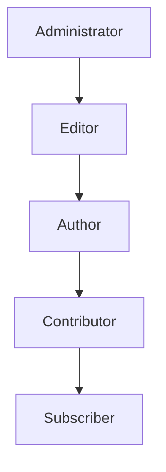

# WordPress User Security

## Introduction

User security is a fundamental aspect of WordPress site protection. Since users interact with your WordPress site through accounts with varying privilege levels, securing these accounts is crucial for maintaining overall website integrity. This guide explores essential user security practices for WordPress, helping you protect your site from unauthorized access and potential breaches.

User security in WordPress encompasses several key areas:
- Secure authentication practices
- Appropriate user role management
- Strong password policies
- Protection against common user-based attacks

Whether you're managing a personal blog or a business website, implementing these security measures will significantly reduce your site's vulnerability.

## Understanding WordPress User Roles

WordPress has a built-in role-based access control system that determines what actions users can perform on your site.

### Default WordPress User Roles

WordPress comes with the following predefined user roles, arranged from highest to lowest privileges:



Let's examine each role's capabilities:

| Role | Description | Security Implications |
|------|-------------|----------------------|
| Administrator | Complete site control, including plugin/theme management | High risk if compromised |
| Editor | Can publish and manage all content | Can modify content but not site settings |
| Author | Can publish and manage their own posts | Limited content modification abilities |
| Contributor | Can write posts but cannot publish them | Very limited capabilities |
| Subscriber | Can only manage their profile | Minimal risk if compromised |

### Best Practices for Role Management

1. **Follow the Principle of Least Privilege**: Assign users the minimum access level they need to perform their tasks.

```php
// Example of programmatically changing a user's role to a lower privilege
function downgrade_user_role($user_id) {
    $user = new WP_User($user_id);
    
    // Remove all roles
    $user->set_role('');
    
    // Add the new role with fewer privileges
    $user->add_role('author');
    
    return true;
}
```

2. **Regularly Audit User Accounts**: Remove unused accounts and verify appropriate role assignments.

```php
// Example of listing all administrators for audit purposes
function list_all_admins() {
    $admins = get_users(['role' => 'administrator']);
    
    foreach($admins as $admin) {
        echo 'Admin user: ' . $admin->user_login . ' (ID: ' . $admin->ID . ')<br />';
    }
}
```

## Implementing Secure Authentication

Strong authentication is your first line of defense against unauthorized access.

### Two-Factor Authentication (2FA)

2FA adds an extra layer of security by requiring two different types of identification before granting access.

Several plugins can add 2FA to your WordPress site:
- Google Authenticator
- Two Factor Authentication
- Wordfence Security

### Setting up 2FA with a plugin:

1. Install and activate your chosen 2FA plugin
2. Configure the plugin settings
3. Enable 2FA for administrative accounts first
4. Gradually roll out to other user roles

### Limiting Login Attempts

By default, WordPress allows unlimited login attempts, which makes it vulnerable to brute force attacks.

```php
// Example code showing how to hook into the WordPress authentication system
// to count and limit failed login attempts
function check_login_attempts($user, $username, $password) {
    if (empty($username)) return $user;
    
    // Get the IP address
    $ip = $_SERVER['REMOTE_ADDR'];
    
    // Get current failed attempts for this IP
    $failed_attempts = get_transient('failed_login_attempts_' . $ip);
    
    if ($user instanceof WP_User) {
        // Successful login, reset the counter
        delete_transient('failed_login_attempts_' . $ip);
        return $user;
    }
    
    // Failed login, increment the counter
    $failed_attempts = ($failed_attempts) ? $failed_attempts + 1 : 1;
    set_transient('failed_login_attempts_' . $ip, $failed_attempts, 3600); // Store for 1 hour
    
    // If too many failed attempts, block further attempts
    if ($failed_attempts >= 5) {
        return new WP_Error('too_many_attempts', 'Too many failed login attempts. Please try again later.');
    }
    
    return $user;
}

add_filter('authenticate', 'check_login_attempts', 30, 3);
```

## Enforcing Strong Password Policies

Weak passwords remain one of the most common security vulnerabilities.

### Password Requirements

WordPress doesn't enforce strong passwords by default, but you can implement requirements with plugins or custom code.

```php
// Example of enforcing strong password requirements
function enforce_strong_password($errors, $update, $user) {
    if ($update) {
        return $errors;
    }
    
    $password = isset($_POST['pass1']) ? $_POST['pass1'] : '';
    
    // Check password length
    if (strlen($password) < 12) {
        $errors->add('password_too_short', 'Password must be at least 12 characters long.');
    }
    
    // Check for uppercase letters
    if (!preg_match('/[A-Z]/', $password)) {
        $errors->add('password_no_upper', 'Password must include at least one uppercase letter.');
    }
    
    // Check for numbers
    if (!preg_match('/[0-9]/', $password)) {
        $errors->add('password_no_number', 'Password must include at least one number.');
    }
    
    // Check for special characters
    if (!preg_match('/[^a-zA-Z0-9]/', $password)) {
        $errors->add('password_no_special', 'Password must include at least one special character.');
    }
    
    return $errors;
}
add_filter('registration_errors', 'enforce_strong_password', 10, 3);
```

### Password Expiration and Rotation

Implementing password expiration policies encourages users to regularly update their passwords.

```php
// Example of implementing a password expiration system
function check_password_expiration() {
    if (!is_user_logged_in()) {
        return;
    }
    
    $user_id = get_current_user_id();
    $last_password_change = get_user_meta($user_id, 'last_password_change', true);
    $current_time = time();
    
    // If no record exists or password was changed more than 90 days ago
    if (empty($last_password_change) || ($current_time - $last_password_change > 90 * DAY_IN_SECONDS)) {
        // Redirect to password change page
        wp_redirect(admin_url('profile.php?password_expired=true'));
        exit;
    }
}
add_action('admin_init', 'check_password_expiration');

// Update the last password change timestamp when a user changes their password
function update_password_change_time($user_id) {
    update_user_meta($user_id, 'last_password_change', time());
}
add_action('after_password_reset', 'update_password_change_time');
add_action('wp_update_user', 'update_password_change_time');
```

## Protecting Against Common User-Based Attacks

### Preventing Username Enumeration

WordPress makes it easy to discover valid usernames, which can be used in targeted attacks.

```php
// Prevent username enumeration through author parameter
function prevent_author_enumeration($redirect_url) {
    if (isset($_REQUEST['author']) && is_numeric($_REQUEST['author'])) {
        wp_redirect(home_url(), 301);
        exit;
    }
    return $redirect_url;
}
add_filter('redirect_canonical', 'prevent_author_enumeration');
```

### Securing the WordPress Login Page

The default WordPress login page (`wp-login.php`) is a common target for attacks.

Options for securing the login page include:

1. **Custom Login URL**: Change the default login URL to something unique.

```php
// Example of how to create a custom login URL with a simple plugin
function custom_login_url() {
    // Create a custom login URL at /secure-login instead of /wp-login.php
    if ($_SERVER['REQUEST_URI'] == '/secure-login/') {
        require_once(ABSPATH . 'wp-login.php');
        exit();
    }
    
    // Block direct access to wp-login.php
    if (strpos($_SERVER['REQUEST_URI'], 'wp-login.php') !== false && 
        !isset($_SERVER['HTTP_REFERER']) || 
        strpos($_SERVER['HTTP_REFERER'], 'wp-admin') === false) {
        wp_redirect(home_url());
        exit();
    }
}
add_action('init', 'custom_login_url');

// Update the login URL for WordPress functions
function custom_login_url_filter($url) {
    return str_replace('wp-login.php', 'secure-login', $url);
}
add_filter('site_url', 'custom_login_url_filter', 10, 4);
add_filter('network_site_url', 'custom_login_url_filter', 10, 3);
```

2. **Login Page CAPTCHA**: Add CAPTCHA to prevent automated login attempts.

### Monitoring User Activity

Track user actions to detect suspicious behavior:

```php
// Simple example of logging user actions
function log_user_activity($user_login, $user) {
    $activity = [
        'time' => current_time('mysql'),
        'user_id' => $user->ID,
        'username' => $user_login,
        'ip' => $_SERVER['REMOTE_ADDR'],
        'user_agent' => $_SERVER['HTTP_USER_AGENT']
    ];
    
    // Log to a custom table or file
    // This is a simplified example - in production, use a proper logging mechanism
    error_log(json_encode($activity));
}
add_action('wp_login', 'log_user_activity', 10, 2);
```

## Implementing User Security in Real-World Scenarios

### Case Study: Small Business Website

For a small business website with multiple content contributors:

1. **Role Configuration**:
   - Owner: Administrator (single account)
   - Content Managers: Editor role
   - Marketing Staff: Author role
   - Interns/Temporary: Contributor role

2. **Security Measures**:
   - 2FA for all Administrator and Editor accounts
   - Custom login URL with CAPTCHA protection
   - Password requirements enforced for all users
   - Regular security audits of user accounts

### Case Study: Membership Website

For a membership website with user-generated content:

1. **Role Configuration**:
   - Site Owners: Administrator (limited accounts)
   - Moderators: Editor or custom moderation role
   - Premium Members: Custom role with additional capabilities
   - Standard Members: Subscriber role with enhanced permissions

2. **Security Measures**:
   - Email verification for all new accounts
   - Progressive privilege system based on user history
   - Monitoring systems for unusual account activity
   - Automatic account lockout after suspicious behavior

## Summary

Securing WordPress user accounts is crucial for maintaining overall website security. Key practices include:

1. **Managing user roles** appropriately using the principle of least privilege
2. **Implementing strong authentication** with methods like 2FA
3. **Enforcing password policies** to ensure users create strong credentials
4. **Protecting against common attacks** by securing login pages and monitoring activity
5. **Regularly auditing user accounts** to identify potential security risks

By implementing these security measures, you can significantly reduce the risk of unauthorized access and account-based attacks on your WordPress site.

## Additional Resources and Exercises

### Resources for Further Learning

- [WordPress Codex: Roles and Capabilities](https://wordpress.org/support/article/roles-and-capabilities/)
- [OWASP Authentication Cheat Sheet](https://cheatsheetseries.owasp.org/cheatsheets/Authentication_Cheat_Sheet.html)
- [WordPress.org Security Documentation](https://wordpress.org/support/article/hardening-wordpress/)

### Practice Exercises

1. **Security Audit Exercise**: 
   - Review your WordPress site's user list
   - Verify each user has the appropriate role
   - Remove inactive accounts
   - Ensure administrators are using strong passwords and 2FA

2. **Custom Security Implementation**:
   - Create a custom plugin that enforces your organization's password policy
   - Implement login attempt limitations
   - Set up a system to log and review user activity

3. **Role-Based Security Challenge**:
   - Create a custom user role with specific capabilities
   - Implement content restrictions based on user roles
   - Test the security boundaries of your implementation

Remember that security is an ongoing process. Regularly review and update your security measures as new WordPress versions are released and as security best practices evolve.