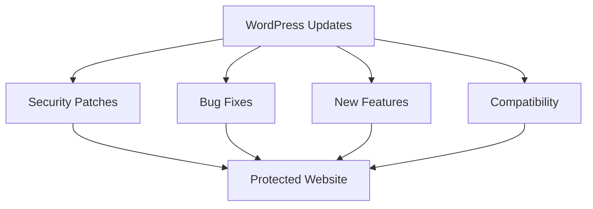

# WordPress Updates Management

## Introduction

WordPress powers over 40% of all websites on the internet, making it a popular target for hackers and malicious actors. One of the most critical aspects of WordPress security is keeping your website updated. 

Updates aren't just about getting new features—they often include critical security patches that protect your site from known vulnerabilities. In this guide, we'll explore how to effectively manage WordPress updates to maintain a secure and well-performing website.

## Why Updates Matter

Before diving into the how-to, let's understand why WordPress updates are so important:

1. **Security Patches**: Updates fix security vulnerabilities that could be exploited by hackers.
2. **Bug Fixes**: Updates resolve functionality issues and improve site performance.
3. **New Features**: Updates often include new features and improvements to enhance your site.
4. **Compatibility**: Updates ensure your site works with the latest versions of PHP, browsers, and other technologies.



## Types of WordPress Updates

WordPress updates come in three main categories:

### 1. Core Updates

These are updates to the WordPress software itself. They come in two forms:

- **Major Updates**: These include new features, major changes, and are denoted by number changes like 5.8, 5.9, 6.0.
- **Minor Updates**: These are primarily security and maintenance releases, denoted as 5.8.1, 5.8.2, etc.

### 2. Plugin Updates

These are updates to the plugins you've installed to extend WordPress functionality.

### 3. Theme Updates

These are updates to your WordPress theme, affecting how your site looks and functions.

## Best Practices for Managing WordPress Updates

### Setting Up Automatic Updates

WordPress 5.6 and later enables automatic updates for minor releases by default. Here's how to configure automatic updates for different components:

#### For Core Updates

Add this code to your `wp-config.php` file to enable automatic updates for all core updates:

```php
// Enable all core updates, including minor and major:
define( 'WP_AUTO_UPDATE_CORE', true );

// Enable core updates for minor releases only (default):
define( 'WP_AUTO_UPDATE_CORE', 'minor' );

// Disable all core updates:
define( 'WP_AUTO_UPDATE_CORE', false );
```

#### For Plugin and Theme Updates

You can selectively enable automatic updates for specific plugins or themes by adding this code to your theme's `functions.php` file or a site-specific plugin:

```php
// Enable automatic updates for all plugins
add_filter( 'auto_update_plugin', '__return_true' );

// Enable automatic updates for all themes
add_filter( 'auto_update_theme', '__return_true' );

// Enable updates for specific plugins
function auto_update_specific_plugins( $update, $item ) {
    // Array of plugin slugs to automatically update
    $plugins = array( 
        'akismet',
        'contact-form-7'
    );
    
    if ( in_array( $item->slug, $plugins ) ) {
        return true; // Always update plugins in this array
    } else {
        return $update; // Use default for other plugins
    }
}
add_filter( 'auto_update_plugin', 'auto_update_specific_plugins', 10, 2 );
```

### Manual Update Process

While automatic updates are convenient, manual updates give you more control. Here's the proper way to manually update WordPress:

1. **Backup Your Site**: Always create a complete backup of your files and database before updating.

2. **Update in Staging First**: If possible, test updates in a staging environment before applying to your live site.

3. **Update WordPress Core**:
   - Go to Dashboard > Updates
   - Click "Update Now" if a core update is available

4. **Update Plugins**:
   - Go to Dashboard > Updates or Plugins > Installed Plugins
   - Select the plugins you want to update
   - Click "Update Plugins"

5. **Update Themes**:
   - Go to Dashboard > Updates or Appearance > Themes
   - Click on the update notification for your theme

### Creating a Maintenance Mode Page

When performing updates, it's good practice to put your site in maintenance mode to prevent users from seeing broken pages:

```php
// Create a simple maintenance mode function
function wp_maintenance_mode() {
    if (!current_user_can('edit_themes') || !is_user_logged_in()) {
        wp_die('<h1>Under Maintenance</h1><p>We are performing scheduled maintenance. We will be back online shortly!</p>', 'Maintenance Mode');
    }
}
add_action('get_header', 'wp_maintenance_mode');
```

Add this code to your `functions.php` file when updating, and remove it when finished.

## Advanced Update Management Strategies

### Using a Staging Environment

A staging environment is a copy of your live website used for testing updates before applying them to your production site.

Setting up a staging environment:

1. Many hosting providers offer one-click staging environment creation
2. You can use plugins like WP Staging or duplicator to create a staging site
3. After testing updates in staging, migrate the changes to production

### Using Version Control

Version control systems like Git can help track changes to your WordPress site:

1. Initialize a Git repository in your WordPress installation
2. Create a `.gitignore` file to exclude unnecessary files
3. Commit your changes before and after updates

Example `.gitignore` file for WordPress:

```
# Ignore WordPress core files
wp-admin/
wp-includes/
wp-*.php
index.php
xmlrpc.php
license.txt
readme.html

# Ignore sensitive data
wp-config.php

# Ignore uploads directory
wp-content/uploads/

# Ignore cache files
wp-content/cache/
wp-content/advanced-cache.php
wp-content/wp-cache-config.php

# Ignore plugin and theme specific files
wp-content/plugins/*/README.md
wp-content/themes/*/README.md
```

### Using WordPress Management Tools

Several tools can help manage WordPress updates across multiple sites:

1. **ManageWP**: Manage updates across multiple WordPress sites from a single dashboard
2. **MainWP**: Self-hosted solution for managing multiple WordPress sites
3. **InfiniteWP**: Another tool for managing multiple WordPress installations

## Troubleshooting Common Update Issues

### White Screen of Death (WSOD)

If your site shows a blank white screen after updating:

1. Access your site via FTP or your hosting file manager
2. Rename the `plugins` folder to `plugins_old` to deactivate all plugins
3. If the site comes back, activate plugins one by one to identify the problematic one
4. Contact the plugin developer or find an alternative plugin

### Broken Functionality

If certain features stop working after an update:

1. Check browser console for JavaScript errors
2. Enable WordPress debugging by adding this to `wp-config.php`:

```php
define( 'WP_DEBUG', true );
define( 'WP_DEBUG_LOG', true );
define( 'WP_DEBUG_DISPLAY', false );
```

3. Check the debug log at `wp-content/debug.log` for PHP errors

### Failed Updates

If an update fails to complete:

1. Try updating again manually
2. Increase PHP memory limit in `wp-config.php`:

```php
define( 'WP_MEMORY_LIMIT', '256M' );
```

3. If problems persist, contact your hosting provider

## Real-World Update Management Plan

Let's create a practical update management plan for a small business website:

### Weekly Tasks

- Check for available updates in WordPress dashboard
- Review plugin update changelogs to understand what's changing
- Perform minor plugin updates that don't mention breaking changes

### Monthly Tasks

- Create a full backup of the website
- Update WordPress core if a new version is available
- Update all plugins and themes
- Test critical website functionality:
  - Contact forms
  - E-commerce checkout process
  - Search functionality
  - Mobile responsiveness

### Quarterly Tasks

- Perform a security audit
- Remove unused plugins and themes
- Test site performance using tools like GTmetrix or PageSpeed Insights
- Check for plugins that haven't been updated in 6+ months and consider alternatives

## Update Management Best Practices

1. **Never skip updates**: Delaying updates leaves your site vulnerable
2. **Always back up first**: Create a complete backup before any update
3. **Update in the right order**: Themes first, then plugins, then WordPress core
4. **Test thoroughly after updates**: Check critical functionality after updating
5. **Keep a record of updates**: Document when you performed updates and any issues encountered
6. **Monitor site after updates**: Watch for any unexpected behavior for 24-48 hours

## Summary

Managing WordPress updates is a fundamental aspect of website security and maintenance. By following the practices outlined in this guide, you can keep your WordPress site secure, stable, and performing well.

Remember these key points:
- Regular updates are essential for security
- Always back up before updating
- Test updates in a staging environment when possible
- Have a systematic process for managing updates
- Keep documentation of all update activities

By implementing these strategies, you'll significantly reduce the risk of security breaches and ensure your WordPress site remains in optimal condition.

## Additional Resources

- [WordPress Codex on Updating WordPress](https://wordpress.org/support/article/updating-wordpress/)
- [Understanding WordPress Security](https://wordpress.org/support/article/hardening-wordpress/)
- [WordPress Backup Solutions](https://wordpress.org/support/article/wordpress-backups/)

## Exercises

1. Set up automatic updates for minor WordPress core releases on your website.
2. Create a backup strategy that includes both files and database.
3. Configure a staging environment for your WordPress site.
4. Perform a security audit after updating all components of your WordPress installation.
5. Document an update management plan specific to your WordPress site's needs.