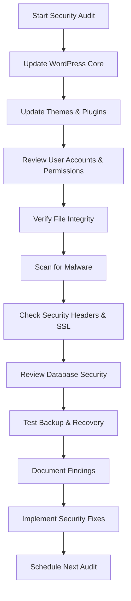

# WordPress Security Audits

## Introduction

Security is a critical aspect of maintaining a WordPress website. With WordPress powering over 40% of all websites on the internet, it has become a prime target for hackers and malicious actors. WordPress security audits are systematic examinations of your website's security posture, designed to identify vulnerabilities before they can be exploited.

In this guide, we'll walk through the process of conducting a thorough WordPress security audit, providing you with the knowledge and tools to protect your website effectively.

## Why Security Audits Matter

Security audits are not just for large organizations or e-commerce websites. Every WordPress site, regardless of size or purpose, can benefit from regular security audits for several reasons:

1. **Proactive Protection**: Identify security issues before they can be exploited
2. **Compliance Requirements**: Meet industry regulations and standards
3. **Data Protection**: Safeguard sensitive user information
4. **Reputation Management**: Maintain trust with your visitors and customers
5. **Performance Optimization**: Security vulnerabilities can often affect site performance

## Key Components of a WordPress Security Audit

### 1. WordPress Core, Theme, and Plugin Updates

Outdated software is one of the most common security vulnerabilities. Here's how to check for updates:

```php
// You can use the WordPress API to check for updates programmatically
function check_for_updates() {
    // Check WordPress core updates
    $core_updates = get_core_updates();
    
    // Check theme updates
    $theme_updates = get_theme_updates();
    
    // Check plugin updates
    $plugin_updates = get_plugin_updates();
    
    return [
        'core' => $core_updates,
        'themes' => $theme_updates,
        'plugins' => $plugin_updates
    ];
}

// Output example
$updates = check_for_updates();
print_r($updates);
```

**Expected output:**
```
Array
(
    [core] => Array
        (
            [0] => stdClass Object
                (
                    [current] => 6.2.3
                    [version] => 6.3.1
                    [php_version] => 5.6.20
                    [mysql_version] => 5.0
                    [new_bundled] => 
                    [partial_version] => 
                    [response] => upgrade
                )
        )
    [themes] => Array(...theme update information...)
    [plugins] => Array(...plugin update information...)
)
```

### 2. User Management and Permissions Review

Check for inactive or unnecessary user accounts and inappropriate permission levels.

```php
// Example function to audit user accounts and roles
function audit_user_accounts() {
    $users = get_users();
    $user_audit = [];
    
    foreach ($users as $user) {
        $last_login = get_user_meta($user->ID, 'last_login', true);
        $user_audit[] = [
            'ID' => $user->ID,
            'username' => $user->user_login,
            'role' => implode(', ', $user->roles),
            'registered' => $user->user_registered,
            'last_login' => $last_login ? date('Y-m-d H:i:s', $last_login) : 'Never'
        ];
    }
    
    return $user_audit;
}
```

### 3. File Integrity Verification

Check if your WordPress core files have been modified from their original state.

```php
// Simple file integrity checking function
function check_core_file_integrity() {
    // Get WordPress version
    $wp_version = get_bloginfo('version');
    
    // Core files to check (simplified example)
    $core_files = [
        ABSPATH . 'wp-login.php',
        ABSPATH . 'wp-config.php',
        ABSPATH . 'index.php',
        ABSPATH . 'wp-settings.php'
    ];
    
    $modified_files = [];
    
    foreach ($core_files as $file) {
        // You'd compare with checksums from WordPress.org API
        // This is a simplified example
        if (file_exists($file)) {
            // Check if file has been modified recently
            $modified_time = filemtime($file);
            $install_time = get_option('wp_installation_time', 0);
            
            if ($modified_time > $install_time) {
                $modified_files[] = [
                    'file' => $file,
                    'modified' => date('Y-m-d H:i:s', $modified_time)
                ];
            }
        }
    }
    
    return $modified_files;
}
```

### 4. Database Security Assessment

The WordPress database contains sensitive information and should be regularly audited.

```sql
-- SQL queries to check for suspicious database entries
-- Example to find potential SQL injection attempts in postmeta
SELECT post_id, meta_key, meta_value 
FROM wp_postmeta 
WHERE meta_value LIKE '%<script>%' 
   OR meta_value LIKE '%eval(%' 
   OR meta_value LIKE '%base64_decode(%';
```

### 5. Security Headers and SSL Configuration

Security headers protect against common web vulnerabilities like XSS, clickjacking, and more.

```php
// Function to check security headers
function check_security_headers() {
    $site_url = get_site_url();
    $headers = get_headers($site_url, 1);
    
    $security_headers = [
        'Strict-Transport-Security' => 'Not set',
        'Content-Security-Policy' => 'Not set',
        'X-Content-Type-Options' => 'Not set',
        'X-Frame-Options' => 'Not set',
        'X-XSS-Protection' => 'Not set',
        'Referrer-Policy' => 'Not set'
    ];
    
    foreach ($security_headers as $header => $value) {
        if (isset($headers[$header])) {
            $security_headers[$header] = $headers[$header];
        }
    }
    
    return $security_headers;
}
```

To add security headers to your WordPress site, you can add the following to your `.htaccess` file:

```apache
# Security Headers
<IfModule mod_headers.c>
    # Protect against XSS attacks
    Header set X-XSS-Protection "1; mode=block"
    
    # Prevent MIME-sniffing
    Header set X-Content-Type-Options "nosniff"
    
    # Clickjacking protection
    Header set X-Frame-Options "SAMEORIGIN"
    
    # Enforce HTTPS
    Header set Strict-Transport-Security "max-age=31536000; includeSubDomains"
    
    # Control resource loading
    Header set Content-Security-Policy "default-src 'self';"
    
    # Control referrer information
    Header set Referrer-Policy "strict-origin-when-cross-origin"
</IfModule>
```

## Creating a WordPress Security Audit Workflow

Here's a step-by-step workflow for conducting a comprehensive security audit:



## Security Audit Checklist

Let's create a practical security audit checklist:

1. **WordPress Core and Software Updates**
   - [ ] WordPress core is up to date
   - [ ] All themes are updated (including inactive ones)
   - [ ] All plugins are updated (including inactive ones)
   - [ ] Removed unused themes and plugins

2. **User Security**
   - [ ] Admin username is not "admin"
   - [ ] Strong password policy enforced
   - [ ] User roles correctly assigned
   - [ ] Inactive users disabled or deleted
   - [ ] Two-factor authentication implemented

3. **File System Security**
   - [ ] Proper file permissions (755 for directories, 644 for files)
   - [ ] Core file integrity verified
   - [ ] Secure wp-config.php file location
   - [ ] No sensitive information in public directories
   - [ ] Disabled directory browsing

4. **Database Security**
   - [ ] WordPress database prefix is not default "wp_"
   - [ ] Regular database backups configured
   - [ ] Removed orphaned tables and entries
   - [ ] Scanned for suspicious content

5. **Server Configuration**
   - [ ] Security headers implemented
   - [ ] SSL certificate installed and properly configured
   - [ ] PHP version is current and secure
   - [ ] Firewall configured (WAF or host-level)
   - [ ] File upload limits properly set

## Implementing a Security Audit Plugin

If you're creating or recommending a security audit plugin, here's a simplified example of how one might work:

```php
/**
 * Plugin Name: Simple WordPress Security Audit
 * Description: Performs basic security audits on your WordPress installation
 * Version: 1.0.0
 */

// Don't allow direct access
if (!defined('ABSPATH')) {
    exit;
}

class Simple_Security_Audit {
    public function __construct() {
        add_action('admin_menu', array($this, 'add_admin_menu'));
    }
    
    public function add_admin_menu() {
        add_management_page(
            'Security Audit', 
            'Security Audit', 
            'manage_options', 
            'security-audit', 
            array($this, 'audit_page')
        );
    }
    
    public function audit_page() {
        echo '<div class="wrap">';
        echo '<h1>WordPress Security Audit</h1>';
        
        // Run the audit
        $this->perform_audit();
        
        echo '</div>';
    }
    
    public function perform_audit() {
        // Check WordPress version
        $this->check_wordpress_version();
        
        // Check plugin updates
        $this->check_plugin_updates();
        
        // Check theme updates
        $this->check_theme_updates();
        
        // Check file permissions
        $this->check_file_permissions();
        
        // Check user security
        $this->check_user_security();
    }
    
    private function check_wordpress_version() {
        // Implementation here
    }
    
    private function check_plugin_updates() {
        // Implementation here
    }
    
    private function check_theme_updates() {
        // Implementation here
    }
    
    private function check_file_permissions() {
        // Implementation here
    }
    
    private function check_user_security() {
        // Implementation here
    }
}

// Initialize plugin
$simple_security_audit = new Simple_Security_Audit();
```

## Real-World Example: Conducting a Full Security Audit

Let's walk through a complete security audit for a typical WordPress site:

### Step 1: Create a Pre-Audit Backup

Always create a full backup before beginning your audit.

```php
// Example backup function (conceptual - use a dedicated backup solution in production)
function create_security_audit_backup() {
    // Timestamp for backup identification
    $timestamp = date('Y-m-d-H-i-s');
    
    // Backup directory (should be outside web root)
    $backup_dir = WP_CONTENT_DIR . '/backups/' . $timestamp;
    
    if (!file_exists($backup_dir)) {
        mkdir($backup_dir, 0755, true);
    }
    
    // Backup database
    $this->backup_database($backup_dir);
    
    // Backup files
    $this->backup_files($backup_dir);
    
    return $backup_dir;
}
```

### Step 2: Run an Automated Scan

Use a security plugin to perform an initial scan for common issues.

### Step 3: Manually Review Critical Components

Review your WordPress configuration with special attention to:

```php
// Check if debug mode is enabled in production
function check_wp_debug() {
    if (defined('WP_DEBUG') && WP_DEBUG === true) {
        return 'Warning: WP_DEBUG is enabled in production';
    }
    return 'OK: WP_DEBUG is disabled';
}

// Check if REST API is properly protected
function check_rest_api_security() {
    $results = [];
    
    // Check if REST API is restricted
    if (!has_filter('rest_authentication_errors')) {
        $results[] = 'Warning: REST API is not restricted';
    }
    
    // Check if user enumeration is possible
    $response = wp_remote_get(rest_url('wp/v2/users'));
    if (!is_wp_error($response) && 200 === wp_remote_retrieve_response_code($response)) {
        $users = json_decode(wp_remote_retrieve_body($response));
        if (!empty($users)) {
            $results[] = 'Warning: User enumeration is possible via REST API';
        }
    }
    
    return empty($results) ? 'OK: REST API is properly secured' : $results;
}
```

### Step 4: Review Server Logs

Server logs can reveal attempted attacks and security issues:

```bash
# Example Apache command to find potential attack patterns in logs
grep -E '(wp-login|xmlrpc|admin-ajax|eval\(|base64_decode)' /var/log/apache2/access.log | tail -n 100
```

### Step 5: Document Findings and Create Action Plan

Organize your findings by severity and create a prioritized action plan:

1. Critical issues - Address immediately
2. High severity issues - Address within 48 hours
3. Medium severity issues - Address within 1 week
4. Low severity issues - Address during next maintenance window

## Automating Regular Security Audits

Create a WP-Cron job to perform automatic security checks:

```php
// Register the security audit cron job
function register_security_audit_cron() {
    if (!wp_next_scheduled('weekly_security_audit')) {
        wp_schedule_event(time(), 'weekly', 'weekly_security_audit');
    }
}
add_action('wp', 'register_security_audit_cron');

// Function to execute during the cron job
function perform_scheduled_security_audit() {
    $audit_results = [];
    
    // Check for updates
    $updates_needed = check_for_updates();
    $audit_results['updates'] = $updates_needed;
    
    // Check file integrity
    $file_integrity = check_core_file_integrity();
    $audit_results['file_integrity'] = $file_integrity;
    
    // Check security headers
    $security_headers = check_security_headers();
    $audit_results['security_headers'] = $security_headers;
    
    // Store results
    update_option('security_audit_results', $audit_results);
    
    // Send email notification if issues found
    if (!empty($updates_needed['core']) || !empty($file_integrity)) {
        $admin_email = get_option('admin_email');
        wp_mail(
            $admin_email,
            'WordPress Security Audit: Issues Detected',
            'Your scheduled security audit has detected issues that need attention. Please log in to review.'
        );
    }
}
add_action('weekly_security_audit', 'perform_scheduled_security_audit');
```

## Responding to Security Audit Findings

When your security audit reveals vulnerabilities, follow these steps:

1. **Prioritize issues** based on severity and potential impact
2. **Document all changes** you make in response to findings
3. **Create a timeline** for addressing all identified issues
4. **Test fixes** in a staging environment before applying to production
5. **Verify fixes** after implementation to ensure they resolved the issue
6. **Update your security policies** based on lessons learned

## Summary

WordPress security audits are essential for maintaining a secure website. By regularly performing comprehensive audits, you can identify and address vulnerabilities before they can be exploited by malicious actors.

In this guide, we've covered:

- The importance of WordPress security audits
- Key components to examine during an audit
- Step-by-step workflow for conducting thorough audits
- Tools and techniques for automated security testing
- Real-world examples and practical implementation steps
- Methods for responding to and documenting audit findings

Remember that security is not a one-time task but an ongoing process. Regular audits, combined with proactive security measures, will significantly improve your WordPress site's security posture.

## Additional Resources

1. **WordPress Hardening Guide**: [WordPress.org Security Documentation](https://wordpress.org/support/article/hardening-wordpress/)
2. **OWASP WordPress Security Implementation Guide**
3. **WordPress Security Best Practices**

## Practice Exercises

1. Conduct a basic security audit on a test WordPress installation and document your findings.
2. Create a custom plugin that checks for at least five common WordPress security issues.
3. Set up an automated weekly security scan using WP-Cron and email notifications.
4. Develop a security audit checklist tailored to your specific WordPress environment.
5. Practice a security incident response by simulating a breach on a test environment.

By making security audits a regular part of your WordPress maintenance routine, you'll stay ahead of potential threats and keep your site secure for your visitors and customers.