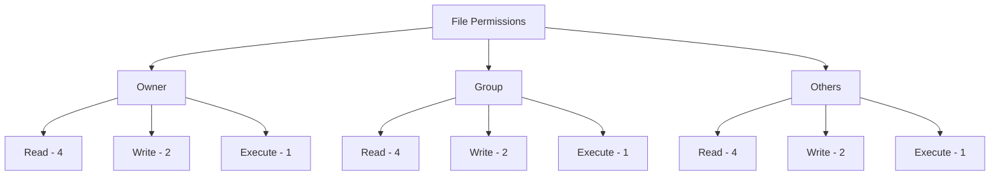

# WordPress File Permissions

## Introduction

File permissions play a crucial role in WordPress security. Properly configured file permissions help protect your website from unauthorized access and potential attacks while ensuring that WordPress functions correctly. In this guide, we'll explore what WordPress file permissions are, why they matter, and how to set them up correctly to secure your WordPress installation.

## What Are File Permissions?

File permissions determine who can read, write, or execute files on your web server. In Unix-based systems (which most WordPress hosting environments use), permissions are assigned to three user categories:

- **Owner**: The user who owns the file or directory
- **Group**: Users who belong to the file's designated group
- **Others**: Everyone else who accesses the server

Each category can be assigned specific permissions:

- **Read (r)**: Permission to view the file or list directory contents (numeric value: 4)
- **Write (w)**: Permission to modify the file or add/remove files in a directory (numeric value: 2)
- **Execute (x)**: Permission to run the file as a program or access a directory (numeric value: 1)

Permissions are often represented in numeric format (like 755 or 644) or symbolic notation (like `rwxr-xr-x`).



## Why WordPress File Permissions Matter

Incorrect file permissions can lead to:

1. **Security vulnerabilities**: Overly permissive settings allow attackers to modify your files
2. **Website malfunctions**: Overly restrictive settings prevent WordPress from working properly
3. **Plugin/theme issues**: Some functionalities may break if permissions aren't set correctly

## Recommended WordPress File Permissions

Here's a table of recommended permissions for different WordPress files and directories:

| Files/Directories | Recommended Permissions | Numeric Value | Description |
|-------------------|------------------------|--------------|-------------|
| WordPress directories | `rwxr-xr-x` | 755 | Directories need to be executable to be accessed |
| WordPress files | `rw-r--r--` | 644 | Regular files need read permissions, but not execution |
| wp-config.php | `rw-------` | 600 | This sensitive file should be restricted to owner only |
| .htaccess | `rw-r--r--` | 644 | Server needs to read this file, but only owner should write |
| /wp-content/uploads/ | `rwxrwxr-x` | 775 | WordPress needs to write to the uploads directory |

## How to Check Current File Permissions

You can check your current file permissions using SSH or an FTP client.

### Using SSH

Connect to your server via SSH and use the `ls` command with the `-la` flag:

```bash
ls -la
```

Output will look something like:

```
drwxr-xr-x 5 username usergroup 4096 Jan 15 12:34 .
drwxr-xr-x 7 username usergroup 4096 Jan 15 12:34 ..
-rw-r--r-- 1 username usergroup  418 Jan 15 12:34 index.php
-rw-r--r-- 1 username usergroup 19935 Jan 15 12:34 license.txt
-rw------- 1 username usergroup  3957 Jan 15 12:34 wp-config.php
drwxr-xr-x 9 username usergroup  4096 Jan 15 12:34 wp-content
```

The first column shows the permissions in symbolic notation. The first character indicates whether it's a directory (`d`) or a file (`-`).

### Using FTP Client

Most FTP clients like FileZilla display file permissions. Usually, you can right-click on a file and select "File Permissions" or "Properties" to see and modify permissions.

## How to Change File Permissions

### Using SSH (Command Line)

To change file permissions via SSH, use the `chmod` command:

```bash
# Change a single file permission
chmod 644 filename.php

# Change all files in a directory
chmod 644 *.php

# Change a directory and its contents recursively
chmod -R 755 wp-content/
```

### Using FTP Client

1. Connect to your website via FTP
2. Right-click on the file or directory you want to modify
3. Select "File Permissions" or similar option
4. Enter the numeric value or check/uncheck permission boxes
5. Apply the changes

## Practical Examples

### Fixing Common Permission Issues

#### WordPress Cannot Upload Files

If WordPress cannot upload files, the uploads directory might have incorrect permissions:

```bash
# Fix uploads directory permissions
chmod -R 755 wp-content/uploads/
```

Or if the web server runs as a different user than your FTP user:

```bash
chmod -R 775 wp-content/uploads/
```

#### Plugin or Theme Installation Fails

If you can't install plugins or themes directly from the WordPress admin:

```bash
# Fix permissions for the plugins directory
chmod -R 755 wp-content/plugins/

# Fix permissions for the themes directory
chmod -R 755 wp-content/themes/
```

#### Securing wp-config.php

The wp-config.php file contains sensitive information and should be secured:

```bash
# Secure wp-config.php file
chmod 600 wp-config.php
```

### WordPress Permissions Reset Script

Here's a bash script that sets recommended permissions for a WordPress installation:

```bash
#!/bin/bash
# Reset WordPress file permissions script

# Reset files to 644
find /path/to/wordpress/ -type f -exec chmod 644 {} \;

# Reset directories to 755
find /path/to/wordpress/ -type d -exec chmod 755 {} \;

# Set wp-config.php to 600
chmod 600 /path/to/wordpress/wp-config.php

# Make uploads directory writable
chmod -R 775 /path/to/wordpress/wp-content/uploads/

echo "WordPress permissions have been reset to secure defaults."
```

Replace `/path/to/wordpress/` with your actual WordPress installation path.

## Special Considerations

### Shared Hosting Environments

In shared hosting, your website runs under your user account, but PHP scripts often run as a different user. If WordPress needs to write to files, you may need more permissive settings:

- Use `775` instead of `755` for directories that WordPress needs to write to
- Use `664` instead of `644` for files that WordPress needs to modify

### Local Development Environments

Local development environments often require more permissive settings than production servers. It's okay to use more permissive settings locally, but make sure to tighten security when deploying to production.

## Troubleshooting Permission Issues

### Common Error Messages Related to Permissions

| Error Message | Likely Cause | Solution |
|---------------|-------------|----------|
| "Unable to create directory" | WordPress cannot write to directory | `chmod 755` or `775` the directory |
| "Failed to write file to disk" | Insufficient permissions on uploads directory | `chmod -R 755` the uploads directory |
| "Could not create directory" | Plugin/theme installer cannot create directories | Check permissions on wp-content directories |

### Testing Process

When troubleshooting permission issues:

1. Start with the most restrictive permissions that could work
2. Gradually increase permissions until functionality is restored
3. Only give the minimum permissions necessary
4. Document what you've changed for future reference

## WordPress Permission Principles to Remember

1. **Principle of Least Privilege**: Give only the permissions necessary for WordPress to function
2. **Files vs. Directories**: Directories typically need execution permission (755), while files don't (644)
3. **Sensitive Files**: Configuration files should have tighter restrictions than regular files
4. **Writeable Directories**: Only specific directories should be writable by WordPress

## Summary

Proper file permissions are a fundamental aspect of WordPress security. By following these guidelines, you can significantly reduce the risk of unauthorized access while ensuring your WordPress site functions correctly:

1. Most directories should be set to `755`
2. Most files should be set to `644`
3. Sensitive files like wp-config.php should be set to `600`
4. Directories that need to be writable should be set to `755` or occasionally `775`
5. Regularly audit your file permissions as part of your security maintenance

Remember that permissions are just one aspect of WordPress security. For a comprehensive security approach, combine proper permissions with other security measures like regular updates, strong passwords, and security plugins.

## Additional Resources

- [WordPress Codex on Hardening WordPress](https://wordpress.org/documentation/article/hardening-wordpress/)
- [WordPress Permissions Explained](https://www.wpbeginner.com/beginners-guide/beginners-guide-to-file-and-directory-permissions-in-wordpress/)

## Practice Exercises

1. Check your current WordPress installation permissions and compare them to the recommended settings.
2. Create a bash script that checks for insecure permissions in your WordPress installation.
3. Set up a test environment to practice changing file permissions and observe the effects on WordPress functionality.