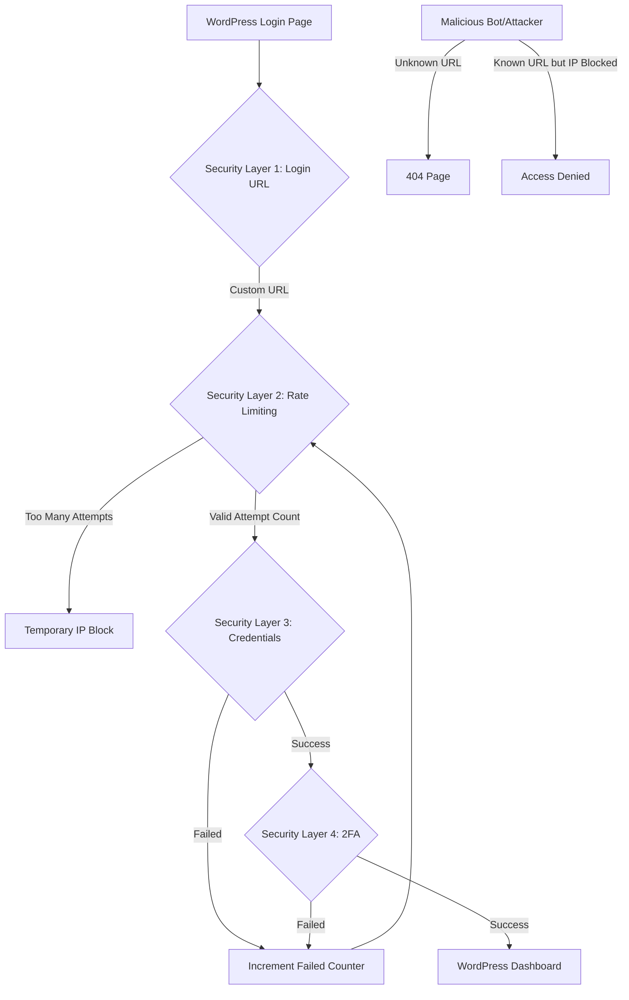

# WordPress Login Protection

WordPress login security is your first line of defense against unauthorized access. Since the login page is publicly accessible, it's a primary target for attackers seeking to gain administrative access to your website.

## Why Login Protection Matters

Every day, WordPress sites face countless automated login attempts from bots and hackers using:
- Dictionary attacks (common username/password combinations)
- Brute force attacks (systematically trying all possible combinations)
- Credential stuffing (using leaked credentials from other websites)

Without proper protection, your site remains vulnerable to these persistent attacks.

## Basic WordPress Login Security Measures

### 1. Strong Username and Password

The foundation of login security starts with proper credentials:

```php
// DON'T use simple usernames like:
'admin', 'administrator', 'webmaster'

// DO use strong passwords that include:
// - At least 12 characters
// - Uppercase and lowercase letters
// - Numbers
// - Special characters
```

### 2. Change the Default Admin Username

If you've already created a WordPress site with the default "admin" username, create a new administrator account and delete the old one:

1. Go to **Users → Add New**
2. Create a new user with administrator role
3. Log out and log in with the new admin account
4. Delete the original "admin" user
5. Attribute content from the old user to the new one when prompted

### 3. Limit Login Attempts

By default, WordPress allows unlimited login attempts, making it vulnerable to brute force attacks. Install a plugin to limit login attempts:

```php
// Example functionality (from Limit Login Attempts plugin)
function limit_login_attempts() {
    // Track failed login attempts by IP
    $failed_attempts = get_transient('failed_login_' . $ip_address);
    
    if ($failed_attempts >= 5) {
        // Lock out IP for 30 minutes
        set_transient('lockout_' . $ip_address, true, 30 * MINUTE_IN_SECONDS);
        wp_die('Too many failed login attempts. Try again later.');
    }
    
    // Increment failed attempts
    if ($login_status === 'failed') {
        set_transient('failed_login_' . $ip_address, $failed_attempts + 1, 24 * HOUR_IN_SECONDS);
    }
}
```

### 4. Use HTTPS for Login Pages

Always secure your login communication with SSL/TLS:

```php
// Force SSL for login and admin pages
// Add to wp-config.php
define('FORCE_SSL_LOGIN', true);
define('FORCE_SSL_ADMIN', true);
```

## Advanced Login Protection Techniques

### 1. Two-Factor Authentication (2FA)

Two-factor authentication adds an extra layer of security by requiring a second form of verification beyond just username and password.

```php
// Example 2FA verification flow
function verify_2fa_code($user, $code) {
    // Get the user's secret key
    $secret = get_user_meta($user->ID, 'two_factor_secret', true);
    
    // Verify the provided code against the secret
    $authenticator = new GoogleAuthenticator();
    if ($authenticator->verifyCode($secret, $code, 2)) {
        // Code is valid
        return true;
    }
    
    // Code is invalid
    return false;
}
```

### 2. Custom Login URL

Change your WordPress login URL to prevent automated attacks targeting the default `/wp-login.php` path:

```php
// Example code to change login URL 
// (similar to what WPS Hide Login plugin does)
function change_login_url() {
    // Set custom login URL
    add_rewrite_rule('^private-login/?$', 'wp-login.php', 'top');
    
    // Block access to default login URLs
    if ($original_login_url_accessed) {
        // Redirect to 404 page
        $this->wp_die();
    }
}
```

### 3. Login Captcha

Implement CAPTCHA challenges to differentiate between humans and bots:

```php
// Example reCAPTCHA implementation
function add_recaptcha_to_login() {
    ?>
    <div class="g-recaptcha" data-sitekey="YOUR_SITE_KEY"></div>
    <?php
}
add_action('login_form', 'add_recaptcha_to_login');

function verify_recaptcha($user, $password) {
    // Verify reCAPTCHA response
    $recaptcha_response = $_POST['g-recaptcha-response'];
    
    $verify_response = wp_remote_post('https://www.google.com/recaptcha/api/siteverify', array(
        'body' => array(
            'secret' => 'YOUR_SECRET_KEY',
            'response' => $recaptcha_response
        )
    ));
    
    $response_data = json_decode(wp_remote_retrieve_body($verify_response));
    
    if (!$response_data->success) {
        // reCAPTCHA verification failed
        return new WP_Error('captcha_error', 'CAPTCHA verification failed. Please try again.');
    }
    
    return $user;
}
add_filter('authenticate', 'verify_recaptcha', 10, 3);
```

### 4. IP-based Access Restrictions

Restrict login access to specific IP addresses for admin users:

```php
// Allow only specific IPs to access wp-admin
function restrict_admin_by_ip() {
    $allowed_ips = array('192.168.1.1', '10.0.0.1');
    
    if (is_admin() && !current_user_can('manage_options') && !in_array($_SERVER['REMOTE_ADDR'], $allowed_ips)) {
        wp_die('Access denied based on your IP address.');
    }
}
add_action('init', 'restrict_admin_by_ip');
```

## Implementing Login Protection with Plugins

There are several reliable plugins that can help you implement login protection without writing code:

### Wordfence Security

Wordfence offers comprehensive security features including login protection:

1. Limit login attempts
2. Two-factor authentication
3. Country blocking
4. Real-time traffic monitoring

### Sucuri Security

Sucuri provides:

1. Brute force prevention
2. IP blacklisting
3. Security activity auditing

### WPS Hide Login

This lightweight plugin allows you to:

1. Change the WordPress login URL
2. Completely disable access to wp-login.php

## Real-World Example: Complete Login Protection Setup

Let's implement a comprehensive login protection strategy for a typical WordPress site:



### Implementation Steps:

1. **Install and configure a security plugin** like Wordfence
   ```php
   // Example Wordfence configuration in wp-config.php
   define('WORDFENCE_DISABLE_LIVE_TRAFFIC', true); // For high-traffic sites
   define('WORDFENCE_DISABLE_FILE_SCANNING', false);
   ```

2. **Change the login URL** with WPS Hide Login
   - Install and activate the plugin
   - Go to Settings → WPS Hide Login
   - Set a new login URL (e.g., `/secret-login`)

3. **Implement 2FA** using Wordfence or a dedicated 2FA plugin
   - Enable 2FA for all admin users
   - Set up authentication apps on admin smartphones

4. **Configure brute force protection**
   - Set limit to 5 failed attempts
   - Set lockout period to 30 minutes
   - Enable email notifications for lockouts

5. **Enable login CAPTCHA**
   - Install and activate a CAPTCHA plugin
   - Configure CAPTCHA to appear on login and registration forms

## Monitoring and Maintaining Login Security

Security is an ongoing process. Regularly:

1. **Review login activity logs** to identify suspicious patterns
2. **Update plugins** providing security features
3. **Scan for vulnerabilities** in your WordPress installation
4. **Test your login security** measures periodically

```php
// Example of checking login activity with get_option
function check_recent_login_activity() {
    $login_activity = get_option('login_activity_log', array());
    $suspicious_activity = false;
    
    foreach ($login_activity as $entry) {
        // Check for multiple failed attempts from same IP
        if ($entry['status'] === 'failed' && $entry['ip'] === $current_ip) {
            $failed_count++;
        }
        
        // Check for successful logins from unusual locations
        if ($entry['status'] === 'success' && !in_array($entry['country'], $usual_countries)) {
            $suspicious_activity = true;
            // Send alert
        }
    }
}
```

## Summary

Protecting your WordPress login page is essential for maintaining your website's security. By implementing strong passwords, limiting login attempts, using two-factor authentication, changing the default login URL, and utilizing CAPTCHA, you can significantly reduce the risk of unauthorized access.

Remember that security is a layered approach—each measure you implement adds another barrier for attackers to overcome. Start with the basics and progressively enhance your security posture as needed.

## Additional Resources

- WordPress Codex: [Hardening WordPress](https://wordpress.org/support/article/hardening-wordpress/)
- OWASP: [Authentication Cheat Sheet](https://cheatsheetseries.owasp.org/cheatsheets/Authentication_Cheat_Sheet.html)

## Exercises

1. Install and configure a login security plugin like Wordfence or Sucuri.
2. Change your WordPress login URL and test that the old URL no longer works.
3. Set up two-factor authentication for your admin account.
4. Review your site's login attempt logs to identify any potential attacks.
5. Create a security policy document for your WordPress site that includes login protection measures.