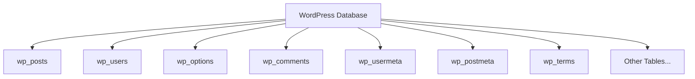

# WordPress Database Security

## Introduction

Your WordPress database houses all your valuable content—posts, pages, user credentials, comments, and settings. It's the heart of your WordPress installation, making it a prime target for attackers. Without proper database security measures, your website becomes vulnerable to data theft, corruption, and unauthorized access.

In this guide, we'll explore essential techniques to secure your WordPress database, focusing on practical approaches that even beginners can implement. You'll learn how to protect sensitive information, prevent common attacks, and maintain a secure database environment.

## Why WordPress Database Security Matters

WordPress uses MySQL or MariaDB to store all your website data. By default, this includes:

- User login credentials (usernames and password hashes)
- Personal information of registered users
- All content you've created (posts, pages, media)
- Plugin and theme settings
- Website configuration details

A database breach can lead to:

1. Account takeovers
2. Content theft or manipulation
3. Website defacement
4. Malware injection
5. Complete site compromise

## Understanding the WordPress Database Structure

Before diving into security measures, let's understand the basic structure of a WordPress database:



Each table serves a specific purpose:
- `wp_posts`: Stores pages, posts, and other content
- `wp_users`: Contains user account information
- `wp_options`: Houses site configuration settings
- `wp_comments`: Stores user comments

Now that we understand what we're protecting, let's explore how to secure it.

## Essential WordPress Database Security Measures

### 1. Secure Your Database Credentials

#### Protect wp-config.php

The `wp-config.php` file contains your database credentials. It's crucial to:

1. Keep it in a location not accessible from the web
2. Set proper file permissions (usually 600 or 644)
3. Use strong, unique database credentials

Here's how you might update your database credentials in `wp-config.php`:

```php
// Use strong, unique credentials
define('DB_NAME', 'unique_database_name');
define('DB_USER', 'unique_username_not_root');
define('DB_PASSWORD', 'StR0ng&Un!qu3P@ssw0rd');
define('DB_HOST', 'localhost');
```

#### Add Security Keys and Salts

WordPress uses authentication keys and salts to enhance login security. Generate strong, random values:

```php
define('AUTH_KEY',         'uW(Vw:Vb+$V|MBoUg+Y-7U$!g-a_^}UrmrS!w31+^|Dl:0!yH bZ<>UUVt]ewS@G');
define('SECURE_AUTH_KEY',  'mJao[!h#qzTvxkL?c5flXD^-}Yd1jtSy|ngGI7PD}1Y|rjbsy&F[hda#][/aWU@p');
define('LOGGED_IN_KEY',    'k/<n|.b&.K_!ByC1^mz=+`lXnzPYgSO{}Vm-|:+U3K]~[+(%{-9b-#5?|%aPdQcm');
define('NONCE_KEY',        'I{g7tD@Snw0j:S+(G}rq;gLlD6-Tc[vsrU)cnHd|2d7P!si$dH-S~>Vw9c0L@Qsb');
define('AUTH_SALT',        'y3+HyV=5N,`ww|~xT$W?Gn8+{*e*OD4s<;YD.I%+yltyEk/OEWT}AIzgKhwN!|bt');
define('SECURE_AUTH_SALT', '(@FC@0irh/w=T+HyMtw[Rv7B#=o*~^v(V?&b%*py(^HOe4+?cRr=rv#)H9a)%Uot');
define('LOGGED_IN_SALT',   'G~;+Uu7a-]xK{hYS*amE)Er0&#<WPCS]aGQs?DQ-)|X2af<3=l$ug!,#9rN#ZY0B');
define('NONCE_SALT',       'sW&=:n%L9l2(s2C]3Q>%|1@*OlC7/A0x4)x~w|S;u||iCAb&d|RX!R4JoK*YlK1+');
```

You can generate these values using WordPress's online generator: https://api.wordpress.org/secret-key/1.1/salt/

### 2. Prevent SQL Injection Attacks

SQL injection is one of the most common attack vectors. WordPress has built-in protection with the `$wpdb` class, but you should still follow best practices when writing custom database queries.

#### Bad Practice (Vulnerable to SQL Injection):

```php
// DON'T DO THIS - Vulnerable to SQL injection
$username = $_POST['username'];
$results = $wpdb->query("SELECT * FROM wp_users WHERE user_login = '$username'");
```

#### Best Practice:

```php
// DO THIS - Using prepared statements
$username = $_POST['username'];
$results = $wpdb->get_results(
    $wpdb->prepare(
        "SELECT * FROM %i WHERE user_login = %s",
        $wpdb->users,
        $username
    )
);
```

### 3. Use Table Prefix

Change the default WordPress table prefix (`wp_`) to something custom. This makes it harder for attackers to guess your table names when attempting SQL injection attacks.

In your `wp-config.php` file:

```php
// Instead of the default 'wp_'
$table_prefix = 'xyz21_';
```

For existing WordPress installations, you can use a plugin like "Better WP Security" or manually update the database to change the table prefix.

### 4. Implement Database Backup Strategy

Regular backups are crucial for database security and recovery.

#### Create a Simple Backup Script

Create a file called `db-backup.php` (store it outside the public directory):

```php
<?php
// Database credentials
$db_name = 'your_database_name';
$db_user = 'your_database_user';
$db_pass = 'your_database_password';
$db_host = 'localhost';

// Backup file
$backup_dir = '/path/to/secure/backup/directory/';
$backup_file = $backup_dir . $db_name . '_' . date("Y-m-d-H-i-s") . '.sql';

// Command for mysqldump
$command = "mysqldump --opt -h $db_host -u $db_user -p$db_pass $db_name > $backup_file";

// Execute command
system($command);

// Compress the file
system("gzip $backup_file");

echo "Backup completed: " . $backup_file . ".gz";
?>
```

You can then set up a cron job to run this script regularly.

### 5. Limit Database User Privileges

Create a database user with only the privileges needed for WordPress, rather than using root or a user with full privileges.

```sql
-- Create a dedicated WordPress database user
CREATE USER 'wp_user'@'localhost' IDENTIFIED BY 'strong_password';

-- Grant only needed privileges
GRANT SELECT, INSERT, UPDATE, DELETE, CREATE, DROP, INDEX, ALTER 
ON wordpress_db.* TO 'wp_user'@'localhost';

FLUSH PRIVILEGES;
```

### 6. Enable Database Encryption

#### Implement SSL for Database Connection

If your database is on a separate server, enable SSL for the connection by adding these lines to your `wp-config.php`:

```php
define('MYSQL_CLIENT_FLAGS', MYSQLI_CLIENT_SSL);
define('MYSQL_SSL_CA', '/path/to/ca-cert.pem');
```

#### Encrypt Sensitive Data

For sensitive data, consider additional encryption:

```php
// Example function to encrypt and decrypt sensitive data
function encrypt_data($plaintext, $key) {
    $method = "AES-256-CBC";
    $iv = openssl_random_pseudo_bytes(16);
    $ciphertext = openssl_encrypt($plaintext, $method, $key, OPENSSL_RAW_DATA, $iv);
    return base64_encode($iv . $ciphertext);
}

function decrypt_data($ciphertext, $key) {
    $ciphertext = base64_decode($ciphertext);
    $iv = substr($ciphertext, 0, 16);
    $ciphertext = substr($ciphertext, 16);
    $method = "AES-256-CBC";
    return openssl_decrypt($ciphertext, $method, $key, OPENSSL_RAW_DATA, $iv);
}
```

### 7. Restrict Database Access

Limit direct access to your MySQL server:

```sql
-- Allow only local connections (if WordPress and DB are on same server)
UPDATE mysql.user SET Host = 'localhost' WHERE User = 'wp_user';
FLUSH PRIVILEGES;
```

If your database is on a separate server, use a firewall to restrict IP access:

```bash
# Example using ufw on Ubuntu/Debian
sudo ufw allow from your_wordpress_server_ip to any port 3306
```

## Real-World Example: Securing a WordPress Site After Compromise

Let's walk through a practical example of securing a WordPress database after a security incident:

### Scenario: WordPress Site Compromised

You discover unauthorized admin users and suspicious content in your WordPress site. Here's how to secure your database:

#### Step 1: Change all database credentials

```php
// In wp-config.php
define('DB_NAME', 'new_database_name');
define('DB_USER', 'new_database_user'); 
define('DB_PASSWORD', 'new_strong_password');
```

#### Step 2: Check for unauthorized users

```sql
-- Look for users you don't recognize
SELECT ID, user_login, user_registered FROM wp_users;

-- Remove unauthorized admin
DELETE FROM wp_users WHERE user_login = 'hacker_username';
DELETE FROM wp_usermeta WHERE user_id = 'hacker_id';
```

#### Step 3: Search for malicious content

```sql
-- Check for suspicious posts or pages
SELECT ID, post_title, post_content, post_modified 
FROM wp_posts 
WHERE post_content LIKE '%eval(%' 
   OR post_content LIKE '%base64_decode(%' 
   OR post_content LIKE '%<script%';
```

#### Step 4: Search for backdoors in options table

```sql
-- Look for suspicious option values
SELECT option_name, option_value 
FROM wp_options 
WHERE option_value LIKE '%eval(%' 
   OR option_value LIKE '%base64_decode(%' 
   OR option_value LIKE '%<script%';
```

#### Step 5: Change table prefix and update security keys

```php
// In wp-config.php - update with new values
$table_prefix = 'new_prefix_';

// Generate fresh security keys
define('AUTH_KEY', 'new-random-value');
// Add all other keys...
```

## Monitoring Database Security

Regular monitoring helps detect potential security issues early:

### 1. Monitor Database Access Logs

Enable MySQL logging in your `my.cnf` or `my.ini`:

```ini
[mysqld]
general_log = 1
general_log_file = /path/to/mysql.log

slow_query_log = 1
slow_query_log_file = /path/to/mysql-slow.log

log_error = /path/to/mysql-error.log
```

### 2. Set Up Database Activity Alerts

Create a simple script to check for unusual activity patterns:

```php
<?php
// Connect to database
$conn = new mysqli('localhost', 'username', 'password', 'database_name');

// Check for multiple failed logins
$query = "SELECT COUNT(*) as attempts FROM wp_login_logs WHERE success = 0 
          AND attempt_time > DATE_SUB(NOW(), INTERVAL 1 HOUR)";

$result = $conn->query($query);
$row = $result->fetch_assoc();

if ($row['attempts'] > 10) {
    // Send alert email
    mail('admin@example.com', 'Security Alert', 'Multiple login failures detected');
}

$conn->close();
?>
```

## Best Practices Checklist

- [ ] Use unique database name (not "wordpress")
- [ ] Create a dedicated database user with limited privileges
- [ ] Use a custom table prefix (not "wp_")
- [ ] Store `wp-config.php` outside web root if possible
- [ ] Set proper file permissions for database-related files
- [ ] Use strong, unique passwords for database access
- [ ] Implement regular database backups (daily or more frequent)
- [ ] Update WordPress core, themes, and plugins regularly
- [ ] Use prepared statements for all database queries
- [ ] Monitor database logs for suspicious activity
- [ ] Use database encryption for sensitive data
- [ ] Implement a Web Application Firewall (WAF)

## Summary

Securing your WordPress database is critical for maintaining the integrity and confidentiality of your website data. By implementing the techniques discussed—creating strong credentials, preventing SQL injection, using table prefixes, regular backups, limiting privileges, and monitoring—you can significantly reduce the risk of a database breach.

Remember that database security is just one aspect of a comprehensive WordPress security strategy. It should be combined with other security practices like using strong passwords, implementing two-factor authentication, keeping WordPress updated, and using security plugins.

## Additional Resources

1. WordPress Codex: Database Security - https://wordpress.org/support/article/hardening-wordpress/#database-security
2. MySQL Security Best Practices - https://dev.mysql.com/doc/refman/8.0/en/security.html
3. SQL Injection Prevention Cheat Sheet - https://cheatsheetseries.owasp.org/cheatsheets/SQL_Injection_Prevention_Cheat_Sheet.html

## Practice Exercises

1. Create a backup strategy for your WordPress database, including automated backups and testing the restoration process.
2. Perform a security audit of your `wp-config.php` file and improve any weak configurations.
3. Write a small script that monitors failed login attempts and sends you an alert email.
4. Create a dedicated database user with appropriate permissions for your WordPress installation.
5. Implement a method to encrypt sensitive user information stored in custom database tables.

By consistently applying these database security principles, you'll build a solid foundation for your WordPress website's overall security posture.