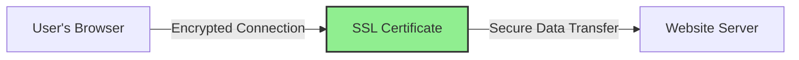

# WordPress SSL Implementation

## Introduction

Secure Socket Layer (SSL) is a critical security technology that establishes an encrypted connection between a web server and a browser. For WordPress websites, implementing SSL is no longer optional—it's essential. SSL not only protects sensitive data exchanged between users and your website but also builds trust, improves search engine rankings, and has become a standard for professional websites.

In this guide, we'll walk through the process of implementing SSL on your WordPress website, from understanding the basics to troubleshooting common issues.

## What is SSL and Why is it Important?

SSL (and its successor, TLS—Transport Layer Security) creates a secure encrypted connection that prevents hackers from intercepting data transmitted between your visitors' browsers and your website's server.

### Key Benefits of SSL Implementation:

1. **Data Protection**: Encrypts sensitive information like login credentials and credit card details
2. **Trust Building**: Shows visitors your site is secure with the padlock icon in browsers
3. **SEO Advantage**: Google gives ranking preference to HTTPS websites
4. **Compliance**: Helps meet data protection regulations like GDPR
5. **Browser Compatibility**: Avoids "not secure" warnings in modern browsers



## Types of SSL Certificates

Before implementation, you need to understand the different types of SSL certificates available:

1. **Domain Validated (DV)**: Basic level verification, quick to obtain
2. **Organization Validated (OV)**: Verifies business legitimacy, moderate vetting
3. **Extended Validation (EV)**: Most rigorous verification, displays organization name in browser
4. **Wildcard Certificates**: Covers main domain and all subdomains
5. **Multi-Domain Certificates**: Secures multiple domains under one certificate

For most WordPress beginners, a Domain Validated certificate is sufficient to start with.

## Prerequisites for SSL Implementation

Before we begin the implementation process, ensure you have:

- Administrative access to your WordPress website
- Access to your hosting control panel
- Access to your domain registrar (if needed for DNS verification)
- A backup of your website (always recommended before major changes)

## Step-by-Step SSL Implementation

### Step 1: Obtain an SSL Certificate

#### Option A: Using Your Host's Free SSL (Recommended for Beginners)

Many hosting providers offer free SSL certificates through Let's Encrypt:

1. Log in to your hosting control panel
2. Look for SSL/Security section
3. Select the option to enable or install Let's Encrypt SSL
4. Follow the host-specific instructions to activate the certificate

#### Option B: Purchase a Certificate from a Certificate Authority

If you need a higher-level certificate:

1. Choose a certificate provider (DigiCert, Comodo, GeoTrust, etc.)
2. Select the appropriate certificate type
3. Complete the verification process
4. Install the certificate using your hosting provider's tools

### Step 2: Configure WordPress to Use HTTPS

Once your SSL certificate is active, you need to update WordPress settings:

1. Log in to your WordPress admin dashboard
2. Go to Settings > General
3. Update both WordPress Address (URL) and Site Address (URL) by changing "http://" to "https://"
4. Save changes and log back in if prompted

```php
// You can also define these in wp-config.php for added security
define('WP_HOME', 'https://yourdomain.com');
define('WP_SITEURL', 'https://yourdomain.com');
```

### Step 3: Set Up Redirects from HTTP to HTTPS

To ensure all traffic uses the secure connection, set up redirects:

#### Option A: Using .htaccess (Apache servers)

Add the following code to your `.htaccess` file:

```apache
<IfModule mod_rewrite.c>
RewriteEngine On
RewriteCond %{HTTPS} off
RewriteRule ^(.*)$ https://%{HTTP_HOST}%{REQUEST_URI} [L,R=301]
</IfModule>
```

#### Option B: Using WordPress Plugin (Easiest Method)

1. Install and activate the "Really Simple SSL" plugin
2. Go to Settings > SSL
3. Click "Activate SSL" or follow the guided setup
4. The plugin will automatically handle redirects and mixed content issues

### Step 4: Fix Mixed Content Issues

Mixed content occurs when your HTTPS pages include resources (images, scripts, etc.) loaded over HTTP. This causes browsers to show security warnings.

#### Manual Method:

1. Use the browser's developer tools (F12) to identify mixed content
2. Update all internal links from HTTP to HTTPS in:
   - Theme files
   - WordPress database
   - Plugin configurations

#### Using SQL Query (Advanced):

Be sure to back up your database before running SQL queries:

```sql
UPDATE wp_posts SET post_content = REPLACE(post_content, 'http://yourdomain.com', 'https://yourdomain.com');
UPDATE wp_postmeta SET meta_value = REPLACE(meta_value, 'http://yourdomain.com', 'https://yourdomain.com');
```

#### Using a Plugin (Recommended for Beginners):

The "Better Search Replace" plugin can help you find and replace all HTTP URLs:

1. Install and activate the plugin
2. Go to Tools > Better Search Replace
3. Enter 'http://yourdomain.com' in the "Search for" field
4. Enter 'https://yourdomain.com' in the "Replace with" field
5. Select all relevant tables
6. Run the search/replace operation

## Testing Your SSL Implementation

After implementation, it's important to verify everything is working correctly:

1. **Check Every Page**: Visit various pages on your site to make sure they load correctly with HTTPS
2. **Verify SSL Certificate**: Use [SSL Labs](https://www.ssllabs.com/ssltest/) to check your implementation
3. **Test Forms and Checkout**: Ensure contact forms and e-commerce functionality work properly
4. **Check for Browser Warnings**: Ensure no security warnings appear in different browsers

## Maintaining Your SSL Certificate

SSL certificates expire—typically after 90 days (Let's Encrypt) or 1-2 years (paid certificates). To maintain security:

- Set up auto-renewal if available through your host
- Calendar the renewal date if manual renewal is required
- Monitor your website for certificate expiration warnings
- Update your certificate if you change domain names

## Troubleshooting Common SSL Issues

### Issue 1: Redirect Loop

**Symptoms**: Browser shows "too many redirects" error

**Solution**:
```php
// Add to wp-config.php (before WordPress settings section)
define('FORCE_SSL_ADMIN', true);
// If you're behind a proxy/load balancer
$_SERVER['HTTPS'] = 'on';
```

### Issue 2: Mixed Content Warnings

**Symptoms**: Padlock icon shows with warning or is missing

**Solution**: 
- Use the "Why No Padlock?" tool to identify specific resources
- Update hardcoded HTTP URLs in your theme files
- Check for plugin-specific settings that might use HTTP links

### Issue 3: Performance Issues

**Symptoms**: Site loads slower after SSL implementation

**Solution**:
- Enable HTTP/2 on your server (check with your host)
- Implement proper caching (WP Rocket, W3 Total Cache, etc.)
- Consider a CDN that supports SSL (Cloudflare, KeyCDN, etc.)

## Real-World Example: E-commerce Implementation

For an e-commerce site, SSL is absolutely critical. Here's how an online store might implement SSL:

1. **Choose the Right Certificate**: For e-commerce, an OV or EV certificate builds more trust
2. **Implement SSL on Checkout Pages**: At minimum, secure pages handling sensitive data
3. **Enable HSTS Header**: Tells browsers to always use HTTPS (advanced)

```apache
# Add to .htaccess for HSTS
<IfModule mod_headers.c>
  Header always set Strict-Transport-Security "max-age=31536000; includeSubDomains; preload"
</IfModule>
```

4. **Add Security Badges**: Display trust symbols like "Secure Checkout" on payment pages
5. **Configure Payment Gateways**: Update API endpoints to use HTTPS versions

## Summary and Best Practices

Implementing SSL on WordPress is a straightforward process that significantly enhances your website's security posture. Let's recap the key points:

1. SSL/HTTPS encrypts data between your visitors and your server
2. Modern websites require SSL for security, SEO, and user trust
3. Most hosts offer free Let's Encrypt certificates that auto-renew
4. Always redirect HTTP to HTTPS to ensure all traffic is secure
5. Regularly check for mixed content issues that might compromise security
6. Monitor certificate expiration dates to prevent security warnings

By following these guidelines, you'll create a more secure environment for your WordPress website and its users.

## Additional Resources

- [WordPress HTTPS Migration Guide](https://wordpress.org/support/article/https-for-wordpress/)
- [Let's Encrypt Documentation](https://letsencrypt.org/docs/)
- [SSL Certificate Explainer](https://www.cloudflare.com/learning/ssl/what-is-an-ssl-certificate/)

## Practice Exercises

1. Install a staging version of your site and practice implementing SSL there first
2. Run an SSL checker tool against your website and address any issues
3. Create a monitoring system to alert you before your SSL certificate expires
4. Compare your site's load time before and after SSL implementation
5. Implement HTTP/2 on your server to optimize performance with SSL

By implementing SSL on your WordPress website, you're not just following best practices—you're creating a safer web experience for everyone who visits your site.