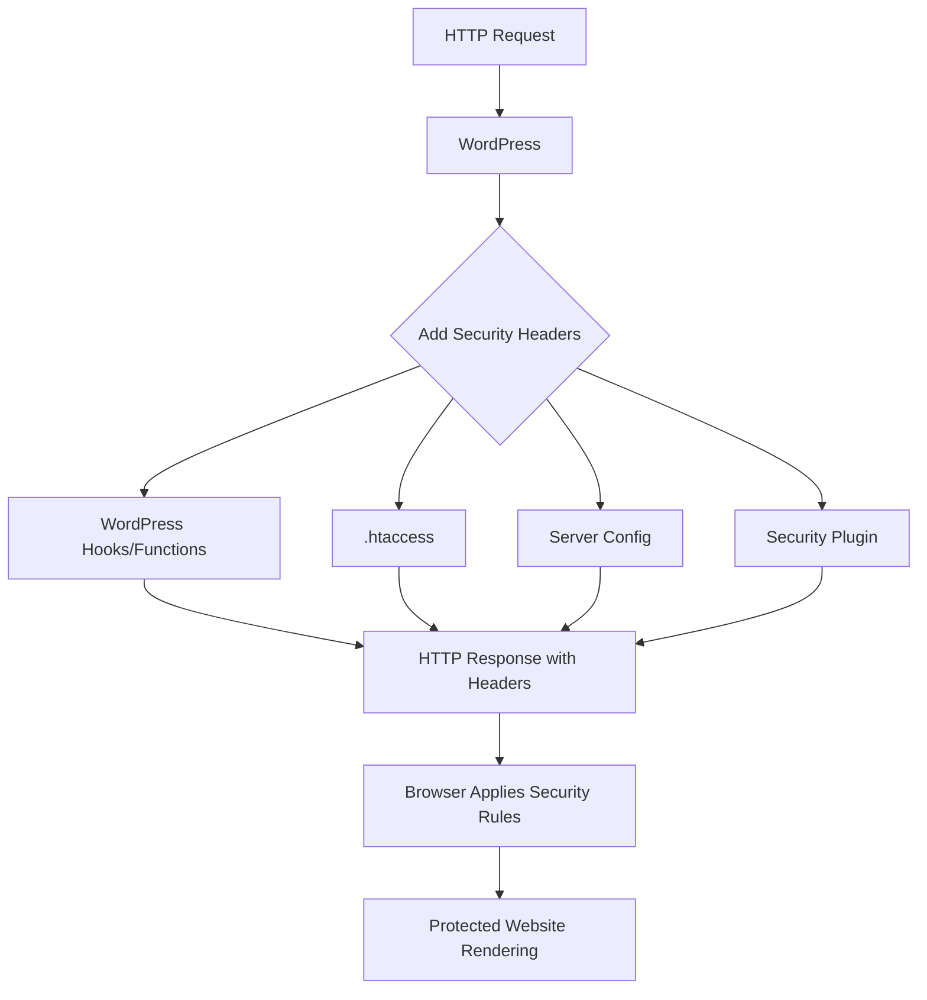

# WordPress Security Headers

Security headers are special HTTP response headers that your WordPress site can send to browsers to enhance security and protect against various attacks. When properly implemented, these headers instruct browsers to enable built-in security mechanisms that help defend against common vulnerabilities like cross-site scripting (XSS), clickjacking, and other code injection attacks.

## Why Security Headers Matter

In today's threat landscape, implementing proper security headers is no longer optional—it's a necessity. These headers provide an additional layer of defense even if vulnerabilities exist in your WordPress themes, plugins, or core files.

Here's why you should care about security headers:

1. They help mitigate multiple security risks with minimal configuration
2. Many headers can be implemented without affecting user experience
3. They improve your site's security posture in security audits
4. Some headers help protect your users' privacy and data

## Common Security Headers for WordPress

Let's explore the most important security headers you should consider adding to your WordPress site:

### 1. Content-Security-Policy (CSP)

The Content-Security-Policy header is one of the most powerful security headers. It helps prevent cross-site scripting (XSS) attacks by controlling which resources (scripts, stylesheets, images, etc.) browsers are allowed to load.

**Basic Example:**

```php
// Add this to your functions.php or a security plugin
function add_csp_header() {
    header("Content-Security-Policy: default-src 'self'; script-src 'self' https://trusted-cdn.com; style-src 'self' https://trusted-cdn.com; img-src 'self' data: https://*; font-src 'self' https://trusted-font-cdn.com;");
}
add_action('send_headers', 'add_csp_header');
```

This header tells browsers to:
- Only load scripts from your own domain and trusted-cdn.com
- Only load styles from your own domain and trusted-cdn.com
- Load images from your domain, data URIs, and any HTTPS source
- Load fonts only from your domain and a trusted font CDN

For WordPress sites with many external resources, implementing CSP can be challenging. Start with a permissive policy in report-only mode:

```php
function add_csp_report_only() {
    header("Content-Security-Policy-Report-Only: default-src 'self'; script-src 'self' 'unsafe-inline' 'unsafe-eval' https:; style-src 'self' 'unsafe-inline' https:; img-src 'self' data: https:; report-uri https://your-reporting-endpoint.com");
}
add_action('send_headers', 'add_csp_report_only');
```

This allows you to see violations without breaking functionality.

### 2. X-XSS-Protection

This header enables built-in browser protection against reflected XSS attacks.

```php
function add_xss_protection() {
    header("X-XSS-Protection: 1; mode=block");
}
add_action('send_headers', 'add_xss_protection');
```

While modern browsers rely more on CSP than this older header, it provides some protection for users on older browsers.

### 3. X-Frame-Options

This header helps prevent clickjacking attacks by controlling which sites can embed yours in an iframe.

```php
function add_frame_options() {
    header("X-Frame-Options: SAMEORIGIN");
}
add_action('send_headers', 'add_frame_options');
```

Options include:
- `DENY`: Prevents any site from framing your content
- `SAMEORIGIN`: Only allows your own site to frame your content
- `ALLOW-FROM https://example.com`: Allows specific domains to frame your content (deprecated)

### 4. X-Content-Type-Options

Prevents browsers from MIME-sniffing a response away from the declared content type.

```php
function add_content_type_options() {
    header("X-Content-Type-Options: nosniff");
}
add_action('send_headers', 'add_content_type_options');
```

This prevents browsers from interpreting files as a different MIME type than what is specified in the Content-Type header.

### 5. Strict-Transport-Security (HSTS)

Forces browsers to use HTTPS for your site even if users type "http://" in the address bar.

```php
function add_hsts_header() {
    header("Strict-Transport-Security: max-age=31536000; includeSubDomains; preload");
}
add_action('send_headers', 'add_hsts_header');
```

Parameters:
- `max-age`: How long browsers should remember to use HTTPS (in seconds)
- `includeSubDomains`: Applies the policy to all subdomains
- `preload`: Indicates intent to submit to the HSTS preload list (optional)

:::caution
Only implement HSTS after confirming your site works properly over HTTPS, as it can make your site inaccessible if SSL is misconfigured.
:::

### 6. Referrer-Policy

Controls how much referrer information should be included with requests.

```php
function add_referrer_policy() {
    header("Referrer-Policy: strict-origin-when-cross-origin");
}
add_action('send_headers', 'add_referrer_policy');
```

Common values:
- `no-referrer`: No referrer information is sent
- `no-referrer-when-downgrade`: Don't send referrer when HTTPS → HTTP
- `same-origin`: Only send referrer for same-site requests
- `strict-origin-when-cross-origin`: Send full path for same-origin, only domain for cross-origin

### 7. Permissions-Policy (formerly Feature-Policy)

Controls which browser features and APIs can be used.

```php
function add_permissions_policy() {
    header("Permissions-Policy: camera=(), microphone=(), geolocation=(self), payment=()");
}
add_action('send_headers', 'add_permissions_policy');
```

This example:
- Blocks camera access completely
- Blocks microphone access completely
- Allows geolocation only for your own domain
- Blocks payment API usage

## Implementing Security Headers in WordPress

There are several ways to implement security headers in WordPress:

### 1. Using PHP in functions.php

You can add the headers directly in your theme's functions.php file:

```php
function add_security_headers() {
    // X-Content-Type-Options
    header("X-Content-Type-Options: nosniff");
    
    // X-Frame-Options
    header("X-Frame-Options: SAMEORIGIN");
    
    // X-XSS-Protection
    header("X-XSS-Protection: 1; mode=block");
    
    // Referrer-Policy
    header("Referrer-Policy: strict-origin-when-cross-origin");
    
    // Permissions-Policy
    header("Permissions-Policy: camera=(), microphone=(), geolocation=(self)");
}
add_action('send_headers', 'add_security_headers');
```

### 2. Using the .htaccess File (Apache)

If you're on an Apache server, you can add headers via .htaccess:

```apache
<IfModule mod_headers.c>
    # Security Headers
    Header set X-Content-Type-Options "nosniff"
    Header set X-Frame-Options "SAMEORIGIN"
    Header set X-XSS-Protection "1; mode=block"
    Header set Referrer-Policy "strict-origin-when-cross-origin"
    Header set Permissions-Policy "camera=(), microphone=(), geolocation=(self)"
    
    # Only add HSTS if you're confident in your HTTPS setup
    Header set Strict-Transport-Security "max-age=31536000; includeSubDomains"
</IfModule>
```

### 3. Using nginx Configuration

If your site runs on nginx:

```nginx
# Add this to your server block
add_header X-Content-Type-Options "nosniff";
add_header X-Frame-Options "SAMEORIGIN";
add_header X-XSS-Protection "1; mode=block";
add_header Referrer-Policy "strict-origin-when-cross-origin";
add_header Permissions-Policy "camera=(), microphone=(), geolocation=(self)";
add_header Strict-Transport-Security "max-age=31536000; includeSubDomains" always;
```

### 4. Using Security Plugins

Several WordPress security plugins make it easy to add security headers:

- **Sucuri Security**: Includes options for security headers
- **Really Simple SSL**: Handles HTTPS-related headers
- **WP Rocket**: Pro version includes security headers
- **SecuPress**: Comprehensive security including headers

## Testing Your Security Headers

After implementing security headers, it's essential to test them. Here are some tools you can use:

1. **Mozilla Observatory** - A comprehensive security scanner
2. **SecurityHeaders.com** - Specifically analyzes HTTP security headers
3. **Chrome DevTools** - Inspect network requests to see your headers

## Real-World Example: E-commerce Site Security Headers

For a WordPress e-commerce site running WooCommerce, you might implement the following:

```php
function ecommerce_security_headers() {
    // Basic security headers
    header("X-Content-Type-Options: nosniff");
    header("X-Frame-Options: SAMEORIGIN");
    header("X-XSS-Protection: 1; mode=block");
    
    // Strict referrer policy to protect customer information
    header("Referrer-Policy: strict-origin-when-cross-origin");
    
    // Allow payment APIs only on checkout pages
    if (is_page('checkout')) {
        header("Permissions-Policy: camera=(), microphone=(), geolocation=(), payment=(self)");
    } else {
        header("Permissions-Policy: camera=(), microphone=(), geolocation=(), payment=()");
    }
    
    // CSP tailored for e-commerce
    $csp = "default-src 'self'; ";
    $csp .= "script-src 'self' https://js.stripe.com https://www.paypal.com https://www.googletagmanager.com; ";
    $csp .= "style-src 'self' 'unsafe-inline'; ";
    $csp .= "img-src 'self' data: https://*; ";
    $csp .= "connect-src 'self' https://api.stripe.com; ";
    $csp .= "frame-src 'self' https://js.stripe.com https://www.paypal.com; ";
    
    header("Content-Security-Policy: " . $csp);
    
    // HSTS for secure connections
    header("Strict-Transport-Security: max-age=31536000; includeSubDomains");
}
add_action('send_headers', 'ecommerce_security_headers');
```

This setup:

1. Implements basic protections across the site
2. Only enables payment APIs on the checkout page
3. Allows necessary third-party resources for payment processing
4. Ensures all transactions occur over HTTPS

## Handling Common Issues

### Mixed Content Warnings

If you see mixed content warnings after implementing CSP:

```php
// Temporarily allow mixed content while fixing issues
function debug_csp_header() {
    header("Content-Security-Policy: upgrade-insecure-requests; default-src https: 'unsafe-inline' 'unsafe-eval';");
}
add_action('send_headers', 'debug_csp_header');
```

The `upgrade-insecure-requests` directive attempts to upgrade HTTP requests to HTTPS.

### Third-party Plugin Conflicts

If third-party plugins stop working after adding security headers, you may need to add exceptions:

```php
function add_plugin_compatible_csp() {
    // More permissive CSP for admin area
    if (is_admin()) {
        header("Content-Security-Policy: default-src 'self' 'unsafe-inline' 'unsafe-eval' https:; img-src 'self' data: https:;");
    } else {
        // Stricter CSP for front-end
        header("Content-Security-Policy: default-src 'self'; script-src 'self' 'unsafe-inline' https://trusted-cdn.com; style-src 'self' 'unsafe-inline';");
    }
}
add_action('send_headers', 'add_plugin_compatible_csp');
```

## Security Headers Flow



## Summary

Security headers are a powerful and relatively easy way to enhance your WordPress site's security posture. By implementing the headers covered in this guide, you can protect your site and users from various common attacks.

Remember these key points:
- Start with simpler headers like X-Frame-Options and X-Content-Type-Options
- Use Content-Security-Policy in report-only mode first to avoid breaking functionality
- Test your headers after implementation
- Adjust headers for special cases (admin area, checkout pages, etc.)
- Regularly review and update your security headers

## Additional Resources

- [OWASP Secure Headers Project](https://owasp.org/www-project-secure-headers/)
- [Mozilla Web Security Guidelines](https://infosec.mozilla.org/guidelines/web_security)
- [Content Security Policy Reference](https://content-security-policy.com/)

## Practice Exercise

1. Test your current WordPress site with [SecurityHeaders.com](https://securityheaders.com) and note your score.
2. Implement the basic headers (X-Content-Type-Options, X-Frame-Options, and X-XSS-Protection).
3. Test again and observe the improvement.
4. Create a Content-Security-Policy-Report-Only header and monitor for violations.
5. Gradually tighten your CSP based on observed violations until you have a secure policy that doesn't break functionality.

By systematically implementing these security headers, you'll significantly improve your WordPress site's security with minimal effort.