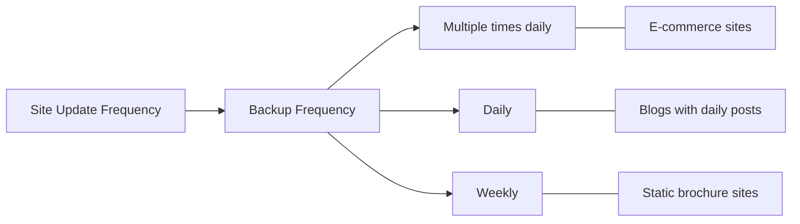

# WordPress Backup Strategy

## Introduction

A solid backup strategy is one of the pillars of WordPress security. No matter how many security measures you implement, your site will never be 100% immune to threats such as hacking, server failures, or accidental data loss. A proper backup strategy ensures that even if the worst happens, you can restore your site with minimal downtime and data loss.

In this guide, you'll learn:
- Why WordPress backups are essential
- What components of your WordPress site need backing up
- Different backup methods and tools
- How to create an effective backup schedule
- How to properly store your backups
- How to restore your site from a backup

## Why WordPress Backups Are Essential

Consider these scenarios:

- Your website gets hacked and malicious code is injected
- You make a change that breaks your site
- Your hosting provider experiences a catastrophic server failure
- An update to a plugin, theme, or WordPress core causes compatibility issues
- You accidentally delete important content

Without a backup, any of these situations could result in permanent data loss or require rebuilding your site from scratch. With a proper backup strategy, you can restore your site to a previous working state in minutes.

## What to Back Up in WordPress

A complete WordPress backup should include:

1. **Database**: Contains all your posts, pages, comments, users, and settings
2. **WordPress core files**: The system files that power your WordPress installation
3. **Theme files**: Your active theme and any customizations you've made
4. **Plugin files**: All installed plugins
5. **Uploads directory**: All media files including images, videos, and documents
6. **Configuration files**: Such as `wp-config.php` which contains your database connection details

## Backup Methods and Tools

### Manual Backup Methods

#### Database Backup via phpMyAdmin

1. Log in to your hosting control panel and access phpMyAdmin
2. Select your WordPress database from the left sidebar
3. Click on the "Export" tab
4. Select "Quick" export method and SQL format
5. Click "Go" to download the SQL file

```sql
-- Example of what a small portion of your exported database might look like
-- Table structure for table `wp_posts`

CREATE TABLE `wp_posts` (
  `ID` bigint(20) UNSIGNED NOT NULL,
  `post_author` bigint(20) UNSIGNED NOT NULL DEFAULT 0,
  `post_date` datetime NOT NULL DEFAULT '0000-00-00 00:00:00',
  `post_content` longtext NOT NULL,
  -- More columns...
) ENGINE=InnoDB DEFAULT CHARSET=utf8mb4;
```

#### File Backup via FTP

1. Connect to your server using an FTP client like FileZilla
2. Navigate to your WordPress installation directory
3. Download all files to your local computer

```
public_html/
├── wp-admin/
├── wp-content/
│   ├── plugins/
│   ├── themes/
│   └── uploads/
├── wp-includes/
├── wp-config.php
└── other WordPress files...
```

### Automated Backup Solutions

#### WordPress Backup Plugins

Several plugins can automate your backup process:

1. **UpdraftPlus**: One of the most popular free backup plugins
2. **BackupBuddy**: A premium plugin with advanced features
3. **Jetpack Backup**: Automated daily backups with one-click restore
4. **WP Time Capsule**: Incremental backups that save server resources

Example UpdraftPlus setup:

1. Install and activate the UpdraftPlus plugin
2. Go to Settings > UpdraftPlus Backups
3. Click the "Backup Now" button for an immediate backup or set up an automatic schedule

```javascript
// Example of UpdraftPlus backup settings in wp-config.php
// (Note: Different plugins have different configuration options)
define('UPDRAFTPLUS_BACKUP_INTERVAL', 'daily');
define('UPDRAFTPLUS_RETAIN_BACKUPS', 7);
```

#### Hosting Provider Backups

Many WordPress hosting providers offer automatic backup solutions:

- **Managed WordPress hosts** like WP Engine, Kinsta, or SiteGround often include daily backups
- **Shared hosting providers** may offer backup services, either included or as an add-on

## Creating an Effective Backup Schedule

Your backup frequency should be based on how often your site changes:



**Recommended schedule:**

1. **High-activity sites** (e-commerce, membership sites): Daily database backups, weekly full backups
2. **Medium-activity sites** (active blogs): Twice-weekly database backups, weekly full backups
3. **Low-activity sites** (brochure sites): Weekly database and full backups

## Storing Your WordPress Backups

Never store backups only on your server! If your server fails, you'll lose both your site and your backups.

### Best Practices for Backup Storage

1. **Follow the 3-2-1 rule**:
   - 3 copies of your data
   - 2 different storage types
   - 1 copy offsite

2. **Offsite storage options**:
   - Cloud storage (Google Drive, Dropbox, Amazon S3)
   - External hard drives kept in a separate physical location
   - Dedicated backup services

3. **Encryption**:
   - Encrypt sensitive backups before storing them

Example UpdraftPlus remote storage setup:

1. Go to Settings > UpdraftPlus Backups
2. Click on the "Settings" tab
3. Under "Choose your remote storage", select your preferred option (e.g., Google Drive)
4. Follow the setup instructions for authentication

## Implementing Automated Backups with a Plugin

Let's walk through setting up automated backups with UpdraftPlus, a popular free backup plugin:

### Step 1: Install UpdraftPlus

1. Go to Plugins > Add New
2. Search for "UpdraftPlus"
3. Click "Install Now" and then "Activate"

### Step 2: Configure Backup Schedule

1. Go to Settings > UpdraftPlus Backups
2. Click on the "Settings" tab
3. Set your preferred schedule for files and database backups

```
Files backup schedule: Weekly
Database backup schedule: Daily
Retention period: 4 backups
```

### Step 3: Configure Remote Storage

1. In UpdraftPlus settings, select a remote storage option
2. We'll use Google Drive as an example:
   - Select "Google Drive" under "Choose your remote storage"
   - Click "Google Drive" to expand the settings
   - Click "Authenticate with Google"
   - Follow the authentication process
   - Return to UpdraftPlus and save settings

### Step 4: Run Your First Backup

1. Go to the UpdraftPlus "Backup/Restore" tab
2. Click "Backup Now"
3. Ensure both files and database are selected
4. Click "Backup Now" button

## Testing Your Backups

A backup is only useful if it can be successfully restored. Regularly test your backup and restoration process:

1. Set up a staging environment or a local development site
2. Restore your backup to this test environment
3. Verify that all content, functionality, and settings are intact
4. Document the restoration process for future reference

Example testing workflow using UpdraftPlus:

1. Create a subdomain (e.g., test.yoursite.com) or local environment
2. Install a fresh WordPress and UpdraftPlus
3. Go to UpdraftPlus > Restore
4. Upload your backup files
5. Select what to restore (database, plugins, themes, uploads)
6. Click "Restore"
7. Verify the site works correctly after restoration

## Restoring from a Backup

### Method 1: Using a Plugin

If your site is still functioning:

1. Go to UpdraftPlus > Backup/Restore
2. Click "Restore" next to the backup you want to use
3. Select components to restore
4. Click "Restore" button

If your site is down but WordPress is accessible:

1. Install WordPress fresh
2. Install and activate your backup plugin
3. Upload your backup files to the plugin
4. Follow the plugin's restoration process

### Method 2: Manual Restoration

If WordPress is completely inaccessible:

1. Create a fresh database or empty the existing one
2. Upload your WordPress files via FTP
3. Import your database backup using phpMyAdmin:
   - Select your database
   - Click on "Import"
   - Select your SQL backup file
   - Click "Go"
4. Update wp-config.php with correct database details if needed

```php
// Example wp-config.php database connection settings
define('DB_NAME', 'database_name');
define('DB_USER', 'database_username');
define('DB_PASSWORD', 'database_password');
define('DB_HOST', 'localhost');
```

## Real-World Backup Strategy Example

Let's design a comprehensive backup strategy for a typical WordPress business site with a blog:

### Scenario: Business Website with Blog and Contact Form

**Site characteristics:**
- Updated with new blog posts 2-3 times per week
- Contact form submissions stored in the database
- WooCommerce store with moderate traffic

**Complete backup strategy:**

1. **Automated backups**:
   - Daily database backups (captures new orders and form submissions)
   - Weekly full site backups
   - Immediate backup before any major update or change

2. **Storage**:
   - Primary storage: Google Drive (automated via UpdraftPlus)
   - Secondary storage: Monthly manual backups to external hard drive
   - Tertiary storage: Hosting provider's backup system

3. **Testing**:
   - Quarterly test restores to a staging environment
   - Document and time the restoration process

4. **Retention**:
   - Keep daily backups for 1 week
   - Keep weekly backups for 1 month
   - Keep monthly backups for 1 year

This strategy ensures multiple layers of protection and quick recovery options for different scenarios.

## Common Backup Mistakes to Avoid

1. **Not backing up frequently enough**: If your site changes daily, you need daily backups
2. **Storing backups only on your server**: If your server goes down, you lose everything
3. **Never testing your backups**: You might discover they're corrupted when it's too late
4. **Forgetting to back up after major changes**: Always backup before AND after significant site changes
5. **Not including all necessary files**: Ensure your backup includes everything you need to restore
6. **Using outdated backup plugins**: Keep your backup solution updated
7. **Not securing your backups**: Encrypt sensitive information in backups

## Summary

An effective WordPress backup strategy is not optional—it's an essential part of your security infrastructure. By implementing regular, comprehensive backups stored in multiple locations and testing your restoration process, you can ensure your site can recover quickly from virtually any disaster.

Remember these key points:

1. Back up your database AND files
2. Automate your backups when possible
3. Store backups in multiple locations, including offsite
4. Test your backups regularly by performing practice restores
5. Adjust your backup frequency based on how often your site changes
6. Document your backup and restoration process

With these practices in place, you can have peace of mind knowing that your WordPress site is protected against data loss.

## Additional Resources

- [WordPress Codex: Backing Up Your Database](https://wordpress.org/support/article/backing-up-your-database/)
- [WordPress Codex: Restoring Your Database From Backup](https://wordpress.org/support/article/restoring-your-database-from-backup/)

## Exercises

1. Set up an automated backup schedule using a WordPress backup plugin of your choice.
2. Create a manual backup of your WordPress database and files.
3. Document your complete backup strategy, including frequency, storage locations, and retention policy.
4. Perform a test restore of your site on a local development environment.
5. Create an emergency response plan that details the steps to restore your site in case of different types of failures.