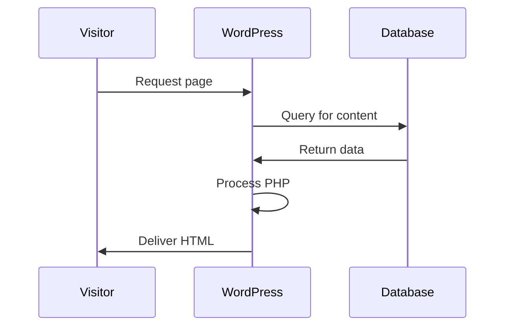
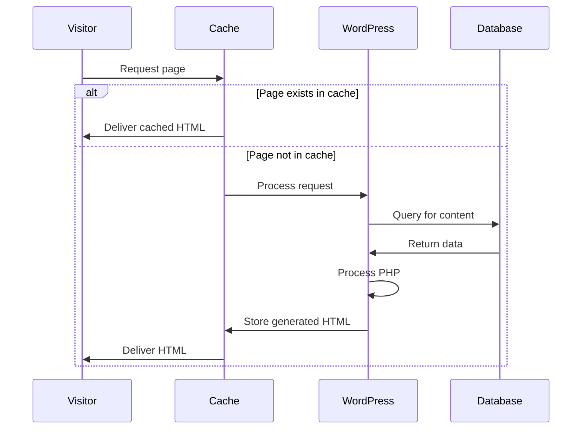

# WordPress Caching

## Introduction

Caching is one of the most effective ways to improve your WordPress site's speed and performance. At its core, caching is the process of storing frequently accessed data in a temporary storage location (a cache) so it can be quickly retrieved later, reducing the need to generate the same content repeatedly.

For WordPress sites, this means less work for your server, faster page loads for your visitors, and a better overall user experience. Whether you're running a small blog or a large e-commerce site, implementing proper caching can dramatically improve your site's performance.

In this guide, we'll explore:
- What caching is and why it matters for WordPress sites
- Different types of caching techniques
- Popular caching plugins and how to use them
- Best practices for implementing caching effectively
- Troubleshooting common caching issues

## What is Caching and Why Do You Need It?

### The Problem: Dynamic Content Generation

WordPress is a dynamic content management system. When a visitor requests a page:

1. WordPress connects to the database
2. Retrieves the necessary content and settings
3. Processes PHP code
4. Assembles the page
5. Finally delivers the HTML to the visitor's browser

This process happens for every page request, even if the content hasn't changed since the last visitor.



### The Solution: Caching

Caching creates a "snapshot" of your dynamically generated pages and serves this static version to subsequent visitors:



Benefits of caching include:
- Up to 5x faster page load times
- Reduced server load and resources
- Better user experience
- Improved SEO rankings (Google favors faster sites)
- Handles traffic spikes more gracefully

## Types of WordPress Caching

Let's explore the main caching methods available for WordPress sites:

### 1. Browser Caching

Browser caching instructs visitors' browsers to store certain static files locally, like images, CSS, and JavaScript. This way, when they visit another page on your site, their browser doesn't need to re-download these files.

**Implementation:**

You can enable browser caching by adding code to your `.htaccess` file:

```apache
<IfModule mod_expires.c>
  ExpiresActive On
  
  # Images
  ExpiresByType image/jpeg "access plus 1 year"
  ExpiresByType image/gif "access plus 1 year"
  ExpiresByType image/png "access plus 1 year"
  ExpiresByType image/webp "access plus 1 year"
  ExpiresByType image/svg+xml "access plus 1 year"
  
  # CSS, JavaScript
  ExpiresByType text/css "access plus 1 month"
  ExpiresByType text/javascript "access plus 1 month"
  ExpiresByType application/javascript "access plus 1 month"
</IfModule>
```

### 2. Page Caching

Page caching creates a static HTML copy of your dynamic WordPress pages. Instead of processing PHP and database queries for each visit, the server delivers the pre-generated HTML file.

Most WordPress caching plugins handle this automatically. Here's a simple example of how this works behind the scenes:

```php
<?php
// Simple page caching example
$cache_file = 'cache/page-' . md5($_SERVER['REQUEST_URI']) . '.html';

// If cache exists and is not expired, serve it
if (file_exists($cache_file) && (time() - filemtime($cache_file) < 3600)) {
    readfile($cache_file);
    exit;
}

// Start output buffering
ob_start();

// Normal WordPress execution happens here
require_once('wp-blog-header.php');

// Get buffered content and write to cache file
$content = ob_get_contents();
file_put_contents($cache_file, $content);
ob_end_flush();
?>
```

### 3. Object Caching

WordPress uses the WP Object Cache to temporarily store data from database queries. By default, this cache only lasts during a single page load. Persistent object caching extends this to store the data in memory for longer periods.

Common technologies used for object caching include:
- Redis
- Memcached
- APCu

Implementing Redis object caching requires:
1. Installing Redis on your server
2. Installing a WordPress Redis plugin
3. Adding configuration to your `wp-config.php` file:

```php
// Redis configuration for WP Object Cache
define('WP_CACHE', true);
define('WP_REDIS_HOST', 'localhost'); // Or Redis server IP
define('WP_REDIS_PORT', 6379);
```

### 4. Database Query Caching

This caching method optimizes database queries by storing the results in memory. This reduces the load on your database server.

### 5. Opcode Caching

PHP code needs to be compiled to bytecode before execution. Opcode caching stores this compiled bytecode in memory, eliminating the need to recompile for each page load.

Popular opcode caching solutions include:
- OPcache (built into PHP 5.5+)
- APCu

To enable OPcache, add these settings to your `php.ini` file:

```
opcache.enable=1
opcache.memory_consumption=128
opcache.interned_strings_buffer=8
opcache.max_accelerated_files=4000
opcache.revalidate_freq=60
```

### 6. CDN Caching

Content Delivery Networks (CDNs) store cached copies of your static content on servers around the world, delivering files from the location closest to each visitor.

## Popular WordPress Caching Plugins

Let's look at some popular caching plugins and how to set them up:

### 1. WP Rocket

WP Rocket is a premium caching plugin known for its ease of use and effectiveness.

**Key features:**
- Page caching
- Browser caching
- GZIP compression
- Database optimization
- Lazy loading images
- Minification and combination of CSS/JS files

**Basic setup:**
1. Purchase and download WP Rocket
2. Install and activate the plugin
3. Most features are enabled automatically
4. For advanced configuration, navigate to Settings → WP Rocket

### 2. W3 Total Cache

This free plugin offers extensive customization options.

**Key features:**
- Page caching
- Database caching
- Object caching
- Browser caching
- Minification options

**Basic setup:**
1. Install and activate W3 Total Cache
2. Go to Performance → General Settings
3. Enable Page Cache, Browser Cache, and other desired options
4. Save all settings
5. Empty cache to ensure clean implementation

```php
// Example of W3 Total Cache configuration in wp-config.php
define('WP_CACHE', true);
```

### 3. WP Super Cache

Developed by Automattic (the company behind WordPress.com), this free plugin focuses on generating static HTML files.

**Basic setup:**
1. Install and activate WP Super Cache
2. Go to Settings → WP Super Cache
3. Click "Turn caching on"
4. Under "Advanced" tab, enable "Cache hits to this website for quick access"
5. Save settings
6. Test cache functionality

## Implementing an Effective Caching Strategy

To maximize WordPress performance, follow these steps:

### Step 1: Assess Your Site Needs

Different sites require different caching approaches:
- Blog/content site: Focus on page caching
- E-commerce: Careful implementation of page caching with exclusions for cart/checkout
- Membership site: Object caching with appropriate exclusions for personalized content

### Step 2: Choose the Right Caching Solution

Based on your needs and technical expertise:
- Beginner: WP Rocket (paid) or WP Super Cache (free)
- Intermediate: W3 Total Cache
- Advanced: Custom caching solution or server-level caching

### Step 3: Configure Basic Caching

Let's implement a basic caching setup using W3 Total Cache:

1. Install and activate the W3 Total Cache plugin
2. Go to Performance → General Settings
3. Enable Page Cache:

   ```
   Page Cache: Enabled
   Page Cache Method: Disk: Enhanced
   ```

4. Enable Browser Cache:

   ```
   Browser Cache: Enabled
   ```

5. Save all settings and test your site

### Step 4: Advanced Configuration

For better performance:

1. **Database Optimization**

   Enable database cache (if your server can handle it):

   ```
   Database Cache: Enabled
   Database Cache Method: [Select based on your server capabilities]
   ```

2. **Minify CSS and JavaScript**

   ```
   Minify: Enabled
   Minify Mode: Auto
   Minify Cache Method: Disk
   ```

3. **Object Caching (if available on your host)**

   ```
   Object Cache: Enabled
   Object Cache Method: [Select based on your server capabilities]
   ```

### Step 5: Exclude Dynamic Content

Certain pages should typically be excluded from caching:
- Login pages
- Checkout pages
- Shopping cart
- User-specific content

In W3 Total Cache, you can add exclusions under Performance → Page Cache → Never cache the following pages:

```
wp-login*
*checkout*
*cart*
*my-account*
```

## Troubleshooting Common Caching Issues

### Issue 1: Changes Not Appearing on the Site

**Solution:**
1. Clear your plugin cache
2. Clear your browser cache (Ctrl+F5 or Cmd+Shift+R)
3. Check plugin settings for cache expiration times

### Issue 2: Functionality Issues After Enabling Caching

**Solution:**
1. Temporarily disable caching to confirm it's causing the issue
2. Check for plugin conflicts
3. Add problematic pages to the exclusion list

### Issue 3: Web Fonts or Styles Not Loading Correctly

**Solution:**
1. Exclude specific CSS or font files from minification
2. Try disabling CSS/JS minification to isolate the issue
3. Check browser console for specific errors

### Issue 4: Login Issues

**Solution:**
1. Make sure wp-login.php is excluded from caching
2. Clear both server and browser caches
3. Check cookie settings in your caching plugin

## Best Practices for WordPress Caching

1. **Start Simple**: Begin with basic page caching before implementing more complex methods
2. **Test Thoroughly**: After each change, test your site functionality
3. **Monitor Performance**: Use tools like GTmetrix or PageSpeed Insights to measure improvements
4. **Regular Maintenance**: Clear cache periodically, especially after updates
5. **Layer Different Caching Types**: Combine browser caching, page caching, and object caching for best results
6. **Use Cache Preloading**: Many plugins can pre-generate cache for your important pages

## Summary

WordPress caching is a powerful way to improve your site's performance without major code modifications. By implementing various caching techniques—from basic page caching to advanced object caching—you can significantly reduce load times and improve the user experience.

Remember that caching is not a "set it and forget it" solution. As your site evolves, regularly review and adjust your caching strategy to maintain optimal performance.

## Additional Resources

- [WordPress Codex on Optimization](https://wordpress.org/documentation/article/optimization/)
- [Google PageSpeed Insights](https://pagespeed.web.dev/) - Analyze your site's performance
- [KeyCDN Caching Guide](https://www.keycdn.com/support/wordpress-cache)

## Exercises

1. **Compare Plugins**: Install both WP Super Cache and W3 Total Cache on a test site. Compare performance improvements and ease of use.

2. **Performance Testing**: Take before and after measurements of your site's load time using tools like GTmetrix, implementing different caching strategies.

3. **Advanced Configuration**: Try setting up Redis object caching on a development environment and measure the impact on dynamic page elements.

4. **Troubleshooting Practice**: Intentionally create a caching conflict by caching a dynamic page, then practice identifying and resolving the issue.