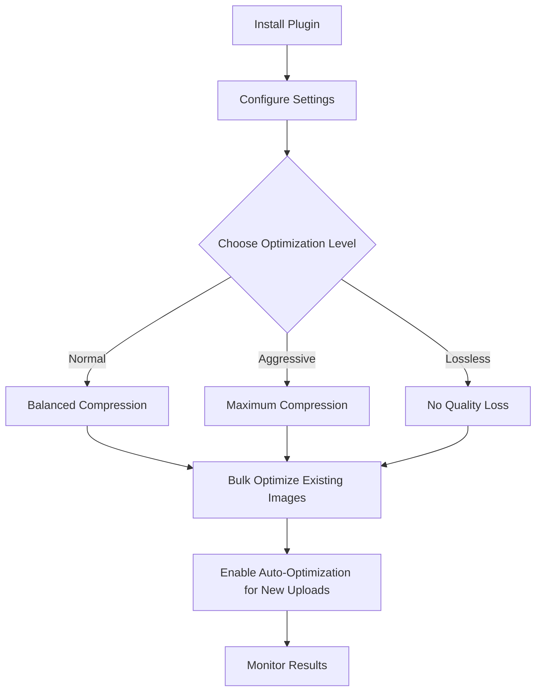

# WordPress Image Optimization

## Introduction

Images play a crucial role in creating engaging websites, but they often account for the majority of a page's file size. Unoptimized images can significantly slow down your WordPress site, leading to poor user experience and lower search engine rankings. In this guide, you'll learn comprehensive techniques to optimize images in WordPress, reducing load times while maintaining visual quality.

## Why Image Optimization Matters

Before diving into the how-to, let's understand why image optimization is critical:

1. **Faster Loading Times**: Optimized images load quicker, reducing page load time
2. **Better User Experience**: Visitors don't have to wait for large images to load
3. **Lower Bounce Rates**: Fast-loading pages keep visitors engaged
4. **Improved SEO Rankings**: Page speed is a ranking factor for search engines
5. **Reduced Bandwidth Usage**: Smaller images consume less bandwidth, important for users on limited data plans

## Understanding Image Formats

Different image formats serve different purposes:

| Format | Best Used For | Characteristics |
|--------|--------------|-----------------|
| JPEG/JPG | Photographs, complex images | Lossy compression, smaller file size, no transparency |
| PNG | Graphics, images needing transparency | Lossless compression, larger file size, supports transparency |
| WebP | Modern alternative to both JPEG and PNG | Better compression, smaller size than JPEG/PNG, wide support |
| SVG | Logos, icons, simple graphics | Vector format, scales without quality loss, very small file size |
| GIF | Simple animations | Limited colors, supports animation, often large file sizes |

## Basic Image Optimization Techniques

### 1. Resize Images Before Uploading

One of the most common mistakes is uploading images that are much larger than needed.

```js
// Example: Image dimensions vs. display size
// Original image: 4000×3000 pixels (12MP, ~5MB file)
// Actual display size on website: 800×600 pixels
// Result: Browser downloads 5MB but only uses 10% of the pixels
```

**Recommended dimensions for common uses:**
- Full-width header images: 1920px width (maximum)
- Content images: 800-1200px width
- Thumbnails: 150-300px width

### 2. Compress Images Before Upload

Use image compression tools before uploading to WordPress:

- [TinyPNG](https://tinypng.com/) (online tool)
- [ImageOptim](https://imageoptim.com/) (Mac app)
- [GIMP](https://www.gimp.org/) (free Photoshop alternative)

### 3. Choose the Right Format

```
// When to use which format:
- Use JPEG for photographs
- Use PNG for screenshots or images requiring transparency
- Use SVG for icons, logos, and simple graphics
- Use WebP as a modern alternative (when supported)
```

## WordPress-Specific Optimization Techniques

### 1. Configure WordPress Image Sizes

WordPress automatically creates multiple versions of each uploaded image. You can configure these in Settings > Media:

```php
// You can also define custom image sizes in your theme's functions.php
add_image_size('custom-thumb', 300, 200, true);
add_image_size('custom-medium', 600, 400, true);
add_image_size('custom-large', 1200, 800, true);
```

### 2. Using Responsive Images

WordPress 4.4+ automatically adds `srcset` and `sizes` attributes to image tags, loading the appropriate image size based on the visitor's screen size:

```html

```

### 3. Implement Lazy Loading

Lazy loading delays loading images until they're about to enter the viewport. WordPress 5.5+ has this built-in:

```html
<!-- WordPress automatically adds loading="lazy" to images -->

```

For older WordPress versions, you can use plugins or add JavaScript:

```js
// Simple example of JavaScript lazy loading
document.addEventListener("DOMContentLoaded", function() {
  const lazyImages = document.querySelectorAll("img.lazy");
  
  const imageObserver = new IntersectionObserver((entries, observer) => {
    entries.forEach(entry => {
      if (entry.isIntersecting) {
        const img = entry.target;
        img.src = img.dataset.src;
        img.classList.remove("lazy");
        imageObserver.unobserve(img);
      }
    });
  });

  lazyImages.forEach(image => imageObserver.observe(image));
});
```

## Using Image Optimization Plugins

WordPress offers several plugins that automate image optimization:

### 1. Smush

Smush optimizes images automatically when uploaded and can bulk optimize existing images.

**Key features:**
- Lossless compression
- Automatic resizing
- EXIF data removal
- Lazy loading

### 2. ShortPixel

ShortPixel uses both lossy and lossless compression algorithms.

**Key features:**
- Multiple compression levels
- WebP conversion
- AVIF conversion
- PDF compression

### 3. Imagify

Created by the WP Rocket team, Imagify offers excellent compression.

**Key features:**
- Three optimization levels
- WebP conversion
- Bulk optimization
- Resize on upload

### Plugin Implementation Example

Most image optimization plugins have a simple workflow:



## Advanced Optimization Techniques

### 1. WebP Conversion

WebP offers 25-34% smaller file sizes than JPEG with the same visual quality:

```php
// Example function to serve WebP images with fallback
function serve_webp_images($content) {
    // Check if browser supports WebP
    if (strpos($_SERVER['HTTP_ACCEPT'], 'image/webp') !== false) {
        // Replace jpg/png with webp in img tags
        $content = preg_replace('/\.jpg|\.jpeg|\.png/i', '.webp', $content);
    }
    return $content;
}
add_filter('the_content', 'serve_webp_images');
```

### 2. Content Delivery Network (CDN)

Using a CDN like Cloudflare, BunnyCDN, or KeyCDN can further optimize image delivery:

- Images are served from servers geographically closer to users
- Automatic optimization and caching
- Built-in image resizing services

### 3. Remove EXIF Data

EXIF data contains camera information that adds to the file size:

```php
// Remove EXIF data on upload
function remove_image_metadata($metadata) {
    if (is_array($metadata)) {
        unset($metadata['image_meta']);
    }
    return $metadata;
}
add_filter('wp_generate_attachment_metadata', 'remove_image_metadata');
```

## Real-World Case Study

Let's look at a practical example of optimizing a WordPress blog post with multiple images:

**Before Optimization:**
- 5 high-resolution photos (5MB each)
- Total page size: 27MB (including 25MB of images)
- Page load time: 8.2 seconds
- Mobile performance score: 43/100

**Optimization Steps Applied:**
1. Resized all images to maximum 1200px width
2. Compressed images using ShortPixel (lossy compression)
3. Converted images to WebP with JPEG fallback
4. Implemented lazy loading for below-the-fold images
5. Added a CDN for delivery

**After Optimization:**
- Same 5 photos (120KB each on average)
- Total page size: 2.1MB (including 600KB of images)
- Page load time: 1.8 seconds
- Mobile performance score: 87/100

## Measuring Image Optimization Success

Use these tools to measure your optimization success:

1. **Google PageSpeed Insights**: Provides specific image optimization recommendations
2. **WebPageTest**: Shows visual loading progress and timing for each image
3. **GTmetrix**: Detailed reports on image optimization opportunities
4. **Chrome DevTools**: Network tab shows actual download size and time for each image

```javascript
// Simple performance measurement before/after optimization
console.time('Page Load');
window.addEventListener('load', () => {
    console.timeEnd('Page Load');
    
    // Get all images and calculate total size
    const images = document.querySelectorAll('img');
    let totalSize = 0;
    
    images.forEach(img => {
        // This requires additional code to get accurate sizes
        // as naturalWidth/naturalHeight only gives dimensions
    });
    
    console.log(`Total images: ${images.length}`);
});
```

## Best Practices Checklist

✅ Resize images to the maximum size needed before uploading  
✅ Choose the appropriate file format for each type of image  
✅ Compress all images using a reliable tool  
✅ Enable WebP conversion with fallbacks  
✅ Implement lazy loading for below-the-fold images  
✅ Configure WordPress to generate appropriate image sizes  
✅ Regularly audit and optimize existing images  
✅ Consider a CDN for larger sites  
✅ Monitor page speed and image load times regularly  
✅ Remove unnecessary EXIF data

## Summary

Image optimization is a critical aspect of WordPress performance that directly impacts user experience and SEO rankings. By implementing the techniques covered in this guide—from basic resizing and compression to advanced methods like WebP conversion and CDN usage—you can dramatically improve your site's loading speed while maintaining excellent image quality.

Remember that image optimization is not a one-time task but an ongoing process. As new images are added to your site, ensure they follow these optimization best practices to maintain optimal performance.

## Additional Resources

- [WordPress Image Optimization Guide](https://wordpress.org/support/article/image-optimization/)
- [Google's Image Optimization Guide](https://web.dev/fast/#optimize-your-images)
- [WebP Browser Compatibility](https://caniuse.com/webp)
- [Responsive Images in WordPress](https://developer.wordpress.org/themes/functionality/featured-images-post-thumbnails/responsive-images/)

## Exercises

1. **Benchmark Exercise**: Run a page speed test on your WordPress site before and after optimizing images. Compare the results.
2. **Format Comparison**: Take one image and save it in JPEG, PNG, and WebP formats. Compare the file sizes and visual quality.
3. **Plugin Test**: Try three different image optimization plugins and compare their results on the same set of images.
4. **CDN Setup**: Implement a free CDN like Cloudflare and measure the impact on image loading times.
5. **Custom Function**: Create a custom function in your theme to automatically add lazy loading to images if your WordPress version doesn't support it natively.