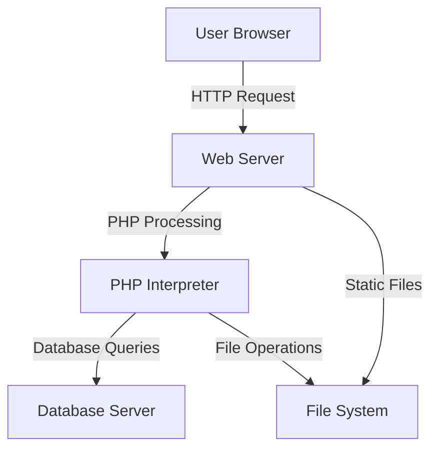

# WordPress Server Configuration

## Introduction

Server configuration is one of the most impactful ways to improve WordPress performance. Even the most optimized WordPress site can struggle if it's running on a poorly configured server. In this guide, we'll explore how to configure your server environment to get the best performance from your WordPress installation.

Whether you're using shared hosting, a VPS, or dedicated server, understanding server configuration will help you make informed decisions about your WordPress hosting environment and identify potential bottlenecks in your setup.

## Why Server Configuration Matters

Before diving into specific configurations, let's understand why server configuration is critical for WordPress performance:

1. **Resource Allocation**: Proper server configuration ensures WordPress gets the resources it needs when it needs them.
2. **Request Handling**: Configuration affects how quickly the server processes HTTP requests.
3. **Caching Capability**: Server-level caching can dramatically improve performance.
4. **Security**: Well-configured servers are more resistant to attacks that could slow down your site.

## Key Components of WordPress Server Environment



### Web Server Software

The two most common web servers for WordPress are Apache and Nginx. Each has its own strengths and configuration approaches.

#### Apache Configuration for WordPress

Apache is the most widely used web server and is compatible with nearly all hosting providers. Here's how to optimize Apache for WordPress:

1. **Enable the right modules**:

```apache
# Essential Apache modules for WordPress
LoadModule deflate_module modules/mod_deflate.so
LoadModule expires_module modules/mod_expires.so
LoadModule headers_module modules/mod_headers.so
LoadModule rewrite_module modules/mod_rewrite.so
```

2. **Configure `.htaccess` file**:

```apache
# WordPress .htaccess optimized for performance
<IfModule mod_rewrite.c>
    RewriteEngine On
    RewriteBase /
    RewriteRule ^index\.php$ - [L]
    RewriteCond %{REQUEST_FILENAME} !-f
    RewriteCond %{REQUEST_FILENAME} !-d
    RewriteRule . /index.php [L]
</IfModule>

# Enable browser caching
<IfModule mod_expires.c>
    ExpiresActive On
    ExpiresByType image/jpg "access plus 1 year"
    ExpiresByType image/jpeg "access plus 1 year"
    ExpiresByType image/gif "access plus 1 year"
    ExpiresByType image/png "access plus 1 year"
    ExpiresByType image/webp "access plus 1 year"
    ExpiresByType text/css "access plus 1 month"
    ExpiresByType application/pdf "access plus 1 month"
    ExpiresByType text/javascript "access plus 1 month"
    ExpiresByType application/javascript "access plus 1 month"
    ExpiresByType application/x-javascript "access plus 1 month"
    ExpiresByType image/x-icon "access plus 1 year"
</IfModule>

# Enable GZIP compression
<IfModule mod_deflate.c>
    AddOutputFilterByType DEFLATE text/plain
    AddOutputFilterByType DEFLATE text/html
    AddOutputFilterByType DEFLATE text/xml
    AddOutputFilterByType DEFLATE text/css
    AddOutputFilterByType DEFLATE application/xml
    AddOutputFilterByType DEFLATE application/xhtml+xml
    AddOutputFilterByType DEFLATE application/rss+xml
    AddOutputFilterByType DEFLATE application/javascript
    AddOutputFilterByType DEFLATE application/x-javascript
</IfModule>
```

3. **MPM Configuration** for better handling of concurrent connections:

```apache
<IfModule mpm_prefork_module>
    StartServers             5
    MinSpareServers         5
    MaxSpareServers         10
    MaxRequestWorkers      150
    MaxConnectionsPerChild   0
</IfModule>
```

#### Nginx Configuration for WordPress

Nginx is known for its speed and efficiency, especially for high-traffic WordPress sites:

1. **Basic WordPress configuration**:

```nginx
server {
    listen 80;
    server_name example.com www.example.com;
    root /var/www/wordpress;
    index index.php;

    # WordPress permalinks
    location / {
        try_files $uri $uri/ /index.php?$args;
    }

    # PHP handling
    location ~ \.php$ {
        include snippets/fastcgi-php.conf;
        fastcgi_pass unix:/var/run/php/php8.1-fpm.sock;
        fastcgi_param SCRIPT_FILENAME $document_root$fastcgi_script_name;
        include fastcgi_params;
    }

    # Deny access to certain files
    location ~ /\. {
        deny all;
    }
}
```

2. **Add performance optimizations**:

```nginx
# Cache static files
location ~* \.(jpg|jpeg|png|gif|ico|css|js|webp|svg)$ {
    expires 1y;
    add_header Cache-Control "public, no-transform";
}

# Enable GZIP compression
gzip on;
gzip_disable "msie6";
gzip_vary on;
gzip_proxied any;
gzip_comp_level 6;
gzip_buffers 16 8k;
gzip_http_version 1.1;
gzip_min_length 256;
gzip_types
  application/atom+xml
  application/javascript
  application/json
  application/ld+json
  application/manifest+json
  application/rss+xml
  application/vnd.geo+json
  application/vnd.ms-fontobject
  application/x-font-ttf
  application/x-web-app-manifest+json
  application/xhtml+xml
  application/xml
  font/opentype
  image/bmp
  image/svg+xml
  image/x-icon
  text/cache-manifest
  text/css
  text/plain
  text/vcard
  text/vnd.rim.location.xloc
  text/vtt
  text/x-component
  text/x-cross-domain-policy;
```

3. **FastCGI caching** for dramatic performance improvements:

```nginx
# FastCGI Cache configuration
fastcgi_cache_path /var/run/nginx-cache levels=1:2 keys_zone=WORDPRESS:100m inactive=60m;
fastcgi_cache_key "$scheme$request_method$host$request_uri";
fastcgi_cache_use_stale error timeout invalid_header http_500;
fastcgi_ignore_headers Cache-Control Expires Set-Cookie;

# In the server block
server {
    # ... other configurations ...
    
    set $skip_cache 0;
    
    # Skip cache for WordPress admin, logged-in users, etc.
    if ($request_uri ~* "/wp-admin/|/xmlrpc.php|wp-.*.php|/feed/|index.php|sitemap(_index)?.xml") {
        set $skip_cache 1;
    }
    
    if ($http_cookie ~* "comment_author|wordpress_[a-f0-9]+|wp-postpass|wordpress_no_cache|wordpress_logged_in") {
        set $skip_cache 1;
    }
    
    location ~ \.php$ {
        # ... existing PHP configuration ...
        
        fastcgi_cache WORDPRESS;
        fastcgi_cache_valid 200 301 302 60m;
        fastcgi_cache_bypass $skip_cache;
        fastcgi_no_cache $skip_cache;
        
        # Add cache hit/miss header
        add_header X-FastCGI-Cache $upstream_cache_status;
    }
}
```

### PHP Configuration

PHP settings have a massive impact on WordPress performance:

1. **php.ini Optimization**:

```ini
; Increase memory limit
memory_limit = 256M

; Max execution time
max_execution_time = 300

; File upload size
upload_max_filesize = 64M
post_max_size = 64M

; Optimize realpath cache
realpath_cache_size = 4096k
realpath_cache_ttl = 120

; OPcache settings
opcache.enable=1
opcache.memory_consumption=128
opcache.interned_strings_buffer=8
opcache.max_accelerated_files=10000
opcache.revalidate_freq=60
opcache.save_comments=1
```

2. **PHP-FPM Configuration** (for Nginx or Apache with mod_fastcgi):

```ini
; In your www.conf or pool configuration file
pm = dynamic
pm.max_children = 50
pm.start_servers = 5
pm.min_spare_servers = 5
pm.max_spare_servers = 35
pm.max_requests = 500
```

### Database Configuration (MySQL/MariaDB)

The database is often a bottleneck for WordPress sites. Here's how to optimize it:

1. **my.cnf configuration** for small to medium sites:

```ini
[mysqld]
# InnoDB settings
innodb_buffer_pool_size = 256M
innodb_log_file_size = 64M
innodb_flush_log_at_trx_commit = 2
innodb_flush_method = O_DIRECT

# Query cache - useful for WordPress
query_cache_type = 1
query_cache_size = 32M
query_cache_limit = 1M

# Connections
max_connections = 100
thread_cache_size = 8

# Temporary tables
tmp_table_size = 32M
max_heap_table_size = 32M
```

2. **For larger sites**, you might need more aggressive settings:

```ini
[mysqld]
# InnoDB settings for larger sites
innodb_buffer_pool_size = 1G 
innodb_log_file_size = 256M
innodb_buffer_pool_instances = 4
```

## Server-Level Caching Solutions

Adding server-level caching can dramatically improve WordPress performance:

### Redis Object Cache

1. **Install Redis** on your server:

```bash
# For Ubuntu/Debian
sudo apt-get update
sudo apt-get install redis-server
```

2. **Install the Redis Object Cache plugin** in WordPress.

3. **Configure Redis in wp-config.php**:

```php
define('WP_CACHE', true);
define('WP_REDIS_HOST', 'localhost');
define('WP_REDIS_PORT', 6379);
```

### Memcached

1. **Install Memcached**:

```bash
# For Ubuntu/Debian
sudo apt-get update
sudo apt-get install memcached
```

2. **Install PHP Memcached extension**:

```bash
sudo apt-get install php-memcached
```

3. **Configure WordPress** with a Memcached plugin like W3 Total Cache.

## Real-World Examples and Case Studies

### Example 1: Small WordPress Blog

For a small WordPress blog with ~1,000 visitors per day:

- **Server**: Shared hosting or small VPS (1 CPU core, 2GB RAM)
- **Configuration**:
  - Apache with mod_php
  - Memory limit: 128MB
  - Database: Default MySQL settings
  - Simple caching plugin

```apache
<IfModule mod_expires.c>
    ExpiresActive On
    ExpiresByType image/jpg "access plus 1 year"
    ExpiresByType text/css "access plus 1 month"
    ExpiresByType application/javascript "access plus 1 month"
</IfModule>
```

**Results**: Page load times improved from 2.5s to 1.2s.

### Example 2: Medium-Sized Business Site

For a business site with ~10,000 visitors per day and WooCommerce:

- **Server**: VPS with 2 CPU cores, 4GB RAM
- **Configuration**:
  - Nginx + PHP-FPM
  - Memory limit: 256MB
  - Redis object cache
  - FastCGI page caching
  - Database tuning

```nginx
# FastCGI caching configuration
fastcgi_cache_path /var/run/nginx-cache levels=1:2 keys_zone=WORDPRESS:100m inactive=60m;

location ~ \.php$ {
    # PHP-FPM configuration
    fastcgi_pass unix:/var/run/php/php8.1-fpm.sock;
    
    # Caching directives
    fastcgi_cache WORDPRESS;
    fastcgi_cache_valid 200 301 302 60m;
}
```

**Results**: Average page load time reduced to 0.8s, server capable of handling traffic spikes without slowing down.

### Example 3: High-Traffic Magazine Site

For a magazine site with 100,000+ visitors per day:

- **Server**: Multiple load-balanced servers
- **Configuration**:
  - Nginx + PHP-FPM
  - Cloud-based MySQL with read replicas
  - Memcached for object caching
  - CDN for static assets
  - Load balancer with SSL termination

**Results**: Consistent sub-second loading times even during major traffic events.

## Monitoring Server Performance

Setting up proper monitoring is essential for maintaining optimal server configuration:

1. **Install a monitoring tool** like New Relic, Datadog, or the free alternative Netdata:

```bash
# Install Netdata
bash <(curl -Ss https://my-netdata.io/kickstart.sh)
```

2. **Monitor key metrics**:
   - CPU usage
   - Memory usage
   - PHP processing time
   - Database query performance
   - Disk I/O

3. **Set up alerts** for critical thresholds.

## Common Server Configuration Issues and Solutions

Here are some common issues and their solutions:

### 1. 502/504 Gateway Timeout Errors

**Problem**: PHP processes take too long or run out of memory.

**Solution**: 
```ini
# In php.ini
memory_limit = 256M
max_execution_time = 300

# In PHP-FPM configuration
pm.max_children = 50
```

### 2. Database Connection Errors

**Problem**: Too many concurrent connections to the database.

**Solution**:
```ini
# In my.cnf
max_connections = 200
wait_timeout = 60
interactive_timeout = 60
```

### 3. Slow Admin Dashboard

**Problem**: WordPress admin operations timeout or run slowly.

**Solution**:
```php
// In wp-config.php
define('WP_MEMORY_LIMIT', '256M');

// And increase PHP settings
// memory_limit = 256M
```

## Conclusion

Server configuration is a foundational aspect of WordPress performance optimization. While it may seem technical at first, understanding these basics will help you make informed decisions about your hosting environment and troubleshoot performance issues more effectively.

Remember that the optimal configuration depends on your specific site's needs, traffic patterns, and content. Regular monitoring and adjustments are key to maintaining peak performance as your site grows and evolves.

## Additional Resources

- [Nginx WordPress Documentation](https://www.nginx.com/resources/wiki/start/topics/recipes/wordpress/)
- [PHP Performance Tuning Guide](https://www.php.net/manual/en/ini.core.php)
- [MySQL Performance Optimization](https://dev.mysql.com/doc/refman/8.0/en/optimization.html)
- [WordPress VIP Go Documentation](https://wpvip.com/documentation/vip-go/)

## Practice Exercises

1. Set up a local development environment using either Apache or Nginx and implement the server optimizations outlined in this guide.
2. Benchmark your WordPress site before and after implementing server-level caching using tools like Apache Bench, Siege, or online services like GTmetrix.
3. Experiment with different PHP-FPM pool configurations and measure their impact on site performance.
4. Create a monitoring dashboard for your WordPress server using an open-source tool like Netdata or Grafana.

By implementing these server configuration best practices, you'll build a solid foundation for WordPress performance that will benefit every other optimization you apply to your site.