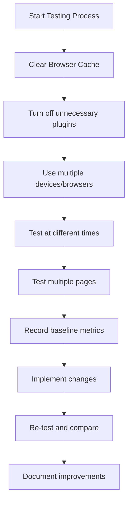
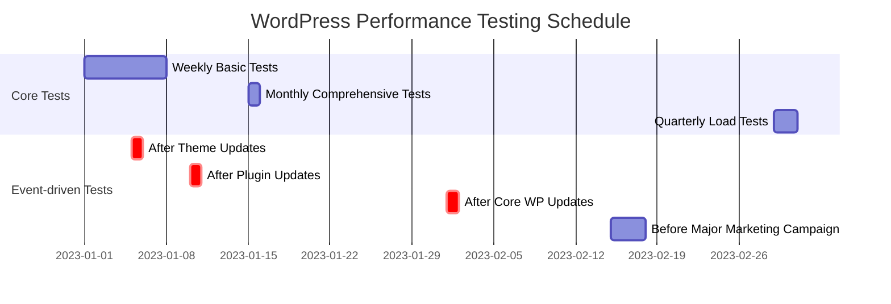

# WordPress Performance Testing

## Introduction

Performance testing is a critical aspect of WordPress website maintenance and optimization. A fast-loading website not only provides a better user experience but also improves SEO rankings, increases conversion rates, and reduces bounce rates. In this comprehensive guide, we'll explore how to properly test your WordPress site's performance, interpret the results, and make data-driven optimization decisions.

## Why Performance Testing Matters

Before diving into the testing methodologies, let's understand why performance testing is essential:

1. **User Experience**: 47% of users expect websites to load in under 2 seconds, and 40% abandon sites that take more than 3 seconds to load.
2. **SEO Impact**: Site speed is a ranking factor for search engines like Google.
3. **Conversion Rates**: A 1-second delay in page load time can result in a 7% reduction in conversions.
4. **Mobile Performance**: With mobile traffic exceeding desktop traffic, mobile performance testing has become crucial.

## Core Metrics to Measure

When testing WordPress performance, focus on these key metrics:

### 1. Page Load Time

The total time it takes for a page to fully load.

### 2. Time to First Byte (TTFB)

How long it takes for the browser to receive the first byte of data from the server.

### 3. First Contentful Paint (FCP)

The time it takes for the first content element to appear on the screen.

### 4. Largest Contentful Paint (LCP)

The render time of the largest content element visible in the viewport.

### 5. Cumulative Layout Shift (CLS)

Measures visual stability by quantifying unexpected layout shifts.

### 6. First Input Delay (FID)

Measures interactivity by quantifying the time from when a user first interacts with your site to when the browser responds to that interaction.

### 7. Total Blocking Time (TBT)

The sum of all time periods between FCP and Time to Interactive (TTI) where the main thread was blocked for long enough to prevent input responsiveness.

## Performance Testing Tools

### 1. Google PageSpeed Insights

Google PageSpeed Insights provides performance metrics for both mobile and desktop versions of your site.

#### How to use:

1. Visit [PageSpeed Insights](https://pagespeed.web.dev/)
2. Enter your website URL
3. Click "Analyze"

The tool will generate a report with performance scores and improvement suggestions.

### 2. GTmetrix

GTmetrix provides detailed insights into your site's performance with grades and recommendations.

#### Sample GTmetrix Test Process:

```javascript
// This is a conceptual representation, not actual code
const performGTmetrixTest = async (websiteUrl) => {
  // Initialize test
  const test = await GTmetrix.createTest({
    url: websiteUrl,
    location: 'London, UK',
    browser: 'Chrome',
    connection: '4G'
  });
  
  // Wait for test completion
  const result = await test.waitForCompletion();
  
  // Return results
  return {
    pageLoadTime: result.pageLoadTime,
    totalPageSize: result.totalPageSize,
    requests: result.requests,
    pagespeedScore: result.pagespeedScore,
    ytSlowScore: result.ytSlowScore
  };
};

// Example output:
// {
//   pageLoadTime: "1.2s",
//   totalPageSize: "1.5MB",
//   requests: 42,
//   pagespeedScore: 85,
//   ytSlowScore: 88
// }
```

### 3. WebPageTest

WebPageTest allows for more sophisticated testing with custom conditions like connection speed, browser type, and geographic location.

### 4. Chrome DevTools

Chrome's built-in performance tools offer deep insights into your site's loading behavior.

#### Using Chrome DevTools for Performance Analysis:

1. Open Chrome DevTools (F12 or Ctrl+Shift+I)
2. Go to the "Performance" tab
3. Click the record button
4. Reload the page
5. Stop recording after the page loads
6. Analyze the results

```javascript
// Using Performance API in JavaScript
const measurePageLoad = () => {
  const perfData = window.performance.timing;
  const pageLoadTime = perfData.loadEventEnd - perfData.navigationStart;
  
  console.log(`Page Load Time: ${pageLoadTime}ms`);
  console.log(`DNS Lookup: ${perfData.domainLookupEnd - perfData.domainLookupStart}ms`);
  console.log(`Server Connection: ${perfData.connectEnd - perfData.connectStart}ms`);
  console.log(`Server Response: ${perfData.responseEnd - perfData.responseStart}ms`);
  console.log(`DOM Processing: ${perfData.domComplete - perfData.domLoading}ms`);
};

// Call this function after page load
window.addEventListener('load', measurePageLoad);
```

### 5. Query Monitor Plugin

For WordPress-specific performance insights, Query Monitor provides detailed information about database queries, hooks, conditionals, and more.

#### Installation:

```bash
# Via WP-CLI
wp plugin install query-monitor --activate
```

Once activated, Query Monitor adds a toolbar to your WordPress admin and front-end (when logged in) with performance details.

## Setting Up a Performance Testing Environment

For accurate results, follow these guidelines:

### 1. Test Environment Preparation



### 2. Creating a Testing Plan

```javascript
// Sample testing plan structure (pseudocode)
const testingPlan = {
  baselineUrls: [
    'https://example.com/',
    'https://example.com/blog/',
    'https://example.com/products/',
    'https://example.com/contact/'
  ],
  testingTools: ['PageSpeed Insights', 'GTmetrix', 'WebPageTest'],
  deviceTypes: ['Desktop', 'Mobile'],
  connectionTypes: ['4G', '3G', 'Fast 3G'],
  metricsToTrack: [
    'TTFB',
    'FCP',
    'LCP',
    'CLS',
    'TBT',
    'Page Size',
    'Number of Requests'
  ],
  testingFrequency: 'Weekly'
};
```

## Conducting Performance Tests for WordPress

### Basic Performance Test Workflow

1. **Establish a baseline**: Test your site before making any changes
2. **Identify bottlenecks**: Use the testing tools to find performance issues
3. **Make incremental changes**: Change one thing at a time
4. **Re-test after each change**: Measure the impact of each optimization
5. **Document results**: Keep a log of changes and their effects

### Example: Testing a Theme Change Impact

```javascript
// Pseudocode for theme performance comparison
async function compareThemePerformance(currentTheme, newTheme) {
  // Activate current theme and test
  await activateTheme(currentTheme);
  const currentThemeResults = await runPerformanceTests();
  
  // Activate new theme and test
  await activateTheme(newTheme);
  const newThemeResults = await runPerformanceTests();
  
  // Compare results
  console.log('Performance Comparison:');
  console.log(`Current Theme (${currentTheme}):`);
  console.log(`- Page Load Time: ${currentThemeResults.pageLoadTime}ms`);
  console.log(`- TTFB: ${currentThemeResults.ttfb}ms`);
  console.log(`- LCP: ${currentThemeResults.lcp}ms`);
  
  console.log(`New Theme (${newTheme}):`);
  console.log(`- Page Load Time: ${newThemeResults.pageLoadTime}ms`);
  console.log(`- TTFB: ${newThemeResults.ttfb}ms`);
  console.log(`- LCP: ${newThemeResults.lcp}ms`);
  
  // Calculate improvements
  const pageLoadImprovement = ((currentThemeResults.pageLoadTime - newThemeResults.pageLoadTime) / 
                              currentThemeResults.pageLoadTime * 100).toFixed(2);
                              
  console.log(`Page Load Time Improvement: ${pageLoadImprovement}%`);
}
```

## Advanced WordPress Performance Testing

### 1. Load Testing

Load testing simulates multiple simultaneous users accessing your site to identify how it performs under heavy traffic.

#### Using k6 for Load Testing:

```javascript
// k6 script example (script.js)
import http from 'k6/http';
import { sleep } from 'k6';

export default function() {
  http.get('https://yourwordpresssite.com/');
  sleep(1);
  http.get('https://yourwordpresssite.com/about/');
  sleep(1);
  http.get('https://yourwordpresssite.com/blog/');
  sleep(1);
}

export const options = {
  vus: 100,  // 100 virtual users
  duration: '3m',  // Test runs for 3 minutes
};

// Run with: k6 run script.js
```

### 2. Database Performance Testing

WordPress heavily relies on its database, so testing database performance is crucial.

#### Using Query Monitor to Identify Slow Queries:

1. Install and activate Query Monitor
2. Navigate through your site while logged in as admin
3. Look for queries with high execution times
4. Check for queries that are executed multiple times
5. Identify plugins generating excessive or inefficient queries

### 3. API Performance Testing

Many modern WordPress sites rely on REST API calls. Testing API endpoints can help identify bottlenecks.

```javascript
// Testing WordPress REST API performance
const testApiEndpoint = async (endpoint) => {
  const startTime = performance.now();
  
  try {
    const response = await fetch(`https://yoursite.com/wp-json/${endpoint}`);
    const data = await response.json();
    
    const endTime = performance.now();
    const responseTime = endTime - startTime;
    
    console.log(`API Endpoint: ${endpoint}`);
    console.log(`Response Time: ${responseTime}ms`);
    console.log(`Response Size: ${JSON.stringify(data).length} bytes`);
    
    return {
      responseTime,
      responseSize: JSON.stringify(data).length,
      success: true
    };
  } catch (error) {
    console.error(`Error testing endpoint ${endpoint}:`, error);
    return {
      success: false,
      error: error.message
    };
  }
};

// Example usage
testApiEndpoint('wp/v2/posts?per_page=10');
```

## Interpreting Test Results

Understanding your test results is as important as running the tests themselves:

### Performance Score Interpretation

| Score | Rating | Action Required |
|-------|--------|----------------|
| 90-100 | Excellent | Maintain and monitor |
| 70-89 | Good | Minor improvements needed |
| 50-69 | Average | Several optimizations required |
| 0-49 | Poor | Critical issues need immediate attention |

### Common WordPress Performance Issues and Solutions

1. **High TTFB**: Usually indicates server issues or inefficient database queries
   - Solution: Upgrade hosting, implement caching, optimize database

2. **Large Page Size**: Indicates unoptimized assets
   - Solution: Compress images, minify CSS/JS, implement lazy loading

3. **High CLS**: Often caused by images without dimensions or late-loading content
   - Solution: Add width/height attributes to images, optimize web font loading

4. **Long TBT**: Usually caused by heavy JavaScript execution
   - Solution: Defer non-critical JavaScript, reduce plugin reliance

## Case Study: Optimizing a WooCommerce Store

Let's look at a real-world example of performance testing and optimization for a WooCommerce site:

### Initial Performance Metrics:
- Page Load Time: 5.2 seconds
- TTFB: 850ms
- LCP: 4.3 seconds
- CLS: 0.35
- Mobile PageSpeed Score: 42

### Testing Process:

1. **Baseline Testing**: Recorded initial metrics using PageSpeed Insights and GTmetrix
2. **Identified Issues**:
   - Unoptimized product images
   - No caching implementation
   - Excessive plugins (28 active)
   - Inefficient database queries
   - Render-blocking resources

3. **Implemented Changes**:
   ```bash
   # Optimized images using WP-CLI
   wp media regenerate --image_size=full
   
   # Installed object caching
   wp plugin install redis-cache --activate
   
   # Configured Redis
   wp config set WP_CACHE_KEY_SALT 'unique-string'
   wp config set WP_REDIS_HOST 'redis'
   wp redis enable
   ```

4. **Eliminated Unused Plugins**:
   - Reduced from 28 to 18 essential plugins
   - Replaced heavy plugins with lightweight alternatives

5. **Database Optimization**:
   ```sql
   -- Sample query optimization
   -- Before: Slow query retrieving all product meta
   SELECT * FROM wp_postmeta WHERE post_id IN (
     SELECT ID FROM wp_posts WHERE post_type = 'product'
   );
   
   -- After: Optimized query with joins
   SELECT p.ID, pm.meta_key, pm.meta_value 
   FROM wp_posts p
   JOIN wp_postmeta pm ON p.ID = pm.post_id
   WHERE p.post_type = 'product'
   AND pm.meta_key IN ('_price', '_stock_status');
   ```

6. **Implemented Critical CSS and Deferred Non-Critical JavaScript**

### Results After Optimization:
- Page Load Time: 1.8 seconds (65% improvement)
- TTFB: 320ms (62% improvement)
- LCP: 1.9 seconds (56% improvement)
- CLS: 0.05 (86% improvement)
- Mobile PageSpeed Score: 87 (107% improvement)

## Creating a Performance Testing Schedule

Regular testing helps maintain optimal performance. Here's a sample schedule:



## Performance Testing Automation

Automate your WordPress performance testing to save time and ensure consistency:

### Using GitHub Actions for Automated Testing

```yaml
# .github/workflows/performance-test.yml
name: Performance Testing

on:
  schedule:
    - cron: '0 0 * * 0'  # Run weekly on Sundays
  workflow_dispatch:  # Allow manual trigger

jobs:
  test-performance:
    runs-on: ubuntu-latest
    steps:
      - name: Checkout code
        uses: actions/checkout@v2
        
      - name: Install Lighthouse
        run: npm install -g lighthouse
        
      - name: Run Lighthouse tests
        run: |
          lighthouse https://yourwordpresssite.com/ --output json --output-path ./lighthouse-report.json
          
      - name: Parse results
        run: |
          PERFORMANCE_SCORE=$(cat lighthouse-report.json | jq '.categories.performance.score')
          echo "Performance score: $PERFORMANCE_SCORE"
          
          # Alert if score is below threshold
          if (( $(echo "$PERFORMANCE_SCORE < 0.7" | bc -l) )); then
            echo "::warning::Performance score is below threshold: $PERFORMANCE_SCORE"
          fi
      
      - name: Upload report
        uses: actions/upload-artifact@v2
        with:
          name: lighthouse-report
          path: ./lighthouse-report.json
```

## Summary

Performance testing is an essential aspect of WordPress website maintenance. By regularly testing and optimizing your site, you can provide a better user experience, improve SEO rankings, and increase conversion rates.

Key takeaways from this guide:

1. **Establish a baseline** before making changes to accurately measure improvements
2. **Test multiple metrics** like TTFB, LCP, and CLS for a comprehensive understanding of performance
3. **Use a combination of tools** for more accurate insights
4. **Make incremental changes** and test after each one
5. **Automate testing** when possible to ensure consistency
6. **Develop a regular testing schedule** to maintain performance over time

By implementing a systematic approach to performance testing, you can identify bottlenecks, make data-driven optimization decisions, and ensure your WordPress site performs at its best.

## Additional Resources

- [Web Vitals](https://web.dev/vitals/) - Learn more about Core Web Vitals
- [WordPress Performance Team](https://make.wordpress.org/performance/) - Follow WordPress core performance initiatives
- [Query Monitor Documentation](https://querymonitor.com/docs/) - Detailed guide to WordPress performance debugging

## Exercises

1. Set up PageSpeed Insights and GTmetrix tests for your WordPress site and establish baseline metrics.
2. Identify your top 3 performance bottlenecks using the tools discussed in this guide.
3. Create a performance improvement plan with specific, measurable goals.
4. Implement one optimization technique and document the before/after metrics.
5. Set up an automated performance testing schedule using GitHub Actions or a similar tool.