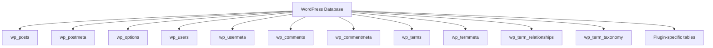

# WordPress Database Optimization

## Introduction

The database is the foundation of every WordPress website, storing everything from posts and pages to user comments and plugin settings. As your site grows, the database can become bloated with unnecessary data, which can significantly slow down your website. In this guide, we'll explore effective techniques for optimizing your WordPress database to improve site performance.

WordPress uses MySQL (or MariaDB) as its database management system. Over time, as content is added, edited, or deleted, the database can accumulate overhead that affects your site's loading speed. Proper database optimization can lead to faster page load times, improved user experience, and better overall site performance.

## Why Database Optimization Matters

Before diving into the techniques, let's understand why database optimization is crucial:

1. **Faster query execution**: Optimized databases process queries more efficiently
2. **Reduced server load**: Less strain on your hosting resources
3. **Improved user experience**: Faster loading pages for your visitors
4. **Better SEO rankings**: Search engines favor faster websites
5. **Lower bounce rates**: Users are less likely to leave a fast-loading site

## Database Structure in WordPress

WordPress organizes its data in several key tables:



Understanding this structure helps you identify which areas to focus on when optimizing.

## Key Optimization Techniques

### 1. Clean Up Post Revisions

WordPress automatically saves revisions of your posts and pages. While useful, they can quickly accumulate and bloat your database.

#### Using a Plugin

Plugins like WP-Optimize or Advanced Database Cleaner can help you remove excessive revisions.

#### Manual Cleanup via SQL

If you're comfortable with SQL, you can use phpMyAdmin or another database management tool to run:

```sql
DELETE FROM wp_posts WHERE post_type = 'revision';
```

#### Limiting Revisions in wp-config.php

Add this line to your wp-config.php file to limit the number of revisions WordPress stores:

```php
define('WP_POST_REVISIONS', 3); // Limits to 3 revisions per post
```

Or disable revisions completely:

```php
define('WP_POST_REVISIONS', false);
```

### 2. Remove Spam and Trashed Comments

Comments, especially spam ones, can take up significant database space.

#### Using WordPress Admin

Navigate to Comments → Spam/Trash and use the "Empty Spam" and "Empty Trash" buttons.

#### Using SQL

```sql
DELETE FROM wp_comments WHERE comment_approved = 'spam';
DELETE FROM wp_comments WHERE comment_approved = 'trash';
```

### 3. Clean Up Transients

Transients are temporary data stored in the WordPress database, often used by plugins and themes for caching.

#### Expired Transients

```sql
DELETE FROM wp_options WHERE option_name LIKE '%\_transient\_%' AND option_name NOT LIKE '%\_transient\_timeout\_%';
DELETE FROM wp_options WHERE option_name LIKE '%\_transient\_timeout\_%';
```

### 4. Optimize Database Tables

Over time, database tables can become fragmented. Optimizing them can improve performance.

#### Using phpMyAdmin

1. Select your WordPress database
2. Select all tables
3. Choose "Optimize Table" from the dropdown menu

#### Using WP-CLI

If you have WP-CLI installed, you can run:

```bash
wp db optimize
```

#### SQL Query

```sql
OPTIMIZE TABLE wp_posts, wp_postmeta, wp_options, wp_comments, wp_commentmeta;
```

### 5. Index Important Database Columns

Adding indexes to frequently queried columns can significantly speed up database operations.

```sql
ALTER TABLE wp_postmeta ADD INDEX meta_key_value (meta_key, meta_value(191));
```

This example adds an index to the meta_key and meta_value columns in the wp_postmeta table, which can speed up metadata queries.

## Implementing Regular Maintenance

### Scheduling Database Optimization

Setting up a regular maintenance schedule ensures your database remains optimized. Here's a simple approach:

1. **Weekly Tasks**:
   - Delete spam and unapproved comments
   - Clean up post revisions
   - Remove expired transients

2. **Monthly Tasks**:
   - Optimize database tables
   - Review and clean up unused post meta

3. **Quarterly Tasks**:
   - Review database indexes
   - Check for orphaned data
   - Perform complete database optimization

### Automation with WP-Cron

You can automate database optimization tasks using WordPress's built-in cron system. Here's a simple example:

```php
// Add this to your theme's functions.php or a custom plugin
function schedule_database_optimization() {
    if (!wp_next_scheduled('my_weekly_db_optimization')) {
        wp_schedule_event(time(), 'weekly', 'my_weekly_db_optimization');
    }
}
add_action('wp', 'schedule_database_optimization');

function perform_weekly_db_optimization() {
    global $wpdb;
    
    // Clean up post revisions (keep last 5)
    $wpdb->query("
        DELETE FROM {$wpdb->posts} 
        WHERE post_type = 'revision' 
        AND ID NOT IN (
            SELECT * FROM (
                SELECT ID FROM {$wpdb->posts} 
                WHERE post_type = 'revision' 
                ORDER BY post_date DESC 
                LIMIT 5
            ) temp
        )
    ");
    
    // Delete spam comments
    $wpdb->query("DELETE FROM {$wpdb->comments} WHERE comment_approved = 'spam'");
    
    // Delete expired transients
    $wpdb->query("
        DELETE FROM {$wpdb->options} 
        WHERE option_name LIKE '%\_transient\_timeout\_%' 
        AND option_value < " . time()
    );
    $wpdb->query("
        DELETE FROM {$wpdb->options} 
        WHERE option_name LIKE '%\_transient\_%' 
        AND option_name NOT LIKE '%\_transient\_timeout\_%'
    ");
}
add_action('my_weekly_db_optimization', 'perform_weekly_db_optimization');
```

## Best Practices for Database Efficiency

### 1. Use a Caching Plugin

Implement a caching plugin like WP Rocket, W3 Total Cache, or LiteSpeed Cache to reduce database queries.

### 2. Optimize wp_options Table

The wp_options table is queried on every page load. Keep it lean by:

- Removing autoloaded options you don't need
- Deleting old and unused options

```sql
-- Find the largest autoloaded options
SELECT option_name, length(option_value) as option_value_length 
FROM wp_options 
WHERE autoload='yes' 
ORDER BY option_value_length DESC 
LIMIT 20;
```

### 3. Monitor Database Query Performance

Use query monitoring plugins like Query Monitor to identify slow database queries:

```php
// Example of a slow query that could be optimized
$results = $wpdb->get_results("
    SELECT * FROM {$wpdb->posts} p
    JOIN {$wpdb->postmeta} pm ON p.ID = pm.post_id
    WHERE p.post_type = 'product'
    AND pm.meta_key = '_price'
    ORDER BY pm.meta_value+0 ASC
");

// Optimized version
$results = $wpdb->get_results("
    SELECT p.*, pm.meta_value 
    FROM {$wpdb->posts} p
    JOIN {$wpdb->postmeta} pm ON p.ID = pm.post_id
    WHERE p.post_type = 'product'
    AND pm.meta_key = '_price'
    ORDER BY pm.meta_value+0 ASC
");
```

### 4. Properly Structure Custom Queries

When writing custom database queries:

1. Use prepared statements to prevent SQL injection
2. Select only the columns you need
3. Use appropriate indexes
4. Limit the results when possible

```php
// Bad example - selecting everything and not using prepared statements
$results = $wpdb->get_results("SELECT * FROM {$wpdb->posts} WHERE post_title LIKE '%{$search}%'");

// Good example - using prepared statements and selecting specific columns
$results = $wpdb->get_results($wpdb->prepare(
    "SELECT ID, post_title, post_date 
     FROM {$wpdb->posts} 
     WHERE post_title LIKE %s 
     LIMIT 50",
    '%' . $wpdb->esc_like($search) . '%'
));
```

## Real-World Case Study

Let's examine a real-world scenario of how database optimization improved performance for a WordPress blog:

**Starting Point:**
- 5+ years of content
- 1,000+ posts with multiple revisions
- 20,000+ comments
- 50+ plugins (many inactive)
- Average page load time: 4.5 seconds

**Optimization Steps Applied:**
1. Removed 15,000+ post revisions
2. Cleaned up 5,000+ spam/trash comments
3. Deleted 10,000+ expired transients
4. Optimized all database tables
5. Added strategic indexes
6. Removed unused post meta from deleted plugins

**Results:**
- Database size reduced by 60%
- Average page load time improved to 1.8 seconds
- Server CPU usage decreased by 45%
- MySQL query time reduced by 70%

## Troubleshooting Common Issues

### Database Connection Issues

If you encounter database connection issues during optimization:

1. Check your database credentials in wp-config.php
2. Ensure your database server isn't overloaded
3. Temporarily increase PHP memory limit
4. Consider performing optimizations during low-traffic periods

### Handling Large Databases

For extremely large databases (1GB+):

1. Break optimization into smaller chunks
2. Use command-line tools like WP-CLI instead of web interfaces
3. Schedule optimizations during off-peak hours
4. Consider using a staging site for major operations

## Summary

Database optimization is a crucial aspect of WordPress performance tuning. Regular maintenance can significantly improve your site's speed and reliability. Key takeaways include:

1. Regularly clean up unnecessary data (revisions, spam, transients)
2. Optimize database tables to reduce fragmentation
3. Add strategic indexes to improve query performance
4. Monitor and optimize your wp_options table
5. Implement a regular maintenance schedule
6. Use proper query techniques when building custom functionality

By implementing these strategies, you can ensure your WordPress database remains efficient, leading to faster page loads and a better user experience.

## Additional Resources

Here are some valuable resources for further learning about WordPress database optimization:

- [WordPress Codex: Optimization](https://wordpress.org/support/article/optimization/)
- [MySQL Documentation](https://dev.mysql.com/doc/)
- [Query Monitor Plugin](https://wordpress.org/plugins/query-monitor/)
- [WP-CLI Documentation](https://wp-cli.org/)

## Practice Exercises

1. **Basic**: Use phpMyAdmin to identify the largest tables in your WordPress database
2. **Intermediate**: Write a query to find the 10 largest autoloaded options in your wp_options table
3. **Advanced**: Create a custom PHP script that performs basic database optimization tasks and can be run via WP-CLI

Start small with your optimization efforts, measure the results, and gradually implement more advanced techniques as you become comfortable with database management.