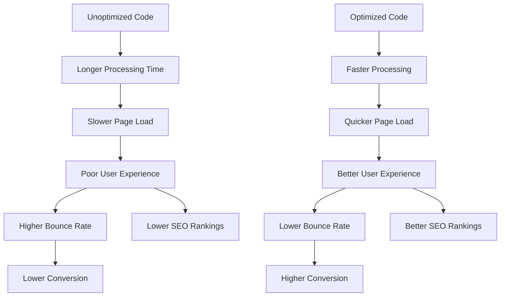

# WordPress Code Optimization

## Introduction

Code optimization is a crucial aspect of WordPress performance enhancement. Poorly written or inefficient code can significantly slow down your website, affecting user experience and search engine rankings. In this guide, we'll explore practical techniques to optimize WordPress code, focusing on PHP, JavaScript, and CSS optimizations that will help your site load faster and operate more efficiently.

Whether you're a WordPress beginner looking to understand performance basics or a developer seeking to refine your coding practices, these optimization techniques will help you build faster, more efficient WordPress websites.

## Why Code Optimization Matters

Before diving into specific techniques, let's understand why code optimization is essential:



## PHP Optimization Techniques

WordPress core is built on PHP, making PHP optimization crucial for performance improvements.

### 1. Use Efficient Database Queries

WordPress sites heavily rely on database interactions. Optimizing these queries can significantly improve performance.

#### Bad Practice:

```php
// Inefficient query retrieving all post data
$posts = $wpdb->get_results("SELECT * FROM $wpdb->posts WHERE post_status = 'publish'");
```

#### Better Approach:

```php
// Only select the fields you need
$posts = $wpdb->get_results("SELECT ID, post_title FROM $wpdb->posts WHERE post_status = 'publish'");

// Or use WP functions with specific parameters
$posts = get_posts(array(
    'post_status' => 'publish',
    'fields' => 'ids', // Only get post IDs
    'posts_per_page' => 10 // Limit the number of results
));
```

### 2. Cache Database Queries

Use WordPress transients API to cache database query results:

```php
function get_featured_products() {
    // Check if data exists in cache
    $featured_products = get_transient('featured_products');
    
    // If no cache exists, run the query
    if (false === $featured_products) {
        $featured_products = get_posts(array(
            'post_type' => 'product',
            'meta_key' => 'featured',
            'meta_value' => 'yes',
            'posts_per_page' => 5
        ));
        
        // Cache the result for 12 hours
        set_transient('featured_products', $featured_products, 12 * HOUR_IN_SECONDS);
    }
    
    return $featured_products;
}
```

### 3. Avoid Direct Database Calls When Possible

Use WordPress built-in functions instead of direct SQL queries:

```php
// Instead of this
$user_info = $wpdb->get_results("SELECT * FROM $wpdb->users WHERE ID = 1");

// Use WordPress functions
$user_info = get_userdata(1);
```

### 4. Optimize Plugin and Theme Functions

Review and optimize your `functions.php` file and any custom plugins:

```php
// Bad practice: Loading scripts on all pages
function load_all_scripts() {
    wp_enqueue_script('heavy-script', 'path/to/heavy-script.js');
}
add_action('wp_enqueue_scripts', 'load_all_scripts');

// Better practice: Conditional loading
function conditionally_load_scripts() {
    if (is_single() || is_page('contact')) {
        wp_enqueue_script('heavy-script', 'path/to/heavy-script.js');
    }
}
add_action('wp_enqueue_scripts', 'conditionally_load_scripts');
```

## JavaScript Optimization Techniques

JavaScript can significantly impact page load time when not properly optimized.

### 1. Defer Non-Critical JavaScript

Use the `defer` attribute to ensure JS doesn't block the page rendering:

```php
function enqueue_optimized_scripts() {
    wp_enqueue_script('main-script', 'path/to/script.js', array(), '1.0', true); // Sets in footer
    
    // For custom script tags
    add_filter('script_loader_tag', 'add_defer_attribute', 10, 2);
}
add_action('wp_enqueue_scripts', 'enqueue_optimized_scripts');

function add_defer_attribute($tag, $handle) {
    if ('main-script' === $handle) {
        return str_replace(' src', ' defer src', $tag);
    }
    return $tag;
}
```

### 2. Minify and Combine JavaScript Files

While there are plugins for this, you can manually prepare your JS files:

```php
function enqueue_optimized_js() {
    // In production environment
    if (!WP_DEBUG) {
        wp_enqueue_script('combined-scripts', 'path/to/scripts.min.js', array(), '1.0', true);
    } else {
        // In development, load separate files
        wp_enqueue_script('script1', 'path/to/script1.js');
        wp_enqueue_script('script2', 'path/to/script2.js');
    }
}
add_action('wp_enqueue_scripts', 'enqueue_optimized_js');
```

### 3. Use Modern JavaScript Techniques

Modern JS techniques can improve performance. For example, using `requestAnimationFrame` for animations:

```javascript
// Instead of using setInterval for animations
setInterval(function() {
    // Update animation
}, 16); // Roughly 60fps

// Better approach
function updateAnimation() {
    // Update animation
    requestAnimationFrame(updateAnimation);
}
requestAnimationFrame(updateAnimation);
```

## CSS Optimization Techniques

Optimized CSS helps pages render faster and reduces browser work.

### 1. Inline Critical CSS

For fastest rendering, inline critical CSS in the `<head>` of your document:

```php
function add_critical_css() {
    ?>
    <style>
        /* Critical CSS goes here */
        header, .hero-section {
            /* Styles for above-the-fold content */
        }
    </style>
    <?php
}
add_action('wp_head', 'add_critical_css');
```

### 2. Load Non-Critical CSS Asynchronously

For non-critical styles, load them asynchronously:

```php
function load_non_critical_css() {
    ?>
    <link rel="preload" href="<?php echo get_template_directory_uri(); ?>/css/styles.css" as="style" onload="this.onload=null;this.rel='stylesheet'">
    <noscript><link rel="stylesheet" href="<?php echo get_template_directory_uri(); ?>/css/styles.css"></noscript>
    <?php
}
add_action('wp_head', 'load_non_critical_css');
```

### 3. Use CSS Selectors Efficiently

Optimize your CSS selectors for better rendering performance:

```css
/* Avoid deeply nested selectors */
body .content .sidebar .widget .widget-content .list .item a {
    color: red;
}

/* Better approach */
.widget-link {
    color: red;
}
```

## Database Optimization for Code Efficiency

Your code interacts with the WordPress database, so database optimization is crucial.

### 1. Use $wpdb Prepare Statements

Always use prepared statements for security and efficiency:

```php
// Bad practice (insecure and potentially inefficient)
$results = $wpdb->get_results("SELECT * FROM $wpdb->postmeta WHERE meta_key = '$meta_key'");

// Good practice
$results = $wpdb->get_results(
    $wpdb->prepare("SELECT * FROM $wpdb->postmeta WHERE meta_key = %s", $meta_key)
);
```

### 2. Optimize Custom Database Tables

If you're using custom tables, ensure they're properly optimized:

```php
function create_optimized_custom_table() {
    global $wpdb;
    $table_name = $wpdb->prefix . 'custom_data';
    
    $charset_collate = $wpdb->get_charset_collate();
    
    $sql = "CREATE TABLE $table_name (
        id mediumint(9) NOT NULL AUTO_INCREMENT,
        user_id bigint(20) NOT NULL,
        data_point varchar(100) NOT NULL,
        timestamp datetime DEFAULT CURRENT_TIMESTAMP NOT NULL,
        PRIMARY KEY  (id),
        KEY user_id (user_id), /* Index for frequently queried columns */
        KEY timestamp (timestamp)
    ) $charset_collate;";
    
    require_once(ABSPATH . 'wp-admin/includes/upgrade.php');
    dbDelta($sql);
}
```

## Real-World Example: Building an Optimized Custom Widget

Let's put these concepts together in a real-world example by creating an optimized popular posts widget:

```php
class Optimized_Popular_Posts_Widget extends WP_Widget {
    public function __construct() {
        parent::__construct(
            'optimized_popular_posts',
            'Optimized Popular Posts'
        );
    }
    
    public function widget($args, $instance) {
        echo $args['before_widget'];
        echo $args['before_title'] . $instance['title'] . $args['after_title'];
        
        // Get cached data or create it
        $popular_posts = get_transient('optimized_popular_posts');
        
        if (false === $popular_posts) {
            // Only select needed fields
            $popular_posts = get_posts(array(
                'posts_per_page' => $instance['count'],
                'meta_key' => 'post_views',
                'orderby' => 'meta_value_num',
                'order' => 'DESC',
                'fields' => 'ids', // Just get IDs for efficiency
            ));
            
            // Cache results for 3 hours
            set_transient('optimized_popular_posts', $popular_posts, 3 * HOUR_IN_SECONDS);
        }
        
        if ($popular_posts) {
            echo '<ul class="optimized-popular-posts">';
            
            foreach ($popular_posts as $post_id) {
                // Fetch only needed data
                $post_title = get_the_title($post_id);
                $post_url = get_permalink($post_id);
                
                echo '<li>';
                echo '<a href="' . esc_url($post_url) . '">' . esc_html($post_title) . '</a>';
                echo '</li>';
            }
            
            echo '</ul>';
        }
        
        echo $args['after_widget'];
    }
    
    // Clear cache when posts are updated
    public static function clear_cache() {
        delete_transient('optimized_popular_posts');
    }
    
    // Widget form, update methods would go here
}

// Register the widget
function register_optimized_widget() {
    register_widget('Optimized_Popular_Posts_Widget');
}
add_action('widgets_init', 'register_optimized_widget');

// Clear cache when posts are updated
add_action('save_post', array('Optimized_Popular_Posts_Widget', 'clear_cache'));
```

## Performance Monitoring and Testing

After implementing optimizations, it's crucial to measure their impact:

### 1. Use Query Monitor Plugin

[Query Monitor](https://wordpress.org/plugins/query-monitor/) helps identify slow database queries and performance bottlenecks.

### 2. Check Page Speed with DevTools

Use browser DevTools to analyze loading performance:

```javascript
// In your browser console, measure execution time
console.time('Function execution');
yourFunction();
console.timeEnd('Function execution');
```

## Advanced Optimization: Template Part Caching

For dynamic template parts that don't change often:

```php
function get_cached_template_part($slug, $name = null, $cache_time = 3600) {
    $cache_key = "template_part_" . md5($slug . $name);
    $output = get_transient($cache_key);
    
    if (false === $output) {
        ob_start();
        get_template_part($slug, $name);
        $output = ob_get_clean();
        set_transient($cache_key, $output, $cache_time);
    }
    
    echo $output;
}
```

Usage:

```php
// Instead of get_template_part('content', 'sidebar');
get_cached_template_part('content', 'sidebar');
```

## Summary

Code optimization is an ongoing process that significantly impacts WordPress performance. By implementing the techniques covered in this guide:

1. **Efficient PHP Coding:** Using proper database queries and caching
2. **JavaScript Optimization:** Deferring non-critical scripts and minification
3. **CSS Improvements:** Inlining critical CSS and efficient selector usage
4. **Database Optimization:** Prepared statements and proper indexing
5. **Template Caching:** For frequently used but rarely changed content

You'll create WordPress sites that not only load faster but also use server resources more efficiently, resulting in better user experience and improved search engine rankings.

## Additional Resources

- [WordPress Developer Handbook](https://developer.wordpress.org/)
- [WordPress Coding Standards](https://developer.wordpress.org/coding-standards/)
- [Web.dev Performance Guide](https://web.dev/fast/)

## Exercises for Practice

1. **Database Query Optimization:**
   Take a complex query from your theme or plugin and optimize it using the techniques discussed.

2. **Script Audit:**
   Review your site's scripts and identify which ones can be deferred or eliminated.

3. **Create a Caching System:**
   Implement a simple transient-based caching system for your custom functions that retrieve data.

4. **CSS Refactoring:**
   Identify and optimize overly complex CSS selectors in your theme.

5. **Performance Testing:**
   Use tools like GTmetrix or WebPageTest to measure your site's performance before and after implementing these optimizations.

By mastering WordPress code optimization, you'll develop skills that are valuable across all web development projects, not just WordPress sites.