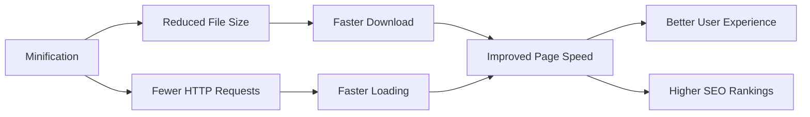

# WordPress Minification

## Introduction

Minification is a crucial performance optimization technique that involves removing unnecessary characters from code without changing its functionality. For WordPress sites, minification plays a significant role in improving page load times, which directly affects user experience and search engine rankings.

When a browser requests your WordPress site, it needs to download, parse, and execute all your CSS, JavaScript, and HTML files. The larger these files are, the longer it takes for your site to load. Minification reduces file sizes by removing:

- White spaces, line breaks, and comments
- Unnecessary semicolons
- Shortening variable names where possible
- Optimizing code patterns

In this guide, we'll explore how minification works in WordPress, why it's important, and how to implement it effectively.

## Why Minify WordPress Files?

Before diving into the implementation, let's understand the benefits of minification:



1. **Reduced file sizes**: Smaller files mean faster downloads
2. **Fewer HTTP requests**: Combined files reduce network overhead
3. **Better user experience**: Faster sites keep visitors engaged
4. **Improved SEO**: Page speed is a ranking factor for search engines

## Understanding Different Types of Minification

### CSS Minification

CSS files contain styling rules for your website. These files often include whitespace, comments, and other characters that make them readable for developers but aren't needed for browsers to interpret them.

**Before Minification:**
```css
/* Primary button styles */
.button-primary {
    background-color: #0073aa;
    color: #ffffff;
    padding: 10px 15px;
    border-radius: 4px;
    font-weight: bold;
}

/* Button hover effect */
.button-primary:hover {
    background-color: #005177;
}
```

**After Minification:**
```css
.button-primary{background-color:#0073aa;color:#fff;padding:10px 15px;border-radius:4px;font-weight:700}.button-primary:hover{background-color:#005177}
```

### JavaScript Minification

JavaScript minification is similar but can be more complex due to the language's syntax. Beyond removing whitespace and comments, advanced JS minification can even rename variables to shorter names.

**Before Minification:**
```javascript
// Function to toggle mobile menu
function toggleMobileMenu() {
    const menuButton = document.getElementById('mobile-menu-button');
    const mobileMenu = document.getElementById('mobile-menu');
    
    menuButton.addEventListener('click', function() {
        if (mobileMenu.classList.contains('hidden')) {
            mobileMenu.classList.remove('hidden');
        } else {
            mobileMenu.classList.add('hidden');
        }
    });
}
```

**After Minification:**
```javascript
function toggleMobileMenu(){const e=document.getElementById("mobile-menu-button"),n=document.getElementById("mobile-menu");e.addEventListener("click",function(){n.classList.contains("hidden")?n.classList.remove("hidden"):n.classList.add("hidden")})}
```

### HTML Minification

HTML minification removes unnecessary whitespace, comments, and other elements that aren't needed for rendering.

**Before Minification:**
```html
<!DOCTYPE html>
<html lang="en">
  <head>
    <!-- Meta information -->
    <meta charset="UTF-8">
    <title>My WordPress Site</title>
  </head>
  <body>
    <!-- Main content -->
    <div class="container">
      <h1>Welcome to my website</h1>
      <p>This is a paragraph of text on my WordPress website.</p>
    </div>
  </body>
</html>
```

**After Minification:**
```html
<!DOCTYPE html><html lang="en"><head><meta charset="UTF-8"><title>My WordPress Site</title></head><body><div class="container"><h1>Welcome to my website</h1><p>This is a paragraph of text on my WordPress website.</p></div></body></html>
```

## How to Implement Minification in WordPress

### Method 1: Using WordPress Plugins

The easiest way to implement minification is through plugins. Here are some popular options:

#### Option A: WP Rocket

[WP Rocket](https://wp-rocket.me/) is a premium caching plugin that includes minification features.

**Steps to configure WP Rocket for minification:**

1. Install and activate WP Rocket
2. Navigate to WP Rocket → File Optimization
3. Check the options for:
   - Minify CSS files
   - Combine CSS files (if applicable)
   - Minify JavaScript files
   - Combine JavaScript files (if applicable)
4. Save changes

#### Option B: Autoptimize

[Autoptimize](https://wordpress.org/plugins/autoptimize/) is a free plugin focused specifically on minification and optimization.

**Steps to configure Autoptimize:**

1. Install and activate the Autoptimize plugin
2. Go to Settings → Autoptimize
3. Check these options:
   - Optimize HTML
   - Optimize CSS Code
   - Optimize JavaScript Code
4. Click "Save Changes and Empty Cache"

Example Autoptimize configuration:

```php
// This would be similar to setting these values in Autoptimize settings
$autoptimize_options = array(
    'autoptimize_html' => 'on',
    'autoptimize_html_keepcomments' => '',
    'autoptimize_css' => 'on',
    'autoptimize_css_exclude' => 'wp-content/cache/, wp-content/uploads/, admin-bar.min.css',
    'autoptimize_js' => 'on',
    'autoptimize_js_exclude' => 'wp-includes/js/jquery/jquery.js, admin-bar.min.js'
);
```

#### Option C: W3 Total Cache

[W3 Total Cache](https://wordpress.org/plugins/w3-total-cache/) is a comprehensive caching plugin that also offers minification.

**Steps to configure W3 Total Cache for minification:**

1. Install and activate W3 Total Cache
2. Go to Performance → Minify
3. Enable minify
4. Configure minification for HTML, CSS, and JavaScript
5. Save all settings

### Method 2: Manual Minification with Code

For developers who want more control, you can manually minify your CSS and JavaScript files before adding them to your theme.

#### Step 1: Minify your files using online tools or Node.js packages

You can use online tools like [CSS Minifier](https://cssminifier.com/) and [JavaScript Minifier](https://javascript-minifier.com/), or use Node.js packages like `uglify-js` and `clean-css`.

With npm (Node Package Manager):

```bash
# Install required packages
npm install uglify-js clean-css-cli --save-dev

# Minify JavaScript
npx uglifyjs src/scripts.js -o dist/scripts.min.js

# Minify CSS
npx cleancss -o dist/styles.min.css src/styles.css
```

#### Step 2: Enqueue the minified files in your theme

Add this code to your theme's `functions.php`:

```php
function enqueue_minified_assets() {
    // Enqueue minified CSS
    wp_enqueue_style( 
        'theme-styles', 
        get_template_directory_uri() . '/dist/styles.min.css', 
        array(), 
        '1.0.0' 
    );
    
    // Enqueue minified JavaScript
    wp_enqueue_script( 
        'theme-scripts', 
        get_template_directory_uri() . '/dist/scripts.min.js', 
        array('jquery'), 
        '1.0.0', 
        true 
    );
}
add_action( 'wp_enqueue_scripts', 'enqueue_minified_assets' );
```

### Method 3: Using Page Builders with Built-in Minification

Many modern WordPress page builders now include minification functionality:

- **Elementor**: Navigate to Elementor → Settings → Advanced → CSS & JavaScript Minification
- **Divi**: Go to Divi → Theme Options → Performance → Minify and Combine
- **Beaver Builder**: Check settings for their PowerPack addon

## Best Practices for WordPress Minification

1. **Always test after implementing**: Minification can sometimes break functionality, so test thoroughly after enabling it.

2. **Exclude problematic files**: Some scripts may not work properly when minified. Most plugins allow you to exclude specific files:

```php
// Example of excluding files in WP Rocket via functions.php
function exclude_files_from_minification($excluded_files) {
    $excluded_files[] = 'wp-content/themes/mytheme/js/animation.js';
    $excluded_files[] = 'wp-content/plugins/problematic-plugin/js/main.js';
    return $excluded_files;
}
add_filter('rocket_exclude_js', 'exclude_files_from_minification');
```

3. **Use defer or async for JavaScript**: This can improve page loading performance further:

```html
<!-- Example of deferred JavaScript loading -->
<script defer src="script.min.js"></script>
```

4. **Combine minification with other optimization techniques**:
   - Browser caching
   - GZIP compression
   - Image optimization
   - Lazy loading

## Measuring the Impact of Minification

To verify that minification is improving your site's performance, use these tools:

1. **Google PageSpeed Insights**: Provides performance metrics and suggestions
2. **GTmetrix**: Detailed load time analysis and waterfall charts
3. **WebPageTest**: In-depth performance testing from multiple locations
4. **Chrome DevTools**: See actual file sizes before and after minification

### Practical Example: Measuring Minification Results

Let's look at a practical example of measuring minification results:

1. Test your site with Google PageSpeed Insights before minification and note the score
2. Implement minification using one of the methods above
3. Clear all caches
4. Test your site again and compare scores

**Sample Results:**

| Metric | Before Minification | After Minification | Improvement |
|--------|---------------------|-------------------|-------------|
| Page Size | 2.3MB | 1.8MB | 21.7% reduction |
| Load Time | 3.2s | 2.4s | 25% faster |
| PageSpeed Score | 72 | 86 | 14 point increase |

## Troubleshooting Common Minification Issues

### Problem 1: JavaScript Functionality Breaks After Minification

**Solution**:
- Exclude the problematic script from minification
- Check for JavaScript code that relies on specific formatting
- Consider using a different minification plugin

### Problem 2: CSS Styling Issues After Minification

**Solution**:
- Check for syntax errors in your CSS
- Ensure that `!important` declarations are properly formatted
- Consider excluding problem CSS files from minification

### Problem 3: Increased Server Load

**Solution**:
- Enable page caching alongside minification
- Consider a CDN to offload static assets
- Optimize your hosting environment

## Summary

WordPress minification is a powerful technique to improve site performance by reducing file sizes and HTTP requests. In this guide, we've covered:

- The concept and benefits of minification
- Different types of minification (CSS, JavaScript, HTML)
- Various implementation methods using plugins, manual coding, and page builders
- Best practices and troubleshooting techniques

When implemented correctly, minification can significantly improve your WordPress site's loading speed, providing a better user experience and potentially improving your search engine rankings.

## Additional Resources

- [Web.dev Guide to Minifying Code](https://web.dev/minify-css/)
- [WordPress Developer Handbook: Optimization](https://developer.wordpress.org/themes/theme-security/optimization/)
- [Google PageSpeed Insights](https://pagespeed.web.dev/)

## Practice Exercises

1. **Compare Plugins**: Test your site with different minification plugins (WP Rocket, Autoptimize, and W3 Total Cache) and compare the results.

2. **Manual Minification**: Create a simple WordPress child theme and implement manual minification for its CSS and JavaScript files.

3. **Performance Testing**: Use PageSpeed Insights to test your site before and after minification, and document the improvements in key metrics.

4. **Advanced Configuration**: Experiment with combining minification with other techniques like browser caching and GZIP compression to see the combined effect on performance.

Remember, optimization is an ongoing process. Regularly test your site's performance and make adjustments as needed to maintain optimal loading speeds.