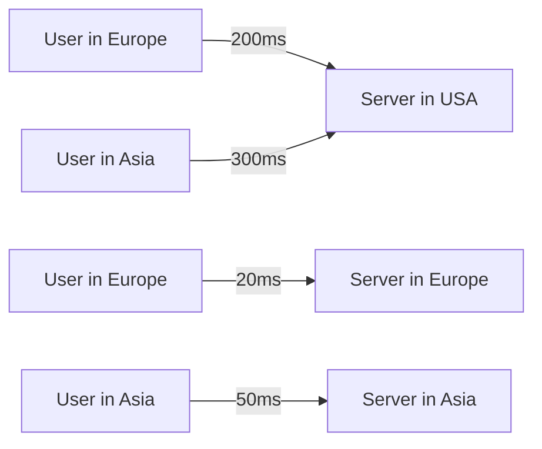

# WordPress Hosting Factors

Your choice of hosting has a profound impact on your WordPress site's performance. Even with perfect code optimization, poor hosting can still result in a slow website. This guide explores the critical hosting factors that affect WordPress performance and helps you make informed hosting decisions.

## Introduction

WordPress hosting is the foundation upon which your website runs. Just like a house needs a solid foundation to remain stable, your WordPress site requires reliable hosting to perform optimally. The right hosting solution can dramatically improve loading speeds, enhance security, and provide better uptime for your WordPress website.

In this guide, we'll explore the key factors to consider when selecting WordPress hosting, the different types of hosting options available, and how each impacts your site's performance.

## Key Hosting Factors That Affect WordPress Performance

### 1. Server Resources

The resources allocated to your website directly impact its performance. These include:

#### CPU Allocation

The CPU (Central Processing Unit) is responsible for processing PHP scripts, database queries, and other computational tasks.

**Impact on WordPress:** Higher CPU allocation allows WordPress to process requests faster, especially during traffic spikes.

#### RAM (Memory) Allocation

RAM determines how much data your server can actively work with at one time.

**Impact on WordPress:** More RAM means WordPress can handle more concurrent visitors and complex operations without slowing down.

```javascript
// Example: Memory usage in WordPress
// You can check current memory usage with this code

function check_wp_memory_usage() {
  $memory_limit = ini_get('memory_limit');
  $memory_usage = memory_get_usage();
  $memory_usage_mb = round($memory_usage / 1024 / 1024, 2);
  
  return [
    'limit' => $memory_limit,
    'usage' => $memory_usage_mb . 'MB',
    'percentage' => round(($memory_usage_mb / intval($memory_limit)) * 100, 2) . '%'
  ];
}

// Output example:
// Array ( [limit] => 128M [usage] => 42.15MB [percentage] => 32.93% )
```

#### Storage Type and Speed

Storage technology impacts how quickly WordPress can read and write files.

**Impact on WordPress:** SSD storage is significantly faster than traditional HDD storage, resulting in better WordPress performance, especially for database operations.

**Comparison:**
- HDD (Hard Disk Drive): 80-160 MB/s read/write speeds
- SSD (Solid State Drive): 500+ MB/s read/write speeds
- NVMe SSD: 3000+ MB/s read/write speeds

### 2. Server Location and Content Delivery Networks

#### Geographic Server Location

The physical distance between your server and your visitors affects loading times due to network latency.

**Impact on WordPress:** Choosing a server location close to most of your audience reduces latency and improves page load times.



#### Content Delivery Network (CDN) Integration

CDNs store cached copies of your website on multiple servers worldwide.

**Impact on WordPress:** A CDN dramatically improves loading times for global audiences by serving content from the closest geographic location.

### 3. Server Software and Configuration

#### Web Server Software

Different web server software options have varying performance characteristics:

- **Apache:** The traditional choice, feature-rich but can be slower
- **Nginx:** Faster and more efficient, especially for static content
- **LiteSpeed:** Optimized for WordPress with built-in caching

**Impact on WordPress:** Nginx or LiteSpeed typically outperform Apache for WordPress sites, especially under higher loads.

#### PHP Version and Configuration

WordPress runs on PHP, and the PHP version and settings significantly impact performance.

**Impact on WordPress:** Newer PHP versions (7.4+, 8.0+, 8.1+) offer substantial performance improvements over older versions.

```php
// Example: Checking PHP version in WordPress
<?php
function check_php_version() {
  $current_version = phpversion();
  $recommended_version = '8.0';
  
  if (version_compare($current_version, $recommended_version, '>=')) {
    echo "Great! You're running PHP $current_version";
  } else {
    echo "Consider upgrading! You're running PHP $current_version, but PHP $recommended_version+ is recommended for optimal performance.";
  }
}

// Sample output: "Great! You're running PHP 8.1.9"
// or "Consider upgrading! You're running PHP 7.2.34, but PHP 8.0+ is recommended for optimal performance."
```

#### Database Optimization

MySQL or MariaDB configuration affects WordPress database operations.

**Impact on WordPress:** Properly tuned database settings can significantly improve WordPress query performance.

### 4. Hosting Architecture

#### Shared vs. Dedicated Resources

- **Shared hosting:** Multiple websites share server resources
- **VPS/Cloud hosting:** Resources are allocated but may still share physical hardware
- **Dedicated hosting:** Entire physical server dedicated to your website

**Impact on WordPress:** Shared hosting often suffers from the "noisy neighbor" problem, where other websites can impact your performance.

#### Scalability Options

How easily can your hosting scale up during traffic spikes?

**Impact on WordPress:** Auto-scaling solutions prevent downtime during viral content or marketing campaigns.

## Types of WordPress Hosting

Let's compare different hosting types specifically for WordPress:

| Hosting Type | Price Range | Best For | Performance Level |
|--------------|-------------|----------|-------------------|
| Shared | $3-15/month | Beginners, Small blogs | Low-Medium |
| VPS | $20-80/month | Growing sites, Small businesses | Medium-High |
| Managed WordPress | $25-200/month | Businesses, No technical skills | High |
| Cloud | $10-1000+/month | Variable traffic, Scalability needs | Medium-Very High |
| Dedicated | $100-500+/month | Large sites, Complete control | Very High |

### Managed WordPress Hosting

Managed WordPress hosting is specifically optimized for WordPress and includes:

- WordPress-specific server optimizations
- Automatic updates and backups
- Enhanced security measures
- Expert WordPress support

**Impact on WordPress:** Typically offers the best out-of-box performance for WordPress sites without requiring technical expertise.

## Real-World Performance Impact of Hosting Choices

### Case Study: Blog Site Migration

Consider a real-world example of a blog that migrated from basic shared hosting to managed WordPress hosting:

**Before (Shared Hosting):**
- Page load time: 3.2 seconds
- Max concurrent users: ~500 before slowdowns
- Time to First Byte (TTFB): 820ms

**After (Managed WordPress Hosting):**
- Page load time: 1.1 seconds
- Max concurrent users: ~5,000 before slowdowns
- Time to First Byte (TTFB): 180ms

The performance improvement was achieved primarily through:
1. Server-side caching
2. PHP-FPM implementation
3. SSD storage
4. Optimized MySQL configuration
5. Content delivery network integration

## How to Choose the Right WordPress Hosting

Follow these steps to select the most appropriate hosting for your WordPress website:

1. **Assess your needs:**
   - Expected traffic volume
   - Budget constraints
   - Technical expertise
   - Growth plans

2. **Evaluate critical factors:**
   - Server location relative to your audience
   - Resource allocation (CPU, RAM, etc.)
   - PHP version support
   - Caching capabilities
   - Backup systems

3. **Test before committing:**
   - Request a trial period
   - Run performance benchmarks
   - Test customer support responsiveness

## Hosting Optimization for WordPress

Even with good hosting, these optimizations can further improve performance:

### Enable Server-Side Caching

Most managed WordPress hosts include built-in caching. For other hosting types, you can set up caching:

```bash
# Example: Installing Redis cache on Ubuntu for WordPress
sudo apt update
sudo apt install redis-server php-redis

# Edit the Redis configuration file
sudo nano /etc/redis/redis.conf

# Set Redis to run as a daemon
# Change "daemonize no" to "daemonize yes"

# Start Redis server
sudo systemctl restart redis-server

# Verify Redis is running
redis-cli ping
# Should return: PONG
```

Then install a WordPress Redis caching plugin like Redis Object Cache.

### Configure PHP Properly

Create or modify your `php.ini` file with these performance-focused settings:

```ini
; Increase memory limit
memory_limit = 256M

; Increase max execution time
max_execution_time = 300

; Optimize opcache
opcache.enable = 1
opcache.memory_consumption = 128
opcache.interned_strings_buffer = 8
opcache.max_accelerated_files = 4000
opcache.revalidate_freq = 60
opcache.fast_shutdown = 1
```

### Database Optimization

Regularly optimize your database:

```sql
-- Optimizing WordPress database tables
OPTIMIZE TABLE wp_posts;
OPTIMIZE TABLE wp_postmeta;
OPTIMIZE TABLE wp_options;
OPTIMIZE TABLE wp_comments;
```

Or use a WordPress plugin like WP-Optimize to automate this process.

## Monitoring Hosting Performance

Use these tools to monitor your WordPress hosting performance:

1. **New Relic:** Comprehensive application performance monitoring
2. **Query Monitor:** WordPress plugin for database and PHP performance analysis
3. **GTmetrix/Pingdom:** External performance testing services

Example of basic server response monitoring with WordPress:

```php
// Add this to functions.php or a custom plugin
function log_slow_page_loads() {
  $start_time = microtime(true);
  
  add_action('shutdown', function() use ($start_time) {
    $execution_time = microtime(true) - $start_time;
    
    if ($execution_time > 2) { // Log if page takes more than 2 seconds
      error_log("Slow page: " . $_SERVER['REQUEST_URI'] . " - " . 
                number_format($execution_time, 2) . " seconds");
    }
  });
}
add_action('init', 'log_slow_page_loads');
```

## Summary

Your WordPress hosting choice is fundamental to your website's performance. The key factors to consider are:

1. **Server resources:** CPU, RAM, and storage type
2. **Location and delivery:** Server location and CDN implementation
3. **Software configuration:** Web server, PHP version, and database optimization
4. **Hosting architecture:** Shared vs. dedicated resources and scalability

For most WordPress sites:
- **Small personal blogs:** Shared hosting may suffice
- **Business sites:** VPS or managed WordPress hosting offers better performance
- **High-traffic sites:** Cloud or dedicated solutions provide necessary scalability

Remember that even the best WordPress optimization techniques cannot overcome fundamental hosting limitations. Investing in quality hosting is often the most effective way to improve WordPress performance.

## Additional Resources

- [WordPress Recommended Hosting Requirements](https://wordpress.org/about/requirements/)
- [PHP Performance Benchmarks](https://www.php.net/manual/en/install.php)
- [MySQL Performance Tuning](https://dev.mysql.com/doc/refman/8.0/en/optimization.html)

## Practice Exercise

1. Run performance tests on your current WordPress hosting using tools like GTmetrix or WebPageTest
2. Identify potential bottlenecks (TTFB, server response time, etc.)
3. Create a hosting requirements document based on your WordPress site's specific needs
4. Research and compare at least three hosting providers that meet your requirements
5. If possible, set up a staging site on a different hosting provider to compare performance

This practical exercise will help you understand your specific WordPress hosting needs and make an informed decision about potential upgrades or changes.