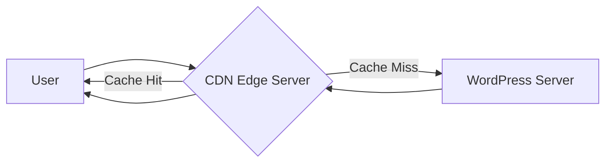

# WordPress CDN Integration

## Introduction

Content Delivery Networks (CDNs) are crucial components in modern website optimization strategy. In this guide, we'll explore how to effectively integrate CDNs with WordPress to dramatically improve your site's performance, reduce server load, and provide a better user experience globally.

A CDN is a distributed network of servers strategically positioned across different geographical locations. When you integrate a CDN with your WordPress site, static assets like images, JavaScript, CSS files, and sometimes even HTML content are cached and delivered from the server nearest to your visitor, reducing latency and load times.

## Why Use a CDN with WordPress?

Before diving into implementation, let's understand the key benefits:

- **Faster loading speeds**: Content is served from servers geographically closer to users
- **Reduced server load**: Your origin server handles fewer requests
- **Better SEO performance**: Speed is a ranking factor for search engines
- **Improved user experience**: Visitors experience less waiting time
- **Higher reliability**: CDNs provide redundancy if your origin server has issues
- **DDoS protection**: Many CDNs offer security features against attacks

## How CDNs Work with WordPress



When a user requests a page from your WordPress site with CDN integration:

1. The request first reaches the CDN
2. If the content is in the CDN cache (and not expired), it's served directly to the user
3. If not, the CDN fetches the content from your origin server, caches it, then serves it
4. Subsequent visitors requesting the same content get it directly from the CDN

## Popular CDN Options for WordPress

### 1. Cloudflare

Cloudflare offers both free and premium plans and is one of the most widely used CDNs.

**Key features:**
- Global network with servers in 200+ cities
- Free SSL certificates
- DDoS protection
- Page rules for customized caching
- Image optimization (on paid plans)

### 2. StackPath (formerly MaxCDN)

A premium CDN option popular among WordPress users.

**Key features:**
- Edge rules for customization
- Real-time analytics
- Edge SSL
- Script and image optimization
- API access

### 3. KeyCDN

A pay-as-you-go CDN option with straightforward pricing.

**Key features:**
- RESTful API
- Custom SSL certificates
- Real-time statistics
- Origin shield
- Image processing

### 4. Bunny CDN

Known for competitive pricing and excellent performance.

**Key features:**
- Global and regional pricing
- Pull and push zone support
- Perma-cache technology
- Bunny Optimizer for images
- Low cost storage options

## Setting Up a CDN with WordPress

Let's walk through the process of integrating a CDN with WordPress, using Cloudflare as our example.

### Step 1: Sign Up for a CDN Account

1. Go to [Cloudflare's website](https://www.cloudflare.com/) and create an account
2. Add your website
3. Select a plan (the free plan is sufficient for beginners)
4. Cloudflare will scan your DNS records

### Step 2: Update Your Nameservers

Cloudflare will provide you with custom nameservers:

1. Log in to your domain registrar account
2. Find the DNS settings
3. Replace your current nameservers with those provided by Cloudflare
4. Save your changes

```
# Example of Cloudflare nameservers (yours will be different)
ns1.cloudflare.com
ns2.cloudflare.com
```

### Step 3: Configure WordPress for CDN Integration

There are two main approaches to integrating a CDN with WordPress:

#### Option A: Using a Plugin (Recommended for Beginners)

Plugins make CDN integration straightforward. We'll use the popular WP Rocket plugin as an example:

1. Install and activate WP Rocket
2. Navigate to WP Rocket > Settings > CDN
3. Enable the CDN option
4. Enter your CDN URL (CNAME provided by Cloudflare)
5. Save changes

```php
// Example of how WP Rocket rewrites URLs in the background
function wp_rocket_cdn_url($url) {
    return str_replace('https://yourdomain.com', 'https://cdn.yourdomain.com', $url);
}
```

#### Option B: Manual Integration (Advanced)

If you prefer not to use a plugin, you can modify your WordPress theme directly:

1. Create a backup of your theme files
2. Open your theme's `functions.php` file
3. Add the following code:

```php
function cdn_url_filter($content) {
    $site_url = 'https://yourdomain.com';
    $cdn_url = 'https://cdn.yourdomain.com';
    
    // Replace URLs in the content
    $content = str_replace($site_url, $cdn_url, $content);
    
    return $content;
}

// Apply filter to content
add_filter('the_content', 'cdn_url_filter');

// Apply filter to stylesheets and scripts
function cdn_for_enqueues($src) {
    $site_url = 'https://yourdomain.com';
    $cdn_url = 'https://cdn.yourdomain.com';
    
    if(strpos($src, $site_url) === 0) {
        return str_replace($site_url, $cdn_url, $src);
    }
    return $src;
}

add_filter('style_loader_src', 'cdn_for_enqueues');
add_filter('script_loader_src', 'cdn_for_enqueues');
```

Replace `yourdomain.com` with your actual domain and `cdn.yourdomain.com` with your CDN URL.

### Step 4: Configure CDN and Cache Settings

Once integrated, optimize your CDN settings:

1. In your Cloudflare dashboard, go to the Caching section
2. Set Browser Cache TTL (Time To Live) to at least 4 hours, ideally 1 week
3. Enable Auto Minify for HTML, CSS, and JavaScript
4. In the Page Rules section, create a rule to cache static assets:

```
URL Pattern: yourdomain.com/*.jpg|*.jpeg|*.png|*.gif|*.webp|*.css|*.js
Setting: Cache Level - Cache Everything
Edge Cache TTL: 1 week
```

## Best Practices for WordPress CDN Implementation

### 1. Exclude Dynamic Content

Some content should not be cached by the CDN:

```php
// Example of excluding admin pages from CDN
function exclude_cdn_urls($cdn_url) {
    if(is_admin() || is_user_logged_in()) {
        return false;
    }
    return $cdn_url;
}
add_filter('wp_rocket_cdn_url', 'exclude_cdn_urls');
```

### 2. Use a Subdomain for Your CDN

Using a subdomain (like `cdn.yourdomain.com`) allows for cookie-free asset delivery:

```apache
# Example Apache configuration for a CDN subdomain
<IfModule mod_headers.c>
    <FilesMatch "\.(js|css|png|jpg|jpeg|gif|webp)$">
        Header unset Cookie
        Header unset Set-Cookie
    </FilesMatch>
</IfModule>
```

### 3. Implement Browser Caching

Alongside CDN caching, implement browser caching with proper headers:

```apache
# Example .htaccess rules for browser caching
<IfModule mod_expires.c>
  ExpiresActive On
  
  # Images
  ExpiresByType image/jpeg "access plus 1 year"
  ExpiresByType image/gif "access plus 1 year"
  ExpiresByType image/png "access plus 1 year"
  ExpiresByType image/webp "access plus 1 year"
  
  # CSS, JavaScript
  ExpiresByType text/css "access plus 1 month"
  ExpiresByType text/javascript "access plus 1 month"
  ExpiresByType application/javascript "access plus 1 month"
</IfModule>
```

### 4. Test After Implementation

Always test your site after CDN implementation:

- Check for mixed content warnings
- Verify images and other assets load correctly
- Test on multiple devices and browsers
- Measure performance improvement using tools like GTmetrix or PageSpeed Insights

## Troubleshooting Common CDN Issues

### Mixed Content Warnings

If you see mixed content warnings after CDN implementation:

```php
// Force HTTPS for all assets
function force_https_in_content($content) {
    return str_replace('http://', 'https://', $content);
}
add_filter('the_content', 'force_https_in_content');
```

### Missing Images or Assets

If some assets don't appear:

1. Check CDN settings to ensure all file types are included
2. Verify URL rewriting is working correctly
3. Clear all caches (WordPress, browser, and CDN)

### Excessive Origin Pulls

If your CDN frequently requests content from your origin server:

1. Increase CDN cache duration
2. Implement proper Cache-Control headers
3. Check for dynamic URLs that prevent effective caching

## CDN Integration with Popular WordPress Cache Plugins

Most caching plugins have built-in CDN integration. Here's how to enable it in various plugins:

### WP Super Cache

1. Go to Settings > WP Super Cache
2. Click on the CDN tab
3. Enable "Off-site URL"
4. Enter your CDN URL
5. Save settings

### W3 Total Cache

1. Go to Performance > CDN
2. Check "Enable" under General
3. Select your CDN type
4. Enter your CDN details
5. Save all settings

### LiteSpeed Cache

1. Navigate to LiteSpeed Cache > CDN
2. Enable CDN functionality
3. Enter your CDN URL
4. Select file types to include
5. Save changes

## Measuring CDN Performance

To verify your CDN is working properly:

1. Use browser developer tools to check resource URLs and headers
2. Compare before and after page load times using:
   - GTmetrix
   - PageSpeed Insights
   - WebPageTest.org

## Summary

Integrating a CDN with WordPress significantly improves your site's performance and user experience. We've covered:

- The fundamentals of CDN operation
- Popular CDN options for WordPress
- Step-by-step implementation instructions
- Best practices for optimal configuration
- Troubleshooting common issues
- Integration with popular caching plugins

By following this guide, you should be able to successfully implement CDN services for your WordPress site and enjoy the performance benefits they provide.

## Additional Resources

To deepen your understanding of WordPress CDNs and performance optimization:

- [WordPress Codex on Optimization](https://codex.wordpress.org/WordPress_Optimization)
- [Google Web Fundamentals - Content Delivery Networks](https://developers.google.com/web/fundamentals/performance/optimizing-content-efficiency/http-caching)

## Practice Exercises

1. Compare the performance of your WordPress site before and after CDN implementation using PageSpeed Insights.
2. Try implementing different CDN providers and compare their performance results.
3. Create custom CDN exclusion rules for dynamic content on your WordPress site.
4. Set up browser caching alongside your CDN for maximum performance.
5. Troubleshoot a mixed content issue when migrating from HTTP to HTTPS with a CDN.