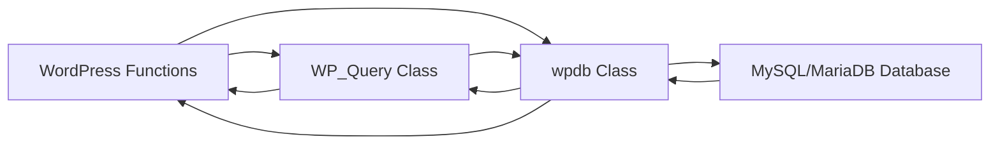

# WordPress Query Optimization

## Introduction

Database queries are often the most significant performance bottleneck in WordPress websites. Every time a page loads, WordPress may execute dozens of database queries to fetch posts, user data, options, and metadata. Understanding how to optimize these queries is crucial for building fast, responsive WordPress websites.

In this guide, we'll explore various techniques for optimizing WordPress database queries, from basic principles to advanced strategies. By the end, you'll have a solid understanding of how WordPress interacts with its database and how to minimize the performance impact of these interactions.

## Understanding WordPress Queries

WordPress uses the `wpdb` class to interact with the database. All queries, whether direct or abstracted through functions like `get_posts()` or `WP_Query`, ultimately execute SQL queries against the MySQL/MariaDB database.

The query process typically looks like this:



### Common Query Issues

Before diving into solutions, let's identify common query-related problems:

1. **Too many queries**: Pages that execute dozens or hundreds of queries
2. **Slow queries**: Individual queries that take a long time to execute
3. **Redundant queries**: The same data being fetched multiple times
4. **Unoptimized queries**: Queries that could be more efficient

## Basic Query Optimization Techniques

### 1. Monitor Your Queries

Before optimizing, you need to understand what's happening. Install a plugin like Query Monitor or Debug Bar to see:
- How many queries are running
- How long each query takes
- Which functions trigger the queries

### 2. Use `WP_Query` Properly

The `WP_Query` class is WordPress's primary way to fetch posts. Using it correctly can dramatically improve performance.

```php
// AVOID: Inefficient query
$posts = get_posts(array(
    'post_type' => 'post',
    'posts_per_page' => -1 // Gets ALL posts!
));

// BETTER: Limit the number of posts
$posts = get_posts(array(
    'post_type' => 'post',
    'posts_per_page' => 10,
    'no_found_rows' => true // Skips counting total rows when pagination isn't needed
));
```

### 3. Select Only What You Need

When using `WP_Query`, request only the fields you need:

```php
// AVOID: Gets all post data when you only need IDs
$query = new WP_Query(array(
    'post_type' => 'product',
    'posts_per_page' => 100
));

// BETTER: Only get IDs if that's all you need
$query = new WP_Query(array(
    'post_type' => 'product',
    'posts_per_page' => 100,
    'fields' => 'ids' // Only retrieves post IDs
));
```

### 4. Avoid `-1` in `posts_per_page`

Setting `posts_per_page` to `-1` retrieves all posts, which can be extremely resource-intensive for sites with thousands of posts:

```php
// AVOID: Could crash your site with enough posts
$query = new WP_Query(array(
    'post_type' => 'post',
    'posts_per_page' => -1
));

// BETTER: Set a reasonable limit
$query = new WP_Query(array(
    'post_type' => 'post',
    'posts_per_page' => 100
));
```

## Intermediate Query Optimization

### 1. Use `no_found_rows` When Possible

When you don't need pagination, set `no_found_rows` to `true` to avoid counting the total number of posts that match your query:

```php
$query = new WP_Query(array(
    'post_type' => 'product',
    'posts_per_page' => 10,
    'no_found_rows' => true // Skip counting total rows
));
```

### 2. Optimize Metadata Queries

Meta queries can be slow, especially when combined with taxonomy queries:

```php
// AVOID: Complex meta_query can be slow
$query = new WP_Query(array(
    'post_type' => 'product',
    'meta_query' => array(
        'relation' => 'AND',
        array(
            'key' => 'color',
            'value' => 'blue',
            'compare' => '='
        ),
        array(
            'key' => 'size',
            'value' => 'large',
            'compare' => '='
        )
    )
));

// BETTER: Use custom tables for frequently filtered data
// or consider using taxonomies instead of post meta for filterable attributes
```

### 3. Cache Query Results

Use the Transients API to cache query results:

```php
function get_featured_products() {
    // Check if the data exists in cache
    $featured_products = get_transient('featured_products');
    
    // If no cache exists, run the query
    if ($featured_products === false) {
        $query = new WP_Query(array(
            'post_type' => 'product',
            'posts_per_page' => 10,
            'meta_key' => 'featured',
            'meta_value' => 'yes'
        ));
        
        $featured_products = $query->posts;
        
        // Cache the result for 12 hours
        set_transient('featured_products', $featured_products, 12 * HOUR_IN_SECONDS);
    }
    
    return $featured_products;
}
```

### 4. Optimize Taxonomy Queries

Taxonomy queries can also impact performance, especially with multiple terms:

```php
// AVOID: Complex tax query without proper indexing
$query = new WP_Query(array(
    'post_type' => 'product',
    'tax_query' => array(
        'relation' => 'AND',
        array(
            'taxonomy' => 'product_category',
            'field' => 'slug',
            'terms' => array('clothing', 'accessories'),
            'operator' => 'IN',
        ),
        array(
            'taxonomy' => 'product_tag',
            'field' => 'slug',
            'terms' => array('sale', 'featured'),
            'operator' => 'IN',
        )
    )
));

// BETTER: Use a single taxonomy query when possible
// or consider merging taxonomies if they're always queried together
```

## Advanced Query Optimization

### 1. Use Object Caching

Implement an object caching system like Redis or Memcached to cache WordPress objects:

```php
// Example of using the object cache
function get_expensive_data($product_id) {
    // Try to get from cache first
    $cache_key = 'product_data_' . $product_id;
    $product_data = wp_cache_get($cache_key);
    
    if (false === $product_data) {
        // Run expensive queries
        $product_data = get_complex_product_data($product_id);
        
        // Cache the result
        wp_cache_set($cache_key, $product_data, 'products', 3600);
    }
    
    return $product_data;
}
```

### 2. Direct Database Access (Use with Caution)

For extremely performance-critical operations, direct SQL can be more efficient:

```php
global $wpdb;

// AVOID: Running in a loop
foreach ($product_ids as $id) {
    $meta = get_post_meta($id, 'price', true);
}

// BETTER: Single query to fetch all values
$product_ids_str = implode(',', array_map('intval', $product_ids));
$prices = $wpdb->get_results(
    "SELECT post_id, meta_value 
    FROM {$wpdb->postmeta} 
    WHERE post_id IN ({$product_ids_str}) 
    AND meta_key = 'price'"
);
```

### 3. Custom Database Tables

For complex data structures that are queried often, consider creating custom tables:

```php
// Example of creating a custom table for product inventory
function create_inventory_table() {
    global $wpdb;
    
    $table_name = $wpdb->prefix . 'product_inventory';
    $charset_collate = $wpdb->get_charset_collate();
    
    $sql = "CREATE TABLE $table_name (
        id mediumint(9) NOT NULL AUTO_INCREMENT,
        product_id mediumint(9) NOT NULL,
        warehouse_id mediumint(9) NOT NULL,
        quantity int NOT NULL,
        last_updated datetime DEFAULT CURRENT_TIMESTAMP NOT NULL,
        PRIMARY KEY  (id),
        KEY product_id (product_id),
        KEY warehouse_id (warehouse_id)
    ) $charset_collate;";
    
    require_once(ABSPATH . 'wp-admin/includes/upgrade.php');
    dbDelta($sql);
}
```

### 4. Optimize Database Indexes

Ensure proper indexes exist for frequently queried fields:

```php
// Example adding an index to postmeta for a frequently used key
function add_custom_index() {
    global $wpdb;
    
    // Check if index exists
    $results = $wpdb->get_results("SHOW INDEX FROM {$wpdb->postmeta} WHERE Key_name = 'meta_key_value'");
    
    if (empty($results)) {
        $wpdb->query("ALTER TABLE {$wpdb->postmeta} ADD INDEX meta_key_value (meta_key, meta_value(32))");
    }
}
```

## Real-world Example: Building an Optimized Product Listing

Let's put these concepts together in a real-world example. Imagine we're building a product listing page with filtering options:

```php
function get_optimized_products($args = array()) {
    // Set cache key based on query args
    $cache_key = 'product_listing_' . md5(serialize($args));
    
    // Try to get from cache
    $products = wp_cache_get($cache_key, 'product_listings');
    
    if (false === $products) {
        // Default query args
        $default_args = array(
            'post_type' => 'product',
            'posts_per_page' => 24,
            'no_found_rows' => !isset($args['paged']), // Skip counting if pagination not needed
            'fields' => 'ids', // We'll fetch full data in an optimized way
            'orderby' => 'date',
            'order' => 'DESC',
        );
        
        // Merge with user args
        $query_args = wp_parse_args($args, $default_args);
        
        // Run the query
        $query = new WP_Query($query_args);
        
        if (!empty($query->posts)) {
            // Get all product data in batched queries
            $products = array();
            
            // Get post data in a single query
            $post_data = get_posts(array(
                'post__in' => $query->posts,
                'posts_per_page' => -1,
                'post_type' => 'product',
                'orderby' => 'post__in' // Preserve original order
            ));
            
            // Get all meta in a single query
            global $wpdb;
            $post_ids_str = implode(',', $query->posts);
            $meta_data = $wpdb->get_results("
                SELECT post_id, meta_key, meta_value 
                FROM {$wpdb->postmeta} 
                WHERE post_id IN ({$post_ids_str}) 
                AND meta_key IN ('price', 'sku', 'stock_status')
            ");
            
            // Organize meta by post ID
            $meta_by_post = array();
            foreach ($meta_data as $meta) {
                $meta_by_post[$meta->post_id][$meta->meta_key] = $meta->meta_value;
            }
            
            // Build the final product objects
            foreach ($post_data as $post) {
                $product = array(
                    'id' => $post->ID,
                    'title' => $post->post_title,
                    'link' => get_permalink($post->ID),
                    'price' => isset($meta_by_post[$post->ID]['price']) ? $meta_by_post[$post->ID]['price'] : '',
                    'sku' => isset($meta_by_post[$post->ID]['sku']) ? $meta_by_post[$post->ID]['sku'] : '',
                    'in_stock' => isset($meta_by_post[$post->ID]['stock_status']) && $meta_by_post[$post->ID]['stock_status'] === 'instock'
                );
                
                $products[] = $product;
            }
            
            // Cache the results for 1 hour
            wp_cache_set($cache_key, $products, 'product_listings', HOUR_IN_SECONDS);
        } else {
            $products = array();
        }
    }
    
    return $products;
}

// Usage:
$products = get_optimized_products(array(
    'tax_query' => array(
        array(
            'taxonomy' => 'product_category',
            'field' => 'slug',
            'terms' => 'electronics'
        )
    ),
    'paged' => get_query_var('paged', 1)
));

// Display products
foreach ($products as $product) {
    echo '<div class="product">';
    echo '<h3>' . esc_html($product['title']) . '</h3>';
    echo '<p>Price: $' . esc_html($product['price']) . '</p>';
    echo '<p>SKU: ' . esc_html($product['sku']) . '</p>';
    echo '<p>' . ($product['in_stock'] ? 'In Stock' : 'Out of Stock') . '</p>';
    echo '</div>';
}
```

## Measuring Performance Improvements

After implementing optimizations, it's important to measure their impact:

1. **Query Count**: Monitor the number of queries before and after optimization
2. **Query Time**: Measure the total and individual query execution times
3. **Page Load Time**: Check overall page load time improvements
4. **Server Resource Usage**: Monitor CPU and memory usage during peak loads

Here's a simple way to measure query performance:

```php
function measure_query_performance($callback, $args = array()) {
    global $wpdb;
    
    // Record starting stats
    $starting_query_count = $wpdb->num_queries;
    $starting_time = microtime(true);
    
    // Run the callback function
    $result = call_user_func($callback, $args);
    
    // Calculate differences
    $query_count = $wpdb->num_queries - $starting_query_count;
    $execution_time = microtime(true) - $starting_time;
    
    return array(
        'result' => $result,
        'query_count' => $query_count,
        'execution_time' => $execution_time
    );
}

// Usage:
$performance = measure_query_performance('get_optimized_products', array('posts_per_page' => 10));
echo "Executed {$performance['query_count']} queries in {$performance['execution_time']} seconds";
```

## Summary

Optimizing WordPress queries is both an art and a science. The key takeaways from this guide include:

1. **Monitor your queries** to understand what's happening under the hood
2. **Retrieve only what you need** by using appropriate parameters
3. **Cache aggressively** to avoid unnecessary database hits
4. **Structure your data smartly**, sometimes using custom tables for complex data
5. **Always measure performance** before and after optimizations

By implementing these strategies, you can dramatically improve your WordPress site's performance, reducing server load and providing a better user experience.

## Additional Resources

- [WordPress Developer Documentation on WP_Query](https://developer.wordpress.org/reference/classes/wp_query/)
- [WordPress Transients API](https://developer.wordpress.org/apis/handbook/transients/)
- [Query Monitor Plugin](https://wordpress.org/plugins/query-monitor/)
- [Database Optimization in WordPress](https://wordpress.org/support/article/optimization-database/)

## Practice Exercises

1. Analyze your website's most visited page with Query Monitor and identify the slowest queries
2. Implement transient caching for a resource-intensive query on your site
3. Refactor a query that uses `posts_per_page => -1` to use pagination or a reasonable limit
4. Optimize a complex meta query by either implementing proper indexing or restructuring the data model
5. Set up object caching using Redis or Memcached and measure the performance impact

Remember that query optimization is an ongoing process. As your site grows, continue to monitor and refine your approach to maintain optimal performance!