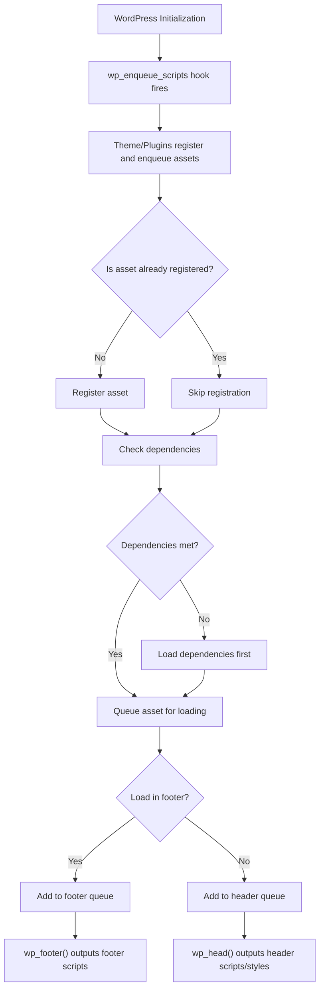

# WordPress Asset Loading

## Introduction

When building WordPress themes or plugins, properly loading your assets (JavaScript and CSS files) is crucial for maintaining good performance. WordPress provides a standardized way to include these files through its **Enqueue System**, which helps prevent duplicate loading, manage dependencies, and control the loading sequence.

In this guide, we'll explore how WordPress handles asset loading, best practices for including scripts and styles, and techniques to optimize your site's performance.

## Why Proper Asset Loading Matters

Before diving into the technical details, let's understand why proper asset loading is important:

1. **Performance**: Improper loading can lead to render-blocking resources, slow page loads, and poor user experience
2. **Conflicts**: Scripts loaded incorrectly may conflict with each other or WordPress core
3. **Maintainability**: Following WordPress conventions makes your code more maintainable
4. **Compatibility**: Proper asset loading ensures better compatibility across different WordPress setups

## The WordPress Enqueue System

WordPress provides a set of functions to properly register and enqueue assets:

- `wp_register_script()` and `wp_register_style()` - Register scripts/styles for later use
- `wp_enqueue_script()` and `wp_enqueue_style()` - Add scripts/styles to the loading queue
- `wp_dequeue_script()` and `wp_dequeue_style()` - Remove scripts/styles from the queue

### Registering vs. Enqueuing

**Registering** an asset means telling WordPress about it without actually loading it yet. This is useful when you want to set up scripts/styles that may be used conditionally.

**Enqueuing** tells WordPress to actually include the asset in the page.

## Enqueuing Scripts and Styles

### Basic Script Enqueuing

Here's how to properly add a JavaScript file to your WordPress site:

```php
function my_theme_enqueue_scripts() {
    wp_enqueue_script(
        'my-custom-script',                     // Handle (unique identifier)
        get_template_directory_uri() . '/js/custom.js', // File path
        array('jquery'),                        // Dependencies
        '1.0.0',                                // Version
        true                                    // Load in footer?
    );
}
add_action('wp_enqueue_scripts', 'my_theme_enqueue_scripts');
```

### Basic Style Enqueuing

Similarly, here's how to add a CSS file:

```php
function my_theme_enqueue_styles() {
    wp_enqueue_style(
        'my-custom-style',                      // Handle
        get_template_directory_uri() . '/css/style.css', // File path
        array(),                                // Dependencies
        '1.0.0'                                 // Version
    );
}
add_action('wp_enqueue_scripts', 'my_theme_enqueue_styles');
```

## Understanding Hook Timing

It's essential to use the correct hook when enqueuing assets:

- `wp_enqueue_scripts` - For front-end scripts and styles
- `admin_enqueue_scripts` - For admin area scripts and styles
- `login_enqueue_scripts` - For login page scripts and styles

## Managing Dependencies

One of the major benefits of WordPress's enqueue system is dependency management. You can specify which scripts your asset depends on:

```php
wp_enqueue_script(
    'my-chart-script',
    get_template_directory_uri() . '/js/charts.js',
    array('jquery', 'chart-js'),  // This script depends on jQuery and chart.js
    '1.0.0',
    true
);
```

WordPress will automatically ensure that jQuery and chart.js are loaded before your script.

## Conditional Loading

For better performance, you should only load assets when they're actually needed:

```php
function my_conditional_assets() {
    // Only load the contact form script on the contact page
    if (is_page('contact')) {
        wp_enqueue_script(
            'contact-form-validator',
            get_template_directory_uri() . '/js/form-validation.js',
            array('jquery'),
            '1.0.0',
            true
        );
    }
    
    // Only load the slider on the homepage
    if (is_front_page()) {
        wp_enqueue_script('slider-script', ...);
        wp_enqueue_style('slider-style', ...);
    }
}
add_action('wp_enqueue_scripts', 'my_conditional_assets');
```

## Passing Data from PHP to JavaScript

Often you need to pass dynamic data from PHP to your JavaScript files. WordPress provides `wp_localize_script()` for this purpose:

```php
function enqueue_with_data() {
    wp_enqueue_script(
        'my-ajax-script',
        get_template_directory_uri() . '/js/ajax-handler.js',
        array('jquery'),
        '1.0.0',
        true
    );
    
    // Pass data to the script
    wp_localize_script(
        'my-ajax-script',
        'myAjaxData',          // JavaScript object name
        array(
            'ajaxUrl' => admin_url('admin-ajax.php'),
            'nonce' => wp_create_nonce('my_ajax_nonce'),
            'siteUrl' => get_site_url(),
            'userId' => get_current_user_id()
        )
    );
}
add_action('wp_enqueue_scripts', 'enqueue_with_data');
```

In your JavaScript file, you can then access this data using the `myAjaxData` object:

```javascript
// Inside ajax-handler.js
jQuery(document).ready(function($) {
    console.log(myAjaxData.userId);
    
    $.ajax({
        url: myAjaxData.ajaxUrl,
        type: 'POST',
        data: {
            action: 'my_action',
            nonce: myAjaxData.nonce,
            // other data...
        },
        success: function(response) {
            // Handle response
        }
    });
});
```

## Advanced Asset Optimization Techniques

### 1. Script Attributes

You can add attributes to your script tags like `async` or `defer` using the `script_loader_tag` filter:

```php
function add_async_attribute($tag, $handle, $src) {
    // Add async to specific scripts
    if ('my-async-script' === $handle) {
        return str_replace(' src', ' async src', $tag);
    }
    // Add defer to specific scripts
    if ('my-defer-script' === $handle) {
        return str_replace(' src', ' defer src', $tag);
    }
    return $tag;
}
add_filter('script_loader_tag', 'add_async_attribute', 10, 3);
```

### 2. Preloading Critical Assets

Preloading can improve performance for critical assets:

```php
function add_preload_links() {
    echo '<link rel="preload" href="' . get_template_directory_uri() . '/fonts/custom-font.woff2" as="font" type="font/woff2" crossorigin>';
    echo '<link rel="preload" href="' . get_template_directory_uri() . '/css/critical.css" as="style">';
}
add_action('wp_head', 'add_preload_links', 1);
```

### 3. Using WordPress's Built-in Libraries

WordPress includes many JavaScript libraries. Use these when possible instead of adding your own copies:

```php
function use_wordpress_libraries() {
    // jQuery UI components
    wp_enqueue_script('jquery-ui-datepicker');
    
    // Media uploader
    wp_enqueue_media();
    
    // Color picker
    wp_enqueue_script('wp-color-picker');
    wp_enqueue_style('wp-color-picker');
}
add_action('wp_enqueue_scripts', 'use_wordpress_libraries');
```

## Performance Considerations

### 1. Scripts in Footer

Loading non-critical JavaScript in the footer can improve page load times. The last parameter of `wp_enqueue_script()` controls this:

```php
wp_enqueue_script('my-script', 'path/to/script.js', array(), '1.0.0', true); // true = footer
```

### 2. Using Minified Versions

Always use minified versions of scripts and styles in production:

```php
// Development vs. Production asset loading
$suffix = (defined('SCRIPT_DEBUG') && SCRIPT_DEBUG) ? '' : '.min';
wp_enqueue_script('my-script', "path/to/script{$suffix}.js", array(), '1.0.0', true);
```

### 3. Version Control for Cache Busting

Always include a version parameter to ensure updates are loaded when you change your files:

```php
// Dynamic version based on file modification time
$version = filemtime(get_template_directory() . '/css/style.css');
wp_enqueue_style('my-style', get_template_directory_uri() . '/css/style.css', array(), $version);
```

## Real-world Example: Complete Theme Asset Loading

Here's a comprehensive example of asset loading for a WordPress theme:

```php
/**
 * Enqueue theme scripts and styles
 */
function mytheme_enqueue_assets() {
    // Theme version for cache busting
    $theme_version = wp_get_theme()->get('Version');
    
    // CSS files
    wp_enqueue_style(
        'mytheme-main',
        get_template_directory_uri() . '/css/main.css',
        array(),
        $theme_version
    );
    
    // Load conditional CSS
    if (is_singular() && comments_open() && get_option('thread_comments')) {
        wp_enqueue_style('mytheme-comments', get_template_directory_uri() . '/css/comments.css');
    }
    
    // JS files - core functionality in the head
    wp_enqueue_script(
        'mytheme-core',
        get_template_directory_uri() . '/js/core.js',
        array(),
        $theme_version,
        false // Load in head
    );
    
    // Non-essential scripts in footer
    wp_enqueue_script(
        'mytheme-main',
        get_template_directory_uri() . '/js/main.js',
        array('jquery'),
        $theme_version,
        true // Load in footer
    );
    
    // Only load slider on homepage
    if (is_front_page()) {
        wp_enqueue_style('mytheme-slider', get_template_directory_uri() . '/css/slider.css');
        wp_enqueue_script(
            'mytheme-slider', 
            get_template_directory_uri() . '/js/slider.js',
            array('jquery'),
            $theme_version,
            true
        );
    }
    
    // Pass data to JavaScript
    wp_localize_script(
        'mytheme-main',
        'mythemeData',
        array(
            'ajaxUrl' => admin_url('admin-ajax.php'),
            'homeUrl' => home_url(),
            'isLoggedIn' => is_user_logged_in(),
            'themeSettings' => array(
                'enableAnimations' => get_theme_mod('enable_animations', true),
                'colorScheme' => get_theme_mod('color_scheme', 'light')
            )
        )
    );
    
    // Conditionally add comment reply script
    if (is_singular() && comments_open() && get_option('thread_comments')) {
        wp_enqueue_script('comment-reply');
    }
}
add_action('wp_enqueue_scripts', 'mytheme_enqueue_assets');

/**
 * Enqueue admin scripts and styles
 */
function mytheme_admin_assets($hook) {
    // Only load on specific admin pages
    if ($hook !== 'appearance_page_theme-options') {
        return;
    }
    
    wp_enqueue_style('mytheme-admin', get_template_directory_uri() . '/css/admin.css');
    wp_enqueue_script('mytheme-admin', get_template_directory_uri() . '/js/admin.js', array('jquery'), '1.0', true);
    
    // Add color picker
    wp_enqueue_style('wp-color-picker');
    wp_enqueue_script('wp-color-picker');
}
add_action('admin_enqueue_scripts', 'mytheme_admin_assets');
```

## Asset Loading Process Flow

To better understand the WordPress asset loading process:



## Common Mistakes to Avoid

1. **Direct inclusion**: Never use `<script>` or `<link>` tags directly in your theme files
2. **Duplicate enqueuing**: Check if a script is already enqueued before adding it
3. **Missing dependencies**: Ensure all required scripts are available
4. **Incorrect hook timing**: Use the appropriate action hook for the context
5. **Forgetting version numbers**: Always include version numbers for cache control
6. **Loading everything everywhere**: Only load assets on pages where they're needed

## Summary

Proper asset loading in WordPress is critical for site performance and maintainability. By using the WordPress enqueue system, you can:

- Ensure scripts and styles load in the correct order
- Avoid conflicts and duplications
- Optimize loading based on page context
- Pass data seamlessly between PHP and JavaScript
- Implement advanced performance techniques

Following the WordPress asset loading best practices helps create faster, more efficient websites while maintaining compatibility with themes, plugins, and future WordPress updates.

## Additional Resources

- [WordPress Developer Handbook: Script and Style Loading](https://developer.wordpress.org/themes/basics/including-css-javascript/)
- [WordPress Function Reference: wp_enqueue_script](https://developer.wordpress.org/reference/functions/wp_enqueue_script/)
- [WordPress Function Reference: wp_enqueue_style](https://developer.wordpress.org/reference/functions/wp_enqueue_style/)
- [WordPress Function Reference: wp_localize_script](https://developer.wordpress.org/reference/functions/wp_localize_script/)

## Practice Exercises

1. Create a function to conditionally load a JavaScript file only on single posts that have the category "featured"
2. Write code to properly handle loading both development (unminified) and production (minified) versions of your assets
3. Implement a system to preload critical fonts and CSS files for your theme
4. Create a script that depends on jQuery UI Datepicker and passes configuration options via wp_localize_script