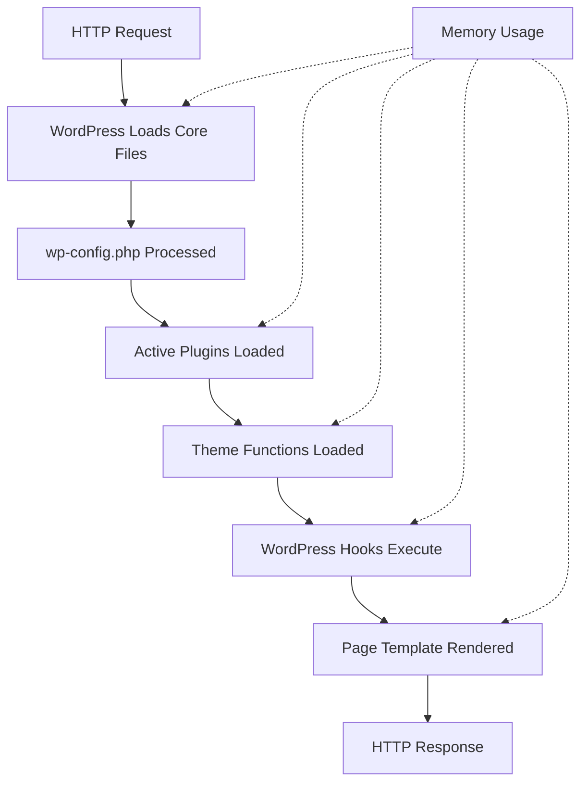

# WordPress PHP Memory

## Introduction

PHP memory management is a crucial aspect of WordPress performance optimization. When your WordPress site grows with plugins, complex themes, or high traffic, it can easily exhaust the allocated PHP memory, leading to the dreaded "Fatal error: Allowed memory size exhausted" message. This guide will help you understand how PHP memory works in WordPress, how to diagnose memory issues, and implement solutions to prevent memory-related crashes.

## Understanding PHP Memory in WordPress

PHP, like any programming language, requires memory to execute scripts. WordPress, being a PHP application, needs sufficient memory to process requests, load plugins, render pages, and handle various operations.

### What is PHP Memory Limit?

The PHP memory limit defines the maximum amount of memory a PHP script is allowed to consume. This limit is set to prevent individual scripts from consuming all available server resources, which could crash the server or affect other websites hosted on the same server.

By default, many hosting providers set the PHP memory limit to 64MB or 128MB. However, WordPress often requires more memory, especially with multiple plugins and a feature-rich theme.

## Diagnosing Memory Issues

### Common Symptoms of Memory Issues

1. **White screen of death (WSOD)** - Page displays nothing
2. **Fatal error messages** - Explicit memory exhaustion errors
3. **Partial page loads** - Only part of the page renders
4. **Admin panel crashes** - Dashboard becomes inaccessible
5. **Plugin/theme activation failures** - New components can't be activated

### How to Check Your Current Memory Limit

You can check your current PHP memory limit in several ways:

#### Method 1: Using WordPress Site Health

1. Navigate to `Tools` > `Site Health`
2. Click on the `Info` tab
3. Look for the `Server` section and find the PHP memory limit

#### Method 2: Using a Custom PHP Script

Create a file named `memory-check.php` with the following content:

```php
<?php
// Check memory limit
echo 'Current PHP memory limit: ' . ini_get('memory_limit') . '<br />';

// Check memory usage
echo 'Current memory usage: ' . size_format(memory_get_usage(), 2) . '<br />';

// Check peak memory usage
echo 'Peak memory usage: ' . size_format(memory_get_peak_usage(), 2);
?>
```

Upload this file to your WordPress root directory and access it through your browser.

#### Method 3: Using a Plugin

Install and activate a plugin like "Query Monitor" which displays the PHP memory limit and usage statistics in its interface.

## Increasing PHP Memory Limit in WordPress

When you determine that your WordPress site needs more memory, here are several methods to increase the PHP memory limit:

### Method 1: Edit wp-config.php

The most common method is to add the following line to your `wp-config.php` file before the line that says "That's all, stop editing!":

```php
define('WP_MEMORY_LIMIT', '256M');
```

This sets the memory limit to 256MB for the WordPress application. You can adjust the value based on your needs.

For the WordPress admin area, which often requires more memory, you can add:

```php
define('WP_MAX_MEMORY_LIMIT', '512M');
```

### Method 2: Edit php.ini File

If you have access to your server's `php.ini` file, you can modify the memory limit directly:

```
memory_limit = 256M
```

If you don't have direct access to the main `php.ini`, many hosting providers allow you to create a custom `php.ini` file in your website's root directory.

### Method 3: Create or Edit .htaccess File

For Apache servers, you can modify the `.htaccess` file in your WordPress root directory by adding:

```
php_value memory_limit 256M
```

### Method 4: Create a PHP.ini File in wp-admin

Sometimes, memory issues only occur in the admin area. Create a `php.ini` file in your `wp-admin` folder with:

```
memory_limit = 256M
```

## Real-world Example: Troubleshooting a Memory Error

Let's walk through a practical example of diagnosing and fixing a WordPress memory issue:

### Scenario

Your client reports that they cannot upload large images to their WordPress site and are seeing an error message:

```
Fatal error: Allowed memory size of 67108864 bytes exhausted (tried to allocate 32768 bytes)
```

### Step-by-Step Diagnosis and Solution

1. **Calculate the current memory limit**: 67108864 bytes = 64MB (which is quite low for WordPress)

2. **Check if the site is on shared hosting**: Many shared hosts limit memory usage

3. **Implement a solution**: Edit the `wp-config.php` file to increase memory:

```php
// Before
// No WP_MEMORY_LIMIT defined

// After
define('WP_MEMORY_LIMIT', '256M');
define('WP_MAX_MEMORY_LIMIT', '512M');
```

4. **Test the solution**: Upload the large image again to verify the fix works

5. **Monitor memory usage**: Use Query Monitor plugin to ensure memory usage stays at acceptable levels

## Advanced Memory Optimization Techniques

Increasing the memory limit is often just a temporary solution. For long-term performance, consider these optimization techniques:

### 1. Identify Memory-Hungry Plugins

```php
<?php
function check_plugin_memory_usage() {
    if ( !is_admin() || !current_user_can('administrator') ) return;
    
    $baseline = memory_get_usage();
    echo "Baseline memory usage: " . size_format($baseline, 2) . "<br />";
    
    $active_plugins = get_option('active_plugins');
    foreach ($active_plugins as $plugin) {
        $plugin_data = get_plugin_data(WP_PLUGIN_DIR . '/' . $plugin);
        $before = memory_get_usage();
        include_once(WP_PLUGIN_DIR . '/' . $plugin);
        $after = memory_get_usage();
        $usage = $after - $before;
        echo $plugin_data['Name'] . " uses approximately " . size_format($usage, 2) . " of memory<br />";
    }
}
// Call this function in a debugging script
?>
```

### 2. Object Caching Implementation

WordPress can use object caching to store database query results and reduce memory usage:

```php
// Example of implementing object caching in a custom function
function get_expensive_data($id) {
    // Try to get from cache first
    $cached_data = wp_cache_get('expensive_data_' . $id, 'my_plugin');
    
    if (false !== $cached_data) {
        return $cached_data;
    }
    
    // If not in cache, compute the expensive operation
    $data = perform_expensive_operation($id);
    
    // Store in cache for future use
    wp_cache_set('expensive_data_' . $id, $data, 'my_plugin', 3600); // Cache for 1 hour
    
    return $data;
}
```

### 3. Code Optimization Practices

Here are some general principles for writing memory-efficient WordPress code:

```php
// Bad practice - loads all posts into memory
$all_posts = get_posts(array('posts_per_page' => -1));

// Good practice - paginate results
$paged_posts = get_posts(array('posts_per_page' => 10, 'paged' => get_query_var('paged')));

// Bad practice - storing large arrays in options
update_option('my_huge_array', $huge_array);

// Good practice - store large data in transients with expiration
set_transient('my_huge_array', $huge_array, 24 * HOUR_IN_SECONDS);
```

## Understanding Memory Flow in WordPress

The following diagram illustrates how memory is allocated and used during a WordPress request:



## Common Misconceptions about WordPress Memory

1. **More memory is always better** - While increasing memory can solve immediate issues, it doesn't address underlying inefficiencies and can mask problems.

2. **Memory limit errors mean you need more memory** - Sometimes the issue is an inefficient plugin or theme, not insufficient memory.

3. **Memory optimization is only for large sites** - Even small sites benefit from efficient memory usage, especially on shared hosting.

## Summary

Managing PHP memory in WordPress requires understanding both the technical limits of your hosting environment and the specific needs of your WordPress installation. By properly configuring memory limits, monitoring memory usage, and implementing optimization techniques, you can prevent memory-related crashes and improve the overall performance of your WordPress site.

Key points to remember:
- Default PHP memory limits are often too low for WordPress sites with multiple plugins
- Memory issues manifest as white screens, fatal errors, or partial page loads
- Several methods exist to increase memory limits, with wp-config.php being the most common
- Long-term solutions include identifying memory-hungry plugins and optimizing code
- Efficient coding practices are better than continuously increasing memory limits

## Additional Resources

- WordPress Codex entry on [Increasing memory allocated to PHP](https://wordpress.org/support/article/editing-wp-config-php/#increasing-memory-allocated-to-php)
- Query Monitor plugin for real-time performance monitoring
- New Relic or similar APM tools for detailed performance insights
- PHP documentation on [memory_limit directive](https://www.php.net/manual/en/ini.core.php#ini.memory-limit)

## Exercises

1. Check your WordPress site's current PHP memory limit using the Site Health tool.
2. Create a backup of your site, then try increasing the memory limit in wp-config.php.
3. Install Query Monitor plugin and identify the top memory-consuming plugins on your site.
4. Review your theme's functions.php file for inefficient code that might cause memory issues.
5. Implement object caching for a resource-intensive operation in your custom plugin or theme.