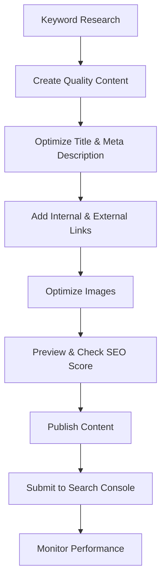

# WordPress SEO Fundamentals

## Introduction

Search Engine Optimization (SEO) is a crucial aspect of any successful website. When implemented correctly, good SEO practices help your WordPress site rank higher in search engine results pages (SERPs), driving more organic traffic to your content.

WordPress is inherently quite SEO-friendly, but understanding and applying specific optimization techniques can significantly improve your site's visibility. In this guide, we'll cover the fundamental concepts of WordPress SEO that every beginner should know.

## Why SEO Matters for WordPress Sites

Before diving into the technical aspects, let's understand why SEO is essential for your WordPress website:

1. **Increased Visibility**: Higher rankings mean more visibility for your content.
2. **Organic Traffic**: Better SEO leads to more visitors coming to your site naturally through search engines.
3. **Credibility**: Sites that appear on the first page of search results are often perceived as more trustworthy.
4. **Cost-Effective Marketing**: Unlike paid advertising, organic search traffic doesn't require ongoing payment.

## Setting Up SEO in WordPress

### Installing an SEO Plugin

The easiest way to handle WordPress SEO is by using a dedicated plugin. Two of the most popular options are:

1. Yoast SEO
2. All in One SEO Pack

Let's look at how to install and set up Yoast SEO:

```
// This is not actual code but steps to follow
1. Go to Plugins > Add New in your WordPress dashboard
2. Search for "Yoast SEO"
3. Click "Install Now" and then "Activate"
```

Once installed, you'll find a new "SEO" menu in your WordPress dashboard.

### Configuring Basic SEO Settings

After installing your SEO plugin, it's important to configure basic settings:

1. **Site Title & Tagline**: Go to Settings > General and ensure your site title and tagline are descriptive and contain relevant keywords.
2. **Permalinks Structure**: Navigate to Settings > Permalinks and choose a search-engine-friendly URL structure. The "Post name" option (e.g., `example.com/sample-post/`) is typically the most SEO-friendly.

```
// Example of good vs. bad permalink structures

// Not SEO-friendly:
example.com/?p=123

// SEO-friendly:
example.com/how-to-optimize-wordpress-seo/
```

## On-Page SEO Fundamentals

### Keyword Research

Before creating content, you need to identify keywords that:
- Your target audience is searching for
- Are relevant to your content
- Have reasonable search volume
- Have manageable competition

Tools like Google Keyword Planner, Ubersuggest, or Ahrefs can help you find appropriate keywords.

### Title Tags and Meta Descriptions

Title tags and meta descriptions are crucial elements that appear in search results:

```html
<title>WordPress SEO Fundamentals | Your Site Name</title>
<meta name="description" content="Learn essential WordPress SEO techniques to improve your site's search engine rankings and drive more organic traffic." />
```

With Yoast SEO, you can edit these elements directly in the post editor:

![Yoast SEO meta box in WordPress editor]

The plugin will also provide feedback on your title and description length and other optimization aspects.

### Content Optimization

When creating content, follow these SEO best practices:

1. **Use your focus keyword in strategic locations**:
   - First paragraph
   - At least one heading (H2 or H3)
   - Throughout the content (but avoid keyword stuffing)
   - Image alt text

2. **Create quality, comprehensive content**:
   - Aim for at least 300 words for basic posts
   - Cover topics thoroughly
   - Provide value to readers

3. **Use proper heading structure**:
   - H1 for the main title (usually handled by your theme)
   - H2 for main sections
   - H3 for subsections

```jsx
// Example of proper HTML heading structure
<h1>WordPress SEO Fundamentals</h1>
  <h2>On-Page SEO Elements</h2>
    <h3>Title Tags Optimization</h3>
    <h3>Meta Descriptions</h3>
  <h2>Technical SEO Aspects</h2>
    <h3>Site Speed</h3>
    <h3>Mobile Optimization</h3>
```

### Image Optimization

Images contribute significantly to SEO when optimized properly:

1. **Use descriptive filenames**: `wordpress-seo-dashboard.jpg` instead of `IMG001.jpg`
2. **Add alt text**: Describe the image with relevant keywords
3. **Reduce file size**: Compress images before uploading to improve loading speed

```jsx
// Example of properly optimized image in HTML

```

In WordPress, you can add alt text when uploading images to the Media Library.

## Technical SEO for WordPress

### XML Sitemaps

A sitemap helps search engines discover and index your content. Most SEO plugins automatically generate and submit sitemaps:

1. Yoast SEO creates a sitemap at `yourdomain.com/sitemap_index.xml`
2. You can verify it's working by visiting that URL

### Robots.txt

The robots.txt file tells search engines which parts of your site to crawl and which to ignore:

```
User-agent: *
Disallow: /wp-admin/
Disallow: /wp-includes/
Allow: /wp-admin/admin-ajax.php

Sitemap: https://yourdomain.com/sitemap_index.xml
```

Most SEO plugins help you configure this file without editing it manually.

### Page Speed Optimization

Google considers page speed as a ranking factor. To improve your WordPress site speed:

1. **Use a caching plugin** like WP Rocket, W3 Total Cache, or WP Super Cache
2. **Optimize images** as mentioned earlier
3. **Minify CSS and JavaScript** files
4. **Use a Content Delivery Network (CDN)** like Cloudflare

You can test your site speed using tools like Google PageSpeed Insights or GTmetrix.

### Mobile Optimization

With Google's mobile-first indexing, your site must perform well on mobile devices:

1. Use a responsive WordPress theme
2. Test your site on various screen sizes
3. Ensure text is readable without zooming
4. Make sure touch elements have adequate spacing

You can test mobile-friendliness using Google's Mobile-Friendly Test tool.

## Internal and External Linking

### Internal Linking Strategy

Internal links help search engines understand your site structure and discover new content:

1. Link related content within your posts
2. Use descriptive anchor text
3. Create cornerstone content and link to it from related articles

```jsx
// Example of good internal linking
<p>To learn more about this topic, check out our guide on <a href="/wordpress-seo-advanced-techniques/">advanced WordPress SEO techniques</a>.</p>
```

### External Linking Best Practices

Linking to reputable external sources can boost your SEO:

1. Link to authoritative websites relevant to your content
2. Use descriptive anchor text
3. Consider whether links should open in new tabs (add `target="_blank" rel="noopener noreferrer"`)

## Monitoring SEO Performance

### Google Search Console Integration

Google Search Console provides valuable insights about your site's performance in search:

1. Sign up for Google Search Console
2. Verify your site ownership (your SEO plugin usually helps with this)
3. Submit your sitemap
4. Regularly check for:
   - Search performance
   - Indexing issues
   - Mobile usability problems
   - Security issues

### Basic SEO Analytics

To track your SEO success:

1. Install Google Analytics on your WordPress site
2. Monitor key metrics:
   - Organic traffic
   - Bounce rate
   - Average session duration
   - Conversion rates from organic traffic

Most SEO plugins offer integration with these tools, making setup easier.

## SEO Workflow for New Content

Here's a practical workflow to follow when publishing new content:



## Common WordPress SEO Mistakes to Avoid

1. **Using a non-SEO-friendly theme**: Choose themes that follow SEO best practices
2. **Ignoring mobile optimization**: Ensure your site works well on all devices
3. **Duplicating content**: Avoid publishing similar content on multiple pages
4. **Neglecting image optimization**: Always compress images and add alt text
5. **Using generic permalinks**: Customize URLs to include relevant keywords
6. **Setting up WordPress incorrectly**: Ensure your site is visible to search engines

## Summary

WordPress SEO is about optimizing multiple aspects of your website to improve its visibility in search engines. By following these fundamentals, you'll create a strong foundation for your WordPress site's SEO:

1. Install and configure an SEO plugin like Yoast SEO
2. Optimize your content with proper keywords, titles, and meta descriptions
3. Implement technical SEO best practices like sitemaps and robots.txt configuration
4. Focus on page speed and mobile optimization
5. Develop a strategic internal linking structure
6. Monitor performance through Google Search Console and Analytics

Remember that SEO is a long-term strategy. Results won't appear overnight, but consistent application of these fundamentals will gradually improve your rankings and organic traffic.

## Additional Resources

To further develop your WordPress SEO skills, consider exploring these resources:

- Google's SEO Starter Guide
- WordPress.org's SEO documentation
- Yoast SEO's knowledge base
- Moz's Beginner's Guide to SEO

## Practice Exercises

1. Install an SEO plugin on your WordPress site and complete the basic setup
2. Conduct keyword research for your next blog post
3. Optimize an existing post following the guidelines in this tutorial
4. Set up Google Search Console and submit your sitemap
5. Analyze your site's mobile-friendliness and page speed, then make improvements based on the results

By consistently applying these WordPress SEO fundamentals, you'll be well on your way to improving your site's search engine visibility and driving more organic traffic.