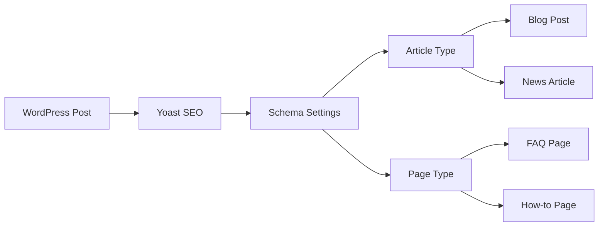

# WordPress On-Page SEO

On-page SEO refers to the practice of optimizing individual pages of your WordPress website to rank higher in search engines and attract more relevant traffic. Unlike technical SEO that focuses on your site's infrastructure or off-page SEO that deals with external factors, on-page SEO is about optimizing content and HTML source code that you have direct control over.

## Why On-Page SEO Matters for Your WordPress Site

Before diving into the techniques, let's understand why on-page SEO is crucial:

- It helps search engines understand your content better
- It improves your chances of ranking for target keywords
- It enhances user experience, which indirectly affects rankings
- It's entirely within your control, unlike many off-page factors

## Essential On-Page SEO Elements for WordPress

### 1. Title Tags Optimization

Title tags are HTML elements that specify the title of a web page. They appear in browser tabs, search engine results, and social shares.

In WordPress, your title tag is typically determined by your theme and the title you give your post or page. Most SEO plugins allow you to customize this separately.

**How to optimize title tags:**

- Include your primary keyword near the beginning
- Keep titles under 60 characters to prevent truncation in search results
- Make titles compelling to encourage clicks
- Ensure each page has a unique title

**Example using Yoast SEO Plugin:**

```html
<!-- Original WordPress title -->
<title>My Blog Post Title - My WordPress Site</title>

<!-- Optimized title using Yoast SEO -->
<title>Best WordPress SEO Techniques for Beginners (2023 Guide)</title>
```

### 2. Meta Descriptions

While meta descriptions aren't a direct ranking factor, they influence click-through rates from search results, which indirectly affects SEO.

**Best practices for meta descriptions:**

- Keep them between 150-160 characters
- Include your target keyword naturally
- Add a compelling call-to-action
- Make each description unique and relevant to the page content

**Example using Rank Math plugin:**

```jsx
// In the WordPress editor with Rank Math installed
// Navigate to the Rank Math meta box below your post editor

// Default meta description often pulls from your first paragraph
// Custom optimized meta description:
"Learn proven WordPress on-page SEO techniques to boost your search rankings. This step-by-step guide covers everything beginners need to optimize their content."
```

### 3. Header Tags (H1, H2, H3...)

Header tags structure your content hierarchically, making it easier for both users and search engines to understand your content.

**Header tag optimization tips:**

- Use only one H1 tag per page (typically your post/page title)
- Include keywords in your H2 and H3 subheadings where natural
- Structure content logically with nested headings
- Use headings to break up text and improve readability

**Example of proper heading structure:**

```html
<h1>WordPress On-Page SEO Guide</h1>
  <h2>Understanding Title Tag Optimization</h2>
    <h3>How to Edit Title Tags in WordPress</h3>
    <h3>Common Title Tag Mistakes</h3>
  <h2>Creating Effective Meta Descriptions</h2>
    <h3>Tools for Writing Compelling Descriptions</h3>
  <h2>Content Optimization Strategies</h2>
```

### 4. URL Structure

WordPress allows you to customize your permalink structure for SEO benefits.

**URL optimization best practices:**

- Keep URLs short and descriptive
- Include your primary keyword
- Use hyphens to separate words
- Avoid unnecessary parameters or numbers

**How to set SEO-friendly permalinks in WordPress:**

1. Go to Settings > Permalinks
2. Select "Post name" structure or create a custom structure
3. Save changes

**Before optimization:**
```
https://example.com/?p=123
```

**After optimization:**
```
https://example.com/wordpress-on-page-seo-guide/
```

### 5. Content Optimization

Content is where on-page SEO truly shines. Here's how to optimize your WordPress content:

**Content optimization checklist:**

- Include your target keyword in the first 100 words
- Use related keywords and synonyms throughout the content
- Write comprehensive content (typically 1000+ words for competitive topics)
- Break content into scannable sections with subheadings
- Use bullet points and numbered lists for better readability
- Include internal links to relevant content on your site
- Add external links to authoritative sources

**Example of keyword optimization:**

```jsx
// Original paragraph
"This guide will help you learn about making your website better."

// SEO-optimized paragraph
"This comprehensive WordPress on-page SEO guide will help you optimize your website to rank higher in search engines and attract more targeted visitors. We'll cover essential techniques that beginners can implement immediately."
```

### 6. Image Optimization

Images play a crucial role in on-page SEO, affecting both user experience and page speed.

**Image SEO best practices:**

- Use descriptive file names (e.g., `wordpress-seo-dashboard.png` instead of `IMG001.png`)
- Add alt text with relevant keywords
- Compress images before uploading
- Consider using WebP format for better compression
- Specify image dimensions in your theme

**Example of image optimization in WordPress:**

```html
<!-- Poor image implementation -->


<!-- SEO-optimized image -->

```

In WordPress, you can add alt text when uploading or editing an image:

1. Select the image in your media library
2. Find the "Alternative Text" field in the right sidebar
3. Enter a descriptive alt text that includes your keyword when relevant

### 7. Internal Linking Strategy

Internal links help search engines discover and understand the relationship between content on your site.

**Internal linking best practices:**

- Link to relevant content using descriptive anchor text
- Create content clusters around pillar topics
- Update older content with links to newer related articles
- Ensure important pages are no more than 3-4 clicks from your homepage

**Example of effective internal linking:**

```html
<!-- Generic, non-optimized internal link -->
<a href="https://example.com/wordpress-plugins">click here</a> to learn about plugins.

<!-- SEO-optimized internal link -->
Check out our guide to <a href="https://example.com/wordpress-plugins">essential WordPress SEO plugins</a> to extend your site's optimization capabilities.
```

### 8. Schema Markup for Rich Results

Schema markup helps search engines understand the context of your content and can result in rich snippets in search results.

Many WordPress SEO plugins support schema markup implementation without coding. Here's an example using Yoast SEO:

1. Navigate to the Yoast SEO meta box below your post editor
2. Click on the "Schema" tab
3. Select the appropriate content type (Article, How-to, FAQ, etc.)
4. Fill in the required information



## Practical On-Page SEO Implementation (Step by Step)

Let's walk through a real-world example of optimizing a WordPress blog post:

### Step 1: Keyword Research Before Creating Content

Before writing, identify your target keyword and related terms using tools like:
- Google Keyword Planner
- Ahrefs
- SEMrush
- Ubersuggest

For this example, let's say our target keyword is "WordPress contact form plugin."

### Step 2: Create an Optimized Draft

1. Create a new post in WordPress with a keyword-focused title:
   "7 Best WordPress Contact Form Plugins for Beginners in 2023"

2. Write an engaging introduction that includes your target keyword naturally:

```
Looking for the perfect WordPress contact form plugin for your site? Contact forms are essential for any website, allowing visitors to reach out without exposing your email to spammers. In this guide, we'll compare the 7 best WordPress contact form plugins that are beginner-friendly and feature-rich.
```

3. Structure your content with optimized headings:

```html
<h1>7 Best WordPress Contact Form Plugins for Beginners in 2023</h1>
<h2>Why Your WordPress Site Needs a Contact Form Plugin</h2>
<h2>Top WordPress Contact Form Plugins Compared</h2>
  <h3>1. WPForms</h3>
  <h3>2. Contact Form 7</h3>
  <!-- More h3 headings for each plugin -->
<h2>How to Choose the Right Contact Form Plugin</h2>
<h2>Setting Up Your First Contact Form</h2>
```

### Step 3: On-Page Optimization Process

Once your draft is ready, optimize all on-page elements:

1. **Customize permalink:**
   `example.com/best-wordpress-contact-form-plugins/`

2. **Optimize images:**
   - Add screenshots of each plugin with descriptive alt text
   - Example: `alt="WPForms contact form builder interface for WordPress"`

3. **Add internal links:**
   - Link to your WordPress beginner guide
   - Link to your page about protecting against spam
   - Link to related plugin roundups

4. **Add external links to authoritative sources:**
   - Link to WordPress.org plugin pages
   - Link to documentation of mentioned plugins

5. **Add schema markup:**
   - Use "Review" or "Article" schema depending on your content approach

6. **Optimize meta description:**
   ```
   Discover the 7 best WordPress contact form plugins for beginners. Compare features, pricing, and ease of use to find the perfect solution for your website in 2023.
   ```

7. **Check overall keyword usage:**
   - Ensure your primary keyword appears in title, meta description, URL, headings, and naturally throughout content
   - Include related terms like "form builder," "responsive forms," "drag and drop forms"

## Using WordPress SEO Plugins for On-Page Optimization

WordPress SEO plugins can significantly streamline your on-page optimization process. Here's how to use the two most popular options:

### Yoast SEO

Yoast provides a comprehensive analysis of your on-page SEO efforts:

1. Look for the colored indicator (red, orange, green) in the Yoast metabox
2. Review the specific recommendations under "SEO Analysis"
3. Check the "Readability Analysis" for content quality suggestions
4. Use the "Edit snippet" button to customize title and meta description

### Rank Math

Rank Math offers similar functionality with some unique features:

1. Check your overall SEO score (0-100) in the Rank Math sidebar
2. Review the specific recommendations provided
3. Use the "Edit Snippet" option to preview and edit how your page appears in search results
4. Take advantage of the built-in schema options to enhance your rich results potential

## Common On-Page SEO Mistakes to Avoid

Even experienced WordPress users make these common on-page SEO mistakes:

1. **Keyword stuffing** - Unnaturally forcing keywords into content
2. **Duplicate content** - Publishing similar content across multiple pages
3. **Missing alt text** - Failing to describe images for accessibility and SEO
4. **Poor mobile optimization** - Not ensuring content looks good on all devices
5. **Neglecting page speed** - Having slow-loading pages due to unoptimized elements
6. **Thin content** - Publishing short content that doesn't fully address the topic
7. **Misleading meta descriptions** - Writing descriptions that don't match actual content

## Measuring Your On-Page SEO Success

To determine if your on-page SEO efforts are working:

1. **Monitor rankings** - Use tools like Google Search Console to track keyword positions
2. **Analyze organic traffic** - Check Google Analytics for changes in search traffic
3. **Track click-through rates** - Improve titles and descriptions for pages with low CTRs
4. **Measure conversion rates** - See if optimized pages convert better
5. **Check crawl stats** - Ensure search engines can properly access your content

## Summary

On-page SEO for WordPress involves optimizing various elements within your control to help search engines understand and rank your content appropriately. By systematically addressing title tags, meta descriptions, content quality, URLs, images, and internal linking, you can significantly improve your site's search visibility.

Remember that on-page SEO is just one piece of the larger SEO puzzle. It works best when combined with technical SEO improvements and quality off-page factors like backlinks.

## Additional Resources

To continue enhancing your WordPress SEO skills:

- Review Google's Search Engine Optimization Starter Guide
- Explore the Advanced WordPress SEO section of this website
- Practice implementing schema markup for different content types
- Learn about Core Web Vitals and page experience signals

## Practice Exercises

1. Audit an existing post on your WordPress site and optimize all on-page elements
2. Create a new piece of content following all the on-page SEO best practices outlined above
3. Implement schema markup on at least three different types of content (article, product, FAQ)
4. Build an internal linking strategy map for your most important content
5. Run a page speed test and address image optimization issues

By consistently applying these on-page SEO principles to your WordPress content, you'll build a strong foundation for better search visibility and more organic traffic.