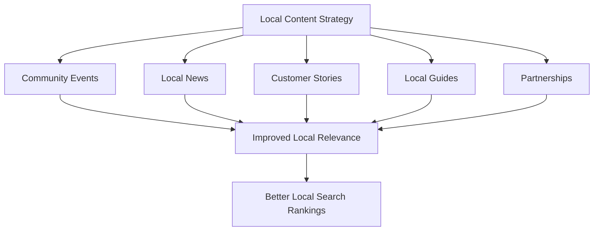

# WordPress Local SEO

## Introduction

Local SEO (Search Engine Optimization) is a specialized branch of SEO focused on helping businesses rank higher in local search results. For businesses that serve specific geographic areas—like restaurants, retail stores, or service providers—local SEO is crucial for connecting with nearby customers who are actively searching for their products or services.

WordPress offers an excellent platform for implementing local SEO strategies through its flexibility and extensive plugin ecosystem. In this guide, we'll explore how to optimize your WordPress website to improve visibility in local search results, attract more local customers, and enhance your business's online presence within your community.

## Why Local SEO Matters

Local SEO is particularly important because:

1. **Near-me searches**: "Near me" searches have grown by more than 500% in recent years
2. **High conversion rates**: Local searches lead to store visits and purchases at a higher rate than non-local searches
3. **Mobile-driven**: 76% of people who search for something nearby on their smartphone visit a business within a day

## Key Components of WordPress Local SEO

### 1. Google Business Profile (Formerly Google My Business)

While not directly part of your WordPress site, Google Business Profile (GBP) is the foundation of local SEO.

#### Setting Up and Optimizing Google Business Profile:

1. Create and verify your GBP listing
2. Add your business information accurately:
   - Business name (exactly as it appears on your storefront)
   - Address
   - Phone number
   - Business hours
   - Website URL
3. Choose the right business categories
4. Add high-quality photos of your business
5. Collect and respond to customer reviews

### 2. WordPress Local SEO Plugins

#### Installing and Setting Up Yoast SEO for Local

The Yoast SEO plugin offers a Local SEO add-on specifically designed for local businesses.

```bash
# Steps to install Yoast SEO Plugin
1. Go to WordPress Dashboard > Plugins > Add New
2. Search for "Yoast SEO"
3. Click "Install Now" and then "Activate"
4. Purchase and install the Yoast Local SEO add-on
```

#### Configuring Yoast Local SEO:

```jsx
// Example configuration in Yoast Local SEO
const yoastLocalSEOSettings = {
  businessName: "Smith's Coffee Shop",
  businessType: "LocalBusiness",
  businessAddress: {
    streetAddress: "123 Main Street",
    city: "Portland",
    state: "OR",
    postalCode: "97201",
    country: "US"
  },
  phone: "(503) 555-1234",
  openingHours: [
    { day: "Monday", from: "08:00", to: "18:00" },
    { day: "Tuesday", from: "08:00", to: "18:00" },
    // Additional days...
  ]
};
```

#### Other Useful Local SEO Plugins:

- **Rank Math**: Another comprehensive SEO plugin with local SEO features
- **All in One SEO Pack**: Offers local business schema markup
- **Schema Pro**: Specifically for adding structured data

### 3. Implementing Local Schema Markup

Schema markup helps search engines understand your business information with structured data.

#### Adding Local Business Schema:

```html
<script type="application/ld+json">
{
  "@context": "https://schema.org",
  "@type": "LocalBusiness",
  "name": "Smith's Coffee Shop",
  "image": "https://www.example.com/photos/coffee-shop.jpg",
  "address": {
    "@type": "PostalAddress",
    "streetAddress": "123 Main Street",
    "addressLocality": "Portland",
    "addressRegion": "OR",
    "postalCode": "97201",
    "addressCountry": "US"
  },
  "telephone": "(503) 555-1234",
  "url": "https://www.smithscoffeeshop.com",
  "priceRange": "$$",
  "openingHoursSpecification": [
    {
      "@type": "OpeningHoursSpecification",
      "dayOfWeek": "Monday",
      "opens": "08:00",
      "closes": "18:00"
    }
    // Additional days...
  ]
}
</script>
```

:::tip
If you're using Yoast SEO or similar plugins, they'll often generate this markup automatically based on the information you provide in the plugin settings.
:::

### 4. Optimizing Your WordPress Content for Local Search

#### Creating Local Landing Pages:

For businesses serving multiple locations, create dedicated pages for each area:

```jsx
// Structure for location pages
const locationPageStructure = {
  url: "/locations/portland-oregon/",
  pageTitle: "Smith's Coffee Shop in Portland, Oregon",
  h1: "Portland's Favorite Local Coffee Shop",
  content: [
    "Unique description of this location",
    "Local services offered",
    "Local testimonials",
    "Location-specific images",
    "Maps and directions",
    "Location-specific contact information"
  ]
};
```

#### Local Keyword Optimization:

1. Use location-specific keywords naturally throughout your content:
   - "coffee shop in Portland"
   - "best Portland coffee"
   - "downtown Portland coffee shop"
   
2. Include location terms in:
   - Page titles
   - Headings
   - Meta descriptions
   - Image alt text
   - URL structures

```html
<!-- Example of locally-optimized title and meta description -->
<title>Smith's Coffee Shop | Best Coffee in Portland, Oregon</title>
<meta name="description" content="Visit Smith's Coffee Shop in downtown Portland for artisan coffee, fresh pastries, and a cozy atmosphere. Locally owned since 2010.">
```

### 5. Implementing NAP Consistency

NAP (Name, Address, Phone Number) consistency is crucial for local SEO. Your business information should be identical across your website and all online directories.

#### Adding NAP Information to Your WordPress Site:

```jsx
// Example of consistent NAP information in footer.php
const napInformation = () => {
  return (
    <div className="business-info">
      <p>Smith's Coffee Shop</p>
      <p>123 Main Street, Portland, OR 97201</p>
      <p>(503) 555-1234</p>
    </div>
  );
};
```

:::caution
Inconsistent NAP information across the web can confuse search engines and potentially harm your local search rankings.
:::

### 6. Creating a WordPress Store Locator

For businesses with multiple locations, implementing a store locator helps customers find your nearest store.

#### WordPress Store Locator Plugins:

- **Store Locator Plus**
- **WP Store Locator**
- **Mapify.it**

```jsx
// Example shortcode for a store locator plugin
function storeLocatorExample() {
  return (
    <div className="store-locator-container">
      {/* Plugin shortcode */}
      [store_locator]
    </div>
  );
}
```

### 7. Mobile Optimization for Local SEO

Local searches are frequently performed on mobile devices, making mobile optimization critical.

#### Mobile Optimization Checklist:

1. Use a responsive WordPress theme
2. Optimize page loading speed
3. Use legible fonts and button sizes
4. Ensure contact information is easily accessible
5. Implement click-to-call functionality

```html
<!-- Example of click-to-call functionality -->
<a href="tel:+15035551234" className="mobile-call-button">Call Us: (503) 555-1234</a>
```

### 8. Local Content Marketing Strategies

Create content that resonates with your local audience to strengthen your local SEO presence.

#### Local Content Ideas:

1. Local event coverage
2. Community involvement posts
3. Local news related to your industry
4. Customer success stories from local clients
5. Guides to local resources related to your business



## Practical Example: Local SEO Implementation for a Coffee Shop

Let's walk through a complete local SEO implementation for our fictional "Smith's Coffee Shop" in Portland.

### Step 1: Set Up Google Business Profile

1. Create a GBP listing with accurate business details
2. Add business hours, photos, and services
3. Choose primary category as "Coffee Shop" and secondary categories like "Bakery"
4. Add attributes like "Wi-Fi," "Outdoor Seating," etc.

### Step 2: Install and Configure Yoast Local SEO

```bash
# After installing Yoast SEO and the Local SEO add-on:
1. Navigate to SEO > Local SEO
2. Enter business information
3. Configure opening hours
4. Set up store locator (if multiple locations)
5. Configure local schema settings
```

### Step 3: Create Location-Based Content

For the coffee shop's website:

1. Homepage with local focus:
   - "Portland's Award-Winning Coffee Shop"
   - Map showing location
   - Local testimonials

2. "About Us" page with local history:
   - "Founded in Portland's Pearl District in 2010"
   - Community involvement
   - Local sourcing practices

3. Blog with local content:
   - "Best Coffee Shops in Portland" (including yours)
   - "Portland Coffee Festival Coverage"
   - "Supporting Local Portland Coffee Farmers"

### Step 4: Technical Local SEO Implementation

```html
<!-- Add local business schema -->
<script type="application/ld+json">
{
  "@context": "https://schema.org",
  "@type": "CafeOrCoffeeShop",
  "name": "Smith's Coffee Shop",
  "address": {
    "@type": "PostalAddress",
    "streetAddress": "123 Main Street",
    "addressLocality": "Portland",
    "addressRegion": "OR",
    "postalCode": "97201"
  },
  "telephone": "(503) 555-1234",
  "openingHours": "Mo-Fr 7:00-19:00, Sa-Su 8:00-20:00",
  "menu": "https://www.smithscoffeeshop.com/menu/",
  "servesCuisine": ["Coffee", "Pastries", "Breakfast"],
  "priceRange": "$$"
}
</script>
```

### Step 5: Local Link Building

1. Get listed in local Portland business directories
2. Partner with complementary local businesses (bookstores, bakeries)
3. Sponsor local events and ensure they link to your website
4. Create profiles on Portland-specific websites and forums

### Step 6: Encourage and Manage Local Reviews

1. Set up review generation campaigns:
   - Email customers after visits
   - Print QR codes on receipts linking to review sites
   - Train staff to mention reviews

2. Respond to all reviews (positive and negative):

```jsx
// Example review response template
const positiveReviewResponse = "Thank you so much for your kind words about Smith's Coffee Shop! We're thrilled you enjoyed our Portland-roasted coffee and house-made pastries. We look forward to serving you again soon!";

const negativeReviewResponse = "We appreciate your feedback and apologize that your experience didn't meet expectations. We'd love to make it right - please contact our manager at manager@smithscoffeeshop.com so we can address your concerns personally.";
```

## Measuring Local SEO Success

Track these metrics to evaluate your local SEO performance:

1. Local search rankings for key terms
2. Google Business Profile insights:
   - How customers search for your business
   - Actions taken (website visits, direction requests, calls)
   - Photo views
3. Local organic traffic (use Google Analytics with geographic filters)
4. Conversion rates from local traffic
5. Review quantity and quality

## Common Local SEO Mistakes to Avoid

1. Inconsistent NAP information across websites
2. Missing or incomplete Google Business Profile
3. Lack of local content
4. Ignoring customer reviews
5. Targeting too broad or too narrow geographic areas
6. Using fake addresses or locations
7. Not optimizing for mobile users

## Summary

Implementing local SEO strategies for your WordPress website is essential for businesses that serve specific geographic areas. By properly setting up your Google Business Profile, using local SEO plugins, implementing schema markup, creating locally-focused content, and maintaining NAP consistency, you can significantly improve your visibility in local search results.

Remember that local SEO is an ongoing process that requires consistent updating and monitoring. As you implement these strategies, continue to track your results and refine your approach based on performance data.

## Additional Resources

- [Google Business Profile Help Center](https://support.google.com/business/)
- [Yoast's Guide to Local SEO](https://yoast.com/local-seo/)
- [Moz Local Learning Center](https://moz.com/learn/local)
- [Schema.org LocalBusiness Documentation](https://schema.org/LocalBusiness)

## Exercises to Practice Local SEO

1. Conduct a local SEO audit of your WordPress website to identify areas for improvement
2. Create a complete Google Business Profile for your business
3. Implement local business schema using a WordPress plugin
4. Develop a local content calendar with topics specific to your geographic area
5. Build a list of local directories and citation sources for your specific industry and location
6. Set up a system to request and manage customer reviews