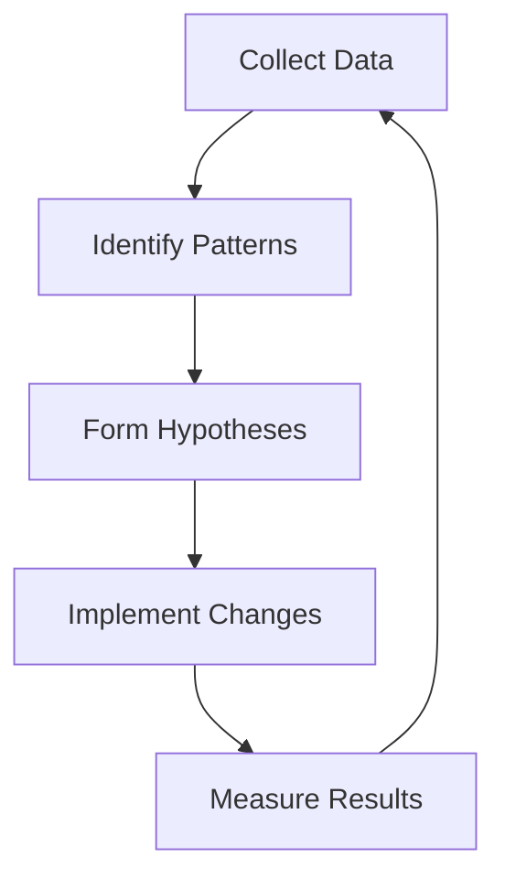

# WordPress Analytics Integration

## Introduction

Analytics integration is a crucial component of any successful WordPress SEO strategy. By implementing analytics solutions on your WordPress site, you gain valuable insights into user behavior, traffic sources, content performance, and conversion rates. This data allows you to make informed decisions that can significantly improve your site's visibility, user experience, and ultimately, its ranking in search results.

In this comprehensive guide, you'll learn how to integrate various analytics tools with your WordPress website, interpret the data they provide, and use those insights to enhance your SEO strategy.

## Why Analytics Matter for WordPress SEO

Before diving into implementation, let's understand why analytics are essential for your WordPress SEO efforts:

1. **Performance Tracking**: Monitor how your SEO efforts translate into actual site traffic
2. **User Behavior Analysis**: Understand how visitors interact with your content
3. **Content Optimization**: Identify high-performing and underperforming pages
4. **Conversion Tracking**: Measure actions that contribute to your business goals
5. **Technical SEO Insights**: Discover site speed issues, mobile usability problems, and other technical factors affecting SEO

## Google Analytics Integration

Google Analytics is the most widely used analytics platform, offering comprehensive data about your website's performance. WordPress makes it easy to integrate this powerful tool.

### Method 1: Using a Plugin

The simplest approach for beginners is to use a dedicated plugin.

#### Step 1: Install and Activate a Google Analytics Plugin

Several popular plugins make integration straightforward:

- **MonsterInsights**: User-friendly with dashboard reports
- **Google Site Kit**: Official Google plugin with multiple services
- **GA Google Analytics**: Lightweight option for analytics only

Let's use MonsterInsights as an example:

1. Navigate to **Plugins > Add New** in your WordPress dashboard
2. Search for "MonsterInsights"
3. Click **Install Now** and then **Activate**

#### Step 2: Configure the Plugin

After activation, most plugins will guide you through the setup process:

1. Navigate to **Insights > Settings** in your WordPress dashboard
2. Click on the **Connect MonsterInsights** button
3. Follow the authentication process to link your Google Analytics account
4. Select the property you want to connect to your WordPress site

#### Step 3: Verify Installation

To ensure proper tracking:

1. Visit your website in an incognito browser window
2. Wait 24-48 hours for data to appear in your Google Analytics account
3. Check real-time reports to confirm immediate tracking

### Method 2: Manual Integration

For developers or those who prefer minimal plugins, you can add the Google Analytics tracking code directly to your theme.

#### Step 1: Create a Google Analytics Account

If you don't already have one:

1. Visit [Google Analytics](https://analytics.google.com)
2. Sign up and create a new property for your website
3. Copy your tracking ID (format: UA-XXXXXXXX-X) or the entire tracking code snippet

#### Step 2: Add the Tracking Code to Your Theme

```php
<?php
/**
 * Add Google Analytics tracking code to website header
 */
function add_google_analytics() {
    ?>
    <!-- Global site tag (gtag.js) - Google Analytics -->
    <script async src="https://www.googletagmanager.com/gtag/js?id=UA-XXXXXXXX-X"></script>
    <script>
        window.dataLayer = window.dataLayer || [];
        function gtag(){dataLayer.push(arguments);}
        gtag('js', new Date());
        
        gtag('config', 'UA-XXXXXXXX-X');
    </script>
    <?php
}
add_action('wp_head', 'add_google_analytics');
```

Replace `UA-XXXXXXXX-X` with your actual tracking ID. Add this code to your theme's `functions.php` file or use a code snippets plugin like "Code Snippets" for a cleaner implementation.

## Setting Up Google Tag Manager

Google Tag Manager (GTM) offers more advanced tracking capabilities by allowing you to deploy various tracking scripts without editing your theme files.

### Step 1: Create a GTM Account and Container

1. Visit [Google Tag Manager](https://tagmanager.google.com/)
2. Create a new account and container for your website
3. Copy the GTM installation code provided

### Step 2: Install GTM in WordPress

You can use a plugin like "Google Tag Manager for WordPress" or add the code manually:

```php
<?php
/**
 * Add Google Tag Manager code to website
 */
function add_google_tag_manager() {
    ?>
    <!-- Google Tag Manager -->
    <script>(function(w,d,s,l,i){w[l]=w[l]||[];w[l].push({'gtm.start':
    new Date().getTime(),event:'gtm.js'});var f=d.getElementsByTagName(s)[0],
    j=d.createElement(s),dl=l!='dataLayer'?'&l='+l:'';j.async=true;j.src=
    'https://www.googletagmanager.com/gtm.js?id='+i+dl;f.parentNode.insertBefore(j,f);
    })(window,document,'script','dataLayer','GTM-XXXXXX');</script>
    <!-- End Google Tag Manager -->
    <?php
}
add_action('wp_head', 'add_google_tag_manager');

function add_google_tag_manager_body() {
    ?>
    <!-- Google Tag Manager (noscript) -->
    <noscript><iframe src="https://www.googletagmanager.com/ns.html?id=GTM-XXXXXX"
    height="0" width="0" style="display:none;visibility:hidden"></iframe></noscript>
    <!-- End Google Tag Manager (noscript) -->
    <?php
}
add_action('wp_body_open', 'add_google_tag_manager_body');
```

Replace `GTM-XXXXXX` with your actual GTM container ID.

### Step 3: Configure Tags in GTM

Once installed, you can set up various tracking tags through the GTM interface:

1. Google Analytics tag for pageviews
2. Event tracking tags for specific user interactions
3. Conversion tracking tags for form submissions
4. Custom HTML tags for third-party analytics scripts

## WordPress Analytics Dashboard with Site Kit

Google's Site Kit plugin provides a centralized dashboard for multiple Google services directly in your WordPress admin panel.

### Step 1: Install and Configure Site Kit

1. Go to **Plugins > Add New** and search for "Site Kit by Google"
2. Install and activate the plugin
3. Click on **Start Setup** and follow the authentication process
4. Connect Google services (Analytics, Search Console, PageSpeed Insights, etc.)

### Step 2: View Analytics Data in WordPress

After setup, you can access key metrics directly from your WordPress dashboard:

1. Overall site traffic and user behavior
2. Top performing pages
3. Search queries bringing visitors to your site
4. Page speed metrics

## Custom Event Tracking for WordPress

To track specific user interactions that matter for your SEO goals, you can set up custom event tracking.

### Basic Custom Event Example

```javascript
// Track PDF downloads
document.addEventListener('DOMContentLoaded', function() {
    const pdfLinks = document.querySelectorAll('a[href$=".pdf"]');
    
    pdfLinks.forEach(link => {
        link.addEventListener('click', function() {
            gtag('event', 'download', {
                'event_category': 'PDF',
                'event_label': this.href
            });
        });
    });
});
```

Add this code to your theme's JavaScript file or through a plugin like "Header and Footer Scripts."

### Tracking Contact Form Submissions

For Contact Form 7 forms:

```javascript
document.addEventListener('wpcf7mailsent', function(event) {
    gtag('event', 'form_submission', {
        'event_category': 'Contact',
        'event_label': 'Contact Form ' + event.detail.contactFormId
    });
});
```

For Gravity Forms:

```php
<?php
/**
 * Track Gravity Form submissions in Google Analytics
 */
function track_gravity_form_submission($entry, $form) {
    ?>
    <script>
        gtag('event', 'form_submission', {
            'event_category': 'Contact',
            'event_label': 'Gravity Form <?php echo $form['title']; ?>'
        });
    </script>
    <?php
}
add_action('gform_after_submission', 'track_gravity_form_submission', 10, 2);
```

## Setting Up Conversion Goals

To measure SEO success, set up conversion goals in your analytics platform.

### Google Analytics Goal Configuration

1. In Google Analytics, navigate to **Admin > Goals**
2. Click **+ New Goal**
3. Select a template or create a custom goal
4. Define the goal details:
   - Destination (thank you page)
   - Duration (time on site)
   - Pages/screens per session
   - Event (based on your custom tracking)
5. Set a goal value if applicable

### Example: Thank You Page Goal

For a contact form that redirects to `/thank-you/` after submission:

1. Create a **Destination** type goal
2. Enter `/thank-you/` as the destination
3. Set the value (optional) based on the average value of a lead

## Integrating Additional Analytics Tools

While Google Analytics is essential, other tools provide complementary data for a complete SEO picture.

### Heatmaps and User Recording

Tools like Hotjar or Clarity offer visual insights into user behavior:

#### Hotjar Integration

1. Sign up for a [Hotjar](https://www.hotjar.com/) account
2. Get your tracking code
3. Install via plugin or add directly to your theme:

```php
<?php
/**
 * Add Hotjar tracking script
 */
function add_hotjar_tracking() {
    ?>
    <!-- Hotjar Tracking Code -->
    <script>
        (function(h,o,t,j,a,r){
            h.hj=h.hj||function(){(h.hj.q=h.hj.q||[]).push(arguments)};
            h._hjSettings={hjid:XXXXXXX,hjsv:6};
            a=o.getElementsByTagName('head')[0];
            r=o.createElement('script');r.async=1;
            r.src=t+h._hjSettings.hjid+j+h._hjSettings.hjsv;
            a.appendChild(r);
        })(window,document,'https://static.hotjar.com/c/hotjar-','.js?sv=');
    </script>
    <?php
}
add_action('wp_head', 'add_hotjar_tracking');
```

Replace `XXXXXXX` with your actual Hotjar ID.

### Content Performance with WordPress Popular Posts

For internal content performance tracking:

1. Install the "WordPress Popular Posts" plugin
2. Configure the plugin settings for tracking method and data storage
3. Add popularity widgets to your sidebar or use shortcodes

```php
<?php
// Display popular posts programmatically
if (function_exists('wpp_get_mostpopular')) {
    wpp_get_mostpopular(array(
        'limit' => 5,
        'range' => 'weekly',
        'post_type' => 'post',
        'stats_views' => 1,
        'stats_date' => 1
    ));
}
```

## Analyzing Data for SEO Improvements

Collecting data is only the first step. The real value comes from analysis and action.

### Key Metrics to Monitor

1. **Organic Search Traffic**: Total visitors from search engines
2. **Keyword Performance**: Search terms bringing visitors
3. **Page Performance**: Which pages attract the most organic traffic
4. **Bounce Rate**: Percentage of single-page sessions
5. **Average Session Duration**: Time users spend on your site
6. **Conversion Rate**: Percentage of visitors completing goals

### Data Analysis Workflow

Follow this process to turn analytics into actionable insights:



### Example: Using Analytics to Improve Content

Let's say your analytics shows a high-traffic page with a high bounce rate:

1. **Analysis**: Users find the page but leave quickly
2. **Hypothesis**: Content may not match search intent
3. **Action**:
   - Review the keywords driving traffic
   - Update content to better match user expectations
   - Add clearer calls-to-action
4. **Measurement**: Monitor bounce rate and time on page after changes

## WordPress Analytics Dashboard Customization

Create custom dashboards to focus on SEO-specific metrics:

### Using Google Analytics Dashboards

1. In Google Analytics, go to **Customization > Dashboards**
2. Create a new dashboard
3. Add widgets for:
   - Organic search traffic
   - Landing pages from organic search
   - Keyword performance
   - Mobile vs. desktop traffic
   - Site speed metrics

### Creating WordPress Admin Dashboard Widgets

```php
<?php
/**
 * Add a custom analytics widget to WordPress dashboard
 */
function add_analytics_dashboard_widget() {
    wp_add_dashboard_widget(
        'custom_analytics_widget',
        'Website Traffic Overview',
        'display_analytics_widget'
    );
}
add_action('wp_dashboard_setup', 'add_analytics_dashboard_widget');

function display_analytics_widget() {
    // If using Google Analytics API, fetch data here
    echo '<p>Connect to Google Analytics API to display data here.</p>';
    
    // For a simple implementation, you can provide a link to GA
    echo '<p><a href="https://analytics.google.com" target="_blank">Open Google Analytics</a></p>';
}
```

For more advanced implementations, you'd need to use the Google Analytics API to fetch and display actual data.

## Troubleshooting Common Analytics Issues

Even careful implementation can sometimes lead to problems. Here are common issues and fixes:

### Issue: No Data in Analytics

**Potential causes and solutions:**

1. **Tracking code not installed properly**
   - Verify code placement in header
   - Check for JavaScript errors with browser console
   
2. **Filters excluding your traffic**
   - Create an IP filter to exclude your own visits
   - Ensure filters aren't too restrictive

3. **Tracking blocker interference**
   - Test site with extensions disabled
   - Consider a cookie consent solution

### Issue: Duplicate Tracking

If you see inflated numbers:

1. Check for multiple installations of tracking code
2. Look for overlapping plugins
3. Use the "Google Tag Assistant" browser extension to identify issues

## Privacy and Compliance Considerations

Analytics implementation must comply with privacy regulations:

### GDPR Compliance

1. **Get consent before tracking**
2. **Anonymize IP addresses**:

```javascript
// Anonymize IP in Google Analytics
gtag('config', 'UA-XXXXXXXX-X', {
    'anonymize_ip': true
});
```

3. **Provide a privacy policy** explaining data collection

### Cookie Consent Integration

Use a cookie consent plugin like "Cookie Notice & Compliance for GDPR / CCPA" and configure it to:

1. Block analytics until consent is given
2. Provide clear opt-in/opt-out options
3. Remember user preferences

```php
<?php
/**
 * Conditionally load Google Analytics based on cookie consent
 */
function conditional_analytics_loading() {
    ?>
    <script>
        // Check if consent cookie exists and is accepted
        function hasAnalyticsConsent() {
            return document.cookie.indexOf('analytics_consent=true') > -1;
        }
        
        // Only load analytics if consent given
        if (hasAnalyticsConsent()) {
            // Google Analytics code here
        }
    </script>
    <?php
}
add_action('wp_head', 'conditional_analytics_loading');
```

## Summary

Integrating analytics with WordPress is a critical step in developing an effective SEO strategy. By properly implementing tools like Google Analytics, Google Tag Manager, and specialized tracking solutions, you gain valuable insights into your site's performance and user behavior.

Remember these key points:

1. Analytics data helps you make informed decisions about content, user experience, and technical optimizations
2. Multiple integration options exist, from simple plugins to custom code implementations
3. Custom event tracking provides deeper insights into specific user interactions
4. Regular data analysis is essential to turn metrics into actionable improvements
5. Privacy compliance should be considered throughout your analytics implementation

By following the practices outlined in this guide, you'll develop a data-driven approach to WordPress SEO that continually improves your site's performance in search results.

## Additional Resources and Exercises

### Learning Resources

- [Google Analytics Academy](https://analytics.google.com/analytics/academy/)
- [Google Tag Manager Fundamentals](https://analytics.google.com/analytics/academy/course/5)
- [WordPress.org Plugin Directory](https://wordpress.org/plugins/) (Search for "analytics")

### Practice Exercises

1. **Basic Implementation**: Install Google Analytics on a test WordPress site and verify data collection
2. **Event Tracking**: Set up custom event tracking for at least three user interactions (downloads, form submissions, video plays)
3. **Goal Configuration**: Create conversion goals based on key actions visitors take on your site
4. **Custom Dashboard**: Build a custom analytics dashboard focused on SEO metrics
5. **A/B Testing**: Use analytics data to identify a low-performing page, create an improved version, and test which performs better

By mastering WordPress analytics integration, you'll transform your SEO approach from guesswork to a strategic, data-driven process that delivers measurable improvements to your website's performance.