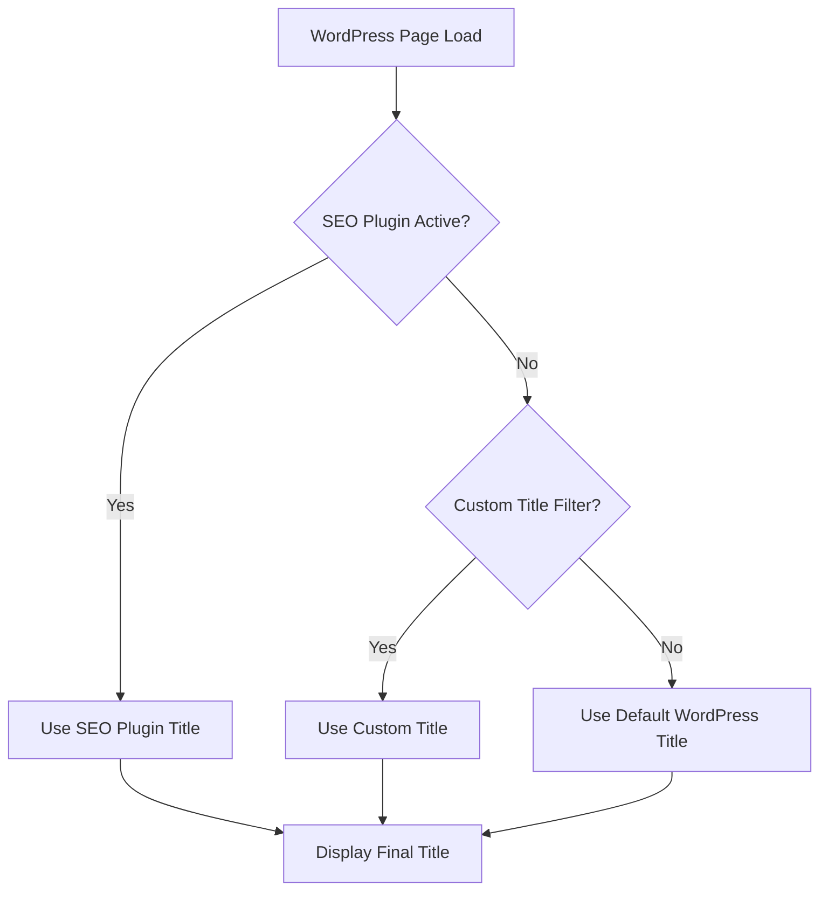

# WordPress Titles Meta

## Introduction

Meta titles (or title tags) are one of the most important on-page SEO elements for your WordPress website. They appear as the clickable headline in search engine results and significantly influence both search engine rankings and user click-through rates. In this guide, we'll learn how to optimize WordPress title meta tags to improve your site's visibility and performance in search results.

## What Are Meta Titles?

A meta title is an HTML element that specifies the title of a webpage. It appears in three key places:

1. Browser tabs
2. Search engine results pages (SERPs)
3. Social media shares

Here's how a title tag appears in HTML:

```html
<head>
  <title>Your Optimized Page Title | Website Name</title>
</head>
```

## Why Meta Titles Matter for SEO

Meta titles play several crucial roles in your WordPress SEO strategy:

- **Search Rankings**: Search engines like Google use title tags to understand page content and relevance
- **Click-Through Rate (CTR)**: Compelling titles encourage users to click on your result
- **User Experience**: Clear titles help visitors understand what your page is about
- **Branding**: Consistent title formatting reinforces your brand identity

## How WordPress Handles Title Tags

By default, WordPress automatically generates title tags based on your content titles. However, this basic implementation often lacks SEO optimization. Here's how WordPress typically structures titles:

```
Post Title | Site Name
```

For example:

```
How to Bake Chocolate Chip Cookies | Recipe Blog
```

## Optimizing Title Meta Tags in WordPress

Let's explore different methods to customize and optimize your WordPress title meta tags:

### Method 1: Using an SEO Plugin

The simplest approach is to use a dedicated SEO plugin. The most popular options are:

#### Yoast SEO

Yoast SEO provides comprehensive title tag management:

1. Install and activate Yoast SEO from the WordPress plugin repository
2. Navigate to the post/page editor
3. Scroll down to the Yoast SEO meta box
4. Click on the "SEO" tab
5. Enter your optimized title in the "SEO title" field

```php
// How Yoast SEO modifies title tags
add_filter('pre_get_document_title', 'yoast_seo_title');
function yoast_seo_title($title) {
    // Yoast's logic to replace default WordPress title
    return $optimized_title;
}
```

#### Rank Math

Rank Math offers similar functionality with a user-friendly interface:

1. Install and activate Rank Math
2. Edit your post or page
3. Look for the Rank Math meta box
4. Enter your custom title in the "Title" field

### Method 2: Using Theme Functions

If you prefer a more hands-on approach, you can modify your theme's `functions.php` file to customize title tags:

```php
function custom_title_tag() {
    global $post;
    
    $custom_title = get_the_title($post->ID);
    $site_name = get_bloginfo('name');
    
    // For homepage
    if (is_home() || is_front_page()) {
        return $site_name . ' | ' . get_bloginfo('description');
    }
    
    // For regular posts and pages
    return $custom_title . ' | ' . $site_name;
}

add_filter('pre_get_document_title', 'custom_title_tag');
```

### Method 3: Using Theme Customizer (for Supported Themes)

Many modern WordPress themes include SEO options in the Theme Customizer:

1. Go to Appearance > Customize
2. Look for "SEO" or "Title Tags" section
3. Configure your title format preferences

## Best Practices for Optimizing WordPress Title Meta Tags

Follow these guidelines to create effective title tags:

### 1. Include Target Keywords

Place your primary keyword near the beginning of the title:

```
Best Chocolate Chip Cookies Recipe | Baking for Beginners
```

### 2. Keep Titles Concise

Limit your titles to 50-60 characters to avoid truncation in search results:

```html
<!-- Good: 57 characters -->
<title>10 Essential WordPress SEO Tips for Beginners | WP Guide</title>

<!-- Too long: 80 characters (will be truncated) -->
<title>The Complete and Comprehensive Guide to WordPress SEO Techniques for Absolute Beginners | WP Guide</title>
```

### 3. Use Title Formulas

Effective title structures to consider:

- **List posts**: "10 Ways to Improve WordPress Performance"
- **How-to guides**: "How to Set Up WordPress Caching in 5 Minutes"
- **Questions**: "What is WordPress Child Theme? A Beginner's Guide"
- **Problem-solution**: "Fix WordPress White Screen of Death: 5 Solutions"

### 4. Include Branding

Add your site name at the end for brand recognition:

```
Primary Keyword: Secondary Keyword | Site Name
```

### 5. Use Title Separators Wisely

Common separators include:
- Pipe symbol (|)
- Dash (-)
- Colon (:)
- Arrow (→)

```html
<title>WordPress SEO Guide | Developer Tips</title>
<title>WordPress SEO Guide - Developer Tips</title>
<title>WordPress SEO Guide: Developer Tips</title>
```

## Analyzing Title Tag Performance

After implementing optimized title tags, monitor their performance:

1. **Google Search Console**: Track click-through rates for different pages
2. **Google Analytics**: Monitor organic traffic to pages with optimized titles

## Dynamic Title Tag Templates

For large WordPress sites, create dynamic title templates for different content types:

```php
function dynamic_title_tags() {
    $site_name = get_bloginfo('name');
    
    // Blog posts
    if (is_single()) {
        return get_the_title() . ' | ' . $site_name;
    }
    
    // Category pages
    if (is_category()) {
        return single_cat_title('', false) . ' Archives | ' . $site_name;
    }
    
    // Author pages
    if (is_author()) {
        return 'Articles by ' . get_the_author() . ' | ' . $site_name;
    }
    
    // Default
    return wp_get_document_title();
}

add_filter('pre_get_document_title', 'dynamic_title_tags');
```

## Troubleshooting Common WordPress Title Meta Issues

### Double Titles

Sometimes WordPress displays duplicate titles like:
```
Page Title | Site Name | Site Name
```

This usually happens when both your theme and an SEO plugin try to modify the title. To fix this:

1. Check if your theme has SEO options and disable them
2. Use only one SEO plugin at a time
3. Add this code to your functions.php if necessary:

```php
remove_action('wp_head', '_wp_render_title_tag', 1);
```

### Missing Title Tags

If your WordPress site isn't displaying title tags:

1. Check if your theme includes `<?php wp_head(); ?>` in the header.php file
2. Verify that your theme supports title tags with:

```php
add_theme_support('title-tag');
```

## Real-World Example: E-commerce Product Page

Let's see a complete example for a WooCommerce product page:

```php
function optimize_product_titles() {
    if (function_exists('is_product') && is_product()) {
        global $product;
        
        $product_title = get_the_title();
        $brand = get_post_meta(get_the_ID(), 'brand', true);
        $site_name = get_bloginfo('name');
        
        return $product_title . ' - ' . $brand . ' | ' . $site_name;
    }
    
    return wp_get_document_title();
}

add_filter('pre_get_document_title', 'optimize_product_titles');
```

This would transform a basic title like "Blue T-Shirt" into an optimized version:
```
Blue Cotton T-Shirt - Nike | Your Fashion Store
```

## The SEO Title Flow in WordPress

Here's a flowchart showing how WordPress determines what title to display:



## Summary

Properly optimized title meta tags are crucial for WordPress SEO success. They help search engines understand your content and encourage users to click through to your website. By following the best practices outlined in this guide, you can create compelling, SEO-friendly title tags that improve your site's visibility and performance.

## Additional Resources and Exercises

### Practice Exercises

1. **Audit Your Existing Titles**: Review 5 of your most important pages and analyze their current title tags.
2. **Rewrite for Improvement**: Using the best practices, rewrite these titles for better SEO.
3. **A/B Testing**: Create two variations of title tags for an important page and test which performs better in terms of CTR.

### Further Learning

- Explore advanced title tag strategies for different page types (archives, taxonomies, custom post types)
- Learn how to integrate schema markup with your title tags for enhanced SERP features
- Understand how title tags interact with social media sharing platforms

Remember, effective title optimization is an ongoing process that requires regular monitoring and refinement based on performance data. Start implementing these techniques today to see improvements in your WordPress SEO efforts!