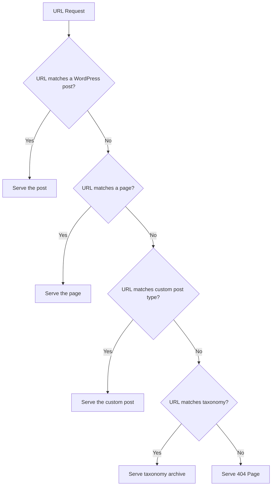

# WordPress Permalinks

## Introduction

Permalinks (permanent links) are the full URLs to your WordPress posts, pages, and other content types. They define how your URLs appear to users and search engines. Well-structured permalinks are crucial for SEO success, user experience, and overall website organization.

By default, WordPress uses URLs with query parameters like `/?p=123`, which aren't particularly user-friendly or search engine optimized. In this guide, we'll explore how to configure permalinks properly to improve your website's SEO and create a better user experience.

## Why Permalinks Matter for SEO

Before diving into the technical details, let's understand why permalinks are crucial for your WordPress website's SEO:

1. **Improved User Experience**: Descriptive URLs help users understand where they are on your site
2. **Search Engine Optimization**: URLs with relevant keywords help search engines understand your content
3. **Shareability**: Clean URLs are easier to share on social media or in emails
4. **Reduced Bounce Rates**: Meaningful URLs build trust with users who can see where a link will take them

## Default WordPress Permalink Structure

When you first install WordPress, it typically uses a default permalink structure that looks like this:

```
https://example.com/?p=123
```

This structure uses query parameters and isn't ideal for several reasons:
- It contains no descriptive information about the content
- It's not user-friendly or memorable
- Search engines prefer descriptive URLs with keywords

## Permalink Structure Options in WordPress

WordPress offers several built-in permalink structure options. To access them, navigate to **Settings → Permalinks** in your WordPress admin dashboard.

![WordPress Permalinks Settings]

The main permalink options include:

| Structure | Example | Description |
|-----------|---------|-------------|
| Plain | `https://example.com/?p=123` | Default structure using query parameters |
| Day and name | `https://example.com/2023/09/15/sample-post/` | Includes year, month, and day of publication |
| Month and name | `https://example.com/2023/09/sample-post/` | Includes year and month of publication |
| Numeric | `https://example.com/archives/123` | Uses post ID with "archives" prefix |
| Post name | `https://example.com/sample-post/` | Uses only the post slug (recommended for most sites) |
| Custom Structure | `https://example.com/%category%/%postname%/` | Fully customizable using available tags |

## How to Change WordPress Permalink Structure

Let's walk through the process of changing your permalink structure:

1. Log in to your WordPress admin dashboard
2. Navigate to **Settings → Permalinks**
3. Select your preferred permalink structure
4. Click "Save Changes"

### Code Example: Custom Permalink Structure

If you want to customize your permalinks beyond the built-in options, you can create a custom structure using tags. Here's how it works:

```
https://example.com/%category%/%postname%/
```

This structure will create URLs that include the category followed by the post name.

Available structure tags include:

- `%year%` - The year of post publication (e.g., 2023)
- `%monthnum%` - Month of publication (e.g., 09)
- `%day%` - Day of publication (e.g., 15)
- `%hour%` - Hour of publication
- `%minute%` - Minute of publication
- `%second%` - Second of publication
- `%postname%` - The post slug (URL-friendly version of the title)
- `%post_id%` - The unique ID of the post
- `%category%` - The category slug
- `%author%` - The author username

## Permalink Best Practices for SEO

To maximize the SEO benefits of your permalinks, follow these best practices:

1. **Choose a Simple Structure**: The "Post name" structure (`/%postname%/`) is generally the most SEO-friendly option for most websites.

2. **Include Keywords**: Ensure your post titles (which become part of the URL) contain relevant keywords.

3. **Avoid Dates in URLs**: Unless your content is specifically time-sensitive (like news), avoid including dates in your permalinks as it can make content seem outdated.

4. **Keep URLs Short**: Shorter URLs are easier to share and remember. Remove unnecessary words like "a", "the", etc.

5. **Use Hyphens as Separators**: WordPress automatically converts spaces to hyphens in URLs. This is good practice as search engines recognize hyphens as word separators.

6. **Avoid Special Characters**: Stick to alphanumeric characters and hyphens to ensure maximum compatibility.

7. **Be Consistent**: Don't change your permalink structure frequently, as it can break existing links.

## Implementing Custom Permalink Structures

### Example: Category + Post Name Structure

A popular permalink structure includes the category followed by the post name:

```
/%category%/%postname%/
```

This creates URLs like:

```
https://example.com/wordpress-tutorials/optimizing-permalinks/
```

This structure has several advantages:
- It provides context about the content's category
- It creates a logical hierarchy for your site
- It includes relevant keywords in the URL

### Example: Creating a Custom Structure for Products

If you run an e-commerce site with WooCommerce, you might want a specific structure for products:

```
/shop/%product_cat%/%product%/
```

This would create URLs like:

```
https://example.com/shop/electronics/smartphone-model-x/
```

## Handling Permalink Changes

When you change permalink structures on an established site, you risk creating broken links. Here's how to handle this situation:

1. **Set Up 301 Redirects**: These tell browsers and search engines that a page has permanently moved.

2. **Use a Redirection Plugin**: Plugins like "Redirection" or "301 Redirects" can help you manage redirects.

3. **Update Internal Links**: Make sure to update any hardcoded links within your site.

### Example: Adding 301 Redirects in .htaccess

If you have access to your server's `.htaccess` file, you can add redirects like this:

```apache
# Redirect old URL structure to new structure
RedirectMatch 301 ^/(\d{4})/(\d{2})/(\d{2})/(.*)$ https://example.com/$4
```

This example redirects URLs with the date structure to just the post name.

## Custom Permalinks for Custom Post Types

If your site uses custom post types, you can define custom permalink structures for them too. Here's an example using the `register_post_type()` function:

```php
function create_book_post_type() {
  register_post_type('book',
    array(
      'labels' => array(
        'name' => __('Books'),
        'singular_name' => __('Book')
      ),
      'public' => true,
      'has_archive' => true,
      'rewrite' => array('slug' => 'books'), // This sets the permalink structure
      'supports' => array('title', 'editor', 'thumbnail', 'excerpt')
    )
  );
}
add_action('init', 'create_book_post_type');
```

This code creates a custom post type called "Book" with URLs structured as:

```
https://example.com/books/book-title/
```

## Troubleshooting Common Permalink Issues

### 404 Errors After Changing Permalinks

If you experience 404 errors after changing permalinks:

1. Go to Settings → Permalinks and click "Save Changes" again without making any changes
2. This will flush the rewrite rules and often fixes the issue

### Permalinks Not Working on Certain Hosts

Some hosting configurations require additional setup:

1. Check if your server uses Apache or Nginx
2. For Apache, ensure the `.htaccess` file is writable
3. For Nginx, you may need to manually update the server configuration

### Example Nginx Configuration for Pretty Permalinks

```nginx
location / {
  try_files $uri $uri/ /index.php?$args;
}
```

### WordPress Doesn't Update .htaccess File

If WordPress can't update your `.htaccess` file automatically:

1. Create or edit the `.htaccess` file manually
2. Add the following code:

```apache
# BEGIN WordPress
<IfModule mod_rewrite.c>
RewriteEngine On
RewriteBase /
RewriteRule ^index\.php$ - [L]
RewriteCond %{REQUEST_FILENAME} !-f
RewriteCond %{REQUEST_FILENAME} !-d
RewriteRule . /index.php [L]
</IfModule>
# END WordPress
```

## Permalink Structure Flowchart

Here's a visual representation of how WordPress processes permalinks:



## Summary

WordPress permalinks are a crucial aspect of your website's SEO strategy. By choosing the right permalink structure, you can improve search engine rankings, enhance user experience, and create a more organized website architecture.

Remember these key points:
- The post name structure (`/%postname%/`) is generally best for SEO
- Avoid changing permalink structure on established sites
- Use 301 redirects if you must change your URL structure
- Keep URLs short, descriptive, and keyword-rich
- Regularly check for broken links after making changes

With proper permalink optimization, you'll be taking an important step toward better WordPress SEO and improved user experience.

## Additional Resources

- [WordPress Codex: Using Permalinks](https://wordpress.org/documentation/article/customize-permalinks/)
- [Google's URL Structure Best Practices](https://developers.google.com/search/docs/advanced/guidelines/url-structure)
- [Yoast SEO Plugin](https://wordpress.org/plugins/wordpress-seo/) - Helps optimize your site's SEO including permalinks

## Exercises

1. Change your permalink structure to post name and observe how your URLs change.
2. Create a custom permalink structure that includes the category and post name.
3. Generate a list of 301 redirects for your most important pages after changing the permalink structure.
4. Optimize the titles of 5 key posts to create more SEO-friendly permalinks.
5. Audit your site for broken links using a tool like Broken Link Checker.