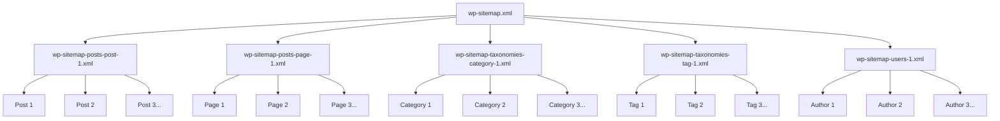

# WordPress Sitemaps

## Introduction

A sitemap is like a roadmap of your website that helps search engines efficiently discover and index your content. Since WordPress 5.5 (released in August 2020), WordPress automatically generates XML sitemaps for your website without requiring any additional plugins. This feature significantly improves your site's visibility to search engines and is a crucial component of WordPress SEO.

In this guide, we'll explore:

- What WordPress sitemaps are and why they matter
- How the built-in sitemap functionality works
- How to customize your WordPress sitemaps
- Troubleshooting common sitemap issues

## What Are WordPress Sitemaps?

A sitemap is an XML file that lists all the important URLs of your website. It provides search engines with:

1. A complete list of pages to crawl
2. Information about when each page was last updated
3. How often the content changes
4. The priority of certain pages relative to others

WordPress's built-in sitemap feature creates a sitemap index that links to individual sitemaps for different content types, making it easier for search engines to understand your site structure.

## Accessing Your WordPress Sitemap

To view your WordPress sitemap, simply add `/wp-sitemap.xml` to your domain name:

```
https://yourdomain.com/wp-sitemap.xml
```

When you visit this URL, you'll see an XML file listing all the different sitemap types available on your website:

```xml
<?xml version="1.0" encoding="UTF-8"?>
<sitemapindex xmlns="http://www.sitemaps.org/schemas/sitemap/0.9">
  <sitemap>
    <loc>https://yourdomain.com/wp-sitemap-posts-post-1.xml</loc>
  </sitemap>
  <sitemap>
    <loc>https://yourdomain.com/wp-sitemap-posts-page-1.xml</loc>
  </sitemap>
  <sitemap>
    <loc>https://yourdomain.com/wp-sitemap-taxonomies-category-1.xml</loc>
  </sitemap>
  <sitemap>
    <loc>https://yourdomain.com/wp-sitemap-users-1.xml</loc>
  </sitemap>
</sitemapindex>
```

## WordPress Sitemap Structure

The default WordPress sitemap includes separate sitemaps for:

1. **Posts** - All published blog posts
2. **Pages** - Static pages on your website
3. **Custom Post Types** - Any public custom post types
4. **Taxonomies** - Categories, tags, and custom taxonomies
5. **Author Archives** - Archives of posts by each author

Each content type gets its own sitemap, which helps organize your site's content logically for search engines.

## How WordPress Sitemaps Help SEO

Sitemaps are essential for SEO because they:

1. **Improve content discovery**: Search engines can find your content more easily
2. **Speed up indexing**: New content gets indexed faster
3. **Provide metadata**: Search engines learn about content updates and priorities
4. **Support large websites**: Makes it easier to index websites with hundreds or thousands of pages

## Customizing WordPress Sitemaps

While the built-in WordPress sitemap functionality works well for most sites, you might want to customize it for specific SEO needs. Let's look at how to modify the sitemap using code.

### Excluding Post Types from the Sitemap

If you want to exclude certain post types from your sitemap, you can use the `wp_sitemaps_post_types` filter:

```php
function remove_post_types_from_sitemap($post_types) {
    // Remove 'attachment' post type
    unset($post_types['attachment']);
    // You can also remove other post types
    // unset($post_types['product']);
    
    return $post_types;
}
add_filter('wp_sitemaps_post_types', 'remove_post_types_from_sitemap');
```

### Excluding Taxonomies from the Sitemap

Similarly, you can exclude taxonomies using the `wp_sitemaps_taxonomies` filter:

```php
function remove_taxonomies_from_sitemap($taxonomies) {
    // Remove 'post_tag' taxonomy
    unset($taxonomies['post_tag']);
    
    return $taxonomies;
}
add_filter('wp_sitemaps_taxonomies', 'remove_taxonomies_from_sitemap');
```

### Modifying Sitemap URLs

You can also modify the URLs included in the sitemap using the `wp_sitemaps_posts_query_args` filter:

```php
function modify_post_sitemap_query($args, $post_type) {
    // Only modify 'post' type queries
    if ($post_type === 'post') {
        // Only include posts from the last year
        $args['date_query'] = [
            [
                'after' => '1 year ago',
            ],
        ];
    }
    
    return $args;
}
add_filter('wp_sitemaps_posts_query_args', 'modify_post_sitemap_query', 10, 2);
```

### Disabling Sitemaps Completely

If you prefer to use a different sitemap solution (like from an SEO plugin), you can disable WordPress's built-in sitemaps:

```php
// Disable WordPress core sitemaps
add_filter('wp_sitemaps_enabled', '__return_false');
```

## Advanced Sitemap Customization

For more advanced sitemap control, let's look at some additional customization options.

### Adding Custom URLs to the Sitemap

WordPress doesn't provide a direct filter to add custom URLs, but you can create a custom sitemap provider:

```php
class Custom_Sitemap_Provider extends WP_Sitemaps_Provider {
    public function __construct() {
        $this->name = 'custom';
    }

    public function get_url_list($page_num, $post_type = '') {
        return [
            [
                'loc'        => 'https://yourdomain.com/custom-page/',
                'lastmod'    => '2023-01-01T12:00:00+00:00',
                'changefreq' => 'monthly',
                'priority'   => 0.8,
            ],
            [
                'loc'        => 'https://yourdomain.com/another-custom-page/',
                'lastmod'    => '2023-02-15T15:30:00+00:00',
                'changefreq' => 'weekly',
                'priority'   => 0.7,
            ],
        ];
    }

    public function get_max_num_pages() {
        return 1; // Only one page of results
    }
}

function register_custom_sitemap_provider($registry) {
    $registry->register('custom', new Custom_Sitemap_Provider());
}
add_filter('wp_sitemaps_add_provider', 'register_custom_sitemap_provider');
```

### Customizing Sitemap Entries

You can also modify the individual entries in a sitemap using the `wp_sitemaps_posts_entry` filter:

```php
function customize_post_sitemap_entries($entry, $post) {
    // Change priority based on post type
    if ($post->post_type === 'page') {
        $entry['priority'] = 0.8;
    } elseif ($post->post_type === 'post') {
        $entry['priority'] = 0.6;
    }
    
    // Change update frequency based on post date
    $post_date = strtotime($post->post_date);
    $current_time = time();
    $six_months_ago = $current_time - (6 * 30 * 24 * 60 * 60);
    
    if ($post_date > $six_months_ago) {
        $entry['changefreq'] = 'monthly';
    } else {
        $entry['changefreq'] = 'yearly';
    }
    
    return $entry;
}
add_filter('wp_sitemaps_posts_entry', 'customize_post_sitemap_entries', 10, 2);
```

## Real-World Sitemap Implementation

Let's look at a comprehensive example of sitemap customization for a typical business website:

```php
/**
 * WordPress Sitemap Customization
 * 
 * This code:
 * 1. Removes attachments and obsolete post types
 * 2. Excludes certain taxonomies
 * 3. Adds priority and changefreq attributes
 * 4. Excludes non-public pages from sitemap
 */

// Remove post types
function custom_sitemap_post_types($post_types) {
    // Remove media attachments - usually not needed in sitemaps
    unset($post_types['attachment']);
    
    // Check if we have a testimonials post type that should be excluded
    if (isset($post_types['testimonials'])) {
        unset($post_types['testimonials']);
    }
    
    return $post_types;
}
add_filter('wp_sitemaps_post_types', 'custom_sitemap_post_types');

// Remove taxonomies
function custom_sitemap_taxonomies($taxonomies) {
    // Remove post formats - rarely needed in sitemaps
    unset($taxonomies['post_format']);
    
    return $taxonomies;
}
add_filter('wp_sitemaps_taxonomies', 'custom_sitemap_taxonomies');

// Exclude specific pages from sitemap
function custom_sitemap_exclude_pages($args, $post_type) {
    if ($post_type === 'page') {
        // Exclude thank you pages, staging pages, etc.
        if (!isset($args['post__not_in'])) {
            $args['post__not_in'] = [];
        }
        
        // Add IDs of pages to exclude
        $excluded_pages = [123, 456, 789]; // Replace with actual page IDs
        $args['post__not_in'] = array_merge($args['post__not_in'], $excluded_pages);
    }
    
    return $args;
}
add_filter('wp_sitemaps_posts_query_args', 'custom_sitemap_exclude_pages', 10, 2);

// Add priority and changefreq to entries
function custom_sitemap_entries($entry, $post) {
    // Set priority based on content type
    if ($post->post_type === 'page') {
        // Static pages typically have higher priority
        $entry['priority'] = 0.8;
    } elseif ($post->post_type === 'post') {
        // Blog posts slightly lower
        $entry['priority'] = 0.6;
    } else {
        // Default priority for other content
        $entry['priority'] = 0.5;
    }
    
    // Set update frequency based on content age
    $post_modified = strtotime($post->post_modified);
    $current_time = time();
    $one_month_ago = $current_time - (30 * 24 * 60 * 60);
    $six_months_ago = $current_time - (6 * 30 * 24 * 60 * 60);
    
    if ($post_modified > $one_month_ago) {
        $entry['changefreq'] = 'monthly';
    } elseif ($post_modified > $six_months_ago) {
        $entry['changefreq'] = 'quarterly';
    } else {
        $entry['changefreq'] = 'yearly';
    }
    
    return $entry;
}
add_filter('wp_sitemaps_posts_entry', 'custom_sitemap_entries', 10, 2);
```

## Submitting Your Sitemap to Search Engines

Once you have configured your WordPress sitemap, you should submit it to search engines to ensure they discover and index your content:

1. **Google**: Submit through Google Search Console (https://search.google.com/search-console)
2. **Bing**: Submit through Bing Webmaster Tools (https://www.bing.com/webmasters)

The process typically involves:

1. Verifying ownership of your website
2. Submitting your sitemap URL (`https://yourdomain.com/wp-sitemap.xml`)
3. Monitoring indexing status through their dashboards

## Sitemap Structure Visualization

Here's a visualization of how WordPress sitemaps are structured:



## Troubleshooting WordPress Sitemap Issues

If you're experiencing issues with your WordPress sitemap, here are some common problems and solutions:

### 1. Sitemap Not Found (404 Error)

**Possible causes and solutions:**
- Permalinks may not be properly set. Go to Settings > Permalinks and save your settings again (this flushes rewrite rules).
- A plugin might be interfering with the sitemap. Try temporarily disabling plugins to isolate the issue.

### 2. Missing Content in Sitemap

**Possible causes and solutions:**
- The content might be set as "noindex". Check if your SEO plugin or theme has noindex settings.
- The content might be hidden by custom sitemap filters. Check if any code is filtering out content.

### 3. Sitemap Shows Outdated Content

**Possible causes and solutions:**
- Search engines cache sitemaps. Resubmit your sitemap in Google Search Console or Bing Webmaster Tools.
- Caching plugins might be serving old sitemap versions. Clear your cache.

### 4. Sitemap Is Too Large

**Solution:** WordPress automatically splits large sitemaps into multiple files, but if you're still having issues:
- Filter out less important content using the code examples shown above.
- Consider limiting the number of items per sitemap page.

## Summary

WordPress sitemaps are a powerful built-in feature that helps search engines discover and index your website content efficiently. Key points to remember:

- WordPress automatically generates sitemaps at `/wp-sitemap.xml` since version 5.5
- The sitemap index links to separate sitemaps for different content types
- You can customize sitemaps using WordPress hooks and filters
- Submitting your sitemap to search engines improves indexing
- Proper sitemap implementation is a crucial part of WordPress SEO

## Additional Resources and Exercises

### Resources

1. [WordPress Developer Documentation on Sitemaps](https://developer.wordpress.org/reference/hooks/wp_sitemaps_enabled/)
2. [Google's Sitemap Guidelines](https://developers.google.com/search/docs/crawling-indexing/sitemaps/overview)
3. [Understanding XML Sitemaps](https://www.sitemaps.org/protocol.html)

### Exercises

1. **Basic Exercise**: Check your WordPress site's existing sitemap at `/wp-sitemap.xml` and explore each of the linked sitemaps.

2. **Intermediate Exercise**: Write a custom function to exclude a specific category from your WordPress sitemap.

3. **Advanced Exercise**: Create a custom sitemap provider that adds a special section for your most important content with custom priorities.

4. **Practical Exercise**: Submit your WordPress sitemap to Google Search Console and monitor the indexing progress over the next few weeks.

By properly implementing and customizing WordPress sitemaps, you'll improve your site's visibility in search engines and ensure that your most important content gets indexed properly.