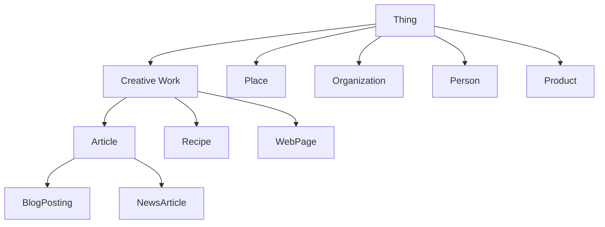

# WordPress Schema Markup

## Introduction

Schema markup is a powerful SEO technique that helps search engines better understand the content on your WordPress website. By implementing schema markup (also known as structured data), you provide explicit clues about the meaning of your content to search engines, which can result in rich snippets in search results, improved visibility, and potentially higher click-through rates.

In this guide, you'll learn:

- What schema markup is and why it matters for WordPress SEO
- How to implement schema markup in WordPress
- Best practices for using structured data
- Testing and troubleshooting your schema implementation

## What is Schema Markup?

Schema markup is a specific vocabulary of tags (or microdata) that you can add to your HTML to improve the way search engines read and represent your page in search results. This structured data vocabulary was created by a collaboration between Google, Bing, Yahoo, and Yandex to create a common set of schemas for structured data markup.

### Why Schema Markup Matters for WordPress SEO

- **Enhanced Search Results**: Schema helps your content appear as rich snippets in search results (with stars, images, and additional information)
- **Better Content Understanding**: Search engines can understand exactly what your content is about
- **Voice Search Optimization**: Structured data helps voice assistants understand and present your content
- **Higher Click-Through Rates**: Rich results typically have higher CTRs than standard search listings

## Types of Schema Markup for WordPress

Here are some common schema types that are particularly useful for WordPress sites:

1. **Article/BlogPosting**: For blog posts and news articles
2. **Product**: For e-commerce product pages
3. **LocalBusiness**: For business websites
4. **Event**: For event pages
5. **Recipe**: For cooking and recipe websites
6. **FAQ**: For frequently asked questions
7. **Review**: For product or service reviews
8. **HowTo**: For step-by-step guides

## How to Implement Schema Markup in WordPress

There are three main methods to implement schema markup in WordPress:

### Method 1: Using WordPress SEO Plugins

The easiest way to add schema to WordPress is through SEO plugins. Popular options include:

#### Yoast SEO

Yoast automatically adds some basic schema markup to your site:

1. Install and activate Yoast SEO
2. Go to SEO → Search Appearance → Content Types
3. Configure the schema settings for each content type

#### Rank Math

Rank Math offers more advanced schema options:

1. Install and activate Rank Math
2. Go to Rank Math → Titles & Meta → Posts (or other content types)
3. Enable and customize schema settings

### Method 2: Schema Markup Plugins

There are dedicated WordPress plugins specifically for schema:

#### Schema Pro

```
// Example of what Schema Pro generates automatically
<script type="application/ld+json">
{
  "@context": "https://schema.org",
  "@type": "Article",
  "mainEntityOfPage": {
    "@type": "WebPage",
    "@id": "https://example.com/blog-post"
  },
  "headline": "How to Implement Schema in WordPress",
  "description": "A complete guide to implementing schema markup in WordPress",
  "image": "https://example.com/images/schema.jpg",
  "author": {
    "@type": "Person",
    "name": "Jane Smith"
  },
  "publisher": {
    "@type": "Organization",
    "name": "WordPress Tutorials",
    "logo": {
      "@type": "ImageObject",
      "url": "https://example.com/logo.jpg"
    }
  },
  "datePublished": "2023-01-15T08:00:00+08:00",
  "dateModified": "2023-01-16T09:30:00+08:00"
}
</script>
```

### Method 3: Manual Implementation with JSON-LD

For full control, you can manually add JSON-LD schema to your WordPress site:

1. Create a function in your theme's `functions.php` file
2. Use `wp_head` or `wp_footer` hooks to output the JSON-LD

Here's an example of manually adding Article schema to single posts:

```php
function add_article_schema() {
    if (is_single() && 'post' === get_post_type()) {
        $post = get_post();
        
        // Get featured image
        $image = '';
        if (has_post_thumbnail()) {
            $image_id = get_post_thumbnail_id();
            $image_url = wp_get_attachment_image_src($image_id, 'full');
            $image = $image_url[0];
        }
        
        // Get author information
        $author = get_the_author_meta('display_name', $post->post_author);
        
        // Build the schema
        $schema = array(
            '@context' => 'https://schema.org',
            '@type' => 'Article',
            'mainEntityOfPage' => array(
                '@type' => 'WebPage',
                '@id' => get_permalink()
            ),
            'headline' => get_the_title(),
            'image' => $image,
            'author' => array(
                '@type' => 'Person',
                'name' => $author
            ),
            'publisher' => array(
                '@type' => 'Organization',
                'name' => get_bloginfo('name'),
                'logo' => array(
                    '@type' => 'ImageObject',
                    'url' => get_template_directory_uri() . '/assets/img/logo.png'
                )
            ),
            'datePublished' => get_the_date('c'),
            'dateModified' => get_the_modified_date('c')
        );
        
        echo '<script type="application/ld+json">' . json_encode($schema) . '</script>';
    }
}
add_action('wp_head', 'add_article_schema');
```

## Common Schema Types for WordPress Sites

Let's look at some practical examples of schema markup for different WordPress content:

### 1. Blog Post Schema (ArticleBlogPosting)

```json
{
  "@context": "https://schema.org",
  "@type": "BlogPosting",
  "headline": "10 Tips for WordPress Performance",
  "image": "https://yourdomain.com/images/performance-tips.jpg",
  "author": {
    "@type": "Person",
    "name": "Jamie Smith"
  },
  "publisher": {
    "@type": "Organization",
    "name": "WordPress Mastery",
    "logo": {
      "@type": "ImageObject",
      "url": "https://yourdomain.com/logo.png"
    }
  },
  "datePublished": "2023-05-15T08:00:00+08:00",
  "dateModified": "2023-05-16T09:30:00+08:00",
  "description": "Learn how to speed up your WordPress website with these 10 performance tips."
}
```

### 2. Product Schema for WooCommerce

```json
{
  "@context": "https://schema.org/",
  "@type": "Product",
  "name": "Premium WordPress Theme",
  "image": "https://yourdomain.com/images/premium-theme.jpg",
  "description": "A responsive, SEO-friendly WordPress theme for businesses.",
  "sku": "WPTH001",
  "mpn": "925872",
  "brand": {
    "@type": "Brand",
    "name": "ThemeMasters"
  },
  "review": {
    "@type": "Review",
    "reviewRating": {
      "@type": "Rating",
      "ratingValue": "4.8",
      "bestRating": "5"
    },
    "author": {
      "@type": "Person",
      "name": "Alex Johnson"
    }
  },
  "aggregateRating": {
    "@type": "AggregateRating",
    "ratingValue": "4.7",
    "reviewCount": "89"
  },
  "offers": {
    "@type": "Offer",
    "url": "https://yourdomain.com/product/premium-theme/",
    "priceCurrency": "USD",
    "price": "59.99",
    "priceValidUntil": "2023-12-31",
    "availability": "https://schema.org/InStock"
  }
}
```

### 3. FAQ Schema

FAQs can significantly enhance your visibility in search results:

```json
{
  "@context": "https://schema.org",
  "@type": "FAQPage",
  "mainEntity": [{
    "@type": "Question",
    "name": "What is schema markup?",
    "acceptedAnswer": {
      "@type": "Answer",
      "text": "Schema markup is code that you put on your website to help search engines return more informative results for users."
    }
  }, {
    "@type": "Question",
    "name": "How does schema markup help SEO?",
    "acceptedAnswer": {
      "@type": "Answer",
      "text": "Schema markup helps search engines understand your content better, which can lead to rich snippets in search results and potentially higher click-through rates."
    }
  }]
}
```

## WordPress Schema Markup Best Practices

To get the most out of your schema implementation:

1. **Be specific**: Use the most specific schema type that applies to your content
2. **Be accurate**: Only include information that is actually visible on the page
3. **Be comprehensive**: Include all recommended properties for each schema type
4. **Add schema site-wide**: Implement Organization and WebSite schema across your whole site
5. **Test thoroughly**: Always validate your schema before publishing

## Schema Markup Hierarchy

Schema markup follows a hierarchical structure. Understanding this helps create better structured data:



## Testing Schema Markup

Always validate your schema implementation using these tools:

1. **Google's Rich Results Test**: https://search.google.com/test/rich-results
2. **Schema.org Validator**: https://validator.schema.org/

### How to Test Your Schema

1. Enter your page URL or paste your code in Google's Rich Results Test
2. Check for errors or warnings
3. View how your rich results might appear in search

## Troubleshooting Common Schema Issues

| Problem | Solution |
|---------|----------|
| Missing required fields | Ensure all required properties for your schema type are included |
| Invalid format | Verify your JSON-LD syntax is correct |
| Duplicate schema | Remove redundant schema types or consolidate them |
| Schema not being detected | Check placement in the `<head>` section and ensure proper encoding |

## Schema Markup Implementation Workflow

Here's a recommended workflow for implementing schema in WordPress:

1. **Audit**: Identify what content types need schema markup
2. **Plan**: Decide which schema types are appropriate for each
3. **Implement**: Add schema using plugins or manual code
4. **Test**: Validate using testing tools
5. **Monitor**: Track performance in Google Search Console
6. **Refine**: Optimize based on results and feedback

## Summary

Schema markup is an essential part of WordPress SEO that helps search engines better understand and represent your content in search results. By implementing structured data either through plugins or manual code, you can enhance your site's visibility and potentially increase click-through rates.

Remember these key points:

- Schema helps search engines understand your content context
- You can implement schema through plugins or manual JSON-LD
- Always use the most specific schema type for your content
- Test your implementation using validation tools
- Monitor performance in Google Search Console

## Additional Resources

- [Schema.org Official Documentation](https://schema.org/)
- [Google's Structured Data Guidelines](https://developers.google.com/search/docs/advanced/structured-data/intro-structured-data)
- [JSON-LD Schema Generator](https://technicalseo.com/tools/schema-markup-generator/)

## Practice Exercise

1. Identify three different content types on your WordPress website that would benefit from schema markup
2. Implement schema for one blog post using a plugin and one manually with JSON-LD
3. Test both implementations using Google's Rich Results Test
4. Compare how each method works and which one better suits your needs

Now you have a solid foundation for implementing schema markup on your WordPress site to boost your SEO and improve your search result appearance!