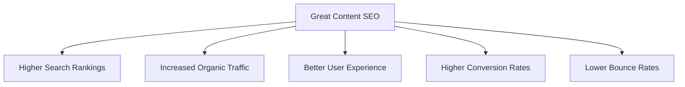

# WordPress Content SEO

## Introduction

Creating great content is only half the battle when it comes to building a successful website. If your content can't be found by search engines, even the most well-crafted posts and pages won't reach your target audience. Content SEO in WordPress focuses on optimizing your written content, images, and overall structure to make it more discoverable in search engine results.

In this guide, we'll explore effective techniques to optimize your WordPress content for search engines while maintaining quality and readability for your human visitors.

## Why Content SEO Matters

Before diving into the techniques, let's understand why content SEO is crucial for your WordPress site:



Optimized content helps search engines understand what your page is about, which improves your chances of ranking for relevant keywords and ultimately drives more targeted traffic to your site.

## Essential WordPress Content SEO Techniques

### 1. Keyword Research and Implementation

Every strong content SEO strategy begins with keyword research.

#### Finding the Right Keywords

Start by identifying keywords that:
- Your target audience is searching for
- Have reasonable search volume
- Have manageable competition
- Are relevant to your content

**Tools for Keyword Research:**
- Google Keyword Planner
- Ahrefs
- SEMrush
- Ubersuggest (free option)

#### Implementing Keywords Effectively

Once you've identified your target keywords, here's how to implement them in your WordPress content:

- **Post title:** Include your primary keyword near the beginning
- **URL/slug:** Include your main keyword in a clean, concise URL
- **First paragraph:** Mention your main keyword in the first 100 words
- **Throughout content:** Use your main keyword and related terms naturally
- **Headings:** Include keywords in some (not all) of your H2, H3, etc.
- **Image alt text:** Describe images with keywords when relevant

**Example of Keyword Implementation:**

For a post targeting "beginner yoga poses":

```
<!-- Title -->
<h1>10 Easy Beginner Yoga Poses for Improved Flexibility</h1>

<!-- URL -->
yourdomain.com/beginner-yoga-poses

<!-- First paragraph -->
<p>Learning beginner yoga poses can be intimidating, but these 10 simple positions will help you build confidence and flexibility. Each pose is designed specifically for newcomers to yoga practice...</p>

<!-- Heading example -->
<h2>Benefits of Practicing Beginner Yoga Poses Daily</h2>

<!-- Image example -->

```

### 2. Optimizing Post Structure and Readability

Content that's well-structured is easier for both humans and search engines to digest.

#### Creating an SEO-Friendly Structure

- **Use proper heading hierarchy:** H1 for title, H2 for main sections, H3 for subsections
- **Write compelling meta descriptions:** Include keywords and a call-to-action
- **Keep paragraphs short:** 2-4 sentences is ideal for web content
- **Use bullet points and numbered lists:** Breaks up text and improves scannability
- **Add internal links:** Connect to relevant content on your site

Here's how to add a custom meta description in WordPress using Yoast SEO:

1. Scroll down to the Yoast SEO section below your post editor
2. Click on the "SEO" tab
3. Find the "Meta description" field
4. Write a compelling 150-160 character description including your target keyword

#### Improving Readability

WordPress offers several readability enhancement tools:

- **Gutenberg blocks:** Use various content blocks for visually engaging layouts
- **Tables:** Present comparative information clearly
- **Blockquotes:** Highlight important quotes or takeaways
- **Custom HTML:** Create more complex layouts when needed

**Example with Gutenberg blocks:**

```jsx
// Simple two-column layout example in Gutenberg
<div className="wp-block-columns">
  <div className="wp-block-column">
    <h3>Benefits of SEO</h3>
    <ul>
      <li>Increased organic visibility</li>
      <li>Higher website traffic</li>
      <li>Better user experience</li>
    </ul>
  </div>
  <div className="wp-block-column">
    <h3>Common SEO Challenges</h3>
    <ul>
      <li>Algorithm changes</li>
      <li>Competitive keywords</li>
      <li>Content creation demands</li>
    </ul>
  </div>
</div>
```

### 3. Optimizing Images for SEO

Images play a crucial role in content SEO but can slow down your site if not optimized properly.

#### Image SEO Best Practices

1. **Use descriptive filenames:** Change `IMG12345.jpg` to `beginner-yoga-downward-dog.jpg`
2. **Add alt text with keywords:** Describe the image while including relevant keywords
3. **Optimize image size:** Compress images before uploading
4. **Choose the right format:** Use JPEG for photos, PNG for graphics with transparency, WebP for best compression
5. **Create responsive images:** Ensure they display properly on all devices

**Example of image implementation in WordPress:**

```html
<!-- Basic image with alt text -->


<!-- Using WordPress responsive image feature -->
<?php 
  $image_id = 123; // The ID of your image in the media library
  echo wp_get_attachment_image($image_id, 'full', false, array(
    'class' => 'my-featured-image',
    'alt' => 'Woman demonstrating beginner yoga poses on a mat'
  ));
?>
```

### 4. Creating SEO-Friendly Content

Beyond structure and keywords, the actual content you create needs to be valuable and SEO-friendly.

#### Content Quality Factors

- **Comprehensive coverage:** Cover topics thoroughly (aim for 1,000+ words for main content)
- **Updated information:** Keep content fresh and current
- **Original content:** Avoid duplicate content issues
- **Expert information:** Demonstrate expertise and authority
- **Engaging writing:** Maintain reader interest with good writing

#### Implementing Schema Markup

Schema markup helps search engines understand the context of your content better. WordPress SEO plugins like Yoast SEO and Rank Math include schema functionality.

**Example of how to implement FAQ schema with a plugin:**

1. Create your FAQ content in WordPress
2. If using Yoast SEO, add a FAQ block in Gutenberg
3. The plugin will automatically generate the schema markup

### 5. Optimizing WordPress Metadata

Metadata provides search engines with specific information about your content.

#### Essential Metadata Elements

- **Title tags:** Usually the same as your post title but can be customized
- **Meta descriptions:** 150-160 character summaries that appear in search results
- **Open Graph tags:** Control how your content appears when shared on social media
- **Twitter Cards:** Similar to Open Graph but specific to Twitter

**How to customize title tags with Yoast SEO:**

1. Navigate to the Yoast SEO section below your post
2. Click the "SEO" tab
3. Edit the "SEO title" field
4. Use the format: Primary Keyword | Secondary Keyword | Brand Name

```html
<!-- Example of what Yoast generates -->
<title>10 Easy Beginner Yoga Poses for Improved Flexibility | YogaLife</title>
<meta name="description" content="Learn 10 simple beginner yoga poses that will improve your flexibility, reduce stress, and boost your confidence on the mat. Step-by-step instructions included." />
<meta property="og:locale" content="en_US" />
<meta property="og:type" content="article" />
<meta property="og:title" content="10 Easy Beginner Yoga Poses for Improved Flexibility" />
<meta property="og:description" content="Learn 10 simple beginner yoga poses that will improve your flexibility, reduce stress, and boost your confidence on the mat." />
<meta property="og:url" content="https://yourdomain.com/beginner-yoga-poses/" />
<meta property="og:site_name" content="YogaLife" />
<meta property="article:published_time" content="2023-08-15T10:30:52+00:00" />
<meta property="article:modified_time" content="2023-08-16T14:23:11+00:00" />
<meta property="og:image" content="https://yourdomain.com/wp-content/uploads/2023/08/beginner-yoga-poses-featured.jpg" />
```

## Practical Content SEO Workflow

Now that we've covered the individual techniques, let's look at a practical workflow for creating SEO-optimized content in WordPress:

### Step 1: Keyword Research and Planning

Before writing:
1. Research keywords using your preferred tool
2. Select a primary keyword and 2-3 secondary keywords
3. Analyze the top-ranking content for your keyword
4. Create a content outline based on your research

### Step 2: Content Creation

While writing:
1. Create a compelling title with your primary keyword
2. Write an engaging introduction with your primary keyword
3. Structure content with clear headings (H2, H3, H4)
4. Include keywords naturally throughout the content
5. Add relevant images with alt text
6. Include internal and external links

### Step 3: SEO Optimization

After drafting:
1. Optimize your permalink/URL
2. Set a custom meta description
3. Review keyword density and placement
4. Check readability score
5. Optimize images (compression, alt text)
6. Add schema markup if applicable

### Step 4: Pre-Publication Check

Final checks:
1. Preview how the post will look on your site
2. Check for any formatting issues
3. Verify all links work correctly
4. Run a final SEO check using your plugin
5. Make any final adjustments

## Real-World Example: Optimizing a WordPress Tutorial

Let's look at a practical example of optimizing a WordPress tutorial post:

**Topic:** "How to Install WordPress Plugins"

### Keyword Research Results:
- Primary keyword: "how to install WordPress plugins"
- Secondary keywords: "add WordPress plugins," "WordPress plugin installation," "beginner WordPress plugins"

### Optimized Post Structure:

```
Title: How to Install WordPress Plugins: A Step-by-Step Guide for Beginners

URL: yourdomain.com/how-to-install-wordpress-plugins

Meta Description: Learn how to install WordPress plugins in 3 easy methods. This beginner-friendly guide covers installation from the repository, upload, and FTP with screenshots.

H1: How to Install WordPress Plugins: A Step-by-Step Guide for Beginners

Intro paragraph: Installing WordPress plugins is one of the first skills new WordPress users need to master. This guide will walk you through how to install WordPress plugins using three different methods, perfect for beginners and intermediate users alike...

H2: What Are WordPress Plugins?
[Content explaining plugins]

H2: Method 1: How to Install WordPress Plugins from the Repository
H3: Step 1: Access Your WordPress Dashboard
H3: Step 2: Navigate to the Plugins Section
[etc.]

H2: Method 2: How to Install WordPress Plugins via Upload
[Steps with screenshots]

H2: Method 3: How to Install WordPress Plugins via FTP
[Steps with screenshots]

H2: Troubleshooting Common WordPress Plugin Installation Issues
[Common problems and solutions]

H2: Best Practices for WordPress Plugin Management
[Tips for maintaining plugins]

H2: Conclusion
[Summary of the methods]

H2: Frequently Asked Questions
[FAQ schema-enabled content]
```

Each section would include:
- Relevant images with proper alt text
- Step-by-step instructions
- Code examples where needed
- Internal links to related content

## Tools to Enhance WordPress Content SEO

Several WordPress plugins can help you optimize your content for search engines:

1. **Yoast SEO or Rank Math:**
   - Keyword optimization guidance
   - Readability analysis
   - Meta tags control
   - XML sitemap generation

2. **Broken Link Checker:**
   - Identifies broken links in your content

3. **ShortPixel or Smush:**
   - Image compression and optimization

4. **Schema Pro or WP Schema Plugin:**
   - Advanced schema markup implementation

5. **Ahrefs or SEMrush WordPress Integration:**
   - Advanced keyword research within WordPress

## Common Content SEO Mistakes to Avoid

1. **Keyword stuffing:** Overusing keywords makes content unreadable and can trigger penalties
2. **Thin content:** Publishing short, low-value content that doesn't satisfy user intent
3. **Duplicate content:** Reusing the same content across multiple pages
4. **Missing alt text:** Failing to add descriptive alt text to images
5. **Poor heading structure:** Using headings improperly or skipping levels
6. **Neglecting mobile optimization:** Failing to ensure content works well on mobile devices
7. **Slow-loading media:** Large, unoptimized images or videos that slow down page load times

## Summary

Optimizing your WordPress content for search engines requires a systematic approach that begins with keyword research and continues through content creation, structure optimization, metadata enhancement, and regular updates. By following the techniques in this guide, you'll create content that not only ranks well in search engines but also provides genuine value to your readers.

Remember that content SEO is not a one-time effort but an ongoing process. Search engine algorithms evolve, and user preferences change. Regularly reviewing and updating your content ensures it remains relevant and continues to perform well in search results.

## Additional Resources

- [WordPress SEO Documentation](https://wordpress.org/support/article/search-engine-optimization/)
- [Google's SEO Starter Guide](https://developers.google.com/search/docs/beginner/seo-starter-guide)
- [Yoast SEO Blog](https://yoast.com/seo-blog/)

## Practice Exercises

1. **Keyword Research Challenge:** 
   Select a topic for your next blog post and identify one primary keyword and three secondary keywords using a keyword research tool.

2. **Content Audit:** 
   Review an existing post on your website and optimize it following the guidelines in this article. Note the before and after SEO scores.

3. **Competitor Analysis:** 
   Analyze the top three search results for your target keyword. Identify their content structure, word count, and media usage to inform your own content strategy.

4. **Image Optimization:** 
   Take 5 images from your media library and optimize them by renaming the files, adding alt text, and compressing their size.

5. **Schema Implementation:** 
   Add FAQ, How-to, or Article schema to an appropriate piece of content on your site and validate it using Google's Rich Results Test.