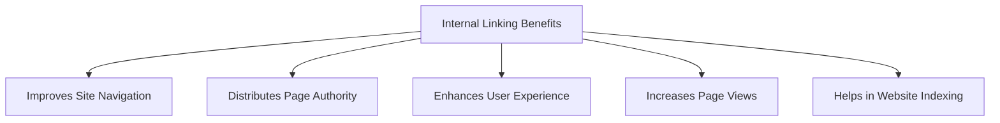
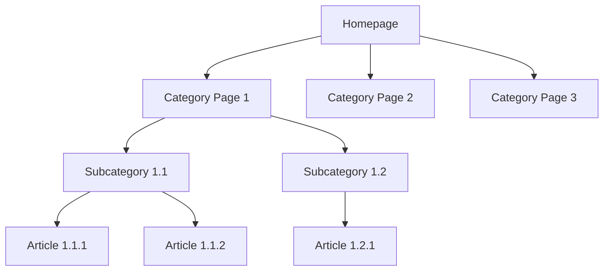

# WordPress Internal Linking

## Introduction

Internal linking is one of the most powerful yet often overlooked aspects of WordPress SEO. Internal links are hyperlinks that point from one page to another within the same website. Unlike external links that connect your site to other websites, internal links create pathways between your own content, helping both users and search engines navigate your website more effectively.

In this guide, we'll explore why internal linking matters, how it benefits your WordPress site, and provide practical implementation strategies to enhance your site's SEO performance and user experience.

## Why Internal Linking Matters

Internal linking serves several critical functions:



1. **Improves Site Navigation**: Internal links create pathways for visitors to discover related content.
2. **Distributes Page Authority**: Links pass SEO value between pages, helping distribute ranking potential.
3. **Enhances User Experience**: Well-placed links help visitors find more relevant information.
4. **Increases Page Views**: Strategic internal linking encourages visitors to explore more content.
5. **Helps in Website Indexing**: Search engine crawlers use links to discover and index your content.

## Internal Linking Best Practices

### 1. Use Descriptive Anchor Text

The clickable text of your internal links (anchor text) should be descriptive and relevant to the linked content. Avoid generic phrases like "click here" or "read more."

**Poor Example:**
```html
To learn more about WordPress themes, <a href="https://example.com/wordpress-themes">click here</a>.
```

**Better Example:**
```html
We offer guidance on selecting the right <a href="https://example.com/wordpress-themes">WordPress themes for business websites</a>.
```

### 2. Link Strategically to Important Pages

Identify your most important or high-converting pages and ensure they receive more internal links than less critical pages.

### 3. Keep a Natural Link Density

While internal linking is beneficial, excessive linking can appear spammy and dilute the SEO value passed through each link. Aim for a natural placement where links truly add value.

### 4. Create a Logical Content Hierarchy

Organize your content in a pyramid structure:



## Implementing Internal Links in WordPress

### 1. Using the Block Editor (Gutenberg)

The WordPress block editor makes adding links straightforward:

1. Select the text you want to turn into a link
2. Click the link button in the toolbar (or press Ctrl+K / Cmd+K)
3. Search for existing content or enter a URL
4. Click the arrow button to complete

**Code Example:**
```html
<!-- In the WordPress block editor, this is generated automatically -->
<p>Learn more about our <a href="/wordpress-optimization-techniques">WordPress optimization techniques</a> to speed up your site.</p>
```

### 2. Creating Automated Internal Links

WordPress plugins can help automate internal linking. One popular option is the "Internal Link Juicer" plugin:

1. Install and activate the Internal Link Juicer plugin
2. Configure keywords and target URLs
3. The plugin will automatically add links based on your settings

**Example Configuration:**

```
Keyword: WordPress security
Target URL: /wordpress-security-guide
Link Limit: 3 (per post)
```

### 3. Using Custom HTML for Advanced Internal Linking

For more advanced internal linking strategies, you might need to add custom HTML:

```html
<div class="related-content">
  <h3>Related Articles</h3>
  <ul>
    <li><a href="/article1">Optimizing WordPress Images</a></li>
    <li><a href="/article2">WordPress Caching Guide</a></li>
    <li><a href="/article3">Best WordPress Security Plugins</a></li>
  </ul>
</div>
```

To implement this in WordPress, you would use a Custom HTML block in the editor.

### 4. Creating Contextual Internal Links

Contextual links appear naturally within your content and are often the most valuable type of internal link:

```html
<p>Before installing any new <a href="/wordpress-plugins">WordPress plugins</a>, always check compatibility with your current WordPress version and other installed plugins.</p>
```

## Practical Implementation Example

Let's create a comprehensive internal linking strategy for a WordPress blog:

### Step 1: Content Audit

First, organize your content into categories and identify key pages:

- Pillar content (comprehensive guides)
- Supporting articles
- Conversion-focused pages

### Step 2: Create a Linking Plan

For each new article about "WordPress Backup Solutions":

```
Link to:
- WordPress Security Guide (pillar content)
- Database Optimization Tutorial (related topic)
- WordPress Hosting Comparison (conversion page)
```

### Step 3: Implement the Links in WordPress

When writing your article about WordPress Backup Solutions:

```html
<p>Regular backups are a critical component of your overall <a href="/wordpress-security-guide">WordPress security strategy</a>. Without proper backups, recovering from attacks becomes significantly more challenging.</p>

<p>After implementing a backup solution, consider <a href="/database-optimization">optimizing your WordPress database</a> to ensure your backups remain manageable in size.</p>

<p>The quality of your <a href="/wordpress-hosting-comparison">WordPress hosting provider</a> can significantly impact your backup options and reliability.</p>
```

## Advanced Internal Linking Techniques

### 1. Create Hub Pages

Hub pages act as content clusters, linking to multiple related articles around a specific topic.

**Example Hub Page Structure:**

```html
<h2>Complete WordPress SEO Guide</h2>

<div class="topic-section">
  <h3>On-Page SEO</h3>
  <ul>
    <li><a href="/title-optimization">Title Tag Optimization</a></li>
    <li><a href="/meta-descriptions">Writing Effective Meta Descriptions</a></li>
  </ul>
</div>

<div class="topic-section">
  <h3>Technical SEO</h3>
  <ul>
    <li><a href="/site-speed">Improving Site Speed</a></li>
    <li><a href="/mobile-optimization">Mobile Optimization</a></li>
  </ul>
</div>
```

### 2. Use Table of Contents for Internal Page Linking

For long-form content, create a table of contents with anchor links:

```html
<div class="table-of-contents">
  <h3>In this article:</h3>
  <ul>
    <li><a href="#section1">Understanding WordPress Backups</a></li>
    <li><a href="#section2">Manual Backup Methods</a></li>
    <li><a href="#section3">Automated Backup Solutions</a></li>
  </ul>
</div>

<h2 id="section1">Understanding WordPress Backups</h2>
<!-- Section content -->

<h2 id="section2">Manual Backup Methods</h2>
<!-- Section content -->

<h2 id="section3">Automated Backup Solutions</h2>
<!-- Section content -->
```

### 3. Adding "Related Posts" Sections

End each article with related posts to encourage further exploration:

```php
<?php
// Example PHP code for a custom related posts function
function display_related_posts() {
    $current_post_id = get_the_ID();
    $current_post_tags = wp_get_post_tags($current_post_id);
    
    if ($current_post_tags) {
        $tag_ids = array();
        foreach($current_post_tags as $tag) {
            $tag_ids[] = $tag->term_id;
        }
        
        $args = array(
            'tag__in' => $tag_ids,
            'post__not_in' => array($current_post_id),
            'posts_per_page' => 3,
            'ignore_sticky_posts' => 1
        );
        
        $related_query = new WP_Query($args);
        
        if ($related_query->have_posts()) {
            echo '<div class="related-posts"><h3>Related Articles</h3><ul>';
            while ($related_query->have_posts()) {
                $related_query->the_post();
                echo '<li><a href="' . get_permalink() . '">' . get_the_title() . '</a></li>';
            }
            echo '</ul></div>';
        }
        
        wp_reset_postdata();
    }
}
?>
```

To use this in your WordPress theme, you would add:

```php
<?php display_related_posts(); ?>
```

## Monitoring Internal Linking Success

### 1. Using Google Search Console

Google Search Console provides insights into how Google crawls your site:

1. Log in to Google Search Console
2. Navigate to "Coverage" report
3. Check for crawl errors or orphaned pages
4. Address issues by adding internal links to orphaned content

### 2. WordPress SEO Plugins

Plugins like Yoast SEO provide internal linking suggestions:

1. Install Yoast SEO Premium
2. While editing content, check the "Internal linking suggestions" box
3. Add suggested links where contextually appropriate

## Common Internal Linking Mistakes to Avoid

1. **Orphaned Content**: Pages with no internal links pointing to them
2. **Over-Optimization**: Using the same anchor text repeatedly
3. **Broken Links**: Links that point to non-existent pages
4. **Too Many Links**: Excessive linking on a single page
5. **Poor Navigation Structure**: Confusing site architecture

## Summary

Effective internal linking is a powerful component of WordPress SEO that helps search engines understand your site structure while enhancing user experience. By implementing strategic internal links, you can guide visitors through your content, distribute page authority, and improve overall site visibility.

Remember these key principles:
- Use descriptive anchor text
- Link strategically to important pages
- Create a logical content hierarchy
- Monitor and update your internal links regularly
- Avoid common internal linking mistakes

When done correctly, internal linking can significantly improve your WordPress site's SEO performance, user engagement, and conversion rates.

## Additional Resources

To continue mastering WordPress internal linking:

1. Analyze successful websites in your niche to understand their linking strategies
2. Create a content map of your website to visualize linking opportunities
3. Regularly audit your internal links with tools like Screaming Frog
4. Study your site analytics to identify which internal links drive the most engagement

## Practice Exercises

1. Audit your top 10 most-visited pages and ensure they link to your conversion-focused pages
2. Create a hub page for your primary topic that links to all related subtopics
3. Implement a "related posts" section on your blog posts
4. Fix any orphaned content by adding relevant internal links

By consistently applying these strategies, your WordPress site will develop a robust internal linking structure that benefits both users and search engines.