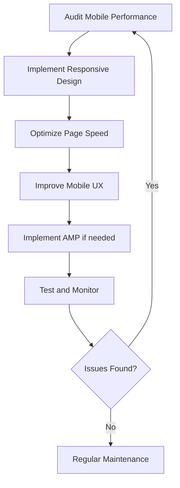

# WordPress Mobile SEO

## Introduction

Mobile SEO (Search Engine Optimization) for WordPress is now more important than ever. With Google's mobile-first indexing, search engines primarily use the mobile version of your website for ranking and indexing. This means that if your WordPress site isn't optimized for mobile devices, you could be missing out on significant traffic, engagement, and conversions.

In this guide, we'll cover everything you need to know about optimizing your WordPress website for mobile search engines, from understanding mobile-first indexing to implementing practical techniques that improve your site's mobile performance and user experience.

## Why Mobile SEO Matters

### The Mobile-First Reality

The statistics speak for themselves:

- Over 60% of web traffic comes from mobile devices
- Google uses mobile-first indexing for most websites
- Mobile page speed is a direct ranking factor
- Poor mobile experience leads to higher bounce rates and lower conversions

Mobile SEO isn't just about rankings—it's about providing a seamless user experience across all devices, which ultimately contributes to your website's success.

## Basic Components of WordPress Mobile SEO

### 1. Responsive Design

A responsive WordPress theme automatically adjusts your website's layout based on the user's screen size and device.

#### How to Check if Your Theme is Responsive

In WordPress, go to **Appearance > Themes** and look for "responsive" in the theme description. To test your current theme's responsiveness:

1. Visit your website in a desktop browser
2. Right-click and select "Inspect" or press F12
3. Click the mobile device icon in the developer tools
4. Resize the screen to see how your site adapts

#### Implementation Example

If your theme isn't responsive, you have several options:

1. **Switch to a responsive theme:**

```jsx
// This isn't actual code, but represents the process
// Go to Appearance > Themes > Add New
// Search for "responsive" and choose a theme
// Click "Install" and then "Activate"
```

2. **Add responsive CSS to your child theme:**

```css
/* Example of basic responsive CSS in your child theme's style.css */
@media only screen and (max-width: 768px) {
  .site-header {
    padding: 10px;
  }
  
  .main-navigation {
    display: none;
  }
  
  .mobile-navigation {
    display: block;
  }
}
```

### 2. Mobile Page Speed Optimization

Mobile users expect fast-loading pages. Here are techniques to improve your WordPress site's mobile speed:

#### Enable Caching

Install a caching plugin like WP Rocket, W3 Total Cache, or LiteSpeed Cache.

```php
// Example of adding caching headers manually (if you're not using a plugin)
// Add this to your .htaccess file
<IfModule mod_expires.c>
  ExpiresActive On
  ExpiresByType image/jpg "access plus 1 year"
  ExpiresByType image/jpeg "access plus 1 year"
  ExpiresByType image/gif "access plus 1 year"
  ExpiresByType image/png "access plus 1 year"
  ExpiresByType text/css "access plus 1 month"
  ExpiresByType application/pdf "access plus 1 month"
  ExpiresByType text/javascript "access plus 1 month"
  ExpiresByType application/javascript "access plus 1 month"
  ExpiresDefault "access plus 2 days"
</IfModule>
```

#### Image Optimization

Optimize images for mobile viewing to reduce loading times:

1. Install and configure an image optimization plugin like Smush or ShortPixel
2. Use properly sized images with the `srcset` attribute:

```html

```

#### Minify CSS and JavaScript

Use plugins like Autoptimize or WP Rocket to:
- Minify CSS and JavaScript
- Combine files
- Defer JavaScript loading

#### Implement Lazy Loading

WordPress now includes native lazy loading for images. Make sure your theme uses it:

```html

```

For older WordPress versions or additional elements, use a lazy loading plugin like a3 Lazy Load.

## Advanced Mobile SEO Techniques

### 1. Accelerated Mobile Pages (AMP)

AMP provides a stripped-down HTML framework that creates super-fast loading pages for mobile devices.

#### Setting Up AMP in WordPress

1. Install the AMP plugin:

```jsx
// Go to Plugins > Add New
// Search for "AMP"
// Install and activate the official AMP plugin
```

2. Configure AMP settings:

```jsx
// Navigate to AMP > Settings
// Choose your preferred template mode:
// - Standard: Full AMP website
// - Transitional: Both AMP and non-AMP versions
// - Reader: AMP only for specific content types
```

3. Customize AMP appearance:

```jsx
// Go to Appearance > Customize > AMP
// Adjust colors, fonts, and layout options
```

### 2. Mobile-Friendly Navigation

Navigation is crucial for mobile users. Here's how to optimize it:

#### Implement a Hamburger Menu

Most responsive themes include a hamburger menu for mobile devices. If yours doesn't, add one:

```jsx
// Example of adding a simple hamburger menu with jQuery
// Add to your theme's JavaScript file

jQuery(document).ready(function($) {
  $('.menu-toggle').click(function() {
    $('nav.main-navigation').toggleClass('toggled');
  });
});
```

```css
/* Add to your stylesheet */
.menu-toggle {
  display: none;
}

@media screen and (max-width: 768px) {
  .menu-toggle {
    display: block;
    cursor: pointer;
  }
  
  .main-navigation ul {
    display: none;
  }
  
  .main-navigation.toggled ul {
    display: block;
  }
}
```

#### Optimize Touch Targets

Make sure buttons and links are large enough for touch interaction (at least 44×44 pixels):

```css
@media screen and (max-width: 768px) {
  .nav-link,
  .button,
  input[type="submit"] {
    min-height: 44px;
    min-width: 44px;
    padding: 12px 16px;
  }
}
```

### 3. Testing and Monitoring Mobile SEO

#### Google's Mobile-Friendly Test

Regularly test your site with Google's Mobile-Friendly Test tool.

#### Mobile Usability Reports in Google Search Console

1. Log in to Google Search Console
2. Navigate to the "Mobile Usability" report
3. Address any issues reported

#### Setting Up Mobile Analytics

Configure Google Analytics to track mobile performance:

1. Log in to Google Analytics
2. Create segments for mobile traffic
3. Monitor key mobile metrics:
   - Page load time
   - Bounce rate
   - Average time on page
   - Conversion rate

## Practical Implementation Example

Let's walk through a complete mobile SEO optimization for a WordPress blog:

### Step 1: Audit Your Current Mobile Performance

Before making changes, assess your current mobile SEO status:

1. Run a mobile speed test using Google PageSpeed Insights
2. Check mobile usability issues in Google Search Console
3. Review mobile analytics data

### Step 2: Implement the Core Optimizations

Based on the audit, implement these core optimizations:

1. **Switch to a responsive theme** if needed
2. **Install and configure key plugins**:
   - A caching plugin like WP Rocket
   - An image optimization plugin like Smush
   - A mobile optimization plugin like AMP

3. **Optimize the header.php file** to ensure proper viewport settings:

```php
<!DOCTYPE html>
<html <?php language_attributes(); ?>>
<head>
  <meta charset="<?php bloginfo('charset'); ?>">
  <meta name="viewport" content="width=device-width, initial-scale=1">
  <link rel="profile" href="https://gmpg.org/xfn/11">
  <?php wp_head(); ?>
</head>
```

4. **Improve mobile loading speed**:

```php
// Add to functions.php to remove unnecessary scripts on mobile
function optimize_scripts_for_mobile() {
  if (wp_is_mobile()) {
    // Remove non-essential scripts and styles
    wp_dequeue_style('non-essential-style');
    wp_dequeue_script('non-essential-script');
  }
}
add_action('wp_enqueue_scripts', 'optimize_scripts_for_mobile', 100);
```

### Step 3: Optimize Content for Mobile Readers

1. **Break content into smaller paragraphs** (2-3 sentences)
2. **Add clear subheadings** for scannable content
3. **Use mobile-friendly tables** with horizontal scrolling:

```css
/* Add to your stylesheet */
.table-container {
  width: 100%;
  overflow-x: auto;
}

@media screen and (max-width: 768px) {
  .wp-block-table table {
    min-width: 600px;
  }
}
```

```html
<!-- Implementation in your content -->
<div class="table-container">
  <table>
    <!-- Table content here -->
  </table>
</div>
```

4. **Optimize forms for mobile**:

```css
/* Add to your stylesheet */
@media screen and (max-width: 768px) {
  input, select, textarea {
    width: 100%;
    padding: 12px;
    font-size: 16px; /* Prevents iOS zoom on focus */
  }
  
  form label {
    display: block;
    margin-bottom: 8px;
  }
}
```

### Step 4: Monitor and Refine

After implementation:

1. Re-test with Google PageSpeed Insights
2. Monitor mobile user behavior in Analytics
3. Make iterative improvements based on data

## Mobile SEO Best Practices Checklist

Use this checklist to ensure your WordPress site is fully optimized for mobile SEO:

- ✅ Responsive theme installed and configured
- ✅ Proper viewport meta tag in header
- ✅ Page load time under 3 seconds on mobile
- ✅ Images properly sized and compressed
- ✅ Touch elements properly sized and spaced
- ✅ No intrusive interstitials (popups) on mobile
- ✅ Mobile-friendly fonts (minimum 16px for body text)
- ✅ Properly configured caching
- ✅ Mobile-friendly navigation
- ✅ Accessible search functionality
- ✅ Structured data implemented
- ✅ AMP configured (if applicable)
- ✅ Content prioritized for mobile viewing
- ✅ Regular testing with mobile SEO tools

## Visualizing the Mobile SEO Process



## Common Mobile SEO Issues and Solutions

| Issue | Solution |
|-------|----------|
| Slow page load | Optimize images, enable caching, minify CSS/JS |
| Non-responsive design | Switch to a responsive theme |
| Tiny text | Set font size minimum to 16px |
| Interstitials blocking content | Remove or reduce intrusive popups |
| Touch elements too close | Increase padding/margin between clickable elements |
| Content wider than screen | Set `max-width: 100%` and `overflow-x: auto` |
| Flash content | Replace with HTML5 alternatives |
| Unplayable video content | Use mobile-compatible video formats and players |

## Summary

Mobile SEO for WordPress is no longer optional—it's essential. By implementing the techniques covered in this guide, you can significantly improve your site's mobile performance, leading to better search rankings, increased traffic, and improved user engagement.

Remember that mobile optimization is an ongoing process that requires regular testing and refinement. As mobile technology evolves, so should your SEO strategy.

## Additional Resources

- [Google's Mobile-First Indexing Best Practices](https://developers.google.com/search/mobile-sites/mobile-first-indexing)
- [WordPress Documentation on Mobile Themes](https://wordpress.org/support/article/mobile-themes/)
- [PageSpeed Insights](https://pagespeed.web.dev/)
- [Mobile Usability Test](https://search.google.com/test/mobile-friendly)

## Practice Exercises

1. Run a mobile-friendly test on your WordPress site and identify three improvements you can make.
2. Implement a lazy loading solution for images and test the impact on your mobile page speed.
3. Create a mobile-specific widget area that displays only on mobile devices.
4. Set up mobile speed monitoring using Google Analytics and create a monthly report.
5. Test your site's forms on at least three different mobile devices and optimize for usability.

By consistently applying these mobile SEO principles to your WordPress site, you'll create a better experience for mobile users and improve your chances of ranking well in mobile search results.