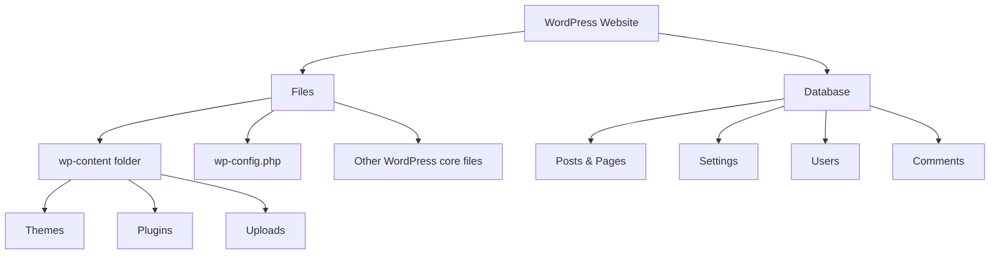

# WordPress Backup Procedures

## Introduction

Backing up your WordPress website is one of the most critical maintenance tasks that often gets overlooked until it's too late. A proper backup strategy acts as an insurance policy against various threats such as:

- Hacking attempts and security breaches
- Server failures or corruptions
- Failed updates or plugin conflicts
- Accidental file deletions or content changes
- Website migrations gone wrong

In this comprehensive guide, we'll explore different WordPress backup procedures, from manual methods to automated solutions, ensuring your website data remains protected at all times.

## Why Regular Backups Are Essential

Before diving into specific backup procedures, let's understand why backups should be a fundamental part of your WordPress maintenance routine:

1. **Peace of mind**: Knowing you can restore your site if anything goes wrong
2. **Quick recovery**: Minimizing downtime after an incident
3. **Version control**: Ability to revert to previous iterations of your website
4. **Migration assistance**: Simplifying the process of moving to a new host

## What to Back Up in WordPress

A complete WordPress backup consists of two main components:

1. **Files**: These include themes, plugins, uploads (images, videos), and any custom code
2. **Database**: Contains all your posts, pages, comments, users, and settings

Let's visualize the WordPress architecture to better understand what needs backing up:



## Basic Manual Backup Procedures

### 1. Manual Database Backup Using phpMyAdmin

Most hosting providers offer phpMyAdmin as a database management tool. Here's how to use it for backups:

1. Log in to your hosting control panel (cPanel, Plesk, etc.)
2. Open phpMyAdmin
3. Select your WordPress database from the left sidebar
4. Click on the "Export" tab at the top
5. Choose "Quick" export method and SQL format
6. Click "Go" to download the SQL file

Here's what the process typically looks like in code:

```sql
-- phpMyAdmin SQL Dump
-- version 5.1.1
-- https://www.phpmyadmin.net/
--
-- Host: localhost
-- Generation Time: Jun 15, 2023 at 10:30 AM
-- Server version: 10.4.21-MariaDB
-- PHP Version: 8.0.12

SET SQL_MODE = "NO_AUTO_VALUE_ON_ZERO";
START TRANSACTION;
SET time_zone = "+00:00";

-- Database: `wp_database`
-- Exporting data...

-- Table structure and data will follow
```

### 2. Manual File Backup via FTP

To back up your WordPress files manually:

1. Connect to your server using an FTP client (like FileZilla)
2. Navigate to your WordPress installation directory
3. Download all files to your local computer, especially the `wp-content` folder
4. Ensure you save the `.htaccess` file and `wp-config.php` file

Essential code configuration from your `wp-config.php` that you should back up:

```php
// Database connection settings
define( 'DB_NAME', 'database_name_here' );
define( 'DB_USER', 'username_here' );
define( 'DB_PASSWORD', 'password_here' );
define( 'DB_HOST', 'localhost' );

// Authentication unique keys and salts
define( 'AUTH_KEY',         'put your unique phrase here' );
define( 'SECURE_AUTH_KEY',  'put your unique phrase here' );
// ... other security keys
```

## Automated Backup Solutions

### 1. Using WordPress Backup Plugins

Several excellent plugins can automate the backup process:

#### UpdraftPlus

One of the most popular free backup plugins with over 3 million active installations.

**Setting up UpdraftPlus:**

1. Install and activate the plugin from the WordPress repository
2. Go to Settings > UpdraftPlus Backups
3. Configure backup schedule (files and database)
4. Select remote storage (Google Drive, Dropbox, etc.)
5. Click "Save Changes"

```php
// Example UpdraftPlus filter to modify backup schedule
add_filter('updraftplus_schedule_backup', function($schedules) {
    // Add a twice-daily backup schedule
    $schedules['twicedaily'] = array(
        'interval' => 43200, // 12 hours in seconds
        'display' => 'Twice Daily'
    );
    return $schedules;
});
```

#### BackupBuddy

A premium plugin offering comprehensive backup solutions.

**Key features:**

- Complete WordPress backups (files and database)
- Scheduled automatic backups
- Offsite storage options
- Easy migration and restoration

### 2. Using Hosting Provider Backup Services

Many quality WordPress hosts provide automated backup services:

- **Managed WordPress hosts** like WP Engine, Kinsta, and Flywheel include daily automated backups
- **Shared hosting providers** often offer backup solutions through their control panels

Example of enabling backups in cPanel:

1. Log in to cPanel
2. Find the "Backup" or "Backup Wizard" section
3. Choose "Full Backup" option
4. Select destination and schedule
5. Confirm settings

## Backup Storage Best Practices

Following the 3-2-1 backup strategy is highly recommended:

- **3** copies of your data
- Stored on **2** different types of media
- With **1** copy stored offsite

Suitable storage options include:

1. **Cloud storage services**:
   - Google Drive
   - Dropbox
   - Amazon S3
   - Microsoft OneDrive

2. **External hard drives**:
   - Keep a local copy for quick restoration

3. **Email backups**:
   - Send small database backups to your email

## Creating a Backup Schedule

Based on your website's update frequency, consider:

| Website Activity | Recommended Backup Frequency |
|-----------------|------------------------------|
| High (e-commerce, membership sites) | Daily or multiple times per day |
| Medium (blogs with regular posts) | 2-3 times per week |
| Low (static brochure sites) | Weekly |

Additionally, always create manual backups before:
- WordPress core updates
- Theme or plugin updates
- Major content changes
- Website customizations

## Restoring from a Backup

### Database Restoration

To restore a WordPress database from a SQL backup:

1. Log in to phpMyAdmin
2. Select your database
3. Click on the "Import" tab
4. Choose your SQL backup file
5. Click "Go" to execute the import

For large database files that exceed upload limits, you may need to split the SQL file or use command-line tools:

```bash
# MySQL command line restoration
mysql -u username -p database_name < backup.sql
```

### File Restoration

To restore WordPress files:

1. Connect to your server via FTP
2. Upload all backed-up files to the appropriate directories
3. Ensure file permissions are set correctly:
   - Files: 644
   - Directories: 755
   - wp-config.php: 600

```bash
# Setting correct permissions via command line
find /path/to/wordpress -type f -exec chmod 644 {} \;
find /path/to/wordpress -type d -exec chmod 755 {} \;
chmod 600 /path/to/wordpress/wp-config.php
```

### Plugin-Based Restoration

If using a backup plugin like UpdraftPlus:

1. Reinstall WordPress if needed
2. Install and activate the backup plugin
3. Navigate to the restore section
4. Upload or select your backup files
5. Follow the plugin's guided restoration process

## Testing Your Backups

A backup is only as good as its ability to restore your site. Regularly test your backups by:

1. Setting up a staging environment or local development site
2. Restoring your backup to this environment
3. Verifying that all content, functionality, and settings work correctly

Example of setting up a local testing environment with Docker:

```bash
# Pull WordPress Docker image
docker pull wordpress

# Start WordPress container
docker run -e WORDPRESS_DB_HOST=db -e WORDPRESS_DB_USER=user \
-e WORDPRESS_DB_PASSWORD=password -e WORDPRESS_DB_NAME=wordpress \
-p 8080:80 --name wordpress --network wordpress-network -d wordpress
```

## Common Backup Challenges and Solutions

| Challenge | Solution |
|-----------|----------|
| Large website size | Use incremental backups or split backups |
| Server timeout during backup | Adjust PHP timeout settings or use command-line tools |
| Limited hosting storage | Use external storage services |
| Backup security concerns | Encrypt backups and secure access credentials |

## Summary

Implementing a robust WordPress backup procedure is a fundamental aspect of responsible website maintenance. By following the strategies outlined in this guide:

1. Understanding what needs to be backed up (files and database)
2. Implementing automated backup solutions
3. Following proper storage practices
4. Creating a consistent backup schedule
5. Testing restoration procedures
6. Addressing common challenges

You'll significantly reduce the risk of data loss and ensure your WordPress website can quickly recover from unexpected issues.

## Additional Resources and Exercises

### Resources

- WordPress Codex: [Backing Up Your WordPress Site](https://wordpress.org/support/article/wordpress-backups/)
- Read documentation for popular backup plugins:
  - UpdraftPlus
  - BackupBuddy
  - Duplicator

### Practice Exercises

1. Set up a local WordPress installation and practice both manual and automated backup procedures.
2. Create a backup of your WordPress site using two different methods and compare the results.
3. Simulate a website crash scenario and practice restoring from your backups.
4. Design a comprehensive backup strategy for a WordPress website that includes scheduling, storage, and testing plans.
5. Configure automated off-site backups to a cloud storage service of your choice.

Remember that backups are not a one-time task but an ongoing maintenance procedure that provides the ultimate safety net for your WordPress website.