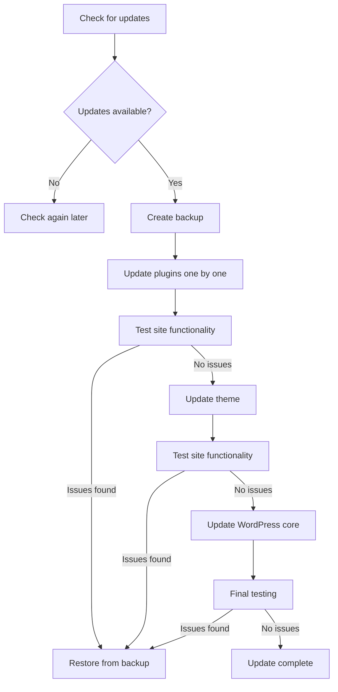

# WordPress Updates Management

## Introduction

Managing WordPress updates is a critical aspect of website maintenance. Regular updates not only provide new features and improvements but also patch security vulnerabilities and fix bugs. This guide will walk you through the process of managing WordPress updates efficiently, ensuring your website remains secure, stable, and performant.

WordPress has three main components that require updates:
- WordPress core system
- Themes
- Plugins

Understanding how to properly manage these updates will help you maintain a healthy WordPress website while minimizing the risk of breaking your site during the update process.

## Why Updates Matter

Before diving into the how-to, let's understand why keeping WordPress updated is crucial:

1. **Security**: Updates often include patches for security vulnerabilities
2. **Bug fixes**: Resolves issues that might be affecting your website
3. **New features**: Adds functionality and improvements
4. **Compatibility**: Ensures your site works with the latest web technologies
5. **Performance**: Often includes optimizations for better speed and efficiency

## Understanding WordPress Update Types

### Core Updates

WordPress core updates come in two varieties:

1. **Major updates** (e.g., 5.8 → 5.9): Include new features, major changes, and may require theme/plugin compatibility checks
2. **Minor updates** (e.g., 5.8 → 5.8.1): Primarily security fixes and bug fixes, generally safe to apply immediately

### Plugin and Theme Updates

These updates vary widely in scope:
- Some are minor bug fixes
- Others introduce new features
- Some may include database changes
- Some might break compatibility with other components

## Best Practices for Update Management

### 1. Create Backups Before Updating

Always back up your website before performing updates. This provides a safety net in case something goes wrong.

```php
// Example of backup using WP-CLI
// You would run this command in your terminal
wp db export my_database_backup.sql
```

Using a backup plugin like UpdraftPlus or BackupBuddy is also recommended for beginners.

### 2. Use a Staging Environment

For critical websites, test updates in a staging environment before applying them to your live site.

```php
// Example of creating a staging site with WP-CLI
// Clone your site to a staging subdomain
wp db export - | ssh user@staging-server "wp db import -"
wp search-replace "www.yoursite.com" "staging.yoursite.com"
```

### 3. Update Process Workflow

Here's a recommended workflow for WordPress updates:



### 4. Updating WordPress Core

You can update WordPress core in two main ways:

#### Method 1: Through the Dashboard

1. Log in to your WordPress admin dashboard
2. Navigate to Dashboard → Updates
3. If a WordPress update is available, you'll see a notification
4. Click the "Update Now" button

#### Method 2: Using WP-CLI

For developers and advanced users, WP-CLI provides a command-line interface:

```bash
# Check for core updates
wp core check-update

# Update WordPress core
wp core update

# Update database if needed
wp core update-db
```

### 5. Updating Plugins

#### Method 1: Bulk Update

1. Go to Plugins → Installed Plugins
2. Select the plugins you want to update
3. Choose "Update" from the bulk actions dropdown
4. Click "Apply"

```php
// Using WP-CLI to update all plugins
wp plugin update --all
```

#### Method 2: Individual Updates

For a more controlled approach, update plugins one by one:

1. Go to Plugins → Installed Plugins
2. Find plugins with "Update Available" notice
3. Click "Update Now" for each plugin
4. Test your site after each critical plugin update

```php
// Update a specific plugin with WP-CLI
wp plugin update woocommerce
```

### 6. Updating Themes

1. Go to Appearance → Themes
2. You'll see an update notification on themes that need updating
3. Click the theme, and you'll see an "Update Available" message
4. Click "Update Now"

```php
// Update the active theme using WP-CLI
wp theme update $(wp theme list --status=active --field=name)

// Update all themes
wp theme update --all
```

## Automating WordPress Updates

WordPress provides options for automating updates:

### 1. Built-in Auto-updates

Since WordPress 5.6, you can enable auto-updates for plugins and themes:

1. For plugins: Go to Plugins → Installed Plugins, click "Enable auto-updates" under each plugin
2. For themes: Go to Appearance → Themes, click a theme, then click "Enable auto-updates"

### 2. Configure Auto-updates via wp-config.php

You can add these constants to your `wp-config.php` file to control auto-updates:

```php
// Enable all automatic updates (core, plugins, themes)
define('WP_AUTO_UPDATE_CORE', true);

// Auto-update only minor versions
define('WP_AUTO_UPDATE_CORE', 'minor');

// Disable all automatic updates
define('AUTOMATIC_UPDATER_DISABLED', true);
```

### 3. Custom Code for Selective Auto-updates

This code example allows certain plugins to auto-update while others are managed manually:

```php
// Add this to your theme's functions.php or a custom plugin
function auto_update_specific_plugins($update, $item) {
    // List of plugins to auto-update
    $plugins = array(
        'akismet', // Akismet plugin
        'wordfence', // Wordfence Security plugin
    );

    if (in_array($item->slug, $plugins)) {
        return true; // Auto-update these plugins
    } else {
        return $update; // Default behavior for others
    }
}
add_filter('auto_update_plugin', 'auto_update_specific_plugins', 10, 2);
```

## Handling Update Failures

Sometimes updates can fail or cause issues. Here's how to handle common problems:

### 1. White Screen of Death (WSOD)

If you see a blank white screen after an update:

1. Access your site via FTP or file manager
2. Rename the plugin or theme folder that's causing the issue
3. This automatically deactivates the problematic component

```php
// If you know which plugin is causing the issue, you can use WP-CLI to deactivate it
wp plugin deactivate problematic-plugin
```

### 2. Maintenance Mode Stuck

If your site gets stuck in maintenance mode:

1. Connect to your server via FTP or file manager
2. Look for a file named `.maintenance` in your WordPress root directory
3. Delete this file to exit maintenance mode

### 3. Database Update Required

Some major updates require database updates:

1. Follow the prompts in WordPress admin to update the database
2. Make sure you have a backup before proceeding
3. Don't interrupt the process once started

## Update Notification Management

WordPress sends email notifications about updates. To customize this behavior:

```php
// Disable update notification emails
add_filter('auto_core_update_send_email', '__return_false');

// Only send emails for critical updates
add_filter('auto_core_update_send_email', 'only_send_email_for_critical_updates', 10, 4);
function only_send_email_for_critical_updates($send, $type, $core_update, $result) {
    if ($type == 'success' && !empty($core_update->response) && $core_update->response == 'critical') {
        return true;
    }
    return false;
}
```

## WordPress Update Management for Multisite Networks

If you manage a WordPress Multisite network:

1. Network updates must be performed by the Super Admin
2. Go to Network Admin → Updates
3. Update WordPress core network-wide
4. Plugin and theme updates can be managed network-wide

```php
// Update WordPress core across a multisite network using WP-CLI
wp core update --network
wp core update-db --network
```

## Best Practices and Schedule

Establish a regular update schedule:

1. **Daily**: Check for security updates
2. **Weekly**: Update plugins and themes
3. **As Released**: Evaluate major WordPress core updates
4. **Monthly**: Clean up unused plugins and themes

## Common Update Issues and Solutions

| Issue | Solution |
|-------|----------|
| Incompatible plugin | Deactivate the plugin, find an alternative, or contact the developer |
| Theme breaks after update | Switch to default theme temporarily, check with theme developer |
| Server timeout during update | Increase PHP memory limit or perform manual update |
| Locked out of admin | Use FTP to rename the plugin/theme folder to deactivate it |

## Summary

Managing WordPress updates is essential for security, stability, and performance. By following the best practices outlined in this guide, you can:

- Keep your WordPress installation secure
- Prevent compatibility issues
- Maintain optimal website performance
- Benefit from new features and improvements
- Minimize downtime due to update-related issues

Remember that a consistent update strategy is key to WordPress maintenance. Create backups, test updates in staging when possible, and update regularly following a systematic approach.

## Additional Resources

- [WordPress Codex on Updating WordPress](https://wordpress.org/documentation/article/updating-wordpress/)
- [WP-CLI Documentation](https://wp-cli.org/commands/)
- [WordPress Security Best Practices](https://wordpress.org/documentation/article/hardening-wordpress/)

## Exercises

1. Set up a staging environment for your WordPress website
2. Create an update checklist specific to your website
3. Configure automated backups before updates
4. Test restoring your site from a backup
5. Implement a custom auto-update strategy for your plugins

By mastering WordPress updates management, you'll ensure your site remains secure, stable, and up-to-date with the latest features and improvements.