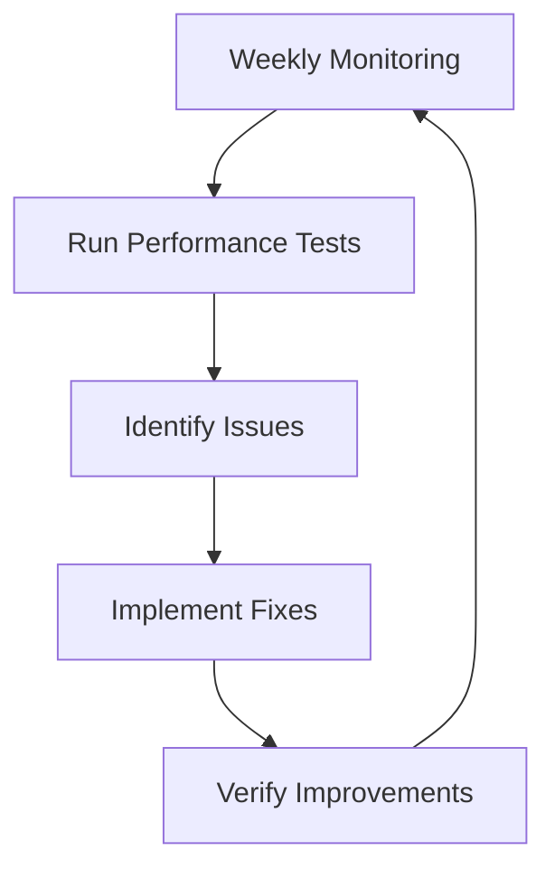

# WordPress Performance Monitoring

Performance monitoring is a critical aspect of WordPress maintenance that helps ensure your site loads quickly, functions efficiently, and provides a smooth experience for your visitors. In this guide, we'll explore how to monitor your WordPress site's performance, identify bottlenecks, and implement solutions to optimize speed and efficiency.

## Why WordPress Performance Matters

Before diving into monitoring techniques, let's understand why performance is crucial:

- **User Experience**: Users expect websites to load within 2-3 seconds. Slower sites lead to higher bounce rates.
- **SEO Ranking**: Search engines like Google consider page speed as a ranking factor.
- **Conversion Rates**: Faster sites typically have higher conversion rates.
- **Server Resources**: Efficient sites consume fewer server resources, which can reduce hosting costs.

## Key Performance Metrics to Monitor

When evaluating WordPress performance, focus on these essential metrics:

1. **Page Load Time**: The total time it takes for a page to fully load.
2. **Time to First Byte (TTFB)**: How quickly the server responds with the first byte of data.
3. **Server Response Time**: How long your server takes to respond to requests.
4. **Database Query Performance**: The efficiency of database operations.
5. **Resource Usage**: CPU, memory, and disk usage on your server.

## Performance Monitoring Tools

### 1. Built-in WordPress Tools

WordPress offers some basic monitoring capabilities through plugins and the Site Health tool.

#### Site Health

The Site Health tool (introduced in WordPress 5.2) provides basic performance insights:

1. Navigate to your WordPress admin dashboard
2. Go to `Tools > Site Health`
3. Review the "Status" and "Info" tabs for performance-related issues

```jsx
// This isn't code you need to write, but demonstrates how WordPress
// internally checks for performance issues in Site Health
function wp_check_php_version() {
    $version = phpversion();
    $recommended = '7.4';
    
    if ( version_compare( $version, $recommended, '<' ) ) {
        return array(
            'status'  => 'recommended',
            'message' => sprintf(
                'Your PHP version (%s) is below the recommended version of %s.',
                $version,
                $recommended
            ),
        );
    }
    
    return array( 'status' => 'good' );
}
```

### 2. Third-Party WordPress Plugins

#### Query Monitor

[Query Monitor](https://wordpress.org/plugins/query-monitor/) is a developer-focused debugging plugin that helps identify slow database queries, API calls, and more.

**Installation and Usage:**

1. Install and activate the Query Monitor plugin
2. A debugging toolbar appears at the top of your site
3. Click different sections to see detailed performance information

Here's what you might see when analyzing a slow query:

```sql
-- Example of a problematic database query identified by Query Monitor
SELECT p.*, m1.meta_value as custom_field1, m2.meta_value as custom_field2
FROM wp_posts p
LEFT JOIN wp_postmeta m1 ON p.ID = m1.post_id AND m1.meta_key = 'custom_field1'
LEFT JOIN wp_postmeta m2 ON p.ID = m2.post_id AND m2.meta_key = 'custom_field2'
WHERE p.post_type = 'post' AND p.post_status = 'publish'
ORDER BY p.post_date DESC
LIMIT 10
```

**Performance Issue:** Multiple JOIN operations without proper indexing can slow down page loading.

#### WP Rocket (Premium)

WP Rocket offers a built-in database optimization tool and metrics to identify bloated database tables:

```jsx
// Example of what WP Rocket might do to optimize database tables
function clean_post_revisions() {
    global $wpdb;
    $query = "DELETE FROM $wpdb->posts WHERE post_type = 'revision'";
    $wpdb->query($query);
}
```

### 3. Browser-Based Tools

#### Google PageSpeed Insights

Google PageSpeed Insights provides detailed performance analysis based on both lab and field data.

**Usage:**
1. Visit [PageSpeed Insights](https://pagespeed.web.dev/)
2. Enter your website URL
3. Review performance scores and recommendations

Example output interpretation:

```jsx
// This represents the JSON data structure from PageSpeed Insights
const pageSpeedResults = {
  "performance": 75,  // Score out of 100
  "first_contentful_paint": 1.8,  // Time in seconds
  "speed_index": 2.5,  // Time in seconds
  "largest_contentful_paint": 2.9,  // Time in seconds
  "total_blocking_time": 150,  // Time in milliseconds
  "cumulative_layout_shift": 0.05  // Unitless
};
```

#### Browser Developer Tools

Chrome DevTools provides comprehensive performance analysis:

1. Open Chrome DevTools (F12 or right-click > Inspect)
2. Go to the "Network" tab
3. Reload the page to see loading times for each resource

## Setting Up Automated Performance Monitoring

For continuous monitoring, consider setting up automated tools that track performance over time.

### Using New Relic for WordPress

New Relic offers detailed performance monitoring with these steps:

1. Sign up for a New Relic account
2. Install the New Relic PHP agent on your server
3. Add the following snippet to your `wp-config.php` file:

```php
// Add this to wp-config.php before WordPress is loaded
define('NEWRELIC_APPNAME', 'Your WordPress Site Name');
```

4. Set up custom transaction naming to better identify WordPress pages:

```php
// Add to your theme's functions.php
function nr_custom_transaction_name() {
    if (extension_loaded('newrelic')) {
        if (is_single()) {
            newrelic_name_transaction('Single: ' . get_the_title());
        } elseif (is_page()) {
            newrelic_name_transaction('Page: ' . get_the_title());
        } elseif (is_archive()) {
            newrelic_name_transaction('Archive: ' . get_the_archive_title());
        }
    }
}
add_action('wp', 'nr_custom_transaction_name');
```

### Setting Up Uptime Robot

For basic uptime monitoring:

1. Create an account on [Uptime Robot](https://uptimerobot.com/)
2. Add a new monitor for your WordPress site
3. Configure alert settings for downtime notifications

## Common Performance Issues & Fixes

Let's examine typical WordPress performance problems and solutions:

### 1. Slow Database Queries

**Detection:**
Use Query Monitor to identify slow queries.

**Solution:**
Optimize database tables and add proper indexing:

```sql
-- Example: Adding an index to improve query performance
ALTER TABLE wp_postmeta ADD INDEX custom_field_index (meta_key, meta_value);
```

### 2. High Server Resource Usage

**Detection:**
Monitor server CPU and memory usage with tools like New Relic or your hosting provider's dashboard.

**Solution:**
Implement object caching with Redis:

1. Install the Redis Object Cache plugin
2. Add this to your `wp-config.php`:

```php
// Redis configuration for object caching
define('WP_CACHE', true);
define('WP_REDIS_HOST', '127.0.0.1');
define('WP_REDIS_PORT', 6379);
```

### 3. Slow Page Load Times

**Detection:**
Use PageSpeed Insights or GTmetrix to identify slow-loading pages.

**Solution:**
Implement full-page caching and Gzip compression:

```php
// Example .htaccess rules for Gzip compression
<IfModule mod_deflate.c>
  # Compress HTML, CSS, JavaScript, Text, XML and fonts
  AddOutputFilterByType DEFLATE application/javascript
  AddOutputFilterByType DEFLATE application/rss+xml
  AddOutputFilterByType DEFLATE application/vnd.ms-fontobject
  AddOutputFilterByType DEFLATE application/x-font
  AddOutputFilterByType DEFLATE application/x-font-opentype
  AddOutputFilterByType DEFLATE application/x-font-otf
  AddOutputFilterByType DEFLATE application/x-font-truetype
  AddOutputFilterByType DEFLATE application/x-font-ttf
  AddOutputFilterByType DEFLATE application/x-javascript
  AddOutputFilterByType DEFLATE application/xhtml+xml
  AddOutputFilterByType DEFLATE application/xml
  AddOutputFilterByType DEFLATE font/opentype
  AddOutputFilterByType DEFLATE font/otf
  AddOutputFilterByType DEFLATE font/ttf
  AddOutputFilterByType DEFLATE image/svg+xml
  AddOutputFilterByType DEFLATE image/x-icon
  AddOutputFilterByType DEFLATE text/css
  AddOutputFilterByType DEFLATE text/html
  AddOutputFilterByType DEFLATE text/javascript
  AddOutputFilterByType DEFLATE text/plain
  AddOutputFilterByType DEFLATE text/xml
</IfModule>
```

## Creating a Performance Monitoring Workflow

To effectively monitor your WordPress site's performance, establish a regular workflow:



### Sample Monitoring Schedule

1. **Daily**
   - Check uptime status
   - Review error logs for critical issues

2. **Weekly**
   - Run PageSpeed Insights tests
   - Check database performance with Query Monitor
   - Review New Relic transaction times

3. **Monthly**
   - Comprehensive performance audit
   - Database optimization
   - Review and update caching configuration

## Performance Monitoring Best Practices

1. **Establish Baselines**: Document normal performance metrics to identify anomalies.
2. **Monitor After Changes**: Always check performance after theme updates, plugin installations, or major content changes.
3. **Test From Multiple Locations**: Use tools that test from various geographic locations.
4. **Mobile vs. Desktop**: Monitor performance separately for mobile and desktop experiences.
5. **Test Real User Scenarios**: Follow common user paths through your site to identify experience issues.

## Real-World Case Study

### Problem
A WordPress e-commerce site was experiencing slow checkout page load times (6+ seconds), resulting in 35% cart abandonment.

### Monitoring Process
1. Used Query Monitor to identify slow database queries during checkout
2. Installed New Relic to track performance over time
3. Used Chrome DevTools to analyze network waterfall

### Identified Issues
- Unoptimized product meta queries
- No object caching
- Large uncompressed images loaded during checkout

### Solutions Implemented
1. Added proper database indexes to product meta tables
2. Implemented Redis object caching
3. Added image optimization and lazy loading

### Results
- Checkout page load time reduced to 2.1 seconds
- Cart abandonment decreased by 20%
- Server CPU usage reduced by 40%

## Summary

WordPress performance monitoring is essential for maintaining a fast, efficient website. By regularly tracking key metrics, identifying bottlenecks, and implementing optimizations, you can significantly improve user experience and achieve better business outcomes.

The monitoring process should be continuous and proactive rather than reactive. With the tools and techniques covered in this guide, you'll be well-equipped to keep your WordPress site performing optimally.

## Additional Resources

- [WordPress.org Performance Documentation](https://wordpress.org/support/article/optimization/)
- [Web.dev Web Performance Guide](https://web.dev/fast/)
- [WordPress Performance Server Configurations](https://wordpress.org/support/article/optimization-server/)

## Practice Exercises

1. Install Query Monitor and identify the 5 slowest database queries on your WordPress site.
2. Run PageSpeed Insights on your home page and one interior page, then document differences.
3. Set up a basic uptime monitoring service for your WordPress site.
4. Create a performance monitoring schedule for your site with specific metrics to track weekly.
5. Benchmark your site's performance before and after implementing a caching plugin.

By consistently monitoring your WordPress site's performance, you'll be able to maintain optimal speed and user experience while preventing potential problems before they impact your visitors.