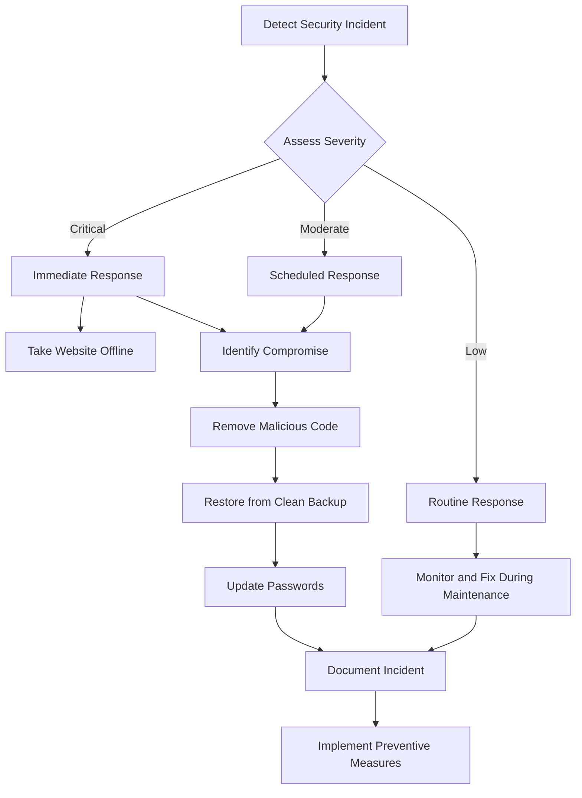

# WordPress Security Monitoring

## Introduction

Security monitoring is a critical component of WordPress maintenance that helps you identify, prevent, and respond to potential security threats. For website owners, security breaches can result in data theft, website defacement, malware distribution, or complete site takeovers. Implementing a robust security monitoring system allows you to detect suspicious activities early and take immediate action to protect your WordPress website.

In this guide, you'll learn comprehensive approaches to WordPress security monitoring, from basic practices to advanced techniques. We'll cover how to set up security logs, implement automated scanning, receive notifications for suspicious activities, and respond to security incidents.

## Why Security Monitoring Matters

Before diving into implementation, let's understand why security monitoring is crucial for your WordPress website:

1. **Early threat detection** - Identify potential security threats before they cause significant damage
2. **Evidence collection** - Gather information about attack patterns to improve your defenses
3. **Compliance requirements** - Meet legal or industry security standards
4. **Performance monitoring** - Detect security issues that might affect site performance
5. **User accountability** - Track user actions for audit purposes

## Essential WordPress Security Monitoring Components

### 1. Activity Logging

Activity logs record actions performed on your WordPress site, helping you track changes and identify suspicious behaviors.

#### Setting Up Activity Logging

Several plugins can help implement activity logging. One popular option is WP Activity Log. Here's how to implement basic logging with code:

```php
// Simple activity logging function (add to functions.php)
function log_user_activity($activity) {
    // Make sure user is logged in
    if (!is_user_logged_in()) return;
    
    $current_user = wp_get_current_user();
    $log_entry = array(
        'time' => current_time('mysql'),
        'user_id' => $current_user->ID,
        'username' => $current_user->user_login,
        'ip_address' => $_SERVER['REMOTE_ADDR'],
        'activity' => sanitize_text_field($activity)
    );
    
    // Convert to string for logging
    $log_string = json_encode($log_entry) . "\n";
    
    // Define log file location (secured outside web root is best)
    $log_file = WP_CONTENT_DIR . '/security-logs/activity-log.txt';
    
    // Ensure directory exists
    wp_mkdir_p(dirname($log_file));
    
    // Append to log file
    file_put_contents($log_file, $log_string, FILE_APPEND);
}

// Example of logging a specific action
add_action('wp_login', function($user_login) {
    log_user_activity("User login: $user_login");
});

add_action('user_register', function($user_id) {
    $user = get_userdata($user_id);
    log_user_activity("New user registered: {$user->user_login}");
});
```

This basic implementation logs user logins and registrations. For production sites, consider using established security plugins that offer more comprehensive and secure logging mechanisms.

#### What to Monitor in Your Logs

Pay special attention to these critical events:

- Failed login attempts (especially multiple failures from the same IP)
- Password changes and user role modifications
- Plugin and theme installations/updates/deletions
- File modifications in core WordPress directories
- Database modifications outside normal operations
- Changes to settings or permalinks

### 2. File Integrity Monitoring

File integrity monitoring checks for unexpected changes to your WordPress core files, themes, and plugins. This helps detect if malicious code has been injected into your site.

#### Implementing File Integrity Monitoring

Here's a simplified example of a file integrity monitoring function:

```php
// File integrity monitoring (add to a custom plugin)
function check_file_integrity() {
    // Define files to check
    $core_files = array(
        ABSPATH . 'wp-login.php',
        ABSPATH . 'wp-config.php',
        ABSPATH . 'index.php',
        // Add more critical files
    );
    
    // Load hashes file or create if it doesn't exist
    $hashes_file = WP_CONTENT_DIR . '/security-data/file-hashes.json';
    
    // Ensure directory exists
    wp_mkdir_p(dirname($hashes_file));
    
    $stored_hashes = array();
    if (file_exists($hashes_file)) {
        $stored_hashes = json_decode(file_get_contents($hashes_file), true);
    }
    
    $changes_detected = false;
    $changed_files = array();
    
    // Check each file
    foreach ($core_files as $file) {
        if (file_exists($file)) {
            $current_hash = md5_file($file);
            $file_key = str_replace(ABSPATH, '', $file);
            
            // If we have a stored hash, compare it
            if (isset($stored_hashes[$file_key])) {
                if ($stored_hashes[$file_key] !== $current_hash) {
                    $changes_detected = true;
                    $changed_files[] = $file_key;
                }
            }
            
            // Store current hash for future comparison
            $stored_hashes[$file_key] = $current_hash;
        }
    }
    
    // Save hashes for next check
    file_put_contents($hashes_file, json_encode($stored_hashes));
    
    // Notify if changes were detected
    if ($changes_detected) {
        // Send notification about changed files
        wp_mail(
            get_option('admin_email'),
            'WordPress File Changes Detected',
            'The following files have changed: ' . implode(', ', $changed_files)
        );
    }
    
    return $changed_files;
}

// Schedule daily integrity checks
if (!wp_next_scheduled('daily_file_integrity_check')) {
    wp_schedule_event(time(), 'daily', 'daily_file_integrity_check');
}
add_action('daily_file_integrity_check', 'check_file_integrity');
```

This basic implementation checks critical files daily and alerts you to changes. For production environments, consider using dedicated security plugins like Wordfence or Sucuri that provide more comprehensive file monitoring.

### 3. Login Security Monitoring

Monitoring login attempts is essential for detecting brute force attacks and unauthorized access attempts.

#### Implementing Login Monitoring

Here's a simple implementation to track failed login attempts:

```php
// Monitor failed logins (add to functions.php)
function monitor_failed_login($username) {
    $ip_address = $_SERVER['REMOTE_ADDR'];
    
    // Get the failed login count from this IP
    $failed_login_count = get_transient('failed_login_' . $ip_address) ?: 0;
    $failed_login_count++;
    
    // Store for 24 hours
    set_transient('failed_login_' . $ip_address, $failed_login_count, 24 * HOUR_IN_SECONDS);
    
    // Log the failed attempt
    log_user_activity("Failed login attempt for user: $username from IP: $ip_address");
    
    // If too many failed attempts, block the IP temporarily
    if ($failed_login_count >= 5) {
        // In a real implementation, you'd add this IP to a blocklist
        // For this example, we'll just send an alert
        wp_mail(
            get_option('admin_email'),
            'Excessive Failed Login Attempts',
            "Multiple failed login attempts ($failed_login_count) detected from IP: $ip_address"
        );
    }
}

add_action('wp_login_failed', 'monitor_failed_login');
```

### 4. Database Monitoring

Monitoring your WordPress database for suspicious changes can help detect SQL injections and other database attacks.

#### Implementing Database Change Monitoring

```php
// Monitor critical database tables (add to a custom plugin)
function check_user_table_changes() {
    global $wpdb;
    
    // Get users count
    $users_count = $wpdb->get_var("SELECT COUNT(*) FROM {$wpdb->users}");
    
    // Get stored count
    $stored_count = get_option('wp_security_users_count', false);
    
    if ($stored_count !== false) {
        // If stored count doesn't match current count
        if ((int)$stored_count !== (int)$users_count) {
            // New users might have been added - check for admin users
            $admin_users = $wpdb->get_results(
                "SELECT u.user_login, u.user_registered 
                FROM {$wpdb->users} u 
                JOIN {$wpdb->usermeta} m ON u.ID = m.user_id 
                WHERE m.meta_key = '{$wpdb->prefix}capabilities' 
                AND m.meta_value LIKE '%administrator%' 
                ORDER BY u.user_registered DESC"
            );
            
            // Send notification about user table changes
            $message = "User count changed from $stored_count to $users_count.\n\n";
            $message .= "Current admin users:\n";
            
            foreach ($admin_users as $admin) {
                $message .= "- {$admin->user_login} (registered: {$admin->user_registered})\n";
            }
            
            wp_mail(
                get_option('admin_email'),
                'WordPress User Table Changes Detected',
                $message
            );
        }
    }
    
    // Update stored count
    update_option('wp_security_users_count', $users_count);
}

// Schedule regular checks
if (!wp_next_scheduled('db_security_check')) {
    wp_schedule_event(time(), 'daily', 'db_security_check');
}
add_action('db_security_check', 'check_user_table_changes');
```

### 5. HTTP Request Monitoring

Monitoring unusual HTTP requests can help detect attacks like XSS, CSRF, and injection attempts.

```php
// Basic HTTP request monitoring (add to functions.php)
function monitor_suspicious_requests() {
    // Check for suspicious query patterns
    $query_string = $_SERVER['QUERY_STRING'];
    
    // List of suspicious patterns
    $suspicious_patterns = array(
        'eval\(', 
        'UNION+SELECT', 
        'CONCAT\(', 
        'base64_decode\(', 
        '<script',
        'document\.cookie',
        'onload\s*=',
        'javascript:',
        'fromCharCode'
    );
    
    // Check if request contains suspicious patterns
    foreach ($suspicious_patterns as $pattern) {
        if (preg_match('/' . $pattern . '/i', $query_string) || 
            preg_match('/' . $pattern . '/i', file_get_contents('php://input'))) {
            
            $ip = $_SERVER['REMOTE_ADDR'];
            $user_agent = $_SERVER['HTTP_USER_AGENT'];
            $request_uri = $_SERVER['REQUEST_URI'];
            
            // Log the suspicious request
            log_user_activity("Suspicious request detected from IP: $ip, URI: $request_uri, Pattern: $pattern");
            
            // Optionally block the request
            // exit('Suspicious activity detected');
            
            break;
        }
    }
}

// Hook early in the WordPress loading process
add_action('init', 'monitor_suspicious_requests', 1);
```

## Setting Up Real-time Monitoring and Alerts

For effective security monitoring, you need to receive timely alerts about potential security threats.

### Email Notifications

WordPress's built-in `wp_mail()` function can be used to send email alerts:

```php
function send_security_alert($subject, $message) {
    $admin_email = get_option('admin_email');
    $site_name = get_bloginfo('name');
    
    $headers = array(
        'Content-Type: text/html; charset=UTF-8',
        'From: ' . $site_name . ' <' . $admin_email . '>',
    );
    
    wp_mail($admin_email, '[Security Alert] ' . $subject, $message, $headers);
}
```

### Slack Notifications

For more immediate notifications, you can send alerts to a Slack channel:

```php
function send_slack_alert($message) {
    // Replace with your Slack webhook URL
    $webhook_url = 'https://hooks.slack.com/services/YOUR/WEBHOOK/URL';
    
    $site_url = get_site_url();
    $payload = json_encode(array(
        'text' => "*Security Alert* for $site_url:\n" . $message
    ));
    
    wp_remote_post($webhook_url, array(
        'body' => $payload,
        'headers' => array('Content-Type' => 'application/json'),
    ));
}
```

## Creating a Security Dashboard

For advanced users, you might want to create a simple security dashboard in your WordPress admin area:

```php
// Register admin page for security dashboard
function register_security_dashboard() {
    add_menu_page(
        'Security Dashboard',
        'Security',
        'manage_options',
        'security-dashboard',
        'display_security_dashboard',
        'dashicons-shield',
        30
    );
}
add_action('admin_menu', 'register_security_dashboard');

// Display the dashboard
function display_security_dashboard() {
    // Basic security stats
    $failed_logins = get_transient('total_failed_logins') ?: 0;
    
    // Get recent file changes
    $changed_files = check_file_integrity();
    
    echo '<div class="wrap">';
    echo '<h1>WordPress Security Dashboard</h1>';
    
    // Security overview section
    echo '<div class="card">';
    echo '<h2>Security Overview</h2>';
    echo '<p>Failed login attempts today: ' . $failed_logins . '</p>';
    
    if (!empty($changed_files)) {
        echo '<p style="color: red;">Warning: ' . count($changed_files) . ' critical files have changed!</p>';
        echo '<ul>';
        foreach ($changed_files as $file) {
            echo '<li>' . esc_html($file) . '</li>';
        }
        echo '</ul>';
    } else {
        echo '<p style="color: green;">No file integrity issues detected.</p>';
    }
    
    echo '</div>'; // End card
    
    // More dashboard sections could be added here
    
    echo '</div>'; // End wrap
}
```

## Using Security Plugins for Monitoring

While custom code provides flexibility, security plugins offer more comprehensive monitoring with less effort. Here are some recommended security monitoring plugins:

### Wordfence Security

Wordfence provides comprehensive security monitoring, including:

- Real-time firewall protection
- Malware scanning
- Login security features
- Live traffic monitoring
- File integrity monitoring

### Sucuri Security

Sucuri offers excellent security monitoring features:

- File integrity monitoring
- Blacklist monitoring
- Security activity auditing
- Post-hack security actions

### WP Activity Log

For detailed activity logging:

- Comprehensive WordPress activity tracking
- User session management
- Email notifications
- Reports and search filters

## Implementing a Security Incident Response Plan

An effective security monitoring system should be paired with a response plan:



## Best Practices for WordPress Security Monitoring

1. **Layered Security Approach**: Don't rely on a single monitoring method; use multiple techniques.

2. **Regular Log Review**: Schedule time to review security logs, even if you have automated alerts.

3. **Keep Monitoring Tools Updated**: Security tools need to be updated regularly to detect new threats.

4. **Backup Before Making Changes**: Always backup your site before implementing security changes.

5. **Test Your Monitoring System**: Periodically verify that your monitoring systems are working correctly.

6. **Document Your Security Architecture**: Create documentation of your security monitoring setup.

## Summary

Effective WordPress security monitoring is essential for protecting your website from various threats. In this guide, we've covered:

- Setting up activity logging to track user actions
- Implementing file integrity monitoring to detect unauthorized changes
- Monitoring login attempts to prevent unauthorized access
- Database monitoring to detect suspicious changes
- HTTP request monitoring to identify attack attempts
- Setting up real-time alerts via email and Slack
- Creating a security dashboard to visualize security status
- Using security plugins for comprehensive monitoring
- Developing an incident response plan

By implementing these security monitoring practices, you'll be better equipped to detect and respond to security threats before they cause significant damage to your WordPress website.

## Additional Resources

- [WordPress Security Handbook](https://developer.wordpress.org/advanced-administration/security/security-handbook/)
- [OWASP Web Security Testing Guide](https://owasp.org/www-project-web-security-testing-guide/)
- [WordPress Codex: Hardening WordPress](https://wordpress.org/support/article/hardening-wordpress/)

## Exercises

1. Set up a basic activity logging system on your development WordPress site.
2. Create a file integrity monitoring script and test it by making changes to a WordPress core file.
3. Implement a failed login monitoring system with email notifications.
4. Design a simple security dashboard that displays key security metrics for your WordPress site.
5. Develop a security incident response plan specific to your WordPress environment.