# WordPress Database Maintenance

## Introduction

Your WordPress website's database is like the engine of a car - it powers everything but requires regular maintenance to run smoothly. The database stores all your critical information including posts, pages, comments, users, settings, and metadata. When properly maintained, your WordPress database ensures fast load times, reliable backups, and overall stability for your website.

In this guide, we'll explore essential WordPress database maintenance tasks, understand why they're important, and learn how to implement them safely. Whether you're a beginner who's never touched a database before or someone looking to optimize your site's performance, these practices will help keep your WordPress site healthy and efficient.

## Why Database Maintenance Matters

Before diving into specific maintenance tasks, it's important to understand why database maintenance is crucial:

1. **Performance**: An optimized database runs queries faster, reducing page load times.
2. **Storage Space**: Regular cleanup reduces unnecessary data that consumes hosting resources.
3. **Error Prevention**: Maintenance helps prevent database corruption and errors.
4. **Security**: Removing old data reduces potential security vulnerabilities.
5. **Backup Efficiency**: Smaller, well-maintained databases are faster to back up and restore.

## Understanding Your WordPress Database Structure

The WordPress database contains tables with specific purposes. Here's a quick overview of the main tables (assuming default table prefix `wp_`):

```mermaid
graph TD
    A[WordPress Database] --> B[wp_posts: Posts, pages, revisions]
    A --> C[wp_postmeta: Post metadata]
    A --> D[wp_options: Site settings]
    A --> E[wp_users: User accounts]
    A --> F[wp_usermeta: User metadata]
    A --> G[wp_comments: Comments]
    A --> H[wp_commentmeta: Comment metadata]
    A --> I[wp_terms: Categories, tags]
    A --> J[wp_termmeta: Term metadata]
    A --> K[wp_term_relationships: Content-term connections]
    A --> L[wp_term_taxonomy: Term hierarchies]
    A --> M[wp_links: Links/bookmarks]
```



Knowing this structure helps you understand what you're maintaining and the impact of your maintenance activities.

## Essential Database Maintenance Tasks

### 1. Backing Up Your Database

The most important maintenance task is creating regular backups. Never perform any database maintenance without a fresh backup.

#### Using a Plugin

Popular backup plugins include UpdraftPlus, BackupBuddy, or WP-DB-Backup.

Example with UpdraftPlus:

1. Install and activate the UpdraftPlus plugin
2. Go to Settings > UpdraftPlus Backups
3. Click "Backup Now"
4. Ensure "Database" is checked
5. Click "Backup Now" button

#### Manual MySQL Backup

For direct database access, you can use the command line:

```bash
# Replace values with your actual database information
mysqldump -u username -p database_name > backup_filename.sql
```

This creates a SQL file with all your database data that can be restored if needed.

### 2. Optimizing Database Tables

Database tables can become fragmented over time, leading to slower performance. Regular optimization helps maintain efficiency.

#### Using a Plugin

WP-Optimize is a popular choice for database optimization:

1. Install and activate WP-Optimize
2. Go to WP-Optimize > Database
3. Select tables to optimize
4. Click "Run optimization"

#### Using phpMyAdmin

If you have access to phpMyAdmin through your hosting:

1. Log in to phpMyAdmin
2. Select your WordPress database
3. Check all tables (or select specific ones)
4. From the dropdown menu, choose "Optimize table"

Here's what happens during optimization:

```sql
-- Behind the scenes, this command runs:
OPTIMIZE TABLE wp_posts, wp_comments, wp_options;
```

### 3. Cleaning Post Revisions

WordPress automatically saves revisions of your posts and pages. While useful for recovering content, too many revisions bloat your database.

#### Using a Plugin

With WP-Optimize:

1. Go to WP-Optimize > Database
2. Check "Post revisions"
3. Click "Run optimization"

#### Manual SQL (Advanced)

If you want to delete all but the latest 5 revisions, you could use SQL, but **always back up first** and consider using a plugin instead unless you're comfortable with SQL:

```sql
-- This is an example only - be very careful with direct SQL
DELETE FROM wp_posts 
WHERE post_type = 'revision' 
AND post_parent IN (
   SELECT id FROM (
      SELECT p.post_parent AS id
      FROM wp_posts p
      WHERE p.post_type = 'revision'
      GROUP BY p.post_parent
      HAVING COUNT(p.post_parent) > 5
   ) AS temp
)
AND ID NOT IN (
   SELECT * FROM (
      SELECT p2.ID
      FROM wp_posts p2
      WHERE p2.post_type = 'revision'
      ORDER BY p2.post_date DESC
      LIMIT 5
   ) AS temp2
);
```

### 4. Removing Spam and Trash Comments

Spam comments can quickly fill your database if not managed properly.

#### Using WordPress Admin

1. Go to Comments in your WordPress dashboard
2. Filter by Spam or Trash
3. Select all and delete permanently

#### Using SQL (Advanced)

```sql
-- Delete all spam comments
DELETE FROM wp_comments WHERE comment_approved = 'spam';
-- Delete all comments in trash
DELETE FROM wp_comments WHERE comment_approved = 'trash';
```

### 5. Cleaning Transients

Transients are temporary data stored in your database with an expiration time. Sometimes expired transients aren't automatically deleted.

#### Using a Plugin

With WP-Optimize:

1. Go to WP-Optimize > Database
2. Check "Expired transients" and/or "All transients"
3. Click "Run optimization"

#### Using SQL (Advanced)

```sql
-- Remove expired transients
DELETE FROM wp_options 
WHERE option_name LIKE '%\_transient\_%' 
AND option_name NOT LIKE '%\_transient\_timeout\_%';
```

### 6. Setting Up Automated Maintenance

Manual maintenance is important, but automation ensures consistency.

#### Schedule Regular Backups

With UpdraftPlus:

1. Go to Settings > UpdraftPlus Backups
2. Click the "Settings" tab
3. Under "Scheduled backups", choose frequency (e.g., daily)
4. Save changes

#### Automate Optimization

With WP-Optimize:

1. Go to WP-Optimize > Settings
2. Under "Scheduled clean-up settings", choose frequency
3. Select what to clean up
4. Save changes

## Advanced Database Maintenance

### Database Repair

If you encounter database errors, WordPress includes a repair tool:

1. Add this line to your `wp-config.php` file:

```php
define('WP_ALLOW_REPAIR', true);
```

2. Visit `yourdomain.com/wp-admin/maint/repair.php`
3. Choose "Repair Database" or "Repair and Optimize Database"
4. **Important**: Remove the line from `wp-config.php` when finished

### Reducing Table Size

The `autoload` option in WordPress loads certain options on every page load. Reducing autoloaded data can improve performance:

```sql
-- Example: Change an option to not autoload
UPDATE wp_options SET autoload = 'no' 
WHERE option_name = 'specific_option_name';
```

Plugins like WP-Optimize can help identify and manage autoloaded data.

### Monitoring Database Size

Keeping track of your database size helps you identify when maintenance is needed:

```sql
-- Check database size
SELECT table_schema AS "Database Name",
ROUND(SUM(data_length + index_length) / 1024 / 1024, 2) AS "Size (MB)"
FROM information_schema.TABLES 
WHERE table_schema = "your_database_name"
GROUP BY table_schema;
```

You can also use phpMyAdmin to see this information visually.

## Best Practices for Database Maintenance

Follow these guidelines for effective database maintenance:

1. **Always back up first**: Never perform maintenance without a recent backup
2. **Schedule regular maintenance**: Weekly or monthly depending on site activity
3. **Use trusted tools**: Stick to well-reviewed plugins or direct access methods
4. **Monitor performance**: Track load times before and after maintenance
5. **Keep WordPress updated**: Newer versions often include database improvements
6. **Limit post revisions**: Add this to wp-config.php to control revisions:

```php
define('WP_POST_REVISIONS', 5); // Keep only 5 revisions per post
```

7. **Use a staging environment**: Test major changes on a copy of your site first

## Real-World Maintenance Scenario

Let's walk through a typical maintenance routine for a medium-sized WordPress blog:

1. **Current situation**: The site is loading slowly, and the admin notices the database is 500MB in size.

2. **Step 1**: Create a complete backup using UpdraftPlus.

3. **Step 2**: Use WP-Optimize to analyze the database. The report shows:
   - 10,000+ post revisions (taking 150MB)
   - 5,000+ spam comments (taking 50MB)
   - 3,000+ expired transients (taking 20MB)
   - Fragmented tables needing optimization

4. **Step 3**: Clean post revisions while keeping the latest 3 per post.

5. **Step 4**: Delete all spam comments and trashed items.

6. **Step 5**: Remove all expired transients.

7. **Step 6**: Optimize all database tables.

8. **Result**: Database size reduced to 280MB, and page load time improved by 25%.

9. **Follow-up**: Set up weekly scheduled cleanups to maintain performance.

## Troubleshooting Common Issues

### Database Connection Errors

If you encounter the "Error establishing a database connection" message:

1. Check database credentials in `wp-config.php`
2. Ensure your database server is running
3. Contact your host if server resources are limited

### White Screen After Maintenance

If your site shows a white screen after maintenance:

1. Restore your backup
2. Try maintenance tasks one at a time to identify the problem
3. Check server error logs for specific messages

### Slow Queries

If certain pages remain slow after optimization:

1. Install Query Monitor plugin to identify problematic queries
2. Consider adding indexes to frequently queried tables (advanced)
3. Review plugin queries that might be inefficient

## Summary

Regular WordPress database maintenance is essential for keeping your website running smoothly. By following the practices in this guide, you can ensure your database remains optimized, secure, and reliable.

Remember that a well-maintained database:
- Loads pages faster
- Uses fewer server resources
- Makes backups quicker and smaller
- Reduces the risk of errors and corruption

Establish a regular maintenance schedule that includes backups, cleaning unnecessary data, and optimizing tables. Use reliable plugins to make maintenance easier, but always back up your database before making any changes.

## Additional Resources

For further learning about WordPress database maintenance:

- [WordPress Codex Database Description](https://codex.wordpress.org/Database_Description)
- [MySQL Documentation](https://dev.mysql.com/doc/)

## Practice Exercises

1. Create a manual backup of your WordPress database using phpMyAdmin
2. Install WP-Optimize and perform a database cleanup
3. Add code to your wp-config.php file to limit post revisions
4. Set up a scheduled backup routine for your database
5. Monitor your site's performance before and after database optimization to measure improvements

With consistent maintenance, your WordPress database will continue to support your website efficiently for years to come.