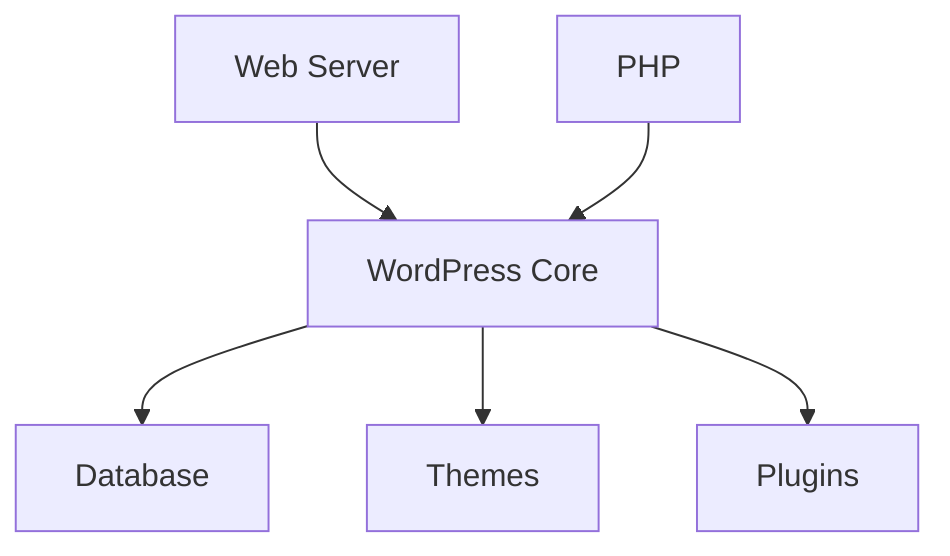
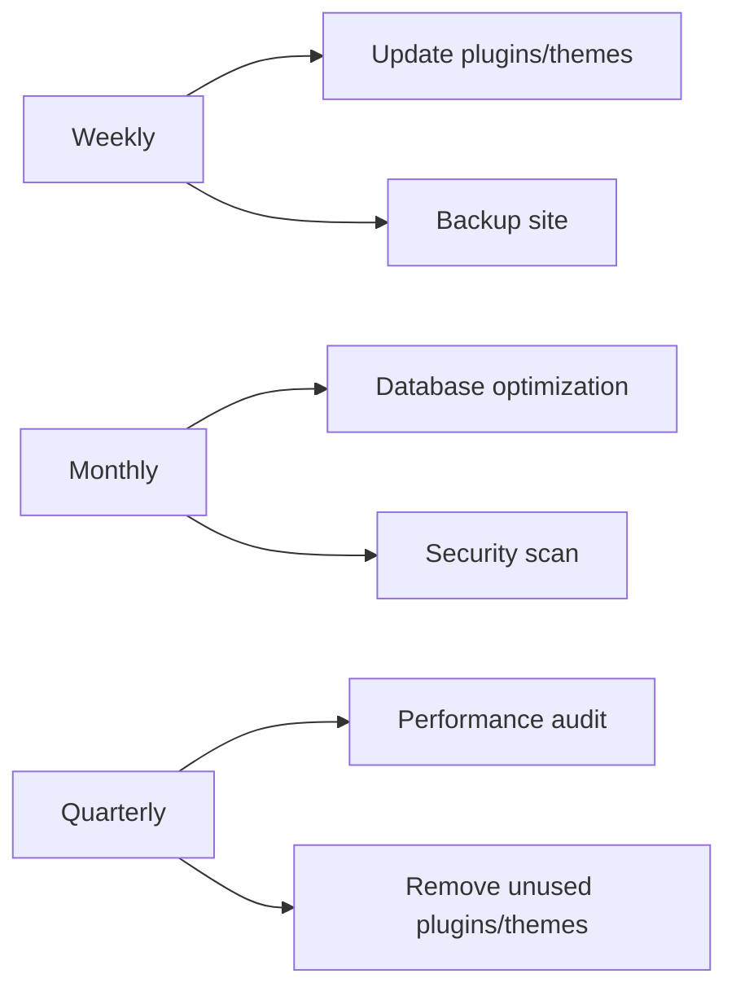

# WordPress Troubleshooting

## Introduction

Welcome to our comprehensive guide on WordPress troubleshooting! Every WordPress site owner will inevitably face technical issues at some point. Whether it's the dreaded white screen of death, slow loading times, or plugin conflicts, knowing how to diagnose and resolve these problems is an essential skill for maintaining a healthy WordPress website.

In this tutorial, we'll cover common WordPress issues and provide step-by-step solutions to fix them. By the end of this guide, you'll have the confidence and knowledge to tackle most WordPress problems that come your way.

## Understanding the WordPress Environment

Before diving into troubleshooting, it helps to understand the basic components of a WordPress installation:



Most WordPress issues stem from one of these components or their interactions. Knowing which component might be causing your problem helps narrow down the troubleshooting process.

## Common WordPress Issues and Their Solutions

### 1. The White Screen of Death (WSOD)

The White Screen of Death appears when your site encounters a critical PHP error.

#### How to Fix:

1. **Enable WordPress Debug Mode**:

   Add the following to your `wp-config.php` file:

   ```php
   define( 'WP_DEBUG', true );
   define( 'WP_DEBUG_LOG', true );
   define( 'WP_DEBUG_DISPLAY', false );
   ```

   This will log errors to `wp-content/debug.log` without displaying them on your site.

2. **Check Error Logs**:
   
   Review the debug log for specific error messages that can point to the source of the problem.

3. **Increase PHP Memory Limit**:
   
   Add the following to your `wp-config.php` file:

   ```php
   define( 'WP_MEMORY_LIMIT', '256M' );
   ```

4. **Deactivate All Plugins**:
   
   If you can access the admin area, deactivate all plugins. If not, rename the plugins folder via FTP:

   ```bash
   # Using FTP, rename folder from:
   /wp-content/plugins/
   # to:
   /wp-content/plugins-deactivated/
   ```

### 2. Database Connection Errors

When WordPress can't connect to your database, you'll see an error message like "Error establishing a database connection."

#### How to Fix:

1. **Verify Database Credentials**:

   Check your `wp-config.php` file for correct database settings:

   ```php
   define( 'DB_NAME', 'database_name' );
   define( 'DB_USER', 'database_user' );
   define( 'DB_PASSWORD', 'database_password' );
   define( 'DB_HOST', 'localhost' );
   ```

2. **Run WordPress Database Repair**:
   
   Add this line to `wp-config.php`:

   ```php
   define( 'WP_ALLOW_REPAIR', true );
   ```

   Then visit `yoursite.com/wp-admin/maint/repair.php` to run the repair tools.

3. **Contact Your Hosting Provider**:
   
   If steps 1 and 2 don't work, your database server might be down.

### 3. Plugin Conflicts

Plugin conflicts can cause various issues from functionality failures to site crashes.

#### How to Fix:

1. **Identify the Problematic Plugin**:
   
   Deactivate all plugins and reactivate them one by one until you find the culprit:

   ```bash
   # If you can't access admin, rename plugin folders via FTP:
   /wp-content/plugins/problem-plugin/
   # to:
   /wp-content/plugins/problem-plugin-deactivated/
   ```

2. **Check for Plugin Updates**:
   
   Outdated plugins may conflict with newer WordPress versions.

3. **Replace the Plugin**:
   
   If a plugin consistently causes problems, find an alternative with similar functionality.

### 4. Slow Website Performance

Slow loading times can be caused by various issues.

#### How to Fix:

1. **Install a Caching Plugin**:
   
   Plugins like WP Super Cache or W3 Total Cache can significantly improve site performance.
   
   Example configuration for W3 Total Cache:
   
   ```php
   // Enable Page Cache
   $config['pgcache.enabled'] = true;
   $config['pgcache.cache_type'] = 'disk: enhanced';
   
   // Enable Browser Cache
   $config['browsercache.enabled'] = true;
   
   // Enable Minify
   $config['minify.enabled'] = true;
   $config['minify.auto'] = true;
   ```

2. **Optimize Images**:
   
   Use plugins like Smush or ShortPixel to reduce image sizes.

3. **Clean Your Database**:
   
   Use plugins like WP-Optimize to remove post revisions, spam comments, and other unnecessary data:

   ```sql
   -- Example SQL to clean revisions manually
   DELETE FROM wp_posts WHERE post_type = "revision";
   DELETE FROM wp_postmeta WHERE post_id NOT IN (SELECT id FROM wp_posts);
   ```

4. **Use a Content Delivery Network (CDN)**:
   
   Services like Cloudflare can distribute your content globally for faster access.

### 5. Website Hacked or Infected with Malware

Security breaches can compromise your WordPress site.

#### How to Fix:

1. **Scan for Malware**:
   
   Use security plugins like Wordfence or Sucuri to scan your site for malicious code.

2. **Check for Suspicious Files**:
   
   Look for unfamiliar PHP files in your WordPress directories:

   ```bash
   find /path/to/wordpress -name "*.php" -mtime -7 -type f
   ```

   This command finds PHP files modified in the last 7 days.

3. **Reset User Passwords**:
   
   Change all WordPress user passwords, especially admin accounts.

4. **Restore from a Clean Backup**:
   
   If available, restore your site from a backup taken before the hack.

5. **Update Security Keys**:
   
   Generate new security keys in `wp-config.php`:

   ```php
   define('AUTH_KEY',         'new-random-key');
   define('SECURE_AUTH_KEY',  'new-random-key');
   define('LOGGED_IN_KEY',    'new-random-key');
   define('NONCE_KEY',        'new-random-key');
   define('AUTH_SALT',        'new-random-key');
   define('SECURE_AUTH_SALT', 'new-random-key');
   define('LOGGED_IN_SALT',   'new-random-key');
   define('NONCE_SALT',       'new-random-key');
   ```

## Advanced Troubleshooting Techniques

### Using WordPress Safe Mode

When you can't access the admin area due to a critical error, you can access WordPress in recovery mode.

#### Steps:

1. **Add Recovery Mode Credential**:

   Add the following to your `wp-config.php` file:

   ```php
   define( 'RECOVERY_MODE_EMAIL', 'your-email@example.com' );
   ```

2. **Access the Recovery Mode Link**:
   
   WordPress will send an email with a recovery mode link when it encounters a fatal error.

### Debugging with Query Monitor

Query Monitor is a developer tool that helps identify slow database queries, PHP errors, and more.

#### Example Usage:

1. Install and activate the Query Monitor plugin

2. Review the debug information it provides in your admin bar:

```php
// Example of a slow database query it might identify
$results = $wpdb->get_results("
    SELECT * FROM $wpdb->posts 
    WHERE post_type = 'post' 
    AND post_status = 'publish'
    ORDER BY post_date DESC
"); // This unoptimized query might be flagged by Query Monitor
```

3. Add indices to database tables for queries that are consistently slow:

```sql
ALTER TABLE wp_postmeta ADD INDEX meta_key_value (meta_key, meta_value);
```

### Performing a Manual Core Update

If the automatic WordPress updater fails, you can manually update WordPress core.

#### Steps:

1. **Download the latest WordPress** from [wordpress.org](https://wordpress.org/download/)

2. **Delete the old wp-admin and wp-includes folders** via FTP

3. **Upload the new wp-admin and wp-includes folders**

4. **Upload individual files** from the new wp-content folder, being careful not to overwrite your themes or plugins

5. **Visit `/wp-admin/upgrade.php`** to complete the database update

## Real-World Troubleshooting Scenario

Let's walk through a real scenario:

### Problem: A client's website shows a critical error after updating a plugin

#### Step-by-Step Diagnosis:

1. **Enable debugging** in wp-config.php to see the error:

```php
define( 'WP_DEBUG', true );
define( 'WP_DEBUG_LOG', true );
define( 'WP_DEBUG_DISPLAY', false );
```

2. **Check the error log** and find an error like:

```
PHP Fatal error: Uncaught Error: Call to undefined function example_function() in /wp-content/themes/custom-theme/functions.php on line 120
```

3. **Identify the cause**: The theme is trying to use a function from the old version of the plugin

4. **Solution**: Either update the theme to be compatible with the new plugin version, or downgrade the plugin temporarily while waiting for a theme update

### Implementation:

```php
// Original problematic code in functions.php
add_action('init', 'example_function'); // This function no longer exists in the updated plugin

// Fixed code
if (function_exists('example_function')) {
    add_action('init', 'example_function');
} else {
    // Fallback functionality
    add_action('init', 'my_custom_fallback_function');
}

function my_custom_fallback_function() {
    // Alternative functionality here
}
```

## Preventive Maintenance to Avoid Issues

### Regular Maintenance Tasks

Creating a maintenance routine helps prevent many common WordPress issues:



### Setting Up Automated Backups

Example code for wp-config.php to enable automatic updates:

```php
// Enable all automatic updates
define( 'WP_AUTO_UPDATE_CORE', true );

// Or, for only minor updates
define( 'WP_AUTO_UPDATE_CORE', 'minor' );
```

### Implementing a Staging Environment

A staging environment allows you to test changes before applying them to your live site:

```bash
# Example WP-CLI commands to create and sync a staging site
wp db export production.sql --path=/path/to/production

# Import to staging
wp db import production.sql --path=/path/to/staging

# Update URLs in the database
wp search-replace 'www.productionsite.com' 'staging.productionsite.com' --path=/path/to/staging
```

## Summary

Effective WordPress troubleshooting follows a systematic process:

1. **Identify the symptoms** - What exactly is happening?
2. **Enable debugging** - Get detailed error messages
3. **Isolate the cause** - Is it a plugin, theme, or core issue?
4. **Apply the solution** - Fix the specific problem
5. **Verify the fix** - Make sure the issue is fully resolved
6. **Implement preventive measures** - Avoid the same problem in the future

By following the techniques in this guide, you'll be equipped to diagnose and resolve most WordPress issues that come your way, keeping your site running smoothly and efficiently.

## Additional Resources

- [WordPress Debugging Documentation](https://wordpress.org/support/article/debugging-in-wordpress/)
- [WordPress Code Reference](https://developer.wordpress.org/reference/)
- [Query Monitor Plugin](https://wordpress.org/plugins/query-monitor/)
- [WordPress Support Forums](https://wordpress.org/support/forums/)

## Practice Exercises

1. **Debugging Challenge**: Set up a test WordPress installation and deliberately cause a plugin conflict. Use debugging techniques to identify and resolve the issue.

2. **Performance Optimization**: Take a slow-loading WordPress site and implement at least three optimizations discussed in this guide. Measure the before and after load times.

3. **Security Audit**: Use a security plugin to scan a WordPress site, identify vulnerabilities, and create an action plan to address them.

4. **Database Cleanup**: Practice optimizing a WordPress database by removing unnecessary data and measuring the size reduction.

By mastering WordPress troubleshooting, you'll not only be able to fix problems more efficiently but also build more stable and reliable WordPress websites from the start.