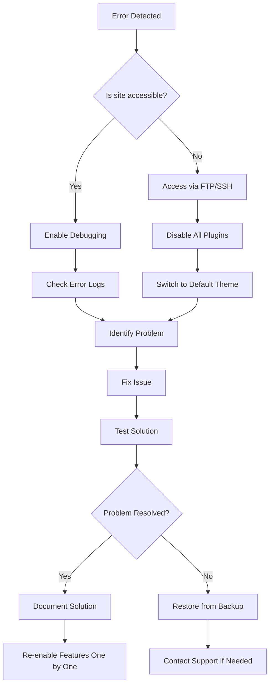

# WordPress Error Handling

## Introduction

When maintaining a WordPress site, encountering errors is inevitable. From white screens of death to database connection issues, errors can occur for various reasons including plugin conflicts, theme incompatibilities, or server configuration problems. Effective error handling is essential for keeping your WordPress site running smoothly and providing a good user experience.

In this guide, we'll explore common WordPress errors, how to identify them, and strategies for resolving these issues. We'll also cover preventative measures to minimize the risk of errors occurring in the first place.

## Enabling WordPress Debug Mode

WordPress includes a built-in debugging system that can help identify issues. By default, this system is turned off to avoid displaying error messages to site visitors, but enabling it during development or troubleshooting is extremely valuable.

### How to Enable WordPress Debug Mode

Add the following code to your `wp-config.php` file, just before the line that says "That's all, stop editing! Happy publishing":

```php
// Enable debugging
define('WP_DEBUG', true);

// Log errors to a file
define('WP_DEBUG_LOG', true);

// Don't display errors on the front end
define('WP_DEBUG_DISPLAY', false);

// Disable JavaScript and CSS concatenation (for debugging)
define('SCRIPT_DEBUG', true);
```

After adding these lines, WordPress will:
- Enable the debug mode
- Log all errors, notices, and warnings to a file called `debug.log` in your `wp-content` directory
- Not display errors to users
- Use unminified versions of core CSS and JavaScript files for easier debugging

## Common WordPress Errors and Solutions

### 1. White Screen of Death (WSOD)

The White Screen of Death is one of the most common WordPress errors. It's characterized by a completely blank page with no error message.

**Causes:**
- PHP memory limit exceeded
- Plugin or theme conflicts
- Syntax errors in code

**Solutions:**

1. Increase PHP memory limit by adding this to your `wp-config.php` file:

```php
define('WP_MEMORY_LIMIT', '256M');
```

2. Disable all plugins by renaming your plugins directory via FTP:

```bash
# Connect to your server via FTP
# Navigate to wp-content directory
# Rename the plugins folder to plugins_old
```

3. Switch to a default WordPress theme via database or FTP:

```sql
UPDATE wp_options SET option_value = 'twentytwentythree' WHERE option_name = 'template';
UPDATE wp_options SET option_value = 'twentytwentythree' WHERE option_name = 'stylesheet';
```

### 2. Database Connection Errors

This error appears when WordPress cannot connect to the database.

**Causes:**
- Incorrect database credentials
- Database server is down
- Corrupted database

**Solution:**

Check your database settings in `wp-config.php`:

```php
// Database Configuration
define('DB_NAME', 'database_name');
define('DB_USER', 'database_username');
define('DB_PASSWORD', 'database_password');
define('DB_HOST', 'localhost');
```

Verify these settings match your database credentials. You can also try changing `'localhost'` to `'127.0.0.1'` if you're still having issues.

### 3. 500 Internal Server Error

This server-side error indicates something went wrong but the server can't specify what exactly happened.

**Causes:**
- Corrupted .htaccess file
- PHP memory limit issues
- Plugin or theme conflicts

**Solutions:**

1. Regenerate your `.htaccess` file:
   - Rename the current `.htaccess` file to `.htaccess.bak`
   - Go to Settings > Permalinks in your WordPress admin
   - Click "Save Changes" to generate a new `.htaccess` file

2. Check your error logs using this PHP script (save as `check-error-log.php` and upload to your root directory):

```php
<?php
// Display the last 20 lines of the error log
$log_file = dirname(__FILE__) . '/wp-content/debug.log';
if (file_exists($log_file)) {
    $log_content = file($log_file);
    $log_content = array_slice($log_content, -20);
    echo '<pre>' . implode('', $log_content) . '</pre>';
} else {
    echo 'Error log file not found.';
}
?>
```

### 4. Memory Exhaustion Errors

If your site needs more PHP memory than is allocated, you'll see a message like "Fatal error: Allowed memory size of X bytes exhausted."

**Solution:**

Increase the PHP memory limit in `wp-config.php`:

```php
define('WP_MEMORY_LIMIT', '256M');
define('WP_MAX_MEMORY_LIMIT', '512M'); // For admin panel
```

If that doesn't work, contact your hosting provider as they may need to increase server-level PHP memory limits.

## Creating a Custom Error Handler

For more advanced users, you can create a custom error handling function for WordPress. This allows you to control how errors are processed and displayed.

```php
// Add this to your theme's functions.php or a custom plugin
function custom_wordpress_error_handler($errno, $errstr, $errfile, $errline) {
    // Log the error
    error_log("Error [$errno]: $errstr in $errfile on line $errline");
    
    // Don't display errors to regular visitors
    if (!current_user_can('manage_options')) {
        return false;
    }
    
    // For admins, show a more useful error message
    echo '<div style="padding: 10px; background-color: #ffecec; border-left: 4px solid #f44336; margin: 10px 0;">';
    echo '<strong>WordPress Error:</strong> ';
    echo "[$errno] $errstr<br />";
    echo "File: $errfile:$errline";
    echo '</div>';
    
    return true; // Don't execute PHP's internal error handler
}

// Set the custom error handler
set_error_handler('custom_wordpress_error_handler', E_ALL);
```

## Using try/catch Blocks for Error Handling

When working with custom code, use PHP's try/catch blocks to handle potential errors gracefully:

```php
try {
    // Attempt risky operation
    $api_response = wp_remote_get('https://api.example.com/data');
    
    if (is_wp_error($api_response)) {
        throw new Exception($api_response->get_error_message());
    }
    
    $body = wp_remote_retrieve_body($api_response);
    $data = json_decode($body);
    
    // Process the data
    echo "Data retrieved successfully!";
    
} catch (Exception $e) {
    // Handle the error gracefully
    error_log('API Request Error: ' . $e->getMessage());
    echo "Sorry, we couldn't retrieve the data. Please try again later.";
}
```

## Debugging Plugins

Several plugins can help with debugging WordPress issues:

1. **Query Monitor** - Provides detailed information about database queries, hooks, conditionals, HTTP requests, and more.

2. **Debug Bar** - Adds a debug menu to the admin bar for troubleshooting.

3. **Error Log Monitor** - Displays the latest WordPress error log entries in your dashboard.

## Example: Handling Plugin Activation Errors

Below is an example of how to handle errors during plugin activation:

```php
// In your plugin's main file
function my_plugin_activation() {
    // Check PHP version
    if (version_compare(PHP_VERSION, '7.4', '<')) {
        deactivate_plugins(plugin_basename(__FILE__));
        wp_die('This plugin requires PHP 7.4 or higher. Please update your PHP version.');
    }
    
    // Check WordPress version
    if (version_compare($GLOBALS['wp_version'], '5.6', '<')) {
        deactivate_plugins(plugin_basename(__FILE__));
        wp_die('This plugin requires WordPress 5.6 or higher. Please update WordPress.');
    }
    
    // Check if required tables can be created
    try {
        // Attempt to create custom tables
        require_once(plugin_dir_path(__FILE__) . 'includes/database-setup.php');
        create_plugin_tables();
    } catch (Exception $e) {
        deactivate_plugins(plugin_basename(__FILE__));
        wp_die('Error setting up plugin database tables: ' . $e->getMessage());
    }
}
register_activation_hook(__FILE__, 'my_plugin_activation');
```

## Creating a Recovery Plan

Having a recovery plan is essential for when errors occur on a live site. Here's a basic recovery workflow:



## Preventative Maintenance

Prevention is better than cure. Here are some best practices to minimize WordPress errors:

1. **Regular Backups**: Back up your WordPress site daily or weekly using tools like UpdraftPlus or VaultPress.

2. **Scheduled Maintenance**: Create a routine maintenance script:

```php
<?php
// maintenance-check.php - Run this weekly via cron job

// Load WordPress
require_once('wp-load.php');

// Check for plugin updates
$update_plugins = get_site_transient('update_plugins');
if (!empty($update_plugins->response)) {
    mail(get_option('admin_email'), 'WordPress Plugin Updates Required', 
        'The following plugins need to be updated: ' . 
        implode(', ', array_keys($update_plugins->response)));
}

// Check WordPress database
global $wpdb;
$result = $wpdb->check_database();

if (!empty($result[0])) {
    mail(get_option('admin_email'), 'WordPress Database Issues Detected', 
        'Database issues found: ' . implode(', ', $result[0]));
}

// Check error logs
$log_file = ABSPATH . 'wp-content/debug.log';
if (file_exists($log_file) && filesize($log_file) > 1048576) { // 1MB
    mail(get_option('admin_email'), 'WordPress Error Log Growing Large', 
        'Your error log file is larger than 1MB. Please check for recurring issues.');
}

echo "Maintenance check completed!";
?>
```

3. **Use a Staging Environment**: Test updates on a staging site before applying them to your live site.

4. **Monitor PHP Error Logs**: Configure your server to save PHP errors and check them regularly.

## Summary

Effective WordPress error handling is a crucial skill for maintaining a healthy and functional website. In this guide, we've covered:

- Enabling WordPress debug mode
- Identifying and fixing common WordPress errors
- Creating custom error handlers
- Using try/catch blocks for graceful error management
- Implementing preventative maintenance practices

By following these practices, you'll be able to quickly identify and resolve WordPress errors, minimizing downtime and providing a better experience for your users.

## Additional Resources

- [WordPress Debugging Documentation](https://wordpress.org/support/article/debugging-in-wordpress/)
- [PHP Error Handling Best Practices](https://www.php.net/manual/en/language.errors.php7.php)
- [WordPress Codex on wp-config.php](https://codex.wordpress.org/Editing_wp-config.php)

## Practice Exercises

1. **Create a Debug Logger**: Write a plugin that logs specific actions on your WordPress site to help with debugging.

2. **Error Simulation**: Deliberately cause different types of errors in a development environment and practice fixing them.

3. **Build a Health Check Tool**: Create a dashboard widget that displays the health status of your WordPress installation.

4. **Automated Testing**: Set up automated tests for your WordPress theme or plugin to catch errors before they reach production.

By mastering WordPress error handling, you'll gain confidence in maintaining and troubleshooting WordPress sites, which is an invaluable skill for any WordPress developer or site administrator.