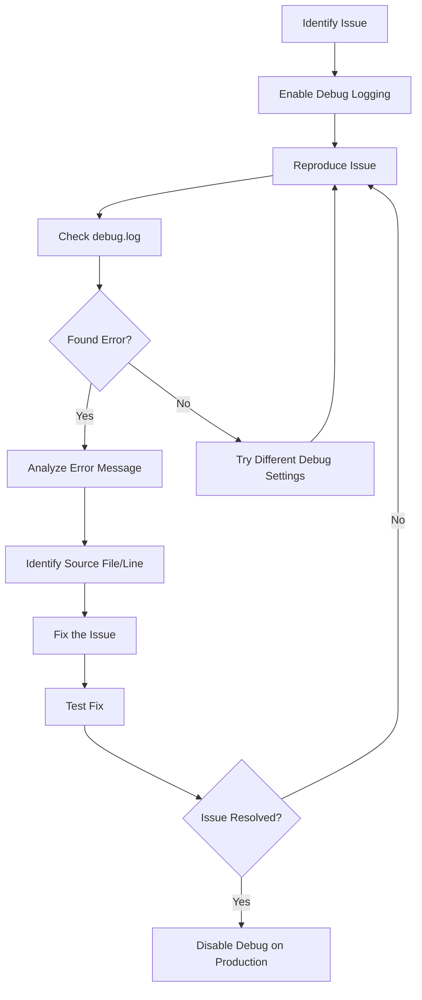

# WordPress Debug Logging

## Introduction

Debug logging is an essential skill for WordPress developers and site maintainers. When your WordPress site encounters issues or behaves unexpectedly, debug logs can provide crucial information about what's happening behind the scenes. This guide will walk you through the process of setting up, accessing, and interpreting WordPress debug logs to help you maintain a healthy WordPress site.

## What is WordPress Debug Logging?

WordPress debug logging is a diagnostic process that records errors, warnings, and notices that occur during the execution of WordPress core, themes, and plugins. These logs can help you:

- Identify problematic code in plugins or themes
- Troubleshoot compatibility issues
- Detect security vulnerabilities
- Monitor PHP errors and warnings
- Track down performance bottlenecks

## Setting Up WordPress Debug Mode

### Basic Debug Configuration

WordPress debugging is controlled through constants defined in the `wp-config.php` file, which is located in your WordPress root directory.

Here are the primary debug constants you should know:

```php
// Enable WordPress debug mode
define('WP_DEBUG', true);

// Log debug information to a file
define('WP_DEBUG_LOG', true);

// Control whether debug messages are displayed on-screen
define('WP_DEBUG_DISPLAY', false);

// Suppress PHP errors from being displayed
@ini_set('display_errors', 0);
```

### Step-by-Step Setup Process

1. **Backup your site**: Always create a backup before making changes to core WordPress files.

2. **Locate wp-config.php**: This file is in your WordPress root directory.

3. **Add debug constants**: Add the following code to your wp-config.php file, just before the line that says `/* That's all, stop editing! Happy publishing. */`:

```php
// Enable debugging
define('WP_DEBUG', true);

// Save errors to a debug.log file
define('WP_DEBUG_LOG', true);

// Don't show errors on the site
define('WP_DEBUG_DISPLAY', false);

// Disable display of PHP errors
@ini_set('display_errors', 0);
```

4. **Save the file**: Upload the modified wp-config.php back to your server.

5. **Check the log file**: WordPress will now create a `debug.log` file in the `wp-content` directory.

## Understanding Debug Log Content

When WP_DEBUG_LOG is enabled, WordPress writes all PHP errors to a file called `debug.log` in the wp-content directory. Let's look at an example of what you might find in this file:

```
[14-Feb-2023 15:23:45 UTC] PHP Notice: Undefined variable: my_variable in /var/www/html/wp-content/plugins/example-plugin/example.php on line 25
[14-Feb-2023 15:24:12 UTC] PHP Warning: Invalid argument supplied for foreach() in /var/www/html/wp-content/themes/my-theme/functions.php on line 120
[14-Feb-2023 15:30:22 UTC] PHP Fatal error: Uncaught Error: Call to undefined function nonexistent_function() in /var/www/html/wp-content/plugins/broken-plugin/broken.php:50
```

Each log entry contains:
- Date and time of the error
- Type of error (Notice, Warning, Fatal error, etc.)
- Error message
- File path where the error occurred
- Line number in that file

## Advanced Debugging Options

### Script Debugging

WordPress has additional constants for more specific debugging needs:

```php
// For debugging scripts (JavaScript)
define('SCRIPT_DEBUG', true);

// For saving database queries to debug
define('SAVEQUERIES', true);
```

### Custom Error Handling

You can also define a custom error handler for more control:

```php
function custom_error_handler($severity, $message, $file, $line) {
    if (!(error_reporting() & $severity)) {
        return;
    }
    
    $error = "[$severity] $message in $file on line $line";
    error_log($error);
    
    // You can perform additional actions here
    
    // Don't execute PHP's internal error handler
    return true;
}

// Set the custom error handler
set_error_handler('custom_error_handler');
```

## Real-World Debug Applications

### Case Study 1: Identifying Plugin Conflicts

When multiple plugins conflict with each other, debug logs can help identify the culprits:

```
[15-Feb-2023 09:15:32 UTC] PHP Fatal error: Cannot redeclare create_custom_post_type() (previously declared in /var/www/html/wp-content/plugins/plugin-a/functions.php:25) in /var/www/html/wp-content/plugins/plugin-b/custom-types.php on line 40
```

This log entry shows that both Plugin A and Plugin B are trying to declare the same function, causing a conflict.

### Case Study 2: Fixing Memory Limit Issues

```
[15-Feb-2023 14:20:10 UTC] PHP Fatal error: Allowed memory size of 33554432 bytes exhausted (tried to allocate 2348617 bytes) in /var/www/html/wp-content/plugins/image-processor/process.php on line 75
```

This indicates that your WordPress site is hitting PHP memory limits. To fix this, you can increase the memory limit in your `wp-config.php`:

```php
define('WP_MEMORY_LIMIT', '128M');
```

### Case Study 3: Debugging Theme Functions

```
[16-Feb-2023 11:05:22 UTC] PHP Notice: Undefined index: featured_image in /var/www/html/wp-content/themes/custom-theme/template-parts/content.php on line 45
```

This suggests your theme is trying to access an array key that doesn't exist. You can fix it by adding a check:

```php
if (isset($post_data['featured_image'])) {
    // Use $post_data['featured_image']
}
```

## Best Practices for Debug Logging

1. **Disable debugging in production**: Always turn off `WP_DEBUG` or set `WP_DEBUG_DISPLAY` to false on live sites.

   ```php
   // Safe production settings
   define('WP_DEBUG', false);
   // Or if you want logging without displaying
   define('WP_DEBUG', true);
   define('WP_DEBUG_LOG', true);
   define('WP_DEBUG_DISPLAY', false);
   ```

2. **Regularly check and rotate logs**: Large log files can consume disk space.

3. **Use a log viewer plugin**: Consider plugins like "Query Monitor" or "Debug Bar" for a more user-friendly debugging experience.

4. **Secure your log files**: Ensure debug.log isn't publicly accessible:

   Add to your `.htaccess` file:
   
   ```apache
   # Protect debug.log
   <Files debug.log>
   Order allow,deny
   Deny from all
   </Files>
   ```

5. **Add custom logging**: For specific debugging needs, use the WordPress logging function:

   ```php
   if (WP_DEBUG === true) {
       if (is_array($thing_to_debug) || is_object($thing_to_debug)) {
           error_log(print_r($thing_to_debug, true));
       } else {
           error_log($thing_to_debug);
       }
   }
   ```

## Creating a Debugging Workflow

Here's a workflow diagram illustrating an effective debugging process:



## Implementing a Debug Logger Function

This simple debug function can be added to your theme's `functions.php` or a custom plugin:

```php
/**
 * Simple debug logger
 *
 * @param mixed $message Message to log
 * @param string $title Optional title for the log entry
 * @return void
 */
function my_debug_logger($message, $title = '') {
    if (WP_DEBUG === true) {
        if (is_array($message) || is_object($message)) {
            if ($title) {
                error_log('====== ' . $title . ' ======');
            }
            error_log(print_r($message, true));
        } else {
            if ($title) {
                error_log('====== ' . $title . ' ======');
            }
            error_log($message);
        }
    }
}
```

Usage example:

```php
// Log a simple message
my_debug_logger('User registration processed', 'USER REGISTRATION');

// Log an array
$user_data = [
    'id' => 123,
    'name' => 'John Doe',
    'roles' => ['subscriber', 'customer']
];
my_debug_logger($user_data, 'USER DATA');
```

Output in debug.log:

```
[17-Feb-2023 10:15:22 UTC] ====== USER REGISTRATION ======
[17-Feb-2023 10:15:22 UTC] User registration processed
[17-Feb-2023 10:15:22 UTC] ====== USER DATA ======
[17-Feb-2023 10:15:22 UTC] Array
(
    [id] => 123
    [name] => John Doe
    [roles] => Array
        (
            [0] => subscriber
            [1] => customer
        )
)
```

## Troubleshooting Common Debug Issues

### Debug Logs Not Being Created

If debug logs aren't being generated:

1. Check file permissions: Make sure the `wp-content` directory is writable.
2. Verify WP_DEBUG settings: Ensure both `WP_DEBUG` and `WP_DEBUG_LOG` are set to `true`.
3. Try an absolute path:

```php
define('WP_DEBUG_LOG', '/absolute/path/to/debug.log');
```

### Too Many Errors in Logs

If your log file is growing too quickly:

1. Filter specific errors:

```php
// Ignore specific errors
function ignore_specific_errors($errno, $errstr) {
    if (strpos($errstr, 'deprecated function') !== false) {
        return true; // Ignore this error
    }
    return false; // Let PHP handle it
}
set_error_handler('ignore_specific_errors', E_DEPRECATED);
```

2. Implement log rotation using a plugin or server-level solution.

## Summary

WordPress debug logging is a powerful tool for maintaining and troubleshooting your WordPress site. By enabling the appropriate debug constants in your `wp-config.php` file, you can capture valuable diagnostic information that helps identify and fix issues.

Remember these key points:
- Always disable debugging or at least debug display on production sites
- Secure your debug logs from public access
- Regularly check and maintain your log files
- Use additional debugging tools when necessary

With proper debug logging, you'll be able to maintain a healthier WordPress site and resolve issues more quickly when they arise.

## Additional Resources and Exercises

### Resources

- [WordPress Debugging Documentation](https://wordpress.org/support/article/debugging-in-wordpress/)
- [Query Monitor Plugin](https://wordpress.org/plugins/query-monitor/)
- [Debug Bar Plugin](https://wordpress.org/plugins/debug-bar/)

### Exercises

1. **Practice Exercise**: Enable debug logging on a test WordPress installation and intentionally create errors (for example, by modifying a theme file with incorrect PHP) to see what appears in the logs.

2. **Advanced Exercise**: Create a custom plugin that monitors the debug.log file and sends you an email alert when critical errors occur.

3. **Challenge**: Write a function that analyzes your debug.log file and creates a report of the most common errors and their sources.