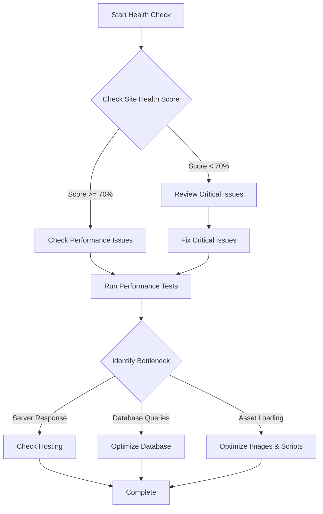

# WordPress Health Checks

## Introduction

WordPress Health Checks are diagnostic tools that help identify and resolve issues affecting your WordPress site's performance, security, and functionality. Regular health checks are an essential part of WordPress maintenance that can prevent serious problems before they impact your visitors or business operations.

In this guide, we'll explore what WordPress health checks are, why they matter, and how to perform them effectively—even if you're new to WordPress maintenance.

## What are WordPress Health Checks?

WordPress Health Checks are systematic examinations of various aspects of your WordPress installation to ensure everything is working as expected. The WordPress core includes a built-in Site Health feature, but comprehensive health checks often involve additional tools and manual inspections.

Think of it as a regular medical check-up for your website—preventive care that catches issues early before they become critical problems.

## The Built-in WordPress Site Health Tool

Since WordPress 5.2, a built-in Site Health tool provides basic diagnostics for your WordPress site.

### Accessing the Site Health Tool

To access this feature:

1. Log in to your WordPress admin dashboard
2. Navigate to **Tools → Site Health**

You'll see two main tabs:

- **Status**: Shows a summary of your site's health with issues categorized as critical or recommended
- **Info**: Provides detailed information about your WordPress configuration

![WordPress Site Health Status Screen]

### Understanding the Health Check Results

The Site Health Status screen provides:

1. An overall health score percentage
2. Critical issues that need immediate attention
3. Recommended improvements
4. Passed tests

```jsx
// Example of how WordPress Site Health data is structured internally
const siteHealthData = {
  score: 85,
  criticalIssues: [
    { 
      test: "php_version", 
      status: "critical",
      label: "Your site is running an outdated version of PHP",
      description: "Support for this version will be dropped soon." 
    }
  ],
  recommendedIssues: [
    {
      test: "ssl_support",
      status: "recommended",
      label: "Your site does not use HTTPS",
      description: "HTTPS is essential for site security and SEO."
    }
  ]
};
```

## Key Areas of WordPress Health Checks

Let's explore the main areas you should check regularly:

### 1. Core, Theme, and Plugin Updates

Outdated software is one of the biggest security vulnerabilities in WordPress sites.

#### How to Check Updates

```php
// Code that WordPress uses to check for updates
function wp_version_check() {
    $locale = get_locale();
    $current = get_site_transient( 'update_core' );
    // Checks WordPress core version against available updates
    // Similar checks exist for plugins and themes
}
```

**Manual Process:**
1. In your WordPress dashboard, look for the Updates section (usually shows a number if updates are available)
2. Review available updates for WordPress core, themes, and plugins
3. Before updating, always back up your site

### 2. Security Checks

#### Common Security Checks Include:

- Verifying file permissions
- Checking for suspicious files or code
- Monitoring failed login attempts
- Reviewing user roles and access

**Example Security Check Script:**

```php
// Example security check for suspicious PHP files (simplified)
function check_for_suspicious_files($directory) {
    $files = scandir($directory);
    $suspicious = [];
    
    foreach ($files as $file) {
        if (pathinfo($file, PATHINFO_EXTENSION) === 'php') {
            $content = file_get_contents($directory . '/' . $file);
            // Check for potentially malicious patterns
            if (strpos($content, 'eval(base64_decode') !== false) {
                $suspicious[] = $file;
            }
        }
    }
    
    return $suspicious;
}
```

### 3. Performance Checks

Slow sites frustrate users and hurt SEO rankings.

#### Key Performance Metrics:

- Page load time
- Database query performance
- Server response time
- Image optimization status

**Adding Performance Monitoring:**

```php
// Simple performance monitoring function
function log_page_load_time() {
    $start_time = $_SERVER['REQUEST_TIME_FLOAT'];
    $end_time = microtime(true);
    $total_time = round(($end_time - $start_time) * 1000); // in milliseconds
    
    error_log("Page {$_SERVER['REQUEST_URI']} loaded in {$total_time}ms");
}
add_action('shutdown', 'log_page_load_time');
```

### 4. Database Health

Your WordPress database needs regular maintenance to perform optimally.

#### Database Health Checks:

- Table optimization
- Removing spam comments
- Clearing post revisions
- Checking for database errors

**Example Database Optimization Query:**

```sql
-- Example query to find and remove excessive post revisions
DELETE FROM wp_posts 
WHERE post_type = 'revision' 
AND post_date < DATE_SUB(NOW(), INTERVAL 30 DAY);
```

### 5. Plugin Compatibility and Conflicts

Plugins can conflict with each other or with your theme, causing functionality issues.

#### Diagnosing Plugin Conflicts:

1. Deactivate all plugins
2. Reactivate them one by one, checking for issues after each activation
3. When a problem appears, you've found the conflicting plugin

## Implementing Automated Health Checks

While manual checks are important, automating health checks ensures consistent monitoring.

### Using the WordPress REST API for Health Checks

WordPress provides REST API endpoints for site health data that you can use in automated monitoring scripts.

```php
// Example of accessing the REST API for site health data
function get_site_health_via_api() {
    $request = new WP_REST_Request('GET', '/wp-site-health/v1/tests/');
    $response = rest_do_request($request);
    $server = rest_get_server();
    $data = $server->response_to_data($response, false);
    
    return $data;
}
```

### Creating a Custom Health Check Dashboard

You can create a custom dashboard widget to show health status:

```php
// Custom dashboard widget for site health
function site_health_dashboard_widget() {
    add_meta_box(
        'site_health_dashboard_widget',
        'Site Health Status',
        'display_site_health_widget',
        'dashboard',
        'normal',
        'high'
    );
}
add_action('wp_dashboard_setup', 'site_health_dashboard_widget');

function display_site_health_widget() {
    $health_info = wp_get_update_php_annotation();
    echo '<div class="health-check-widget">';
    echo '<p>PHP Version: ' . phpversion() . '</p>';
    echo '<p>WordPress Version: ' . get_bloginfo('version') . '</p>';
    echo '<p>' . $health_info . '</p>';
    echo '<p><a href="' . admin_url('tools.php?page=site-health') . '">Full Site Health Check</a></p>';
    echo '</div>';
}
```

## Creating a WordPress Health Check Schedule

For effective maintenance, establish a regular health check schedule:

### Example Maintenance Schedule

| Task | Frequency | Priority |
|------|-----------|----------|
| Check for updates | Weekly | High |
| Full security scan | Monthly | High |
| Database optimization | Monthly | Medium |
| Performance testing | Quarterly | Medium |
| Plugin audit | Quarterly | Low |

You can use WordPress cron to schedule some of these tasks:

```php
// Schedule a weekly health check using WordPress cron
function schedule_weekly_health_checks() {
    if (!wp_next_scheduled('my_weekly_health_check_event')) {
        wp_schedule_event(time(), 'weekly', 'my_weekly_health_check_event');
    }
}
add_action('wp', 'schedule_weekly_health_checks');

function perform_weekly_health_check() {
    // Check for updates
    $update_core = get_site_transient('update_core');
    $core_update_needed = $update_core && !empty($update_core->updates);
    
    // Check database size
    global $wpdb;
    $db_size_query = $wpdb->get_row("SELECT sum(data_length + index_length) 'size' FROM information_schema.TABLES WHERE table_schema = '" . DB_NAME . "'");
    $db_size_mb = round($db_size_query->size / 1024 / 1024, 2);
    
    // Send notification email if needed
    if ($core_update_needed || $db_size_mb > 100) {
        wp_mail(
            get_option('admin_email'),
            'WordPress Site Health Alert',
            "Health check report:\n" .
            ($core_update_needed ? "- WordPress core update available\n" : "") .
            "- Database size: {$db_size_mb}MB"
        );
    }
}
add_action('my_weekly_health_check_event', 'perform_weekly_health_check');
```

## Real-world Example: Troubleshooting a Slow Website

Let's walk through a practical example of using health checks to diagnose a slow WordPress site:

### Step 1: Initial Assessment

First, check the Site Health screen in WordPress admin for any immediate issues:



### Step 2: Performance Analysis

After addressing critical issues, use external tools to analyze performance:

```php
// Example plugin code to log slow database queries
function log_slow_queries($query, $query_time, $query_vars) {
    if ($query_time > 1) { // If query takes more than 1 second
        error_log('Slow query detected: ' . $query . ' - Time: ' . $query_time . 's');
    }
    
    return $query;
}
add_filter('query', 'log_slow_queries', 10, 3);
```

### Step 3: Implement Solutions

Based on findings, implement solutions:

```php
// Example: Adding image lazy loading
function add_lazy_loading_to_images($content) {
    return str_replace('<img', '<img loading="lazy"', $content);
}
add_filter('the_content', 'add_lazy_loading_to_images');
```

### Step 4: Verify Improvements

After implementing fixes, run the health checks again to verify improvements.

## Best Practices for WordPress Health Checks

1. **Regular Monitoring**: Schedule routine checks rather than waiting for problems
2. **Document Baselines**: Know what "normal" looks like for your site
3. **Use Multiple Tools**: Don't rely solely on one health check tool
4. **Take Incremental Action**: Fix one issue at a time to isolate effects
5. **Keep Records**: Maintain logs of issues and solutions for future reference

## Summary

WordPress Health Checks are essential maintenance tools that help keep your WordPress site secure, fast, and reliable. By implementing regular checks across core updates, security, performance, database health, and plugin compatibility, you can identify and resolve issues before they affect your users.

Whether you use the built-in Site Health tool, third-party plugins, or custom scripts, consistent health monitoring should be part of your WordPress maintenance routine.

## Additional Resources

- [WordPress Codex: Site Health Documentation](https://wordpress.org/documentation/article/site-health-screen/)
- [WordPress REST API Handbook](https://developer.wordpress.org/rest-api/)
- [Query Monitor Plugin](https://wordpress.org/plugins/query-monitor/) - For advanced database and performance monitoring

## Exercises

1. **Basic**: Access your WordPress Site Health screen and document any issues found.
2. **Intermediate**: Write a custom function that emails an administrator when critical updates are available.
3. **Advanced**: Create a custom dashboard widget that displays the five most resource-intensive plugins on your site based on performance metrics.

By following these practices and regularly performing health checks, you'll ensure your WordPress site stays healthy, secure, and performs optimally for your visitors.