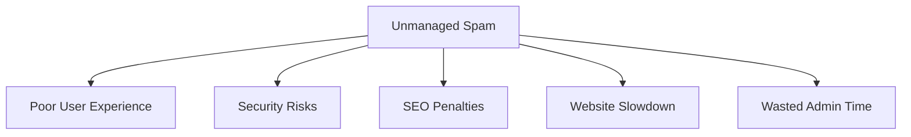

# WordPress Spam Management

## Introduction

Spam is an unfortunate reality for almost every WordPress website, especially once your site gains visibility. From irrelevant comments filled with suspicious links to contact form submissions promoting questionable services, spam can degrade your site's user experience, harm your SEO efforts, and potentially expose your visitors to security risks.

In this guide, we'll explore comprehensive approaches to managing spam in WordPress. You'll learn how to identify different types of spam, implement effective prevention tools, and establish a maintenance routine that keeps your WordPress site clean and professional.

## Understanding WordPress Spam

### What Constitutes Spam in WordPress?

Spam in WordPress typically manifests in several forms:

1. **Comment spam** - Automated bots or manual spammers leaving irrelevant comments, often containing promotional links
2. **Contact form spam** - Unsolicited messages through your site's contact forms
3. **User registration spam** - Fake accounts created for malicious purposes
4. **Trackback/pingback spam** - Abusing WordPress's built-in notification system
5. **E-commerce spam** - Fake orders or reviews on online stores

### Why Spam Management Matters

Neglecting spam management can lead to several issues:

- Diminished user experience
- Reduced site performance
- Potentially harmful links that damage SEO
- Security vulnerabilities
- Wasted time moderating irrelevant content



## Essential WordPress Spam Management Tools

### 1. Akismet Anti-Spam

Akismet is one of the most popular and effective anti-spam plugins for WordPress, developed by Automattic (the company behind WordPress.com).

#### Setting Up Akismet

1. Navigate to **Plugins > Add New** in your WordPress dashboard
2. Search for "Akismet"
3. Click "Install Now" and then "Activate"
4. Get an API key from [Akismet.com](https://akismet.com/)
5. Configure the plugin with your API key

```php
// How Akismet works (conceptual code)
function check_if_comment_is_spam($comment_data) {
    $akismet_api_key = 'your_api_key_here';
    $comment_content = $comment_data['comment_content'];
    $comment_author = $comment_data['comment_author'];
    $comment_author_email = $comment_data['comment_author_email'];
    
    // Send data to Akismet API
    $response = wp_remote_post(
        'https://rest.akismet.com/1.1/comment-check',
        [
            'body' => [
                'api_key' => $akismet_api_key,
                'blog' => home_url(),
                'comment_content' => $comment_content,
                'comment_author' => $comment_author,
                'comment_author_email' => $comment_author_email,
                // Additional parameters...
            ]
        ]
    );
    
    $result = wp_remote_retrieve_body($response);
    
    if ($result === 'true') {
        // Comment is spam
        return true;
    }
    return false;
}
```

### 2. Anti-Spam by CleanTalk

CleanTalk provides robust protection against various forms of spam, including comment spam, contact form spam, and registration spam.

#### Key Features

- Invisible protection without CAPTCHAs
- Cloud-based spam database
- Protection for comments, registration, and contact forms
- Detailed statistics and reporting

### 3. Built-in WordPress Tools

WordPress comes with several built-in features to help manage spam:

#### Comment Moderation Settings

Navigate to **Settings > Discussion** to configure:

- Email notification for comments awaiting moderation
- Comment approval requirements
- Comment moderation triggers (links, specific words)
- Comment blocklist (previously called blacklist)

Here's an example of what you might add to your comment blocklist to filter out common spam terms:

```
viagra
casino
porn
free\s*money
online\s*pharmacy
```

## Advanced Spam Prevention Techniques

### Implementing CAPTCHAs

CAPTCHAs can significantly reduce automated spam. Popular CAPTCHA solutions for WordPress include:

1. **reCAPTCHA by Google** - Modern, user-friendly CAPTCHA
2. **hCaptcha** - Privacy-focused alternative

#### Adding reCAPTCHA to a WordPress Form

If you're using Contact Form 7, here's how to implement reCAPTCHA:

1. Register for API keys at [Google reCAPTCHA](https://www.google.com/recaptcha)
2. Install the Contact Form 7 plugin
3. Navigate to **Contact > Integration** in your WordPress dashboard
4. Add your reCAPTCHA keys
5. Edit your form and add the reCAPTCHA tag:

```
[recaptcha]
```

### Honeypot Technique

The honeypot technique adds invisible form fields that humans don't see or fill out, but bots do:

```html
<!-- Example honeypot field in a form -->
<div style="display:none;">
    <input type="text" name="website_hp" value="" />
</div>
```

Then in your form processing code:

```php
// Check if the honeypot field is empty (as it should be)
if (!empty($_POST['website_hp'])) {
    // This is likely a bot submission
    exit;
}

// Continue processing legitimate form submission
// ...
```

## Practical Guide: Creating a Spam Management Routine

### Weekly Spam Maintenance

Establish a weekly routine to keep spam under control:

1. **Review spam queue** - Check what Akismet has flagged as spam to ensure no false positives
2. **Update blocklists** - Add new patterns or keywords you notice in spam
3. **Check plugin updates** - Ensure spam protection tools are up to date
4. **Review spam statistics** - Identify patterns or increases in spam activity

### Monitoring Comment Quality

Even with anti-spam tools, manual review helps maintain quality:

```js
// Example for displaying spam statistics (pseudocode for a dashboard widget)
function displaySpamStatistics() {
    const totalComments = getCommentCount();
    const spamComments = getSpamCommentCount();
    const spamPercentage = (spamComments / totalComments) * 100;
    
    return `
        <div class="spam-statistics">
            <h3>Spam Statistics This Week</h3>
            <p>Total comments: ${totalComments}</p>
            <p>Spam comments caught: ${spamComments}</p>
            <p>Spam percentage: ${spamPercentage.toFixed(2)}%</p>
        </div>
    `;
}
```

### Real-World Case Study: Managing a High-Traffic Blog

A high-traffic WordPress blog with thousands of daily visitors implemented these spam management techniques:

1. **Layered protection** - Using both Akismet and custom filtering rules
2. **Delayed approval** - First-time commenters required approval
3. **Limited links** - Comments with more than two links were held for moderation
4. **Regular expressions** - Custom patterns to catch sophisticated spam

Result: Spam was reduced by 97% while legitimate comments were unaffected.

## Dealing with Persistent Spammers

For sites facing targeted or persistent spam:

### IP Blocking

If specific IP addresses consistently generate spam:

1. Use a security plugin like Wordfence to block problematic IPs
2. Add code to your `.htaccess` file:

```apache
# Block specific IP addresses
<IfModule mod_rewrite.c>
RewriteEngine on
RewriteCond %{REMOTE_ADDR} ^123\.456\.789\.10$
RewriteRule .* - [F]
</IfModule>
```

### Country-Level Blocking

For sites experiencing regional spam attacks, geo-blocking might help:

```php
// Example function to block specific countries (simplified)
function block_country_access() {
    $blocked_countries = array('XX', 'YY', 'ZZ'); // ISO country codes
    $visitor_country = get_visitor_country(); // Function to determine visitor's country
    
    if (in_array($visitor_country, $blocked_countries)) {
        status_header(403);
        exit('Access denied for your region.');
    }
}
add_action('init', 'block_country_access');
```

## Summary

Effective WordPress spam management combines automated tools, manual oversight, and a consistent maintenance routine. By implementing the strategies covered in this guide, you can:

- Significantly reduce spam comments and form submissions
- Protect your website's reputation and SEO
- Save time on moderation tasks
- Improve the overall user experience

Remember that spam techniques evolve constantly, so regular reviews of your spam management approach are essential to stay protected.

## Additional Resources

1. [WordPress Codex: Combating Comment Spam](https://codex.wordpress.org/Combating_Comment_Spam)
2. [Akismet Documentation](https://akismet.com/support/)
3. [WordPress Security Best Practices](https://wordpress.org/support/article/hardening-wordpress/)

## Practice Exercises

1. **Review your current spam settings** - Examine your WordPress Discussion settings and optimize them for your site's needs.
2. **Implement a honeypot** - Add a honeypot field to at least one form on your site.
3. **Create a spam monitoring dashboard** - Use a plugin like WP Statistics or Google Analytics to track spam patterns.
4. **Test your defenses** - Create a testing environment and attempt to submit test spam comments to ensure your protections work.

By combining these tools and techniques, you'll create a robust defense against WordPress spam while ensuring legitimate users enjoy a smooth experience on your site.