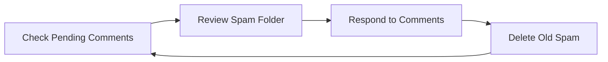

# WordPress Comment Moderation

Comments are a powerful way to engage with your visitors and build community on your WordPress site. However, without proper moderation, comments can become a source of spam, inappropriate content, or security vulnerabilities. In this guide, we'll explore how to effectively manage and moderate comments on your WordPress website.

## Understanding WordPress Comment System

WordPress comes with a built-in comment system that allows visitors to leave feedback on your posts and pages. By default, comments are enabled on all posts but can be configured globally or on a per-post basis.

### The Importance of Comment Moderation

Comment moderation is crucial for several reasons:

1. **Spam Prevention** - Unmoderated sites quickly become targets for automated spam comments
2. **Content Quality** - Ensures discussions remain relevant and valuable
3. **Site Reputation** - Protects your site's professional appearance
4. **User Experience** - Creates a safer, more pleasant environment for genuine visitors
5. **SEO Considerations** - Prevents spam links that could harm your search rankings

## Configuring Comment Settings

Before diving into specific moderation techniques, let's configure the basic comment settings in WordPress.

### Basic Comment Settings

Navigate to **Settings → Discussion** in your WordPress dashboard to access the main comment configuration options.

Key settings include:

- **Default article settings** - Control whether to allow comments on new posts
- **Other comment settings** - Configure comment author requirements
- **Email me whenever** - Notification settings for new comments
- **Before a comment appears** - Moderation and approval settings
- **Comment Moderation** - Keywords and rules for automatic moderation
- **Disallowed Comment Keys** - Words that trigger automatic rejection

Here's an example of recommended settings for beginners:

```
✓ Allow people to submit comments on new posts
✓ Comment author must fill out name and email
✓ Comment author must have a previously approved comment
✓ Comment must be manually approved
```

### Enabling Threaded Comments

Threaded comments allow visitors to reply directly to specific comments, creating organized discussions:

```php
// In your theme's functions.php file, ensure threaded comments are supported
function theme_setup() {
    // Add support for threaded comments
    add_theme_support('threaded-comments');
}
add_action('after_setup_theme', 'theme_setup');
```

## Manual Moderation Techniques

### The Comments Dashboard

Access your comments by clicking on "Comments" in the WordPress dashboard sidebar. Here, you'll see:

- **Pending** - Comments awaiting moderation
- **Approved** - Published comments
- **Spam** - Comments marked as spam
- **Trash** - Deleted comments (can be restored)

### Available Actions for Each Comment

When you hover over a comment, several options appear:

- **Approve** - Publish the comment
- **Reply** - Respond to the comment
- **Quick Edit** - Make changes to the comment content
- **Edit** - Open the full comment editor
- **History** - View the comment's moderation history
- **Spam** - Mark as spam (helps train spam filters)
- **Trash** - Move to trash

### Bulk Moderation

To save time, you can moderate multiple comments at once:

1. Check the boxes next to the comments you want to moderate
2. Select an action from the "Bulk Actions" dropdown
3. Click "Apply"

## Automated Moderation Techniques

### Using Comment Moderation Keywords

WordPress can automatically flag comments containing specific words for moderation:

1. Go to **Settings → Discussion**
2. Scroll to "Comment Moderation"
3. Add keywords one per line (comments containing these will be held for moderation)

Example moderation keywords:

```
http://
casino
viagra
loan
```

### Using Comment Blacklist Keywords

Comments containing blacklisted keywords are automatically sent to the spam folder:

1. Go to **Settings → Discussion**
2. Scroll to "Disallowed Comment Keys" (or "Comment Blacklist" in older versions)
3. Add keywords one per line

Example blacklist keywords:

```
porn
seo service
free money
```

## Implementing Akismet for Spam Protection

Akismet is a powerful anti-spam plugin that comes pre-installed with WordPress. It automatically checks comments against its database of spam patterns.

### Setting Up Akismet

1. Activate the Akismet plugin from **Plugins → Installed Plugins**
2. Click on "Set up your Akismet account"
3. Sign up for an API key (free for personal blogs, paid for commercial sites)
4. Enter your API key in the Akismet settings

Akismet works silently in the background, but you can review its activity:

```
Last 24 hours:    35 spam blocked
Total:           12,456 spam blocked
Accuracy:         99.7%
```

## Moderating Comments Programmatically

For developers, WordPress offers hooks to customize the comment moderation process.

### Pre-filtering Comments

```php
// Reject comments with certain patterns
add_filter('pre_comment_approved', 'custom_comment_moderation', 99, 2);
function custom_comment_moderation($approved, $comment_data) {
    // Block comments with more than 3 links (often spam)
    $pattern = '/http/';
    $num_links = preg_match_all($pattern, $comment_data['comment_content']);
    
    if ($num_links > 3) {
        return 'spam';
    }
    
    // Block comments that are too short
    if (strlen($comment_data['comment_content']) < 5) {
        return 0; // 0 = hold for moderation
    }
    
    return $approved;
}
```

### Adding Custom Notification for New Comments

```php
// Send notifications to additional email addresses
add_filter('comment_notification_recipients', 'custom_comment_notification', 10, 2);
function custom_comment_notification($emails, $comment_ID) {
    // Add another email address to receive notifications
    $emails[] = 'moderator@yoursite.com';
    return $emails;
}
```

## Best Practices for Comment Moderation

### Create a Comment Policy

A clear comment policy helps set expectations for your visitors:

```html
<!-- Example Comment Policy HTML to add to your pages -->
<div class="comment-policy">
  <h4>Comment Policy</h4>
  <p>We welcome thoughtful and respectful comments. Please note:</p>
  <ul>
    <li>All comments are moderated before publishing</li>
    <li>Spam and promotional content will be removed</li>
    <li>Be respectful to others – personal attacks will not be tolerated</li>
    <li>Keep comments relevant to the post topic</li>
  </ul>
</div>
```

### Consistent Moderation Schedule

Establish a regular schedule for comment moderation to avoid backlogs:



### Using CAPTCHA to Reduce Spam

Adding a CAPTCHA system can significantly reduce automated spam. Popular options include:

1. **reCAPTCHA** - Google's service
2. **hCaptcha** - Privacy-focused alternative
3. **Simple math problems** - Lightweight option

## Advanced Comment Features

### Comment Rating Systems

Enhance your comments with rating functionality:

```php
// Simple comment rating functionality
add_action('comment_form_logged_in_after', 'comment_rating_field');
function comment_rating_field() {
    echo '<p class="comment-form-rating">
        <label for="rating">Rating</label>
        <select name="rating" id="rating">
            <option value="">Rate this article</option>
            <option value="5">Excellent</option>
            <option value="4">Good</option>
            <option value="3">Average</option>
            <option value="2">Below Average</option>
            <option value="1">Poor</option>
        </select>
    </p>';
}

// Save the rating
add_action('comment_post', 'save_comment_rating');
function save_comment_rating($comment_id) {
    if (isset($_POST['rating'])) {
        add_comment_meta($comment_id, 'rating', esc_attr($_POST['rating']));
    }
}
```

### Highlighting Author Comments

Make your own comments stand out:

```css
/* Add to your theme's CSS */
.bypostauthor {
    background: #f8f8f8;
    border-left: 3px solid #0073aa;
    padding-left: 10px;
}
```

## Troubleshooting Common Issues

### Comments Not Appearing

If legitimate comments aren't appearing:

1. Check your Discussion settings
2. Verify if the comment was caught by spam filters
3. Ensure the post has comments enabled
4. Check if the commenter was previously blocked

### Excessive Spam Despite Protections

If you're still getting too much spam:

1. Consider temporarily disabling comments on older posts
2. Add more strict moderation keywords
3. Implement a more robust CAPTCHA solution
4. Consider a premium anti-spam solution

## Summary

Effective comment moderation is essential for maintaining a healthy, engaging WordPress site. By combining WordPress's built-in tools with plugins like Akismet and implementing clear policies, you can create a vibrant comment section that adds value to your content while keeping spam and inappropriate content at bay.

Remember that comment moderation is an ongoing process that should evolve with your site's needs. Regular maintenance and attention to your comment section will help foster a positive community around your content.

## Additional Resources

- WordPress Codex: Discussion Settings
- Akismet Documentation
- WordPress Comment Moderation APIs

## Exercises

1. Set up your comment moderation settings following the recommendations in this guide.
2. Create and publish a comment policy on your website.
3. Install and configure Akismet.
4. Review your existing comments for spam and legitimate content.
5. Implement at least one programmatic comment moderation technique on your site.