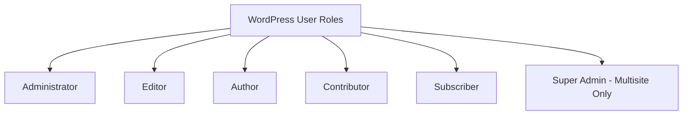

# WordPress User Management

## Introduction

User management is a critical aspect of maintaining a WordPress website. Whether you're running a blog with multiple contributors, an e-commerce site with customers, or a membership site, understanding how to properly manage users is essential for security, workflow, and overall site functionality.

In this guide, we'll explore the WordPress user management system, including user roles and capabilities, how to add and manage users, security best practices, and tools to extend WordPress's built-in user management functionality.

## Understanding WordPress User Roles

WordPress comes with a pre-defined set of user roles, each with specific capabilities (permissions). These roles determine what actions users can perform on your site.

### Default WordPress User Roles



Let's examine each role:

1. **Administrator** - Has complete control over the entire website, including:
   - Managing all content
   - Installing plugins and themes
   - Managing users
   - Changing site settings
   - Editing code

2. **Editor** - Can:
   - Publish and manage posts (their own and others')
   - Moderate comments
   - Manage categories and tags
   - Cannot install plugins or themes

3. **Author** - Can:
   - Publish and manage their own posts
   - Upload files
   - Cannot edit others' posts

4. **Contributor** - Can:
   - Write and manage their own posts (but not publish them)
   - Cannot upload media
   - Posts require approval by Administrators or Editors

5. **Subscriber** - Can:
   - Manage their profile
   - Read content (including private content if configured)
   - Leave comments

6. **Super Admin** (Multisite only) - Has:
   - Administrator capabilities for all sites in the network
   - Can manage network settings, themes, and plugins

## Managing Users Through WordPress Dashboard

### Accessing the Users Section

1. Log in to your WordPress dashboard
2. Navigate to "Users" in the left sidebar menu

![User Management Dashboard]

### Adding a New User

To add a new user:

1. Click on "Add New" under the Users menu
2. Fill in the necessary information:
   - Username (required)
   - Email (required)
   - First Name
   - Last Name
   - Website
   - Password (or use auto-generate)
   - Role selection
3. Click "Add New User"

### Code Example: Programmatically Creating a User

You can also create users programmatically using WordPress functions:

```php
$user_data = array(
    'user_login'    => 'johndoe',
    'user_email'    => 'john.doe@example.com',
    'first_name'    => 'John',
    'last_name'     => 'Doe',
    'user_pass'     => 'secure_password', // It's better to use wp_generate_password() for security
    'role'          => 'editor'
);

$user_id = wp_insert_user($user_data);

if (is_wp_error($user_id)) {
    echo 'Error creating user: ' . $user_id->get_error_message();
} else {
    echo 'Successfully created user with ID: ' . $user_id;
}
```

### Editing User Profiles

To edit an existing user's profile:

1. Go to Users → All Users
2. Hover over the username and click "Edit"
3. Modify the user's information
4. Click "Update User"

### Bulk Actions for Users

WordPress allows you to perform bulk actions on multiple users:

1. Select users by checking the boxes next to their names
2. Choose an action from the "Bulk Actions" dropdown:
   - Delete
   - Change role
3. Click "Apply"

## Implementing User Management Best Practices

### Security Considerations

1. **Limit Administrator Accounts**
   - Only give administrator access to those who absolutely need it
   - Create a separate administrator account for maintenance tasks

2. **Use Strong Passwords**
   - Enforce strong password policies
   - Consider implementing two-factor authentication

```php
// Force strong passwords with a plugin or by adding this to functions.php
function check_password_strength($errors, $update, $user) {
    $password = isset($_POST['pass1']) ? $_POST['pass1'] : '';
    
    if ($password && strlen($password) < 8) {
        $errors->add('password_too_short', 
            '<strong>ERROR</strong>: Password must be at least 8 characters long.');
    }
    
    if ($password && !preg_match('/[A-Z]/', $password)) {
        $errors->add('password_no_uppercase', 
            '<strong>ERROR</strong>: Password must include at least one uppercase letter.');
    }
    
    // Add more validation as needed
    
    return $errors;
}
add_action('user_profile_update_errors', 'check_password_strength', 10, 3);
```

3. **Regular User Audits**
   - Periodically review all users and their roles
   - Remove unused accounts
   - Downgrade privileges when appropriate

### Extending User Profiles

You can add custom fields to user profiles to store additional information:

```php
// Add custom field to user profile
function add_custom_user_profile_fields($user) {
    ?>
    <h3>Additional Information</h3>
    <table class="form-table">
        <tr>
            <th><label for="phone">Phone Number</label></th>
            <td>
                <input type="text" name="phone" id="phone" 
                    value="<?php echo esc_attr(get_user_meta($user->ID, 'phone', true)); ?>" 
                    class="regular-text" />
            </td>
        </tr>
    </table>
    <?php
}
add_action('show_user_profile', 'add_custom_user_profile_fields');
add_action('edit_user_profile', 'add_custom_user_profile_fields');

// Save custom field data
function save_custom_user_profile_fields($user_id) {
    if (!current_user_can('edit_user', $user_id)) {
        return false;
    }
    update_user_meta($user_id, 'phone', $_POST['phone']);
}
add_action('personal_options_update', 'save_custom_user_profile_fields');
add_action('edit_user_profile_update', 'save_custom_user_profile_fields');
```

## Advanced User Management with Custom Roles

### Creating Custom User Roles

Sometimes the default WordPress roles aren't enough for your site's needs. You can create custom roles with specific capabilities:

```php
// Register a custom "Support Staff" role
function create_support_staff_role() {
    add_role(
        'support_staff',
        'Support Staff',
        array(
            'read'              => true,
            'edit_posts'        => true,
            'delete_posts'      => true,
            'publish_posts'     => true,
            'upload_files'      => true,
            'moderate_comments' => true,
        )
    );
}
register_activation_hook(__FILE__, 'create_support_staff_role');

// Remove the role if plugin is deactivated
function remove_support_staff_role() {
    remove_role('support_staff');
}
register_deactivation_hook(__FILE__, 'remove_support_staff_role');
```

### Modifying Existing Roles

You can also add or remove capabilities from existing roles:

```php
// Add a capability to the Editor role
function modify_editor_role() {
    $role = get_role('editor');
    $role->add_cap('manage_categories', true);
}
add_action('init', 'modify_editor_role');

// Remove a capability from the Author role
function restrict_author_role() {
    $role = get_role('author');
    $role->remove_cap('upload_files');
}
add_action('init', 'restrict_author_role');
```

## Managing Users with Plugins

While WordPress has robust built-in user management, plugins can extend this functionality significantly.

### Popular User Management Plugins

1. **User Role Editor**
   - Allows fine-grained control over user roles and capabilities
   - Lets you create custom roles easily through a UI

2. **Members**
   - Provides role management tools
   - Content permissions and restriction features
   - Role-based content restrictions

3. **User Switching**
   - Allows administrators to quickly switch between user accounts
   - Great for testing and troubleshooting user experiences

4. **WP User Avatar**
   - Enables custom profile pictures
   - Extends user profile capabilities

### Implementing Advanced User Registration

For sites requiring more advanced user registration flows, you might use a plugin like "ProfilePress" or code a custom solution:

```php
// Custom registration form handling
function custom_registration_form_handling() {
    if (isset($_POST['custom_registration_nonce']) && 
        wp_verify_nonce($_POST['custom_registration_nonce'], 'custom_registration')) {
        
        $username = sanitize_user($_POST['username']);
        $email = sanitize_email($_POST['email']);
        $password = $_POST['password'];
        $first_name = sanitize_text_field($_POST['first_name']);
        $last_name = sanitize_text_field($_POST['last_name']);
        
        // Validation
        if (empty($username) || empty($email) || empty($password)) {
            return new WP_Error('field', 'Required form field is missing');
        }
        
        if (username_exists($username) || email_exists($email)) {
            return new WP_Error('exists', 'Username or email already exists');
        }
        
        // Create the user
        $user_id = wp_create_user($username, $password, $email);
        
        if (is_wp_error($user_id)) {
            return $user_id;
        }
        
        // Update user information
        wp_update_user([
            'ID' => $user_id,
            'first_name' => $first_name,
            'last_name' => $last_name,
            'role' => 'subscriber' // Default role for new users
        ]);
        
        // Auto login after registration
        wp_set_auth_cookie($user_id, true);
        
        // Redirect
        wp_redirect(home_url('/welcome-new-users/'));
        exit;
    }
}
add_action('init', 'custom_registration_form_handling');
```

## User Management for Multisite Networks

WordPress Multisite networks introduce additional complexity for user management. Users can belong to multiple sites with different roles on each site.

### Super Admin Role

The Super Admin can:
- Manage the entire network
- Add/remove sites
- Install network-wide plugins and themes
- Add users to any site

### Managing Network Users

To manage users across a multisite network:

1. Log in as a Super Admin
2. Go to Network Admin → Users
3. From here you can:
   - Add new users to the network
   - Edit existing users
   - Delete users
   - View which sites each user belongs to

## User Management for Membership and E-commerce Sites

For sites that require user subscriptions, membership levels, or customer accounts:

### Customer/Member Management

1. **User Segmentation**
   - Group users based on membership levels, purchase history, etc.
   - Create custom user meta to store additional user data

```php
// Add membership level to a user
update_user_meta($user_id, 'membership_level', 'premium');

// Check user's membership level
$membership_level = get_user_meta($user_id, 'membership_level', true);
if ($membership_level === 'premium') {
    // Show premium content
}
```

2. **Content Restrictions**
   - Restrict content based on user roles or custom capabilities
   - Implement paywalls or membership gates

```php
// Restrict content to specific roles
function restrict_content_to_role($content) {
    if (is_singular('premium_content')) {
        $allowed_roles = array('administrator', 'premium_member');
        $user = wp_get_current_user();
        $user_roles = (array) $user->roles;
        
        $can_access = false;
        foreach ($allowed_roles as $role) {
            if (in_array($role, $user_roles)) {
                $can_access = true;
                break;
            }
        }
        
        if (!$can_access) {
            return '<div class="restricted-content">This content is for premium members only. 
            <a href="/membership-signup/">Sign up here</a>.</div>';
        }
    }
    return $content;
}
add_filter('the_content', 'restrict_content_to_role');
```

## Troubleshooting Common User Management Issues

### Lost Administrator Access

If you lose admin access:

1. **Direct Database Method**
   ```sql
   UPDATE wp_users SET user_pass = MD5('new_password') WHERE user_login = 'admin_username';
   UPDATE wp_usermeta SET meta_value = 'a:1:{s:13:"administrator";b:1;}' 
   WHERE user_id = (SELECT ID FROM wp_users WHERE user_login = 'admin_username') 
   AND meta_key = 'wp_capabilities';
   ```

2. **Using wp-cli**
   ```bash
   wp user update admin_username --role=administrator --user_pass=new_password
   ```

### User Role Display Issues

If user roles aren't displaying correctly:

1. Check for plugin conflicts
2. Reset the user roles with:

```php
// Reset user roles to default
function reset_wp_user_roles() {
    require_once(ABSPATH . '/wp-admin/includes/schema.php');
    populate_roles();
    echo "User roles have been reset to default.";
}
// Add this to a temporary plugin file and run once
```

## Summary

Effective WordPress user management is crucial for maintaining site security and creating an efficient workflow. Key points to remember:

- Understand the different user roles and their capabilities
- Only assign the minimum privileges necessary for each user
- Regularly audit users and remove unused accounts
- Consider using plugins for advanced user management
- Implement strong password policies
- Back up your user database regularly

By mastering user management, you'll create a more secure WordPress site and improve the experience for both administrators and users.

## Additional Resources and Exercises

### Resources

- [WordPress Codex: Roles and Capabilities](https://wordpress.org/documentation/article/roles-and-capabilities/)
- [WordPress Developer Documentation: Users](https://developer.wordpress.org/plugins/users/)

### Practice Exercises

1. **Basic Exercise**: Create a new user with Editor permissions and test what they can and cannot do on your site.

2. **Intermediate Exercise**: Create a custom user role with specific capabilities using code or the User Role Editor plugin.

3. **Advanced Exercise**: Build a custom user registration form with additional fields, and create a dashboard where users can manage their profile information.

4. **Security Exercise**: Implement a password strength meter and two-factor authentication for your WordPress users.

By consistently applying these user management best practices, you'll maintain a secure and efficient WordPress site for both administrators and users.