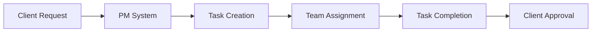
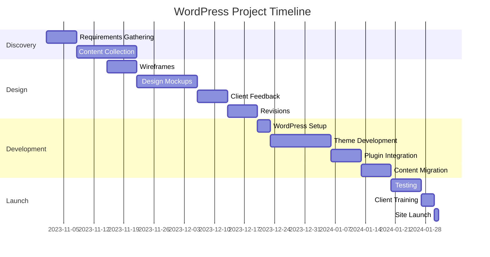

# WordPress Client Management

Managing clients effectively is crucial for any WordPress business. Good client management involves clear communication, setting expectations, providing value, and building long-term relationships. In this guide, we'll explore how to manage WordPress clients from initial contact to ongoing maintenance.

## Why Client Management Matters

Successful WordPress businesses aren't just about technical skills—they're about people skills. Good client management:

- Creates repeat business and referrals
- Reduces scope creep and project issues
- Leads to higher client satisfaction
- Allows for premium pricing
- Reduces stress and improves work-life balance

## Client Onboarding Process

### 1. Initial Consultation

The client relationship begins with the first meeting. This is where you gather requirements and determine if the client is a good fit.

**Key components:**
- Discovery questionnaire
- Project scope discussion
- Budget and timeline alignment
- Identifying the decision-makers

**Example Discovery Questions:**
```
1. What are your primary business goals for this website?
2. Who is your target audience?
3. What specific functionality do you need?
4. Do you have existing brand guidelines?
5. What websites do you like and why?
6. What's your timeline and budget for this project?
```

### 2. Proposal and Contract

Clear documentation prevents misunderstandings and scope creep.

**Essential elements to include:**
- Detailed project scope
- Timeline with milestones
- Payment terms and schedule
- Revision policy
- Additional costs for scope changes

```jsx
// Example Project Scope Definition in Contract
const projectScope = {
  pages: ['Home', 'About', 'Services', 'Contact', 'Blog'],
  features: ['Contact Form', 'Newsletter Signup', 'Image Gallery'],
  responsibleParties: {
    developer: ['Website setup', 'Theme installation', 'Plugin configuration'],
    client: ['Content provision', 'Image selection', 'Feedback within 48hrs']
  },
  exclusions: ['Logo design', 'Content writing', 'SEO optimization']
};
```

### 3. Welcome Packet

Provide clients with a welcome packet that includes:
- How to contact you (hours, response times)
- Project timeline with key milestones
- Required materials and deadlines
- How to provide feedback
- Access to project management tools

## Client Communication Tools

Effective communication is essential. Here are tools that can streamline your client interactions:

### Project Management Systems



**Popular options:**
- Asana
- Trello
- ClickUp
- Monday.com

### Client Portals

Client portals provide a professional, centralized location for all project communication.

**Example WordPress client portal setup:**
```php
// Example plugin code for a client dashboard
function client_dashboard_widget() {
    wp_add_dashboard_widget(
        'client_support_dashboard',
        'Website Support',
        'render_client_support_dashboard'
    );
}
add_action('wp_dashboard_setup', 'client_dashboard_widget');

function render_client_support_dashboard() {
    echo '<h3>Need Help?</h3>';
    echo '<p>Contact us directly:</p>';
    echo '<p><strong>Email:</strong> support@yourcompany.com</p>';
    echo '<p><strong>Phone:</strong> (555) 123-4567</p>';
    echo '<a href="https://yourcompany.com/support-ticket" class="button button-primary">Submit Support Ticket</a>';
}
```

### Documentation and Training

Providing documentation helps clients understand their website and reduces support requests.

**Types of documentation:**
- Video tutorials
- Written guides
- Admin area walkthroughs
- Monthly reports

## Setting Boundaries and Expectations

### Service Level Agreements (SLAs)

An SLA defines what services you'll provide and how quickly you'll respond.

**Example SLA terms:**
```
Response Time: Within 24 business hours
Emergency Support: Available 9am-5pm M-F
Resolution Time: 
  - Critical issues: 4 business hours
  - Major issues: 8 business hours
  - Minor issues: 3 business days
Support Channels: Email and support ticket system only
```

### Managing Scope Creep

Scope creep is the gradual expansion of project requirements beyond the original agreement.

**Strategies to prevent scope creep:**
1. Document all requirements in detail
2. Use change request forms
3. Charge for additional work
4. Regularly review project scope with client

**Example change request process:**

```jsx
// Example Change Request Form Fields
const changeRequestForm = {
  requestDate: "2023-10-15",
  clientName: "Acme Corporation",
  projectName: "Website Redesign",
  originalRequirement: "5-page website with contact form",
  requestedChange: "Add e-commerce functionality with 20 products",
  impactOnTimeline: "+2 weeks",
  additionalCost: "$1,500",
  approvalStatus: "Pending",
  clientSignature: ""
};
```

## Building Recurring Revenue

### Maintenance Plans

Maintenance plans provide ongoing value to clients while creating predictable income for your business.

**Common maintenance plan components:**
- Regular WordPress updates
- Security monitoring
- Backups and restoration
- Performance optimization
- Analytics reporting
- Content updates

**Example tiered maintenance packages:**

```jsx
// Example Maintenance Plan Structure
const maintenancePlans = {
  basic: {
    name: "Basic Care",
    price: "$49/month",
    features: [
      "WordPress core updates",
      "Plugin updates",
      "Weekly backups",
      "Uptime monitoring"
    ]
  },
  standard: {
    name: "Standard Care",
    price: "$99/month",
    features: [
      "All Basic Care features",
      "Daily backups",
      "Security scanning",
      "1 hour of content updates"
    ]
  },
  premium: {
    name: "Premium Care",
    price: "$199/month",
    features: [
      "All Standard Care features",
      "Priority support",
      "Monthly performance optimization",
      "Monthly analytics report",
      "3 hours of content updates"
    ]
  }
};
```

### Client Reporting

Regular reporting demonstrates your value and keeps clients informed.

**Effective client reports include:**
- Website uptime statistics
- Security scan results
- Backup verification
- Updates performed
- Traffic analytics
- Recommendations for improvements

## Client Education

Educated clients make better decisions and appreciate your expertise more.

**Education strategies:**
- Regular blog posts
- Email newsletters with tips
- Quarterly webinars
- Custom video tutorials

## Handling Difficult Situations

### Non-responsive Clients

When clients don't provide needed feedback or materials:

1. Set clear deadlines in your contract
2. Include a project pause clause
3. Charge a restart fee if the project goes dormant
4. Document all communication attempts

### Payment Issues

To prevent payment problems:

```jsx
// Example Payment Terms for Contract
const paymentTerms = {
  deposit: "50% of project total due before work begins",
  milestone: "25% due upon completion of design phase",
  final: "Remaining 25% due before site launch",
  late: "2% late fee applied to invoices past due 15 days",
  nonPayment: "Work paused on accounts 30+ days overdue"
};
```

## Client Offboarding

Sometimes client relationships end. Handle this professionally by:

1. Providing all necessary files and credentials
2. Documenting the site's setup
3. Offering a transition period
4. Getting feedback via an exit interview
5. Leaving the door open for future work

## Practical Example: Full Client Management Workflow

Let's walk through a complete client management process:

### 1. Inquiry and Qualification

```jsx
// Example qualification scoring system
function qualifyLead(prospect) {
  let score = 0;
  
  // Budget alignment
  if (prospect.budget >= 5000) score += 3;
  else if (prospect.budget >= 3000) score += 2;
  else if (prospect.budget >= 1000) score += 1;
  
  // Timeline reasonability
  if (prospect.timeline >= 8) score += 3;
  else if (prospect.timeline >= 4) score += 2;
  else score += 0; // Rush jobs score low
  
  // Decision maker?
  if (prospect.isDecisionMaker) score += 2;
  
  // Project clarity
  if (prospect.hasDetailedRequirements) score += 2;
  
  return {
    totalScore: score,
    qualified: score >= 6
  };
}

// Sample usage
const prospect = {
  name: "Acme Inc",
  budget: 4000,
  timeline: 6, // weeks
  isDecisionMaker: true,
  hasDetailedRequirements: true
};

const qualification = qualifyLead(prospect);
console.log(qualification); // {totalScore: 9, qualified: true}
```

### 2. Onboarding

1. Send welcome packet
2. Collect assets and login credentials
3. Set up project in management system
4. Schedule kickoff meeting

### 3. Project Execution



### 4. Handover and Support

1. Provide client training
2. Deliver documentation
3. Transition to maintenance plan
4. Schedule regular check-ins

## Tools for WordPress Client Management

### CRM Systems
- [CRM Plugin] - Manage clients directly in WordPress
- [Project Management + CRM] - Combined solution

### Client Communication
- [Help Desk Plugin] - Support ticket system for WordPress
- [Client Portal Plugin] - Secure document sharing and messaging

### Documentation
- [Knowledge Base Plugin] - Create searchable documentation
- [Screen Recording Tool] - Create video tutorials

## Summary

Effective WordPress client management involves:

1. **Clear communication** - Set expectations early and maintain regular contact
2. **Documented processes** - Use contracts, welcome packets, and change requests
3. **Value-focused service** - Provide ongoing education and maintenance
4. **Professional boundaries** - Manage scope and payment terms firmly but fairly
5. **Relationship building** - Focus on long-term partnerships, not just transactions

By implementing these client management strategies, you can build a more sustainable WordPress business with happier clients, more predictable income, and less stress.

## Further Learning

To improve your WordPress client management skills:

1. Create templates for your:
   - Client onboarding questionnaire
   - Welcome packet
   - Maintenance plan offerings
   - Monthly client reports

2. Implement a client feedback system to continuously improve your processes

3. Develop a knowledge base of common client questions to streamline support

4. Practice having difficult conversations about scope, budget, and timeline

Remember that great client management is an ongoing process. Continuously refine your approach based on what works best for your specific client base and business goals.